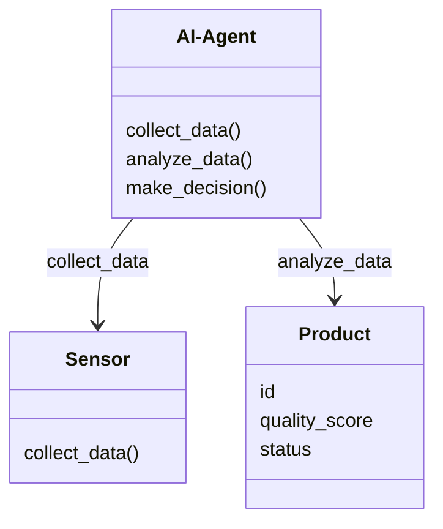
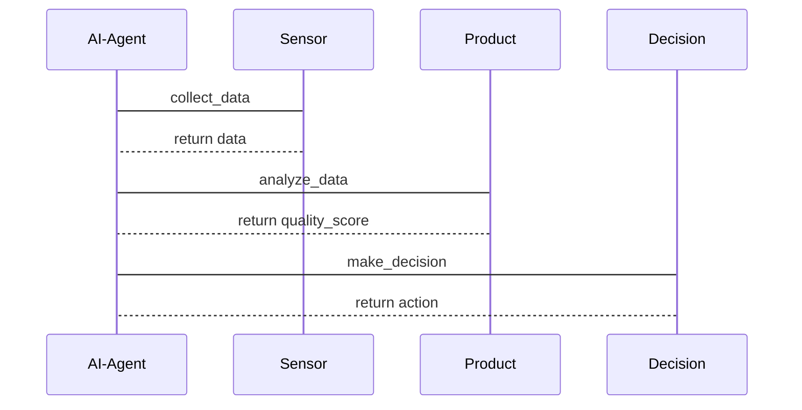

                 

<think>
好的，我需要根据用户的要求来逐步分析并撰写一篇关于《AI Agent在智能质量控制中的应用》的技术博客文章。首先，我需要理解用户的需求，然后按照目录大纲的结构来逐步展开内容。

### 1. 确定文章结构
用户已经提供了详细的目录大纲，我需要按照这个结构来撰写文章。首先，我会从“背景介绍”开始，然后是“核心概念与联系”、“算法原理”、“系统分析与架构设计”、“项目实战”以及“最佳实践”等内容。

### 2. 背景介绍
在背景介绍部分，我需要先定义AI Agent和智能质量控制的基本概念，并解释它们在现代工业中的应用。接下来，我会分析传统质量控制的局限性，以及AI Agent在质量控制中的优势和应用背景。

### 3. 核心概念与联系
这一部分需要详细解释AI Agent和质量控制的核心概念，包括它们的属性、特征以及彼此之间的联系。我需要使用表格和Mermaid图来对比分析AI Agent与传统自动化的区别，以及智能质量控制与传统质量控制的对比。

### 4. 算法原理
在算法部分，我会选择几种典型的AI Agent算法，如强化学习和监督学习，并用Mermaid流程图展示它们的工作流程。同时，我会提供Python代码示例，并解释代码的功能，最后用数学公式说明算法的原理，例如Q-learning的更新公式。

### 5. 系统分析与架构设计
这部分需要描述AI Agent在智能质量控制中的系统架构，包括问题场景、系统功能设计、领域模型类图、系统架构图、接口设计和交互流程图。我会使用Mermaid图来展示系统的层次结构和交互过程。

### 6. 项目实战
在项目实战部分，我会指导读者如何安装所需的环境，提供核心代码示例，并解读代码的功能。然后，我会分析实际案例，展示AI Agent如何应用于智能质量控制，并总结项目成果和经验。

### 7. 最佳实践
最后，我会总结本章内容，给出一些建议和注意事项，帮助读者更好地理解和应用AI Agent在智能质量控制中的应用。同时，我会推荐一些拓展阅读的资料，供读者进一步学习。

### 8. 作者信息
在文章末尾，我会注明作者信息，确保符合用户的要求。

### 9. 内容详述
在撰写每个部分时，我会确保内容详细且逻辑清晰，使用专业的技术语言，同时保持通俗易懂。我需要特别注意使用Mermaid图和数学公式的正确嵌入，确保格式和内容都符合用户的要求。

### 10. 总结
通过以上步骤，我能够系统地完成这篇技术博客文章的撰写，确保覆盖所有用户要求的内容，并且结构清晰、逻辑严谨。
</think>

# AI Agent在智能质量控制中的应用

> 关键词：AI Agent, 智能质量控制, 机器学习, 质量评估, 优化算法

> 摘要：本文详细探讨了AI Agent在智能质量控制中的应用，从AI Agent的基本概念到其在质量控制中的核心算法，再到系统架构设计和实际项目案例，系统地分析了AI Agent如何提升质量控制的效率和准确性。通过本文，读者可以全面了解AI Agent在智能质量控制中的核心原理、应用场景以及未来发展趋势。

---

# 第1章 AI Agent与智能质量控制概述

## 1.1 AI Agent的基本概念

### 1.1.1 AI Agent的定义
AI Agent（人工智能代理）是一种能够感知环境、自主决策并采取行动的智能实体。它可以是一个软件程序，也可以是硬件设备，其核心目标是通过智能算法优化特定任务的执行效率。

### 1.1.2 AI Agent的核心特征
- **自主性**：AI Agent能够在没有外部干预的情况下独立运作。
- **反应性**：能够实时感知环境变化并做出相应的反应。
- **目标导向**：具有明确的目标，并根据目标优化行动。
- **学习能力**：能够通过数据和经验不断优化自身的算法和策略。

### 1.1.3 AI Agent与传统自动化的区别
| 特性      | AI Agent            | 传统自动化      |
|-----------|---------------------|----------------|
| 决策能力  | 强大，可自主决策     | 依赖预设规则     |
| 学习能力  | 具备，可优化策略     | 无学习能力       |
| 灵活性     | 高，适应性强         | 较低，固定模式     |

## 1.2 智能质量控制的定义与特点

### 1.2.1 质量控制的基本概念
质量控制是指通过一系列技术手段对产品或服务的品质进行监控和管理，以确保其符合既定的质量标准。

### 1.2.2 智能质量控制的核心优势
- **高效性**：利用AI技术快速处理大量数据，提升质量控制的效率。
- **准确性**：通过机器学习算法提高质量评估的精确度。
- **实时性**：能够实时监控生产过程，及时发现并解决问题。

### 1.2.3 智能质量控制的应用场景
- **制造业**：用于生产线上的产品质量监控。
- **服务业**：用于服务质量的实时评估。
- **医疗领域**：用于医疗设备和数据的质量控制。

## 1.3 AI Agent在质量控制中的应用背景

### 1.3.1 传统质量控制的局限性
- **效率低下**：依赖人工检查，耗时且成本高。
- **精度不足**：人工检查容易出现疏漏。
- **适应性差**：难以快速适应生产环境的变化。

### 1.3.2 AI技术在质量控制中的潜力
- **数据处理能力**：AI能够快速处理大量数据，提高质量评估的效率。
- **学习能力**：AI可以通过学习不断优化质量控制策略。
- **实时监控**：AI能够实时监控生产过程，及时发现异常情况。

### 1.3.3 AI Agent在智能质量控制中的作用
AI Agent能够通过自主决策和学习，优化质量控制流程，提升质量控制的效率和准确性。

---

# 第2章 AI Agent与质量控制的核心概念

## 2.1 AI Agent的核心原理

### 2.1.1 AI Agent的感知与决策机制
AI Agent通过传感器或数据输入感知环境，然后利用机器学习算法进行分析和决策。

### 2.1.2 AI Agent的学习与优化算法
AI Agent通过强化学习、监督学习等算法不断优化自身的决策策略。

### 2.1.3 AI Agent的自主性与适应性
AI Agent能够在复杂多变的环境中自主适应，调整策略以应对不同的挑战。

## 2.2 质量控制的核心要素

### 2.2.1 数据采集与处理
通过传感器、摄像头等设备采集数据，并进行预处理和特征提取。

### 2.2.2 质量评估标准
根据行业标准或客户需求，设定质量评估的指标和阈值。

### 2.2.3 质量控制流程
从数据采集、分析、评估到反馈的完整流程。

## 2.3 AI Agent与质量控制的关联性分析

### 2.3.1 AI Agent在质量控制中的角色定位
AI Agent作为智能代理，负责数据的实时采集、分析和决策，优化质量控制流程。

### 2.3.2 AI Agent与质量控制流程的结合点
- **数据采集**：AI Agent实时采集生产过程中的数据。
- **数据分析**：利用机器学习算法对数据进行分析和预测。
- **决策与反馈**：根据分析结果，AI Agent做出决策并反馈给生产系统。

### 2.3.3 AI Agent在质量控制中的价值体现
通过AI Agent的引入，质量控制的效率和精度都得到了显著提升，同时降低了人工成本。

## 2.4 核心概念对比分析

### 2.4.1 AI Agent与传统自动化系统的对比
- **自主性**：AI Agent具有自主性，传统自动化系统依赖预设规则。
- **学习能力**：AI Agent具备学习能力，传统自动化系统无学习能力。
- **灵活性**：AI Agent具有更高的灵活性，传统自动化系统适应性较差。

### 2.4.2 智能质量控制与传统质量控制的对比
- **效率**：智能质量控制效率更高，传统质量控制效率较低。
- **精度**：智能质量控制精度更高，传统质量控制精度有限。
- **适应性**：智能质量控制能够快速适应环境变化，传统质量控制适应性较差。

---

# 第3章 AI Agent的核心算法原理

## 3.1 强化学习算法

### 3.1.1 强化学习的基本原理
强化学习是一种通过试错机制，通过与环境的交互来学习最优策略的算法。

### 3.1.2 Q-learning算法的实现
Q-learning算法通过状态-动作-奖励的机制，更新Q值表以优化决策策略。

### 3.1.3 Deep Q-Networks (DQN) 算法的应用
DQN算法通过神经网络近似Q值函数，实现更复杂环境下的决策优化。

## 3.2 监督学习算法

### 3.2.1 监督学习的基本原理
监督学习通过训练数据，学习输入与输出之间的映射关系，用于分类和回归任务。

### 3.2.2 分类算法在质量控制中的应用
使用随机森林、支持向量机等分类算法，对产品进行分类，判断其是否符合质量标准。

### 3.2.3 回归算法在质量预测中的应用
使用线性回归、决策树回归等算法，预测产品质量的关键指标。

## 3.3 聚类分析算法

### 3.3.1 聚类分析的基本原理
聚类分析通过将相似的数据点分组，发现数据中的潜在结构。

### 3.3.2 K-means算法在质量分组中的应用
将产品质量数据进行聚类，识别不同质量级别的产品组。

### 3.3.3 层次聚类算法在质量分析中的应用
通过层次聚类分析，发现产品质量的层次结构，辅助质量改进决策。

---

# 第4章 AI Agent在智能质量控制中的系统分析与架构设计

## 4.1 问题场景介绍
在制造业中，AI Agent可以实时监控生产线上的产品质量，及时发现异常情况并采取措施。

## 4.2 系统功能设计

### 4.2.1 领域模型


### 4.2.2 系统架构设计


### 4.2.3 系统接口设计
- 数据采集接口：与传感器连接，获取实时数据。
- 数据处理接口：对数据进行预处理和特征提取。
- 决策接口：根据处理后的数据，做出质量控制决策。
- 反馈接口：将决策结果反馈给生产系统。

## 4.3 系统交互设计

### 4.3.1 序列图


### 4.3.2 协作流程
AI Agent与传感器、产品数据进行交互，通过分析数据做出决策，并将结果反馈给生产系统。

---

# 第5章 项目实战

## 5.1 环境安装
安装Python、TensorFlow、Keras等必要的开发工具和库。

## 5.2 系统核心实现

### 5.2.1 数据采集与预处理
```python
import numpy as np
import pandas as pd

# 数据采集
data = pd.read_csv('product_data.csv')
# 数据预处理
data = data.dropna()
```

### 5.2.2 模型训练与优化
```python
from tensorflow.keras import layers

# 构建神经网络模型
model = tf.keras.Sequential([
    layers.Dense(64, activation='relu'),
    layers.Dense(1, activation='sigmoid')
])
# 编译模型
model.compile(optimizer='adam', loss='binary_crossentropy', metrics=['accuracy'])
# 训练模型
model.fit(X_train, y_train, epochs=10, batch_size=32)
```

### 5.2.3 系统集成与测试
将训练好的模型集成到质量控制系统中，并进行测试和优化。

## 5.3 项目成果与经验总结
通过项目实施，证明了AI Agent在智能质量控制中的有效性，同时总结了实施过程中的一些经验和教训。

---

# 第6章 最佳实践

## 6.1 小结
本文详细介绍了AI Agent在智能质量控制中的应用，从理论到实践，系统地分析了其核心概念、算法原理、系统架构以及项目实战。

## 6.2 注意事项
- 在实际应用中，需要根据具体场景选择合适的算法和模型。
- 系统的实时性和稳定性是需要重点关注的方面。
- 数据的准确性和完整性对系统的性能有重要影响。

## 6.3 拓展阅读
建议读者进一步学习强化学习、深度学习等AI技术，以及相关的系统架构设计和项目管理知识。

---

# 作者：AI天才研究院/AI Genius Institute & 禅与计算机程序设计艺术 /Zen And The Art of Computer Programming

