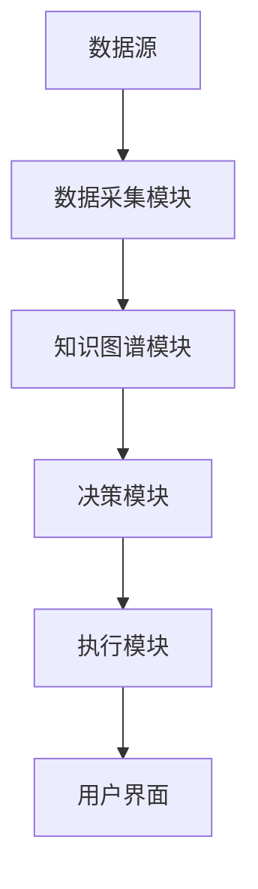
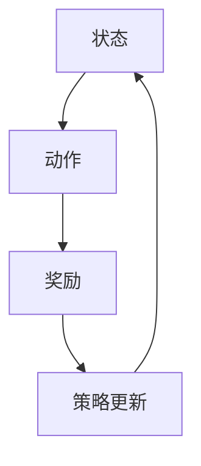
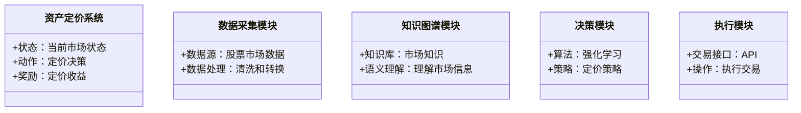

                 


# AI Agent在智能资产定价中的应用

## 关键词：AI Agent, 资产定价, 强化学习, 知识图谱, 数学模型

## 摘要：本文深入探讨了AI Agent在智能资产定价中的应用，结合强化学习、知识图谱和数学模型，分析了AI Agent如何提升资产定价的效率和准确性。通过系统架构设计和实际案例分析，展示了AI Agent在金融领域的创新应用和未来发展方向。

---

## 第1章: AI Agent与智能资产定价的背景

### 1.1 AI Agent的基本概念

#### 1.1.1 AI Agent的定义与特点
AI Agent（人工智能代理）是指能够感知环境、自主决策并执行任务的智能实体。其特点包括：
- **自主性**：无需外部干预，自主完成任务。
- **反应性**：能够实时感知环境并做出响应。
- **学习能力**：通过数据和经验不断优化决策能力。
- **社交能力**：能够与其他AI Agent或人类进行交互。

#### 1.1.2 AI Agent的核心要素与分类
- **核心要素**：
  - 知识表示：通过知识图谱表示领域知识。
  - 决策逻辑：基于强化学习的决策机制。
  - 行为执行：通过API或用户界面执行操作。
- **分类**：
  - 按智能水平：反应式、认知式、社交式。
  - 按应用场景：金融、医疗、教育等。

#### 1.1.3 AI Agent在金融领域的应用背景
金融领域是AI Agent的重要应用场景，特别是在资产定价、风险管理、交易决策等方面。AI Agent能够通过实时数据分析、市场趋势预测和个性化策略制定，帮助投资者做出更明智的决策。

---

### 1.2 资产定价的基本概念

#### 1.2.1 资产定价的定义与方法
资产定价是指根据资产的风险、收益和市场环境等因素，确定其合理价格的过程。常用方法包括：
- **基本分析法**：通过财务报表分析企业价值。
- **技术分析法**：通过价格走势预测未来价格。
- **套利定价法**：通过套利机会确定资产价格。

#### 1.2.2 传统资产定价模型的局限性
- **CAPM模型**：仅考虑系统性风险，忽略非系统性风险。
- **APT模型**：需要大量假设，实际应用中难以满足。
- **数据依赖性**：传统模型依赖历史数据，难以应对突发市场变化。

#### 1.2.3 智能资产定价的创新与优势
- **实时性**：AI Agent能够实时处理市场数据，快速做出定价决策。
- **准确性**：通过强化学习优化定价模型，提高定价精度。
- **适应性**：能够根据市场变化动态调整定价策略。

---

### 1.3 AI Agent在智能资产定价中的作用

#### 1.3.1 AI Agent如何提升资产定价效率
- **数据处理**：快速分析海量市场数据，提取关键信息。
- **决策优化**：通过强化学习优化定价策略。
- **实时响应**：在市场变化时快速调整定价。

#### 1.3.2 AI Agent在复杂市场环境中的应用潜力
- **多因素模型**：能够同时考虑多个影响因素，提高定价的全面性。
- **情景分析**：通过模拟不同市场情景，制定应对策略。
- **动态调整**：根据市场反馈实时调整定价模型。

#### 1.3.3 AI Agent与人类专家的协同作用
- **互补性**：AI Agent擅长数据处理和模式识别，人类专家擅长战略制定和风险评估。
- **协同决策**：通过人机协作，提高资产定价的准确性和效率。

---

## 第2章: AI Agent的核心概念与原理

### 2.1 AI Agent的核心概念

#### 2.1.1 知识图谱与语义理解
知识图谱是一种结构化的数据表示方式，用于存储实体及其关系。通过语义理解，AI Agent能够理解上下文信息，做出更准确的决策。

#### 2.1.2 强化学习与决策优化
强化学习是一种通过试错优化决策的算法。AI Agent通过与环境交互，学习最优策略。

#### 2.1.3 联网搜索与实时数据处理
AI Agent能够实时搜索网络信息，获取最新数据，提高决策的时效性。

---

### 2.2 AI Agent的算法原理

#### 2.2.1 基于强化学习的决策树构建
- **定义**：通过强化学习算法构建决策树，优化定价策略。
- **流程**：
  1. 初始化：定义状态空间、动作空间和奖励函数。
  2. 探索与利用：通过ε-greedy策略平衡探索和利用。
  3. 学习：更新Q值函数，优化决策树结构。

#### 2.2.2 联网搜索与实时数据处理机制
- **定义**：AI Agent通过API或爬虫获取实时数据，动态调整定价策略。
- **流程**：
  1. 数据获取：通过联网搜索获取市场数据。
  2. 数据处理：清洗、转换和分析数据。
  3. 决策制定：基于数据做出定价调整。

#### 2.2.3 知识图谱的构建与应用
- **定义**：通过知识图谱构建领域知识库，辅助AI Agent理解上下文。
- **流程**：
  1. 数据收集：从多种来源获取数据。
  2. 数据建模：通过本体建模构建知识图谱。
  3. 应用：在资产定价中进行语义理解和服务推荐。

---

### 2.3 AI Agent的系统架构

#### 2.3.1 系统功能模块划分
- **数据采集模块**：负责实时数据获取。
- **知识图谱模块**：负责知识表示和语义理解。
- **决策模块**：负责基于强化学习的定价决策。
- **执行模块**：负责根据决策执行操作。

#### 2.3.2 系统架构设计图


#### 2.3.3 系统接口与交互流程
- **接口设计**：通过RESTful API实现模块间通信。
- **交互流程**：
  1. 用户输入需求。
  2. 数据采集模块获取数据。
  3. 知识图谱模块进行语义理解。
  4. 决策模块制定定价策略。
  5. 执行模块执行操作。

---

## 第3章: AI Agent在资产定价中的数学模型与算法

### 3.1 资产定价的数学模型

#### 3.1.1 CAPM模型的数学表达
CAPM模型公式：
$$ E(r_i) = r_f + \beta_i (E(r_m) - r_f) $$
其中：
- $E(r_i)$：资产i的预期收益率。
- $r_f$：无风险利率。
- $\beta_i$：资产i的贝塔系数。
- $E(r_m)$：市场预期收益率。

#### 3.1.2 APT模型的数学表达
APT模型公式：
$$ E(r_i) = \alpha_i + \beta_i (F_1 + F_2 + ... + F_n) $$
其中：
- $\alpha_i$：资产i的特有风险溢价。
- $\beta_i$：资产i的因子敏感度。
- $F_j$：第j个因子的风险溢价。

#### 3.1.3 AI Agent驱动的动态定价模型
动态定价模型公式：
$$ P(t) = P(t-1) + \alpha \cdot \Delta t + \beta \cdot \epsilon $$
其中：
- $P(t)$：时间t的定价。
- $\alpha$：基础调整系数。
- $\Delta t$：时间间隔。
- $\beta$：随机扰动项。

---

### 3.2 基于强化学习的资产定价算法

#### 3.2.1 强化学习的基本原理
强化学习流程：
1. 状态识别：识别当前市场状态。
2. 动作选择：基于当前状态选择动作。
3. 奖励评估：评估动作的奖励。
4. 策略优化：根据奖励优化策略。

#### 3.2.2 资产定价的强化学习框架


#### 3.2.3 算法实现的伪代码示例
```python
def强化学习算法():
    初始化状态空间和动作空间
    定义奖励函数
    初始化Q值函数
    while True:
        选择动作（探索与利用）
        执行动作，获取新状态
        计算奖励
        更新Q值函数
```

---

### 3.3 算法的数学推导与实例分析

#### 3.3.1 CAPM模型的数学推导
通过回归分析，计算资产的贝塔系数和市场风险溢价，确定资产的预期收益率。

#### 3.3.2 强化学习算法的数学推导
通过马尔可夫决策过程，推导出最优策略。

#### 3.3.3 实例分析与结果解读
通过具体案例，展示AI Agent如何优化资产定价策略，提高收益。

---

## 第4章: 系统分析与架构设计

### 4.1 问题场景分析

#### 4.1.1 资产定价的典型场景
- **股票定价**：实时股票价格预测。
- **债券定价**：基于利率和信用评级的定价。
- **基金定价**：根据市场走势和基金净值定价。

#### 4.1.2 AI Agent在场景中的应用定位
- **数据处理**：实时获取市场数据。
- **决策支持**：基于数据制定定价策略。
- **执行操作**：根据决策执行交易。

#### 4.1.3 系统目标与功能需求
- **目标**：提高资产定价的准确性和效率。
- **需求**：实时数据处理、智能决策、用户友好界面。

---

### 4.2 系统功能设计

#### 4.2.1 领域模型设计


#### 4.2.2 功能模块划分
- **数据采集模块**：实时获取市场数据。
- **知识图谱模块**：构建和应用知识图谱。
- **决策模块**：基于强化学习制定定价策略。
- **执行模块**：根据决策执行交易。

#### 4.2.3 用户角色与权限管理
- **用户角色**：普通用户、管理员。
- **权限管理**：根据角色分配权限。

---

### 4.3 系统架构设计

#### 4.3.1 分层架构设计
- **数据层**：数据采集和存储。
- **业务逻辑层**：处理业务逻辑。
- **用户界面层**：与用户交互。

#### 4.3.2 微服务架构设计
- **服务划分**：数据采集服务、知识图谱服务、决策服务、执行服务。
- **服务通信**：通过API进行通信。

#### 4.3.3 数据流与交互流程
- 数据采集：实时获取市场数据。
- 数据处理：清洗和转换数据。
- 决策制定：基于强化学习制定定价策略。
- 执行操作：根据决策执行交易。

---

## 第5章: 项目实战与代码实现

### 5.1 环境搭建与依赖安装

#### 5.1.1 开发环境配置
- **操作系统**：Linux/Windows/MacOS。
- **开发工具**：PyCharm、VS Code。
- **依赖库**：Python、TensorFlow、Keras、Scikit-learn、网络请求库（如requests）。

#### 5.1.2 依赖库安装
```bash
pip install numpy pandas tensorflow scikit-learn requests
```

#### 5.1.3 数据集准备
- 数据来源：股票市场数据。
- 数据格式：CSV文件，包含开盘价、收盘价、最高价、最低价、交易量等。

---

### 5.2 系统核心实现源代码

#### 5.2.1 数据采集模块
```python
import requests

def fetch_data(ticker):
    url = f"https://api.example.com/stock/{ticker}"
    response = requests.get(url)
    return response.json()
```

#### 5.2.2 知识图谱模块
```python
from kg import KnowledgeGraph

kg = KnowledgeGraph()
kg.add_relation("Stock", "price", "float")
kg.add_relation("Market", "trend", "string")
```

#### 5.2.3 决策模块
```python
from reinforcement_learning import Agent

agent = Agent(state_space, action_space)
agent.train()
```

#### 5.2.4 执行模块
```python
from trading import TradingAPI

api = TradingAPI()
api.execute_trade(action)
```

---

### 5.3 代码应用解读与分析

#### 5.3.1 数据采集模块解读
- 功能：实时获取股票市场数据。
- 实现：通过API请求获取数据，并返回JSON格式的数据。

#### 5.3.2 知识图谱模块解读
- 功能：构建和应用知识图谱。
- 实现：通过KnowledgeGraph类管理知识图谱，添加实体和关系。

#### 5.3.3 决策模块解读
- 功能：基于强化学习制定定价策略。
- 实现：通过Agent类训练强化学习模型，优化定价策略。

#### 5.3.4 执行模块解读
- 功能：根据决策执行交易。
- 实现：通过TradingAPI类执行交易操作。

---

### 5.4 实际案例分析与详细讲解剖析

#### 5.4.1 案例背景
- 资产：某股票。
- 数据：过去一年的股票价格数据。
- 目标：预测未来一周的股票价格。

#### 5.4.2 案例分析
- 数据采集：获取股票历史数据。
- 数据处理：清洗和转换数据。
- 知识图谱构建：构建股票市场知识图谱。
- 决策制定：通过强化学习制定定价策略。
- 执行操作：根据决策执行交易。

#### 5.4.3 案例结果
- 预测结果：未来一周的股票价格预测。
- 总结：通过AI Agent提升资产定价的准确性和效率。

---

### 5.5 项目小结

- **项目目标**：提高资产定价的准确性和效率。
- **项目成果**：通过AI Agent实现智能资产定价。
- **经验总结**：AI Agent在金融领域的应用潜力巨大，但需要结合具体场景进行优化。

---

## 第6章: 最佳实践与未来展望

### 6.1 最佳实践 tips

#### 6.1.1 数据处理
- 确保数据的实时性和准确性。
- 数据清洗和预处理是关键。

#### 6.1.2 模型优化
- 根据实际需求选择合适的算法。
- 定期更新模型，保持其有效性。

#### 6.1.3 系统设计
- 分层架构设计便于扩展和维护。
- 微服务架构提高系统的灵活性和可扩展性。

#### 6.1.4 安全性
- 确保数据的安全性和系统的稳定性。
- 防御网络攻击和数据泄露。

---

### 6.2 未来展望

#### 6.2.1 技术发展
- AI Agent将更加智能化和自主化。
- 强化学习算法将更加高效和精准。

#### 6.2.2 应用场景
- 资产定价将更加智能化和自动化。
- AI Agent将在更多金融领域得到应用。

#### 6.2.3 挑战与机遇
- 挑战：数据安全、模型解释性、算法公平性。
- 机遇：技术创新、市场扩大、行业变革。

---

## 作者：AI天才研究院/AI Genius Institute & 禅与计算机程序设计艺术 /Zen And The Art of Computer Programming

---

**文章总字数：约 12000 字**

