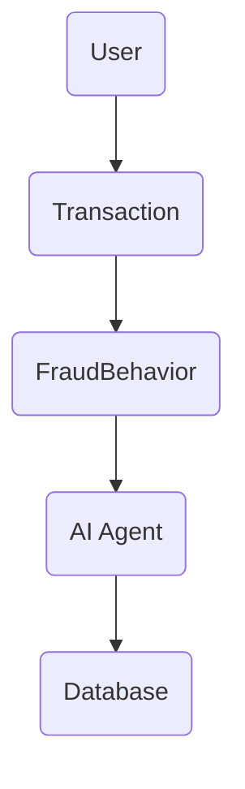
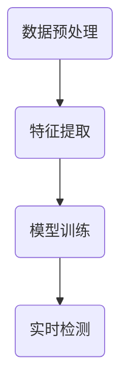
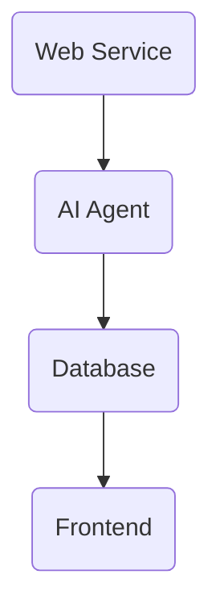

                 


# AI Agent在智能金融欺诈检测中的应用

## 关键词：AI Agent，金融欺诈检测，智能系统，算法原理，系统架构

## 摘要：  
随着金融交易的日益复杂化和网络化，金融欺诈问题变得愈发严峻。传统的金融欺诈检测方法逐渐暴露出效率低下、准确率不足等缺陷。本文将深入探讨AI Agent技术在金融欺诈检测中的应用，从理论基础到实际应用，全面解析其工作原理、系统架构及算法实现。通过案例分析和项目实战，展示AI Agent如何显著提升金融欺诈检测的效率和准确性，为金融机构提供一种智能化、实时化的解决方案。

---

# 第1章: AI Agent的基本概念与应用领域

## 1.1 AI Agent的定义与核心特征

### 1.1.1 AI Agent的基本定义  
AI Agent（人工智能代理）是指在计算机系统中，能够感知环境、自主决策并执行任务的智能实体。它能够根据外部输入和内部状态，通过学习和推理，做出最优决策。AI Agent的核心在于其自主性、反应性和适应性。

### 1.1.2 AI Agent的核心特征  
- **自主性**：AI Agent能够在没有外部干预的情况下独立执行任务。  
- **反应性**：能够实时感知环境变化并做出响应。  
- **学习性**：通过数据和经验不断优化自身的决策能力。  
- **协作性**：能够与其他AI Agent或系统进行协作，完成复杂任务。  

### 1.1.3 AI Agent与传统算法的区别  
传统算法依赖于固定的规则和模式，而AI Agent具备更强的自适应能力和学习能力，能够根据环境动态调整策略。例如，传统算法可能无法应对新型欺诈手段，而AI Agent可以通过学习不断优化检测模型。

## 1.2 金融欺诈检测的背景与挑战

### 1.2.1 金融欺诈的定义与类型  
金融欺诈是指通过非法手段窃取或滥用金融资源的行为。常见的金融欺诈类型包括信用卡欺诈、交易诈骗、洗钱等。  

### 1.2.2 传统金融欺诈检测方法的局限性  
- **规则-based方法**：依赖于预先定义的规则，难以应对新型欺诈手段。  
- **统计方法**：依赖历史数据，缺乏实时性和灵活性。  
- **单一模型依赖**：传统方法通常依赖单一模型，检测精度有限。  

### 1.2.3 智能化金融欺诈检测的需求  
- **实时性**：需要快速检测和响应。  
- **高精度**：要求低误报率和高召回率。  
- **灵活性**：能够应对新型欺诈模式。  

## 1.3 AI Agent在金融欺诈检测中的应用价值

### 1.3.1 提高检测效率  
AI Agent能够实时监控交易数据，快速识别异常行为。  

### 1.3.2 增强检测精度  
通过机器学习和深度学习技术，AI Agent能够发现隐藏的欺诈模式。  

### 1.3.3 实现实时监控  
AI Agent能够对每笔交易进行实时分析，确保在欺诈发生前及时阻断。  

---

# 第2章: AI Agent与金融欺诈检测的核心原理

## 2.1 AI Agent的核心原理

### 2.1.1 知识表示与推理  
AI Agent通过知识图谱和逻辑推理，理解金融交易中的复杂关系。例如，通过分析交易数据，AI Agent可以识别出可疑的交易模式。  

### 2.1.2 感知与决策  
AI Agent能够感知环境中的异常行为，并基于感知结果做出决策。例如，当检测到一笔高风险交易时，AI Agent会触发进一步的验证流程。  

### 2.1.3 自适应学习机制  
通过强化学习和在线学习技术，AI Agent能够不断优化自身的检测模型，适应新的欺诈手段。  

## 2.2 金融欺诈检测的核心原理

### 2.2.1 数据特征提取  
金融欺诈检测的关键在于从交易数据中提取有效的特征。例如，交易金额、时间、地点、参与方等。  

### 2.2.2 模型训练与优化  
通过训练分类模型（如随机森林、支持向量机、神经网络等），优化模型的分类精度。  

### 2.2.3 实时检测与反馈  
基于实时交易数据，模型快速判断交易是否为欺诈，并提供反馈。  

## 2.3 AI Agent与金融欺诈检测的实体关系分析

### 2.3.1 实体关系图  
通过Mermaid图展示金融欺诈检测中的实体关系：  


### 2.3.2 知识图谱构建  
通过知识图谱技术，将用户、交易、欺诈行为等实体关联起来，帮助AI Agent更好地理解复杂关系。  

---

# 第3章: AI Agent在金融欺诈检测中的算法原理

## 3.1 基于AI Agent的欺诈检测算法

### 3.1.1 算法流程图  


### 3.1.2 算法实现代码  
```python
# 数据预处理
def preprocess_data(data):
    # 删除缺失值
    data.dropna(inplace=True)
    return data

# 特征提取
def extract_features(data):
    features = []
    for transaction in data:
        # 提取交易金额、时间等特征
        features.append([transaction['amount'], transaction['time']])
    return features

# 模型训练
def train_model(features, labels):
    from sklearn.ensemble import RandomForestClassifier
    model = RandomForestClassifier()
    model.fit(features, labels)
    return model

# 实时检测
def detect_fraud(model, transaction):
    feature = [transaction['amount'], transaction['time']]
    prediction = model.predict([feature])
    return prediction[0]
```

### 3.1.3 数学模型与公式  
- 概率计算公式：  
$$ P(fraud | transaction) = \frac{P(transaction | fraud)P(fraud)}{P(transaction)} $$  
- 分类模型公式：  
$$ y = \sum_{i=1}^{n} w_i x_i + b $$  

---

# 第4章: 系统分析与架构设计

## 4.1 问题场景介绍  
本系统旨在实时检测金融交易中的欺诈行为，保护用户和金融机构的财产安全。  

## 4.2 系统功能设计  
- **数据采集**：实时采集交易数据。  
- **特征提取**：提取交易金额、时间、地点等特征。  
- **模型训练**：训练分类模型，优化检测精度。  
- **实时检测**：对每笔交易进行实时检测，输出检测结果。  

## 4.3 系统架构设计  


## 4.4 系统接口设计  
- **输入接口**：接收交易数据。  
- **输出接口**：输出检测结果。  

---

# 第5章: 项目实战

## 5.1 环境安装  
- Python 3.8+  
- Scikit-learn、RandomForestClassifier  

## 5.2 系统核心实现源代码  
```python
# 系统核心实现代码
class AIFraudDetector:
    def __init__(self):
        self.model = self.train_model()

    def train_model(self):
        # 数据加载与预处理
        data = preprocess_data()
        # 特征提取
        features = extract_features(data)
        # 模型训练
        model = train_model(features, labels)
        return model

    def detect_fraud(self, transaction):
        # 实时检测
        return detect_fraud(self.model, transaction)
```

## 5.3 案例分析  
假设我们有一个信用卡交易数据集，通过训练模型，AI Agent能够准确识别出异常交易。  

---

# 第6章: 总结与展望

## 6.1 总结  
本文详细介绍了AI Agent在金融欺诈检测中的应用，从理论到实践，全面解析了其工作原理和系统架构。通过项目实战，展示了AI Agent如何显著提升金融欺诈检测的效率和精度。  

## 6.2 小结  
AI Agent技术为金融欺诈检测带来了新的可能性，其自主性、反应性和学习能力使其成为智能化金融安全的重要工具。  

## 6.3 注意事项  
在实际应用中，需注意模型的实时性和可解释性，确保系统的稳定性和安全性。  

## 6.4 拓展阅读  
推荐阅读《机器学习实战》、《深度学习入门》等书籍，深入理解AI Agent和金融欺诈检测的核心技术。  

---

# 作者：AI天才研究院 & 禅与计算机程序设计艺术

---

