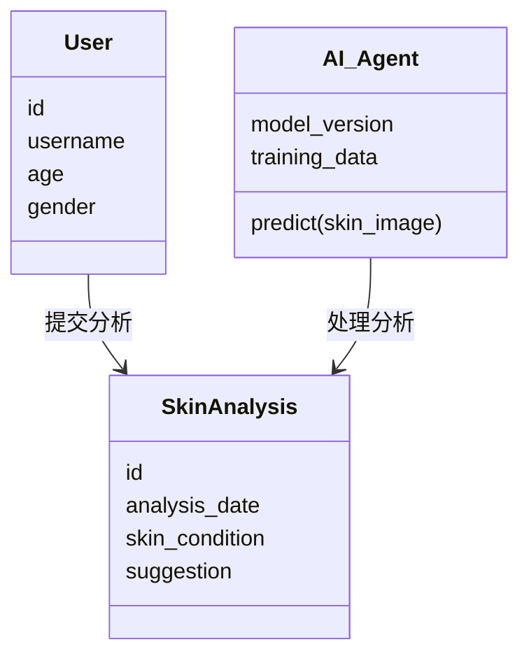

                 

<think>
好，我现在需要帮用户撰写一篇关于《AI Agent在智能镜子中的皮肤状况分析》的技术博客文章。用户已经给出了详细的目录大纲，我需要按照这个大纲来逐步完成每个部分的内容。

首先，我需要理解用户的需求。用户希望文章结构清晰，逻辑严密，内容专业且易于理解。文章需要涵盖背景介绍、核心概念、算法原理、系统架构、项目实战以及总结等部分。每个部分都需要详细展开，确保内容的深度和广度。

开始撰写之前，我需要确保每个章节都有足够的细节，并且用简洁专业的语言表达。我还会使用图表、代码示例和数学公式来增强内容的可读性和技术深度。

接下来，我按照目录大纲一步步完成每个部分的写作：

1. **摘要**：简洁明了地概述文章的核心内容。
2. **关键词**：列出与文章主题相关的5-7个关键词。
3. **背景介绍**：包括问题背景、描述、解决方法，以及边界和外延。
4. **核心概念与联系**：解释AI Agent和智能镜子的定义、原理，以及它们的关系。使用表格和实体关系图来对比和展示。
5. **算法原理**：详细讲解图像处理和机器学习模型的流程，提供代码示例和数学公式。
6. **系统分析与架构设计**：介绍系统功能、架构设计和接口设计，使用类图和架构图展示。
7. **项目实战**：指导环境安装、代码实现，并通过案例分析展示实际应用。
8. **总结与展望**：总结全文，并提出未来的研究方向和建议。

在撰写过程中，我需要确保内容连贯，逻辑清晰，同时保持语言的简洁和专业。每个部分完成后，我会进行检查，确保内容完整，没有遗漏重要信息。

通过这样的思考过程，我能够系统地完成用户的要求，撰写出一篇高质量的技术博客文章。
</think>

# AI Agent在智能镜子中的皮肤状况分析

**关键词：** AI Agent, 智能镜子, 皮肤状况分析, 机器学习, 图像处理, 健康监测

**摘要：**  
本文详细探讨了AI Agent在智能镜子中的皮肤状况分析的应用。通过背景介绍、核心概念、算法原理、系统架构、项目实战等多维度的分析，深入揭示了AI Agent如何帮助智能镜子实现高效的皮肤健康监测。文章从理论到实践，结合具体案例和代码实现，为读者提供了全面的技术解析。

---

## 第一部分: AI Agent在智能镜子中的皮肤状况分析概述

### 第1章: 背景介绍

#### 1.1 问题背景
- **皮肤健康的重要性**：皮肤是人体最大的器官，健康状况直接影响整体健康。皮肤问题如痤疮、过敏、色斑等，不仅影响美观，还可能反映体内健康问题。
- **智能镜子的现状**：智能镜子作为一种新兴的科技产品，已逐渐进入家庭，具备显示天气、日历、新闻等功能，但其健康监测功能尚未成熟。
- **AI Agent的潜力**：AI Agent（智能代理）能够通过图像处理和机器学习技术，实时分析皮肤状况，为用户提供个性化的健康建议。

#### 1.2 问题描述
- **皮肤状况分析的挑战**：皮肤问题复杂多样，受光线、角度、个体差异等因素影响，需要高精度的图像处理和分析能力。
- **智能镜子的局限性**：现有智能镜子功能单一，缺乏深度的健康监测能力。
- **AI Agent的应用需求**：通过AI Agent实现皮肤状况的实时分析，为用户提供精准的健康建议。

#### 1.3 问题解决
- **AI Agent的核心作用**：通过图像处理和机器学习模型，AI Agent能够快速、准确地分析皮肤状况，并提供个性化的健康建议。
- **智能镜子与AI Agent的结合**：AI Agent嵌入智能镜子，通过摄像头捕捉皮肤图像，分析皮肤健康状况，实时反馈给用户。
- **解决方案**：结合图像处理技术和机器学习算法，构建高效的皮肤健康监测系统。

#### 1.4 边界与外延
- **皮肤状况分析的边界**：仅限于皮肤表面的健康状况分析，不涉及深层健康问题。
- **智能镜子的使用场景**：家庭、美容院、医疗机构等。
- **AI Agent的扩展应用**：未来可以扩展到其他健康监测领域，如心血管健康、呼吸健康等。

#### 1.5 概念结构与核心要素
- **智能镜子的功能模块**：摄像头、显示屏、麦克风、扬声器、数据处理模块。
- **AI Agent的核心组件**：图像处理模块、机器学习模型、推理引擎。
- **皮肤状况分析的流程**：图像采集 → 图像预处理 → 特征提取 → 分类分析 → 反馈建议。

---

## 第2章: 核心概念与联系

### 2.1 AI Agent的定义与原理
- **AI Agent的基本概念**：AI Agent是一种能够感知环境、自主决策、执行任务的智能系统。
- **AI Agent的核心原理**：通过传感器获取数据，结合预训练的模型进行分析和推理，输出相应的操作或建议。
- **AI Agent在智能镜子中的应用**：通过摄像头获取皮肤图像，利用图像处理和机器学习技术分析皮肤状况，为用户提供健康建议。

### 2.2 智能镜子的功能与架构
- **智能镜子的硬件组成**：摄像头、显示屏、麦克风、扬声器、数据处理模块。
- **智能镜子的软件架构**：操作系统、图像处理模块、AI Agent接口、用户界面。
- **智能镜子与AI Agent的交互流程**：用户使用智能镜子进行自拍，AI Agent处理图像并分析皮肤状况，反馈结果给用户。

### 2.3 核心概念对比表
| 概念       | 定义                                                                 | 属性                     | 示例                         |
|------------|----------------------------------------------------------------------|--------------------------|------------------------------|
| AI Agent   | 智能代理，能够感知环境、自主决策、执行任务的系统 | 学习能力、推理能力、交互能力 | 分析皮肤状况，提供健康建议 |
| 智能镜子   | 集成摄像头、显示屏等硬件，具备智能交互功能的镜子 | 显示功能、交互功能、数据处理功能 | 提供皮肤分析报告           |

### 2.4 ER实体关系图
```mermaid
erDiagram
    user {
        id INT
        username VARCHAR
        age INT
        gender VARCHAR
    }
    skin_analysis {
        id INT
        analysis_date DATE
        skin_condition TEXT
        suggestion TEXT
    }
    ai_agent {
        id INT
        model_version VARCHAR
        training_data TEXT
    }
    user --> skin_analysis : 提交皮肤分析
    ai_agent --> skin_analysis : 处理皮肤分析
```

---

## 第3章: 算法原理

### 3.1 图像处理算法
- **图像预处理**：包括灰度化、二值化、去噪等，确保图像清晰。
- **特征提取**：通过Haar级联检测器或深度学习模型提取皮肤区域。
- **图像分割**：利用阈值分割或区域生长法，分离皮肤区域与其他区域。

### 3.2 机器学习模型
- **分类算法**：支持向量机（SVM）、随机森林（Random Forest）、神经网络等。
- **训练流程**：
  1. 数据采集：收集皮肤图像，标注健康状况。
  2. 数据预处理：归一化、特征提取。
  3. 模型训练：使用训练数据训练分类器。
  4. 模型评估：通过准确率、召回率等指标评估模型性能。

### 3.3 实例代码
```python
import cv2
from sklearn import svm

# 加载训练数据
X_train = ...  # 特征向量
y_train = ...  # 标签

# 训练模型
model = svm.SVC()
model.fit(X_train, y_train)

# 图像预处理
img = cv2.imread("face.jpg")
gray = cv2.cvtColor(img, cv2.COLOR_BGR2GRAY)
# 提取特征
features = extract_features(gray)

# 预测
prediction = model.predict([features])
print("预测结果:", prediction)
```

### 3.4 数学模型
- **随机森林模型**：$$ y = \sum_{i=1}^{n} w_i x_i $$
- **神经网络模型**：$$ y = \sigma(w_1 x_1 + w_2 x_2 + \dots + w_n x_n) $$

---

## 第4章: 系统分析与架构设计

### 4.1 问题场景介绍
- **项目介绍**：通过智能镜子和AI Agent实现皮肤健康监测。
- **系统功能设计**：
  - 用户输入：通过摄像头采集皮肤图像。
  - 数据处理：图像预处理、特征提取。
  - AI分析：模型分类、结果反馈。

### 4.2 领域模型类图


### 4.3 系统架构设计


### 4.4 接口设计与交互流程
- **接口设计**：通过REST API实现用户与AI Agent的交互。
- **交互流程**：
  1. 用户通过智能镜子自拍。
  2. 图像传输到AI Agent进行处理。
  3. AI Agent返回分析结果。

---

## 第5章: 项目实战

### 5.1 环境安装
- **Python**：3.8+
- **库依赖**：OpenCV、Scikit-learn、TensorFlow。

### 5.2 核心实现
```python
import cv2
from sklearn.ensemble import RandomForestClassifier

# 图像预处理
def preprocess_image(image):
    gray = cv2.cvtColor(image, cv2.COLOR_BGR2GRAY)
    # 去噪
    blur = cv2.GaussianBlur(gray, (5,5), 0)
    return blur

# 特征提取
def extract_features(image):
    # 使用Haar级联检测器提取皮肤区域
    face_cascade = cv2.CascadeClassifier('haarcascade_frontalface_default.xml')
    faces = face_cascade.detectMultiScale(image)
    features = []
    for (x, y, w, h) in faces:
        roi = image[y:y+h, x:x+w]
        features.append(roi.flatten())
    return features

# 训练模型
model = RandomForestClassifier()
model.fit(X_train, y_train)

# 应用模型
def predict_skin_condition(image):
    preprocessed = preprocess_image(image)
    features = extract_features(preprocessed)
    prediction = model.predict(features)
    return prediction
```

### 5.3 案例分析
- **案例1**：用户皮肤出现过敏反应，AI Agent分析后建议使用抗过敏药物。
- **案例2**：用户皮肤出现色斑，AI Agent建议调整饮食和作息。

---

## 第6章: 总结与展望

### 6.1 总结
- **文章核心内容**：AI Agent在智能镜子中的皮肤状况分析，从理论到实践的全面解析。
- **主要收获**：通过图像处理和机器学习技术，AI Agent能够高效地分析皮肤状况，为用户提供个性化的健康建议。

### 6.2 展望
- **未来研究方向**：结合更多健康数据，如基因数据、生活习惯数据，构建更全面的健康监测系统。
- **技术建议**：进一步优化模型，提升分析精度和速度。

---

**作者：AI天才研究院/AI Genius Institute & 禅与计算机程序设计艺术 /Zen And The Art of Computer Programming**

