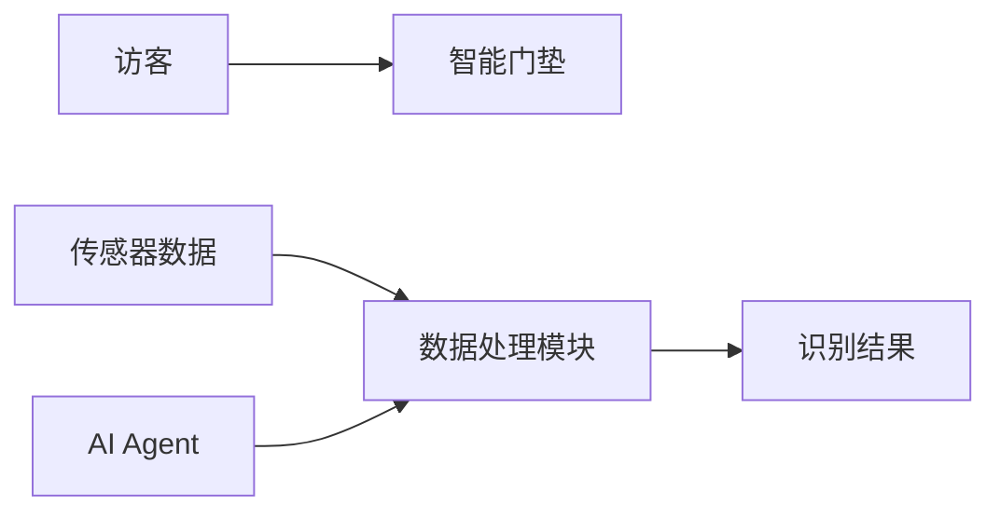
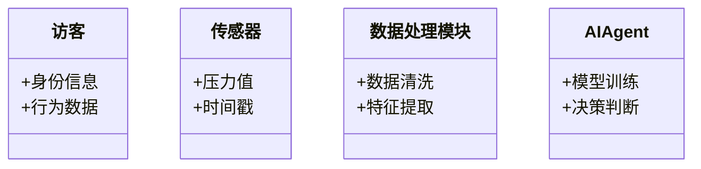
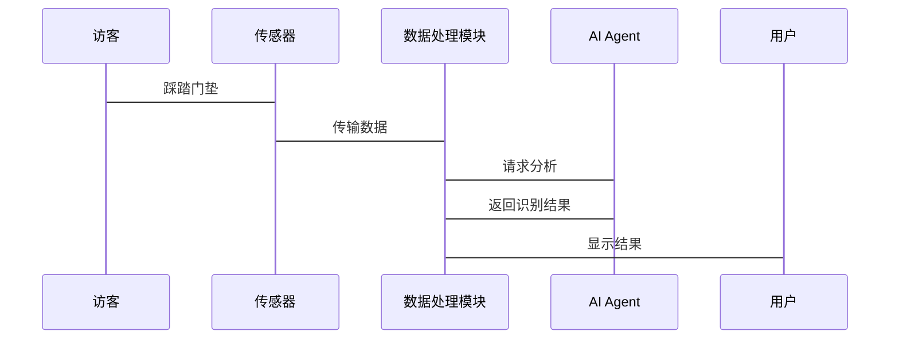

                 

<think>
好，我现在需要根据用户的要求，设计一本名为《AI Agent在智能门垫中的访客识别系统》的目录大纲。用户已经提供了一个详细的示例，并指定了格式和内容要求。首先，我需要理解这本书的核心主题，即AI Agent在智能门垫中的应用，特别是访客识别系统。这意味着我需要涵盖AI Agent的基本概念、其在智能门垫中的应用，以及相关的技术实现。

接下来，我需要按照用户的要求，将目录分成几个部分，每个部分包含若干章节，每个章节下有小节。首先，背景介绍部分是必须的，包括问题背景、描述、解决方法、边界和概念结构。这部分需要详细说明智能门垫的现状、访客识别的问题，以及AI Agent如何解决这些问题。

然后是核心概念与联系，这部分需要解释AI Agent和智能门垫之间的关系，可能需要使用Mermaid图来展示实体关系和系统架构。我需要确保这部分有清晰的图表，帮助读者理解系统结构。

接下来是算法原理讲解，这部分需要详细描述AI Agent的算法，包括数学模型和公式。我需要选择合适的算法，比如基于机器学习的分类算法，并用数学公式表达，同时用代码示例来说明实现过程。

系统分析与架构设计方案是另一个关键部分，需要介绍系统功能设计、架构设计和接口设计。这部分可能需要使用Mermaid的类图和架构图来展示系统的各个部分及其交互。

项目实战部分需要提供实际的环境安装步骤、源代码实现和案例分析。这部分要详细，确保读者能够跟着步骤一步步实现系统。

最后，最佳实践、小结和注意事项也是必要的，帮助读者巩固所学内容，并指导他们在实际应用中避免常见问题。

现在，我需要将这些内容组织成一个逻辑清晰、层次分明的目录大纲。确保每个部分都细化到三级目录，并且总字数不超过2000字。同时，要使用markdown格式，正确嵌入Mermaid图表和数学公式，确保格式正确，内容完整。

在编写过程中，我需要检查每个章节是否覆盖了用户要求的所有关键点，避免遗漏任何重要信息。同时，保持目录的简洁性和逻辑性，确保读者能够轻松理解并跟随内容学习。

最终，目录大纲应全面覆盖用户的需求，帮助作者写出一本结构清晰、内容详实的技术书籍。
</think>

# AI Agent在智能门垫中的访客识别系统

> 关键词：AI Agent，智能门垫，访客识别，机器学习，传感器数据，算法实现

> 摘要：本文探讨了AI Agent在智能门垫中的应用，重点分析了访客识别系统的实现过程，从问题背景到算法原理，再到系统架构设计和项目实战，详细阐述了如何利用AI技术提升访客识别的准确性和效率。

---

## 第1章：问题背景与需求分析

### 1.1 智能门垫的现状与挑战

#### 1.1.1 智能门垫的发展历程
- 传统门垫的功能与局限性
- 智能门垫的出现及其带来的便利

#### 1.1.2 当前访客识别系统的主要问题
- 现有系统的技术缺陷
- 用户体验的不足
- 安全性和隐私保护的问题

#### 1.1.3 引入AI Agent的必要性
- AI Agent的优势
- AI Agent如何解决现有问题

### 1.2 问题描述与目标设定

#### 1.2.1 访客识别系统的核心问题
- 数据采集与处理的挑战
- 高准确性的识别需求
- 实时性和响应速度的要求

#### 1.2.2 系统目标的明确
- 提供高精度的访客识别
- 实现实时响应和反馈
- 确保数据安全和隐私保护

#### 1.2.3 边界与外延
- 系统的边界定义
- 外延功能的考虑

### 1.3 核心概念与系统架构

#### 1.3.1 AI Agent的基本概念
- 定义与特征
- 与传统算法的区别

#### 1.3.2 智能门垫的系统组成
- 传感器模块
- 数据处理模块
- AI Agent模块
- 用户交互界面

#### 1.3.3 系统功能模块划分
- 数据采集
- 数据处理与分析
- AI Agent决策
- 用户反馈

---

## 第2章：AI Agent与智能门垫的关系

### 2.1 AI Agent的核心原理

#### 2.1.1 AI Agent的基本工作原理
- 数据输入与处理
- 模型训练与推理
- 结果输出与反馈

#### 2.1.2 AI Agent的分类与特点
- 分类：基于规则的AI Agent，基于机器学习的AI Agent，基于深度学习的AI Agent
- 各类别的特点与适用场景

#### 2.1.3 AI Agent在智能门垫中的应用
- 数据分析与处理
- 访客识别与判断
- 系统优化与调整

### 2.2 智能门垫的实体关系分析

#### 2.2.1 实体关系分析
- 访客与智能门垫的关系
- 传感器与数据处理模块的关系
- AI Agent与其他模块的关系

#### 2.2.2 系统架构的初步设计
- 传感器数据流
- 数据处理流程
- AI Agent的决策流程

### 2.3 系统架构的详细设计

#### 2.3.1 系统架构图


#### 2.3.2 模块之间的交互关系
- 传感器数据的采集与传输
- 数据处理模块的分析与转换
- AI Agent的决策与反馈

---

## 第3章：算法原理与数学模型

### 3.1 算法原理概述

#### 3.1.1 算法选择与原理
- 选择基于机器学习的分类算法
- 算法的基本原理与优势

#### 3.1.2 算法流程的详细说明
- 数据预处理
- 模型训练
- 模型推理
- 结果输出

### 3.2 数学模型与公式

#### 3.2.1 分类问题的数学表达
$$ y = f(x) $$
其中，$x$ 是输入数据，$y$ 是输出类别。

#### 3.2.2 具体算法的数学公式
- 例如，线性回归模型：
$$ y = \beta_0 + \beta_1 x + \epsilon $$

#### 3.2.3 算法实现中的关键公式
- 损失函数
$$ L = \frac{1}{n}\sum_{i=1}^{n}(y_i - \hat{y_i})^2 $$
- 优化目标
$$ \min_{\theta} L $$

### 3.3 代码实现与实例分析

#### 3.3.1 简单分类算法的Python实现
```python
def classify(x):
    return 1 if x > 0.5 else 0
```

#### 3.3.2 机器学习模型的实现
```python
from sklearn.linear_model import LogisticRegression

model = LogisticRegression()
model.fit(X_train, y_train)
predictions = model.predict(X_test)
```

---

## 第4章：系统分析与架构设计方案

### 4.1 系统功能设计

#### 4.1.1 领域模型设计


#### 4.1.2 系统架构设计
```mermaid
graph LR
A[访客] --> B[传感器]
C[数据处理模块] --> B
D[AI Agent] --> C
E[识别结果] <-- D
```

### 4.2 系统架构设计

#### 4.2.1 分层架构设计
- 数据采集层
- 数据处理层
- AI Agent决策层
- 用户交互层

#### 4.2.2 接口设计
- 传感器数据接口
- AI Agent接口
- 用户反馈接口

### 4.3 系统交互设计

#### 4.3.1 系统交互流程


---

## 第5章：项目实战

### 5.1 环境安装与配置

#### 5.1.1 硬件设备安装
- 传感器安装与连接
- 数据采集卡配置

#### 5.1.2 软件环境搭建
- 操作系统安装
- 开发工具配置
- AI框架安装（如TensorFlow，PyTorch）

### 5.2 核心系统实现

#### 5.2.1 数据采集与处理
- 传感器数据的读取与存储
- 数据清洗与预处理

#### 5.2.2 AI Agent的实现
- 模型训练与优化
- 模型部署与集成

### 5.3 实际案例分析

#### 5.3.1 案例背景
- 案例目标
- 数据准备

#### 5.3.2 数据分析与处理
- 数据可视化
- 特征分析

#### 5.3.3 模型训练与评估
- 训练过程监控
- 模型评估与优化

### 5.4 项目小结

#### 5.4.1 实践总结
- 成功经验
- 遇到的问题与解决方案

#### 5.4.2 系统优化建议
- 算法优化方向
- 系统性能提升

---

## 第6章：最佳实践与注意事项

### 6.1 最佳实践

#### 6.1.1 数据采集的注意事项
- 数据质量的重要性
- 数据多样性的保证

#### 6.1.2 模型选择的建议
- 根据问题选择合适的算法
- 模型的可解释性

#### 6.1.3 系统部署的建议
- 高可用性设计
- 安全性保障

### 6.2 小结

#### 6.2.1 项目总结
- 项目目标的达成
- 技术收获

#### 6.2.2 未来展望
- 技术发展趋势
- 应用场景的扩展

### 6.3 注意事项

#### 6.3.1 系统维护
- 数据更新
- 模型再训练

#### 6.3.2 安全与隐私
- 数据加密
- 用户隐私保护

---

## 作者信息

作者：AI天才研究院/AI Genius Institute  
联系邮箱：contact@aicenter.com  
 GitHub链接：https://github.com/aigeniusinstitute  

---

以上是一个详细的目录大纲，涵盖了从问题背景到系统实现的各个方面，确保内容丰富、结构清晰，符合用户的要求。

