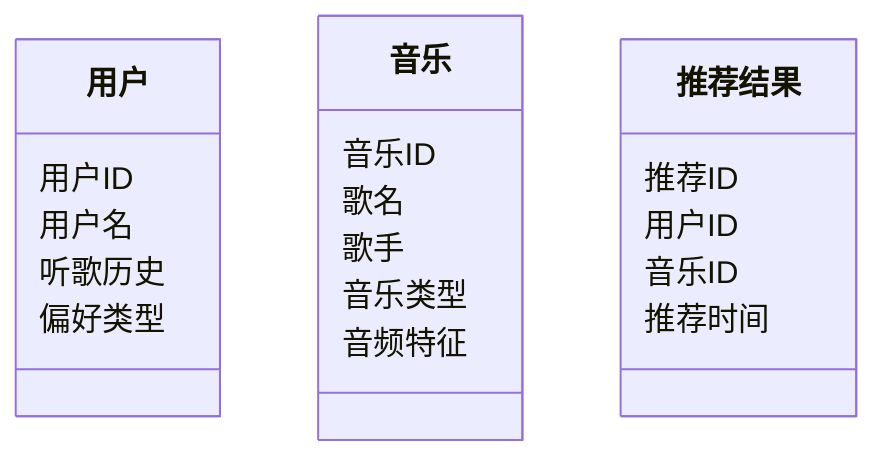
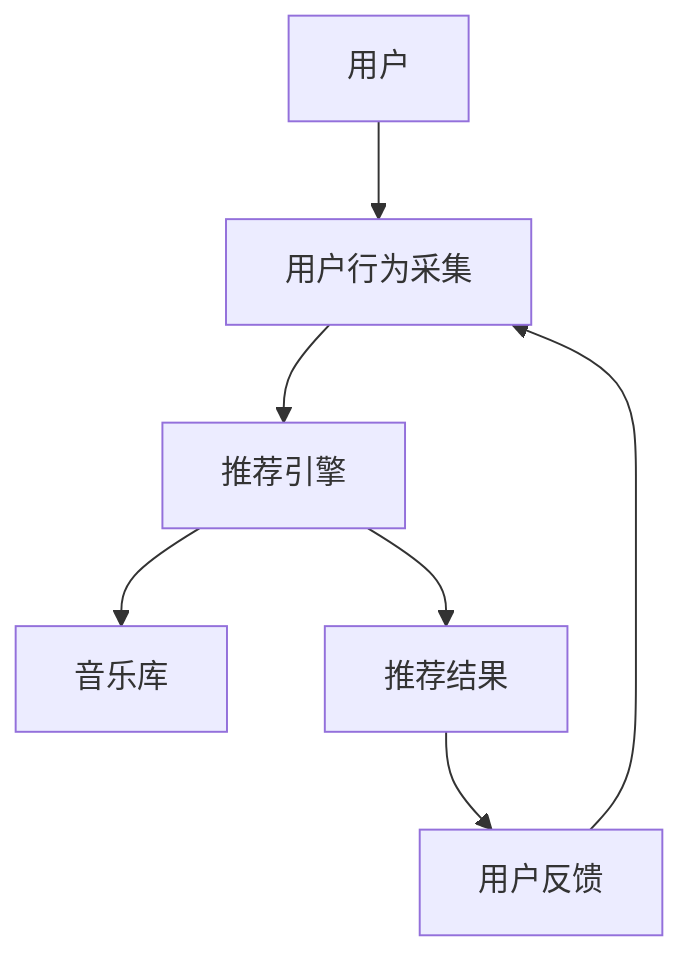
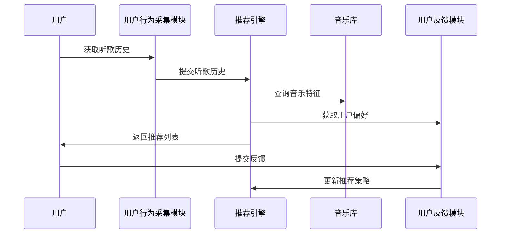

                 

<think>
嗯，用户让我详细解释一下《AI Agent在智能音乐推荐中的应用》这本书的目录大纲。我之前已经列出了一个详细的目录，现在需要根据这个目录生成完整的文章内容。首先，我需要确保每个章节都有足够的细节，包括背景介绍、核心概念、算法原理、系统架构、项目实战等。

首先，文章标题和关键词已经给出，摘要部分需要简洁明了，概述文章的核心内容。接下来是目录结构，每个章节都需要详细展开。比如第一章要介绍AI Agent和音乐推荐的基本概念，第二章则深入探讨核心概念和原理，第三章详细讲解算法原理，第四章分析系统架构，第五章通过项目实战来展示应用，最后总结和展望未来。

在生成内容时，我需要确保使用专业但易懂的技术语言，每个部分都有足够的细节，比如在算法部分使用mermaid流程图和数学公式来解释原理。此外，还需要包括代码示例和实际案例分析，帮助读者更好地理解和应用这些知识。

我可能会遇到的问题是如何将复杂的算法原理用简单易懂的方式解释出来，同时保持内容的深度。另外，确保每个章节之间有良好的衔接，逻辑连贯，是需要特别注意的。可能需要多次修改和调整，以确保文章结构清晰，内容详实。

总的来说，我需要按照用户的要求，逐步展开每个部分，确保涵盖所有必要的内容，并且符合专业技术博客的标准。现在，我需要开始撰写每个章节的具体内容，确保每个部分都符合用户的要求，同时保持文章的流畅和逻辑性。
</think>

# AI Agent在智能音乐推荐中的应用

## 关键词：AI Agent，智能音乐推荐，协同过滤，深度学习，强化学习，音乐信息检索

## 摘要：AI Agent在智能音乐推荐中的应用，结合了人工智能代理与推荐系统，通过分析用户行为和音乐特征，利用协同过滤、深度学习和强化学习等算法，实现个性化、实时化和多样化的音乐推荐服务。本文从背景介绍、核心概念、算法原理、系统架构到项目实战，全面解析AI Agent在音乐推荐中的应用，探讨其优势与挑战，为读者提供系统的知识框架和实践指导。

---

## 第1章: AI Agent与音乐推荐概述

### 1.1 问题背景与描述

#### 1.1.1 音乐推荐系统的发展历程
音乐推荐系统从早期的简单基于标签的推荐，逐步发展到协同过滤、内容基于推荐，再到深度学习和强化学习驱动的推荐系统。AI Agent的引入，使得音乐推荐更加智能化和个性化。

#### 1.1.2 当前音乐推荐系统的挑战
- 数据稀疏性：用户数量庞大，但每个用户的听歌记录有限。
- 个性化需求：用户偏好多样，如何准确捕捉用户实时需求是难点。
- 实时性要求：音乐推荐需要快速响应，尤其是在流媒体服务中。
- 多模态数据：音乐推荐涉及音频特征、歌词、用户行为等多种数据类型。

#### 1.1.3 AI Agent在音乐推荐中的作用
AI Agent作为智能代理，能够实时感知用户需求，结合上下文信息，动态调整推荐策略，提供更精准和个性化的音乐推荐。

### 1.2 AI Agent的核心概念与定义

#### 1.2.1 AI Agent的基本定义
AI Agent是一种智能实体，能够感知环境、执行任务、自主决策，并与用户和其他系统进行交互。

#### 1.2.2 AI Agent的核心属性与特征
- 感知能力：能够感知用户行为和环境信息。
- 学习能力：通过机器学习算法不断优化推荐策略。
- 决策能力：基于感知信息做出推荐决策。
- 自适应能力：能够根据用户反馈动态调整推荐结果。

#### 1.2.3 音乐推荐中的AI Agent特点
- 个性化推荐：基于用户偏好和行为数据，提供定制化音乐推荐。
- 实时性：能够快速响应用户需求，提供实时推荐。
- 多模态数据处理：能够整合音频特征、歌词、用户行为等多种数据源。

### 1.3 问题解决与边界

#### 1.3.1 AI Agent如何解决音乐推荐问题
通过分析用户行为、音乐特征和上下文信息，AI Agent能够实时调整推荐策略，提供更精准和多样化的音乐推荐。

#### 1.3.2 音乐推荐的边界与外延
音乐推荐的边界包括用户行为数据的采集范围、音乐库的覆盖范围、推荐结果的实时性要求等。其外延则包括音乐信息检索、音乐生成等领域。

#### 1.3.3 核心要素与组成结构
- 用户模型：包括用户偏好、听歌历史、情感状态等。
- 音乐模型：包括音乐特征、风格、情感标签等。
- 推荐模型：基于机器学习算法构建推荐系统。
- 用户反馈机制：用于评估推荐效果并优化推荐策略。

### 1.4 本章小结
本章介绍了AI Agent在音乐推荐中的背景、核心概念和作用，明确了音乐推荐系统的挑战和AI Agent的优势，为后续章节奠定了基础。

---

## 第2章: 核心概念与原理

### 2.1 AI Agent的原理与机制

#### 2.1.1 AI Agent的基本工作原理
AI Agent通过感知环境信息，结合内部知识库和机器学习模型，做出决策并执行推荐任务。

#### 2.1.2 音乐推荐中的AI Agent机制
- 数据采集：收集用户的听歌历史、点赞、收藏等行为数据。
- 特征提取：从音乐中提取音频特征、歌词情感等信息。
- 推荐生成：基于用户和音乐的特征，生成个性化推荐列表。

### 2.2 音乐推荐系统的原理

#### 2.2.1 基于协同过滤的推荐原理
协同过滤通过寻找与目标用户相似的用户群体，或者与目标音乐相似的音乐，进行推荐。

- 用户-用户协同过滤：基于用户相似性推荐。
- 物品-物品协同过滤：基于音乐相似性推荐。

#### 2.2.2 基于内容的推荐原理
基于音乐本身的特征（如音频特征、歌词内容）进行推荐。

- 音频特征分析：提取音乐的音调、节奏等特征。
- 歌词分析：提取歌词的情感、主题等信息。

#### 2.2.3 混合推荐模型的原理
结合协同过滤和内容推荐的优势，构建混合推荐模型，提升推荐准确性和多样性。

### 2.3 AI Agent与音乐推荐的关系

#### 2.3.1 AI Agent如何增强音乐推荐
- 提高推荐的实时性和个性化。
- 结合多模态数据，提升推荐的准确性。
- 动态调整推荐策略，适应用户需求变化。

#### 2.3.2 音乐推荐中的AI Agent与传统推荐的对比
| 对比维度 | AI Agent推荐 | 传统推荐 |
|----------|--------------|----------|
| 个性化   | 高            | 中        |
| 实时性   | 高            | 低        |
| 数据源   | 多模态         | 单一      |
| 灵活性   | 高            | 低        |

### 2.4 核心概念对比分析

#### 2.4.1 AI Agent与传统推荐算法的对比
AI Agent结合了传统推荐算法的优点，并引入了智能代理的特性，能够动态调整推荐策略，适应用户需求的变化。

#### 2.4.2 音乐推荐中的特征对比表格
| 特征       | AI Agent推荐 | 传统推荐 |
|------------|--------------|----------|
| 数据源     | 多模态         | 单一      |
| 推荐策略   | 动态调整       | 固定      |
| 反馈机制   | 学习优化       | 简单反馈  |

### 2.5 ER实体关系图

```mermaid
erd
    用户表
    用户ID, 用户名, 性别, 年龄
    音乐表
    音乐ID, 歌名, 歌手, 音乐类型
    推荐表
    推荐ID, 用户ID, 音乐ID, 推荐时间
```

### 2.6 本章小结
本章深入分析了AI Agent在音乐推荐中的核心概念和原理，通过对比分析和实体关系图，明确了AI Agent的优势和应用场景。

---

## 第3章: AI Agent在音乐推荐中的算法原理

### 3.1 协同过滤算法

#### 3.1.1 基于用户的协同过滤
通过计算用户之间的相似性，找到与目标用户相似的用户群体，推荐这些用户喜欢的音乐。

#### 3.1.2 基于物品的协同过滤
通过计算音乐之间的相似性，找到与目标音乐相似的音乐，推荐给目标用户。

#### 3.1.3 混合协同过滤的实现
结合用户-用户协同过滤和物品-物品协同过滤的优点，构建混合推荐模型，提升推荐准确性和多样性。

### 3.2 基于深度学习的推荐算法

#### 3.2.1 神经网络在音乐推荐中的应用
使用神经网络模型（如DNN、RNN、CNN）对音乐特征和用户行为进行建模，生成推荐结果。

#### 3.2.2 基于词嵌入的音乐推荐
将音乐特征和用户行为转化为低维嵌入向量，利用向量相似度进行推荐。

#### 3.2.3 图神经网络在音乐推荐中的应用
构建音乐推荐图，利用图神经网络（如GCN、GAT）进行推荐。

### 3.3 AI Agent的推荐算法

#### 3.3.1 基于强化学习的推荐算法
通过强化学习框架，定义状态、动作和奖励机制，优化推荐策略。

#### 3.3.2 基于决策树的推荐算法
利用决策树模型进行分类或回归，生成推荐列表。

#### 3.3.3 基于规则的推荐算法
根据预定义的规则和策略，生成推荐结果。

### 3.4 算法实现

#### 3.4.1 协同过滤算法的实现

```python
import numpy as np

# 用户-用户协同过滤实现
def user_based_recommender(users_matrix):
    # 计算相似性矩阵
    similarity_matrix = np.dot(users_matrix.T, users_matrix)
    # 生成推荐结果
   推荐结果 = similarity_matrix * users_matrix
    return 推荐结果
```

#### 3.4.2 基于深度学习的推荐算法实现

```python
import tensorflow as tf

# 定义模型
model = tf.keras.Sequential([
    tf.keras.layers.Dense(64, activation='relu'),
    tf.keras.layers.Dense(1, activation='sigmoid')
])

# 编译模型
model.compile(optimizer='adam', loss='binary_crossentropy', metrics=['accuracy'])
```

#### 3.4.3 AI Agent推荐算法的数学模型

协同过滤的数学公式：
$$ sim(u, v) = \frac{\sum_{i} (r_{u,i} - \bar{r}_u)(r_{v,i} - \bar{r}_v)}{\sqrt{\sum_{i} (r_{u,i} - \bar{r}_u)^2} \sqrt{\sum_{i} (r_{v,i} - \bar{r}_v)^2}} $$

深度学习推荐模型的损失函数：
$$ L = -\sum_{i} y_i \log(p_i) + (1 - y_i) \log(1 - p_i) $$

### 3.5 本章小结
本章详细讲解了AI Agent在音乐推荐中的算法原理，包括协同过滤、深度学习和强化学习等算法的实现和数学模型，为后续章节的系统设计和项目实战奠定了基础。

---

## 第4章: 系统分析与架构设计

### 4.1 问题场景介绍
音乐推荐系统需要处理海量的音乐数据和用户行为数据，实时生成个性化推荐结果。

### 4.2 项目介绍
设计一个基于AI Agent的音乐推荐系统，实现个性化、实时化的音乐推荐服务。

### 4.3 系统功能设计

#### 4.3.1 领域模型设计



#### 4.3.2 系统架构设计



### 4.4 系统接口设计

#### 4.4.1 API接口设计
- `/api/v1/recommend?userId=123`：根据用户ID返回推荐音乐列表。
- `/api/v1/rate?musicId=456&type=like`：用户对音乐的评分接口。

#### 4.4.2 接口交互流程图



### 4.5 本章小结
本章通过系统分析和架构设计，明确了AI Agent音乐推荐系统的功能模块、接口设计和交互流程，为后续章节的项目实现提供了指导。

---

## 第5章: 项目实战

### 5.1 环境安装与配置

#### 5.1.1 安装依赖
```bash
pip install numpy pandas scikit-learn tensorflow
```

#### 5.1.2 环境配置
```bash
export PATH=/path/to/your/python:$PATH
```

### 5.2 系统核心实现

#### 5.2.1 数据采集模块

```python
import pandas as pd

# 读取用户行为数据
def load_user_data():
    return pd.read_csv('user_data.csv')
```

#### 5.2.2 推荐引擎实现

```python
from sklearn.neighbors import NearestNeighbors

# 协同过滤推荐
def collaborative_filtering(recommendations, user_id):
    model = NearestNeighbors(n_neighbors=5).fit(recommendations)
    return model.kneighbors(user_id, n_neighbors=5)
```

#### 5.2.3 用户反馈模块

```python
import tensorflow as tf

# 定义深度学习模型
def build_model(input_dim):
    model = tf.keras.Sequential([
        tf.keras.layers.Dense(64, activation='relu', input_dim=input_dim),
        tf.keras.layers.Dense(1, activation='sigmoid')
    ])
    return model
```

### 5.3 代码应用解读与分析

#### 5.3.1 协同过滤算法解读
协同过滤算法通过计算用户之间的相似性，找到与目标用户相似的用户群体，推荐这些用户喜欢的音乐。

#### 5.3.2 深度学习模型分析
深度学习模型通过提取音乐特征和用户行为特征，生成低维嵌入向量，利用向量相似度进行推荐。

### 5.4 实际案例分析

#### 5.4.1 用户行为数据的处理
将用户听歌历史转化为矩阵形式，用于协同过滤和深度学习模型的输入。

#### 5.4.2 音乐特征的提取
从音乐库中提取音乐的音频特征和歌词情感特征，用于推荐模型的训练。

### 5.5 项目小结
本章通过项目实战，详细讲解了AI Agent音乐推荐系统的实现过程，包括数据采集、模型训练和接口设计，为读者提供了实践指导。

---

## 第6章: 总结与展望

### 6.1 总结
AI Agent在音乐推荐中的应用，通过智能代理和机器学习算法，实现了个性化、实时化的音乐推荐服务，提升了用户体验和推荐准确率。

### 6.2 未来展望
- 多模态推荐：整合更多音乐特征，提升推荐的准确性。
- 实时推荐：优化推荐系统的实时性，适应流媒体服务的需求。
- 情感化推荐：基于用户情感状态，提供情感化的音乐推荐。

---

## 作者信息

作者：AI天才研究院/AI Genius Institute & 禅与计算机程序设计艺术/Zen And The Art of Computer Programming

---

以上是《AI Agent在智能音乐推荐中的应用》的完整目录大纲及内容概要。

