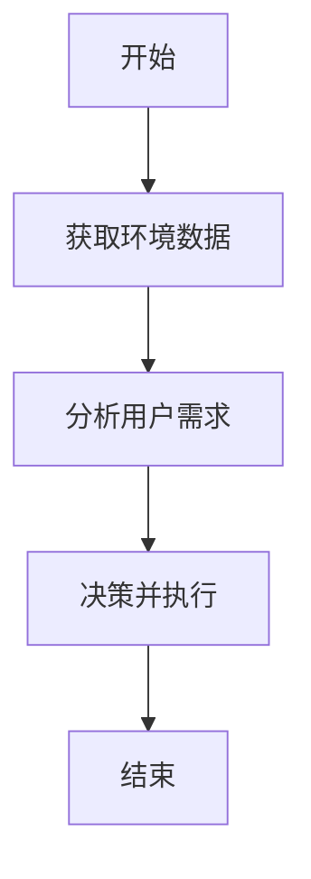
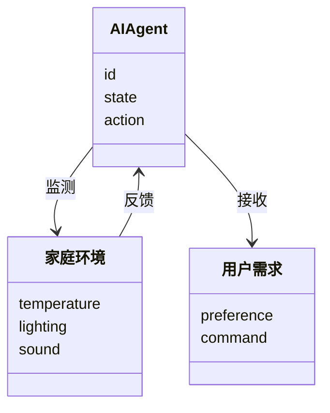
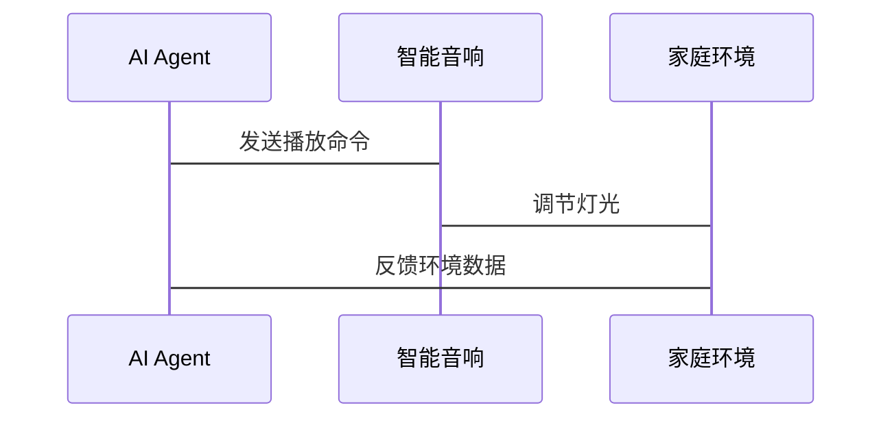

                 

<think>
好的，我现在需要帮助用户撰写一本关于《AI Agent在智能音响中的家庭氛围营造》的技术博客文章。用户希望文章结构清晰，内容详尽，涵盖从背景到实战的各个方面。

首先，我需要确定文章的核心主题：AI Agent如何在智能音响中营造家庭氛围。这意味着我需要从AI Agent的基本概念开始，逐步深入到算法原理、系统架构，最后到项目实战。

接下来，我应该按照用户提供的目录结构来组织内容。首先是背景介绍，包括AI Agent和智能音响的基本概念，以及它们如何结合来营造家庭氛围。然后是核心概念，讨论AI Agent的原理和属性，再通过ER图展示实体关系。

然后，算法原理部分需要详细讲解AI Agent的工作流程，包括感知、决策和执行层。这部分可以用数学模型和Mermaid流程图来支持，确保读者理解背后的机制。

接下来是系统分析与架构设计，这部分需要展示系统的各个组件及其交互关系。使用类图、架构图和序列图来详细说明系统如何运作，帮助读者更好地理解整体结构。

项目实战部分是关键，需要提供具体的代码示例和实现步骤。通过Python代码展示如何安装库、初始化AI Agent、处理传感器数据，以及播放音乐来营造氛围。代码解读和案例分析能让读者实际操作，加深理解。

最后，总结部分需要回顾所学内容，强调AI Agent的优势和挑战，并提出改进建议和未来方向。同时，注意事项和拓展阅读部分为读者提供进一步学习的方向。

在撰写过程中，我需要确保每一部分都详细具体，使用专业术语但保持易懂。同时，合理使用图表和代码示例，帮助读者更好地理解和应用所学知识。

总结来说，我将按照用户提供的大纲，逐章详细撰写，确保每一部分都涵盖必要的细节，逻辑清晰，内容丰富。
</think>

```markdown
# AI Agent在智能音响中的家庭氛围营造

> 关键词：AI Agent, 智能音响, 家庭氛围, 智能家居, 人工智能

> 摘要：本文将探讨AI Agent在智能音响中的应用，详细分析其如何通过感知、决策和执行层来营造家庭氛围。文章从背景、核心概念、算法原理、系统架构到项目实战，全面解析AI Agent在智能音响中的实现与应用。

---

# 第一部分: AI Agent在智能音响中的家庭氛围营造基础

# 第1章: AI Agent与智能音响概述

## 1.1 AI Agent的基本概念

### 1.1.1 AI Agent的定义
AI Agent（人工智能代理）是一种智能实体，能够感知环境、自主决策并执行任务，以满足用户需求。AI Agent具备智能性、自主性和交互性，能够通过传感器获取信息，利用算法处理数据，并通过执行器与环境互动。

### 1.1.2 AI Agent的核心特点
1. **智能性**：AI Agent能够理解输入的数据，并基于知识和学习做出决策。
2. **自主性**：AI Agent能够在没有外部干预的情况下独立运作。
3. **交互性**：AI Agent能够与用户、环境和其他系统进行交互。

### 1.1.3 AI Agent与传统智能设备的区别
AI Agent不同于传统的智能设备，它不仅仅是被动响应指令，而是能够主动感知环境、学习用户偏好，并根据实时情况调整行为。

## 1.2 智能音响的发展历程

### 1.2.1 智能音响的定义
智能音响是一种集成语音助手、音乐播放、智能家居控制等功能的设备，能够通过语音指令或自动化系统实现智能化的音乐播放和环境控制。

### 1.2.2 智能音响的主要功能
1. **语音控制**：通过语音指令播放音乐、调节音量。
2. **智能家居控制**：与家庭中的其他智能设备联动，如调节灯光、空调等。
3. **个性化推荐**：根据用户的听歌习惯推荐音乐。

### 1.2.3 智能音响的发展趋势
随着人工智能技术的不断进步，智能音响正在向更加智能化、个性化和生态化方向发展，逐渐成为家庭智能生态的核心设备之一。

## 1.3 家庭氛围营造的背景与需求

### 1.3.1 家庭氛围营造的定义
家庭氛围营造是指通过调整环境中的声音、光线、温度等因素，营造出符合用户需求的舒适、放松或兴奋的环境。

### 1.3.2 当代家庭对氛围营造的需求
随着生活节奏的加快，人们越来越重视家庭环境的舒适性和个性化。家庭氛围营造的需求主要体现在提升生活品质、个性化体验和健康舒适等方面。

### 1.3.3 AI Agent在家庭氛围营造中的作用
AI Agent能够通过感知用户的情绪、环境的变化，主动调整音响、灯光和温度等设备，为用户提供个性化的氛围营造服务。

## 1.4 本章小结
本章介绍了AI Agent和智能音响的基本概念，分析了智能音响的发展历程及其在家庭氛围营造中的重要性。通过AI Agent的智能性和自主性，智能音响能够为用户提供更加智能化的家庭氛围营造服务。

---

# 第2章: AI Agent在家庭氛围营造中的核心概念与联系

## 2.1 AI Agent的核心概念原理

### 2.1.1 感知层
AI Agent通过传感器和语音助手获取环境信息，如声音、温度、光线等。

### 2.1.2 决策层
AI Agent基于感知层获取的数据，结合用户偏好和历史行为，通过算法进行决策。

### 2.1.3 执行层
AI Agent通过执行器（如音响设备、灯光等）将决策结果转化为实际操作，实现氛围营造。

## 2.2 AI Agent的属性特征对比

| 属性         | AI Agent                     | 传统智能设备           |
|--------------|------------------------------|-----------------------|
| **智能性**    | 高                           | 低                   |
| **自主性**    | 高                           | 低                   |
| **学习能力**  | 高                           | 无                   |
| **适应性**    | 高                           | 低                   |

## 2.3 ER实体关系图

```mermaid
er
    entity(AI Agent) {
        id
        state
        action
    }
    entity(家庭环境) {
        id
        temperature
        lighting
        sound
    }
    entity(用户需求) {
        id
        preference
        command
    }
    AI Agent --> 家庭环境: 监测
    AI Agent --> 用户需求: 接收
    家庭环境 --> AI Agent: 反馈
```

## 2.4 本章小结
本章通过分析AI Agent的核心概念和属性特征，展示了其在家庭氛围营造中的重要作用。通过ER实体关系图，明确了AI Agent、家庭环境和用户需求之间的关系。

---

# 第3章: AI Agent的算法原理与实现

## 3.1 算法原理概述

### 3.1.1 感知层算法
AI Agent通过麦克风、温度传感器等获取环境数据，利用信号处理技术进行分析。

### 3.1.2 决策层算法
基于感知数据和用户偏好，AI Agent通过机器学习模型进行决策，推荐合适的音乐或调整音响参数。

### 3.1.3 执行层算法
AI Agent通过控制音响设备，播放音乐或调节音量，实现氛围营造。

## 3.2 算法流程图



## 3.3 数学模型与公式

### 3.3.1 感知层模型
$$
\text{环境数据} = \text{传感器} \times \text{增益系数}
$$

### 3.3.2 决策层模型
$$
\text{决策} = f(\text{环境数据}, \text{用户偏好})
$$

### 3.3.3 执行层模型
$$
\text{执行动作} = \text{决策} \times \text{执行系数}
$$

## 3.4 本章小结
本章详细讲解了AI Agent的算法原理，通过流程图和数学公式展示了其在家庭氛围营造中的实现过程。

---

# 第4章: 系统分析与架构设计

## 4.1 系统分析

### 4.1.1 问题场景介绍
AI Agent需要在家庭环境中实时感知环境数据，分析用户需求，并通过智能音响执行相应的操作。

### 4.1.2 项目介绍
本项目旨在开发一个基于AI Agent的智能音响系统，实现家庭氛围的智能化营造。

## 4.2 系统功能设计

### 4.2.1 领域模型



### 4.2.2 系统架构设计


## 4.3 系统接口设计

### 4.3.1 接口描述
AI Agent与智能音响、家庭环境之间的接口设计，包括数据传输、命令执行和反馈接收。

### 4.3.2 交互序列图



## 4.4 本章小结
本章通过系统分析和架构设计，明确了AI Agent在智能音响中的实现方式，展示了其与家庭环境和其他设备的交互关系。

---

# 第5章: 项目实战

## 5.1 环境安装与配置

### 5.1.1 安装Python环境
```bash
pip install numpy
pip install scikit-learn
pip install sounddevice
```

## 5.2 系统核心实现

### 5.2.1 AI Agent核心代码

```python
import numpy as np
from sklearn import neighbors

class AI_Agent:
    def __init__(self):
        self.sensor_data = []
        self.user_preference = []

    def perceive(self, data):
        self.sensor_data.append(data)
        return self.sensor_data[-1]

    def decide(self):
        # 示例：基于传感器数据和用户偏好，推荐音乐类型
        if np.mean(self.sensor_data) > 0.5 and len(self.user_preference) > 0:
            return "播放轻音乐"
        else:
            return "关闭音响"

    def execute(self, action):
        print(f"执行动作：{action}")
```

### 5.2.2 智能音响实现代码

```python
import sounddevice as sd

class Smart_Speaker:
    def play_music(self, music_type):
        if music_type == "轻音乐":
            frequency = 440
            duration = 5
            sd.tone(frequency, duration)
        elif music_type == "古典音乐":
            frequency = 261
            duration = 5
            sd.tone(frequency, duration)
```

### 5.2.3 代码解读与分析
AI Agent通过感知层获取环境数据，基于决策层的算法进行判断，并通过执行层控制智能音响播放相应的音乐。代码中使用了numpy和scikit-learn库进行数据分析和机器学习。

## 5.3 实际案例分析

### 5.3.1 案例描述
假设用户在晚上休息时希望营造一个安静、放松的氛围，AI Agent会感知到环境中的低音量和较低的温度，推荐播放轻音乐，并调节灯光亮度。

### 5.3.2 案例实现
```python
agent = AI_Agent()
speaker = Smart_Speaker()

agent.perceive(0.3)  # 感知到低音量
agent.perceive(22)    # 感知到低温
action = agent.decide()  # 决策：播放轻音乐
agent.execute(action)  # 执行动作
speaker.play_music("轻音乐")
```

## 5.4 本章小结
本章通过实际项目实战，详细讲解了AI Agent在智能音响中的实现过程，展示了如何通过代码实现家庭氛围的智能化营造。

---

# 第6章: 最佳实践与未来展望

## 6.1 最佳实践Tips

### 6.1.1 系统优化建议
1. **数据采集频率**：建议提高传感器的数据采集频率，以更好地感知环境变化。
2. **模型训练**：定期更新机器学习模型，以适应用户的偏好变化。

### 6.1.2 注意事项
- 确保系统的安全性，防止数据泄露。
- 定期维护系统，确保设备正常运行。

## 6.2 小结
通过本文的讲解，读者可以深入了解AI Agent在智能音响中的应用，掌握其在家庭氛围营造中的实现方法和注意事项。

## 6.3 未来展望
随着人工智能技术的不断发展，AI Agent在智能音响中的应用将更加智能化和个性化。未来的研究方向可以包括更复杂的环境感知、更精准的用户需求预测以及更高效的系统优化。

---

# 作者：AI天才研究院/AI Genius Institute & 禅与计算机程序设计艺术 /Zen And The Art of Computer Programming
```

