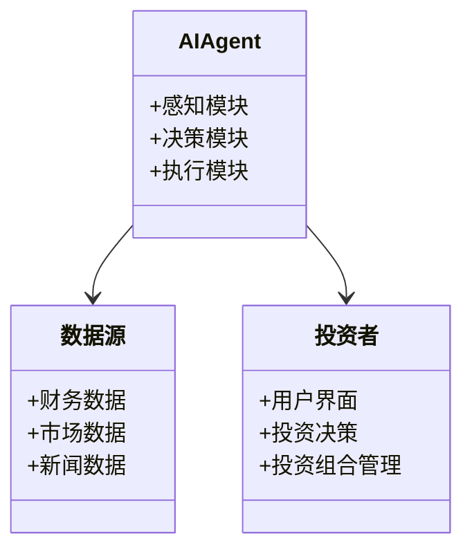
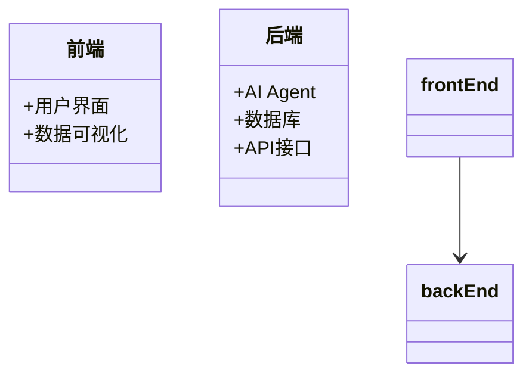
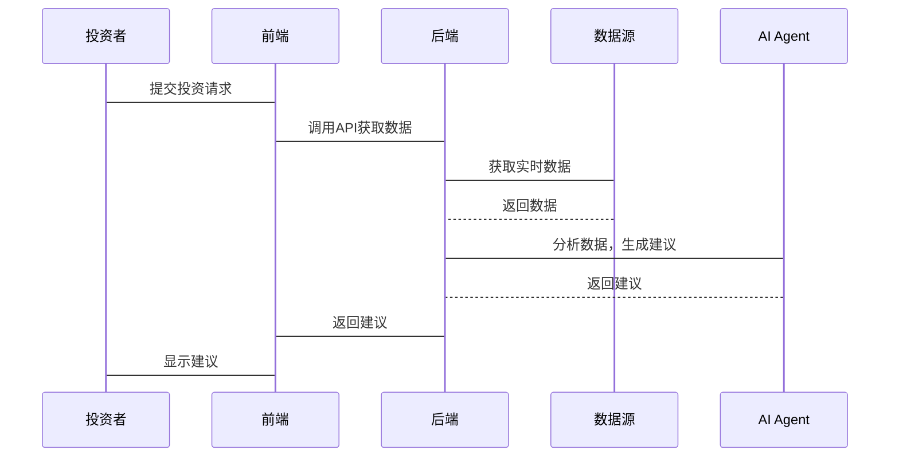

                 


```markdown
# AI Agent在智能风险投资决策中的应用

> 关键词：AI Agent，风险投资，智能决策，机器学习，投资策略

> 摘要：本文探讨AI Agent在风险投资中的应用，分析其技术原理、系统架构及实际案例，揭示其在提升投资效率和准确性中的潜力。

---

# 第一部分: AI Agent在智能风险投资决策中的应用概述

## 第1章: AI Agent与风险投资的背景介绍

### 1.1 AI Agent的基本概念

#### 1.1.1 什么是AI Agent
AI Agent（人工智能代理）是能够感知环境、做出决策并采取行动以实现目标的智能实体。它可以是一个软件程序，通过数据驱动和算法进行分析，提供决策支持或自动化操作。

#### 1.1.2 AI Agent的核心特征
- **自主性**：无需外部干预，自主决策。
- **反应性**：能实时感知环境变化并调整行为。
- **目标导向性**：所有行动基于明确的目标。
- **学习能力**：通过经验改进性能。

#### 1.1.3 AI Agent在金融领域的应用潜力
AI Agent在金融领域的应用广泛，包括交易自动化、风险管理、客户画像构建等。在风险投资中，AI Agent可以通过分析大量数据，识别投资机会，评估风险，并优化投资组合。

### 1.2 风险投资的基本原理

#### 1.2.1 风险投资的定义与流程
风险投资是一种将资金投资于高增长潜力公司的活动，通常涉及对初创企业或中小企业的投资。流程包括项目筛选、尽职调查、估值、投资决策和后续管理。

#### 1.2.2 风险投资中的关键决策点
- 初期筛选：通过财务指标、市场分析等初步评估项目可行性。
- 深入分析：对目标公司进行详细尽职调查，评估管理团队、市场前景等。
- 投资决策：决定是否投资及投资规模。
- 后续管理：监控投资表现，提供增值服务。

#### 1.2.3 传统风险投资的痛点与挑战
- **信息不对称**：投资者难以全面了解被投企业的真实情况。
- **决策滞后**：传统方法依赖人工分析，耗时长，效率低。
- **人为偏差**：决策者主观判断可能导致误判。

### 1.3 AI Agent在风险投资中的定位与作用

#### 1.3.1 AI Agent如何赋能风险投资
- **数据处理**：AI Agent能够快速处理大量非结构化数据，如新闻、社交媒体信息等，提供实时市场洞察。
- **决策支持**：通过机器学习模型，AI Agent可以预测市场趋势，评估企业价值，辅助投资决策。
- **自动化操作**：AI Agent可以自动监控投资组合，识别潜在风险，优化资产配置。

#### 1.3.2 AI Agent在风险投资中的应用场景
- **项目筛选**：通过自然语言处理技术，分析企业文档，识别高潜力项目。
- **市场预测**：利用时间序列分析预测市场走势，辅助投资决策。
- **风险评估**：基于历史数据和实时信息，评估投资项目的风险等级。
- **组合优化**：根据市场变化，动态调整投资组合，最大化收益，最小化风险。

#### 1.3.3 AI Agent的风险与机遇
- **机遇**：提高投资效率，降低人为错误，捕捉更多市场机会。
- **风险**：算法偏差可能导致错误决策，数据隐私问题，市场不可预测性。

---

## 第2章: AI Agent的核心概念与技术原理

### 2.1 AI Agent的核心概念

#### 2.1.1 AI Agent的感知模块
感知模块负责收集和处理环境中的数据。在风险投资中，这包括分析企业的财务报表、新闻报道、社交媒体数据等。

#### 2.1.2 AI Agent的决策模块
决策模块基于感知模块提供的信息，结合历史数据和市场趋势，利用机器学习模型做出投资决策。例如，决定是否投资某家公司，或调整投资组合。

#### 2.1.3 AI Agent的执行模块
执行模块负责将决策模块的指令转化为实际操作，如发出交易指令、生成报告等。

### 2.2 AI Agent的关键技术

#### 2.2.1 机器学习算法
机器学习算法是AI Agent的核心技术之一。常用的算法包括：
- **监督学习**：用于分类和回归问题，如预测股票价格。
- **无监督学习**：用于聚类和降维，如识别市场趋势。
- **强化学习**：用于策略优化，如动态调整投资组合。

#### 2.2.2 自然语言处理（NLP）
NLP技术用于分析非结构化文本数据，如公司报告、新闻文章等。通过情感分析、实体识别等技术，提取有用信息，辅助投资决策。

#### 2.2.3 强化学习（Reinforcement Learning）
强化学习通过试错机制优化决策策略。在风险投资中，可以用于动态调整投资组合，最大化收益，最小化风险。

### 2.3 AI Agent与传统投资决策的对比

#### 2.3.1 数据处理能力对比
- **传统方法**：依赖人工收集和整理数据，耗时且可能遗漏重要信息。
- **AI Agent**：能够实时处理大量数据，包括结构化和非结构化数据，提供更全面的分析。

#### 2.3.2 决策速度与效率对比
- **传统方法**：决策过程缓慢，依赖人工分析，效率低下。
- **AI Agent**：能够快速分析数据，提供实时决策支持，显著提高效率。

#### 2.3.3 决策准确率对比
- **传统方法**：受主观判断影响，准确率不稳定。
- **AI Agent**：基于大量数据和复杂模型，准确率更高，尤其在识别市场趋势和潜在风险方面表现优异。

---

## 第3章: AI Agent在风险投资中的算法原理

### 3.1 强化学习算法在投资决策中的应用

#### 3.1.1 强化学习的基本原理
强化学习通过试错机制，学习最优策略。在投资中，这可以用于动态调整投资组合，最大化收益，最小化风险。

#### 3.1.2 投资决策中的状态、动作与奖励
- **状态（State）**：市场当前的状态，如指数、利率、市场情绪等。
- **动作（Action）**：AI Agent做出的决策，如买入、卖出、持有等。
- **奖励（Reward）**：根据投资结果给予反馈，如收益或损失。

#### 3.1.3 强化学习在投资组合优化中的应用
通过强化学习，AI Agent可以在不同市场条件下，动态调整投资组合，优化风险收益比。例如，在市场波动加剧时，减少高风险资产的配置。

### 3.2 基于机器学习的投资预测模型

#### 3.2.1 数据特征提取与选择
- **特征提取**：从财务报表、市场数据、新闻等来源提取特征，如市盈率、营收增长率、行业趋势等。
- **特征选择**：通过特征重要性分析，选择对投资决策影响最大的特征。

#### 3.2.2 机器学习模型训练流程
1. **数据预处理**：清洗数据，处理缺失值，标准化特征。
2. **模型选择**：选择合适的机器学习算法，如随机森林、支持向量机、神经网络等。
3. **模型训练**：利用训练数据训练模型，调整超参数，优化性能。
4. **模型评估**：通过交叉验证评估模型的准确率、召回率、F1分数等指标。

#### 3.2.3 模型评估与优化
- **评估指标**：准确率、召回率、F1分数、ROC-AUC曲线等。
- **优化方法**：调整模型参数，尝试不同的算法，集成学习（如投票分类器、梯度提升树）。

### 3.3 算法实现的数学模型与公式

#### 3.3.1 强化学习的数学模型
强化学习的核心是通过最大化累计奖励来学习最优策略。数学模型如下：

$$
Q(s, a) = Q(s, a) + \alpha \cdot (r + \gamma \cdot \max Q(s', a') - Q(s, a))
$$

其中：
- \( Q(s, a) \)：状态s下动作a的Q值。
- \( \alpha \)：学习率。
- \( r \)：即时奖励。
- \( \gamma \)：折扣因子。
- \( s' \)：下一步的状态。
- \( a' \)：下一步的动作。

#### 3.3.2 机器学习的损失函数与优化算法
常用的损失函数包括均方误差（MSE）和交叉熵损失。优化算法包括随机梯度下降（SGD）、Adam优化器等。

---

## 第4章: AI Agent在风险投资中的系统架构设计

### 4.1 问题场景介绍
设计一个基于AI Agent的智能风险投资系统，用于辅助投资决策。系统需要处理大量数据，包括财务数据、市场数据、新闻数据等。

### 4.2 系统功能设计

#### 4.2.1 领域模型设计


#### 4.2.2 系统架构设计


#### 4.2.3 系统接口设计
系统提供API接口，供投资者调用。接口包括：
- 获取实时数据。
- 生成投资建议。
- 监控投资组合。

#### 4.2.4 系统交互设计


---

## 第5章: 项目实战与经验分享

### 5.1 项目实战

#### 5.1.1 环境安装
安装必要的库，如Python的Pandas、Scikit-learn、TensorFlow等。

#### 5.1.2 系统核心实现源代码
以下是一个简单的强化学习模型实现：

```python
import numpy as np
import random

class AI-Agent:
    def __init__(self, state_size, action_size):
        self.state_size = state_size
        self.action_size = action_size
        self.gamma = 0.99
        self.epsilon = 1.0
        self.epsilon_min = 0.01
        self.epsilon_decay = 0.995
        self.model = self.build_model()

    def build_model(self):
        # 构建神经网络模型
        pass

    def act(self, state):
        if random.random() < self.epsilon:
            return random.randint(0, self.action_size - 1)
        return self.model.predict(state)

    def remember(self, state, action, reward, next_state):
        # 存储经验
        pass

    def replay(self, batch_size):
        # 回放记忆
        pass

    def decay_epsilon(self):
        self.epsilon = max(self.epsilon_min, self.epsilon * self.epsilon_decay)
```

#### 5.1.3 代码应用解读与分析
上述代码是一个简单的强化学习AI Agent实现，用于在不同状态下做出动作选择。通过经验回放，模型不断优化，提高决策准确性。

#### 5.1.4 实际案例分析
以一个具体的案例为例，展示AI Agent如何分析数据，生成投资建议，并评估结果。

### 5.2 经验分享与注意事项

#### 5.2.1 数据质量的重要性
数据是AI Agent的核心，数据质量直接影响决策的准确性。需要确保数据的完整性和及时性。

#### 5.2.2 模型解释性
复杂的模型可能难以解释，这在风险投资中尤为重要。需要选择可解释的模型，以便投资者理解决策过程。

#### 5.2.3 模型更新
市场环境不断变化，需要定期更新模型，确保其适应新的市场情况。

---

## 第6章: 结论与展望

### 6.1 本章总结
本文详细探讨了AI Agent在风险投资中的应用，分析了其技术原理和系统架构，并通过实际案例展示了其潜力。

### 6.2 未来展望
随着AI技术的不断发展，AI Agent在风险投资中的应用将更加广泛。未来的研究方向包括更复杂的模型、更高效的数据处理方法，以及更人性化的用户界面。

### 6.3 最佳实践 Tips
- **数据驱动决策**：确保数据的准确性和全面性。
- **模型可解释性**：选择易于理解的模型，避免黑箱操作。
- **持续学习**：定期更新模型，适应市场变化。
- **风险管理**：建立完善的风险控制机制，降低投资风险。

---

作者：AI天才研究院/AI Genius Institute & 禅与计算机程序设计艺术 /Zen And The Art of Computer Programming
```

