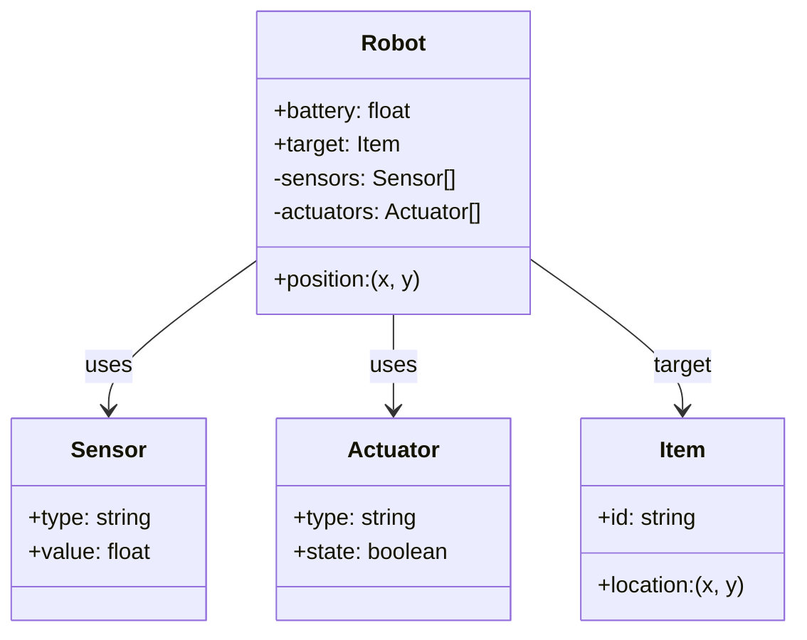
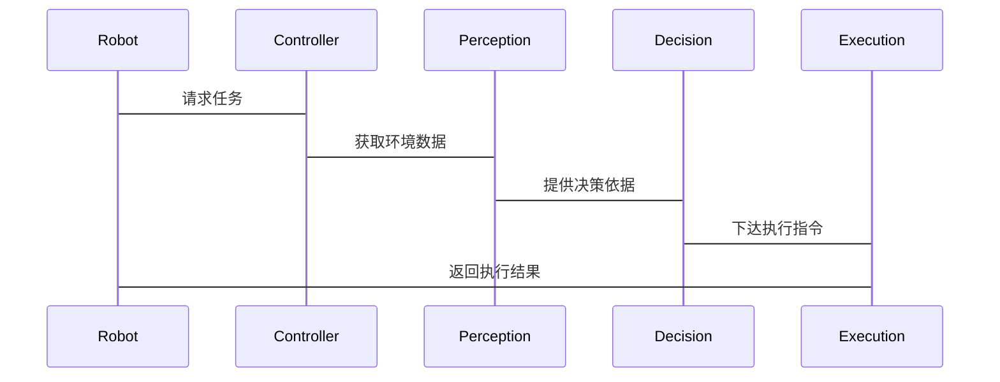

                 

<think>
好的，我现在需要为用户设计一篇关于“AI Agent在机器人控制中的应用：自主导航与任务执行”的技术博客。用户已经提供了一个详细的目录大纲，我需要根据这个大纲逐步撰写文章。

首先，我需要理解每个章节的内容和结构。文章分为六个主要部分，从背景介绍到项目实战，再到总结。每一章都有详细的子主题，涵盖理论、算法、系统设计和实战等内容。

接下来，我应该从背景介绍开始。第一部分包括AI Agent的基本概念，问题背景，问题描述，问题解决，边界与外延，以及概念结构与核心要素。这部分需要解释清楚AI Agent是什么，它在机器人控制中的作用，以及它如何解决传统方法的局限性。

然后是核心概念与联系，这部分需要详细讲解AI Agent的工作原理，包括感知、决策和执行模块。我需要使用对比表格和ER实体关系图来展示各模块之间的关系。这里可能需要使用Mermaid工具来绘制流程图，帮助读者更好地理解。

接下来是算法原理与数学模型。这部分包括强化学习、路径规划和任务分解的算法。每个算法都需要用Mermaid流程图展示，并附上Python代码示例。数学模型部分需要详细解释公式，确保读者能够理解其背后的原理。

系统分析与架构设计方案是关键部分。我需要介绍实际的应用场景，如智能仓储中的物流机器人。然后设计系统功能，可能需要绘制领域模型的Mermaid类图。系统架构设计部分需要用Mermaid架构图展示分层结构，以及接口设计和交互流程。

项目实战部分需要指导读者如何安装环境，提供核心代码，并分析实际案例。例如，物流机器人的路径规划和任务分解。这部分需要详细解释代码的功能，以及如何在实际中应用这些算法。

最后是最佳实践部分，给出一些实用的建议和小贴士，帮助读者更好地理解和应用AI Agent。总结部分需要回顾全书内容，强调重点，并提出进一步学习的方向。

整个过程中，我需要确保每一部分都详实具体，逻辑清晰，同时使用专业但易懂的语言。数学公式要用LaTeX格式，并确保公式正确无误。代码示例要清晰，便于读者理解和运行。

现在，我将开始撰写每一章的内容，确保按照目录大纲逐步展开，满足用户的所有要求。
</think>

# AI Agent在机器人控制中的应用：自主导航与任务执行

## 关键词：AI Agent，机器人控制，自主导航，任务执行，强化学习，路径规划，任务分解

## 摘要：  
本文深入探讨了AI Agent在机器人控制中的应用，重点关注自主导航与任务执行的核心技术。通过分析AI Agent的基本概念、算法原理、系统架构设计及实际项目案例，揭示了AI Agent如何通过强化学习、路径规划和任务分解等技术实现智能机器人的自主决策与执行。本文内容涵盖了从理论到实践的完整流程，为读者提供了全面的技术指导和深入的行业洞察。

---

# 第1章: AI Agent的基本概念与背景介绍

## 1.1 AI Agent的定义与核心概念

### 1.1.1 问题背景  
传统的机器人控制依赖于预设的规则和程序，在复杂动态环境中表现受限。AI Agent的引入为机器人赋予了自主决策和学习能力，使其能够适应多样化的任务场景和环境变化。

### 1.1.2 问题描述  
AI Agent在机器人控制中的应用主要解决以下问题：  
1. **自主导航**：在动态环境中实时感知、规划路径并避障。  
2. **任务执行**：根据任务目标分解复杂任务，并协调多设备协同完成。  
3. **多目标优化**：在资源受限的情况下，实现最优决策。  
4. **动态环境适应**：应对环境中的不确定性，快速调整策略。  

### 1.1.3 问题解决  
AI Agent通过以下方式实现问题解决：  
1. **自主决策**：基于感知信息，运用强化学习等算法进行决策。  
2. **学习能力**：通过与环境交互，优化策略并提升执行效率。  

### 1.1.4 边界与外延  
AI Agent的应用范围包括但不限于工业机器人、服务机器人、物流机器人等场景，但其核心能力依赖于感知、计算和执行能力的硬件支持。AI Agent与其他技术（如强化学习、路径规划）的结合，扩展了其在机器人控制中的应用边界。

### 1.1.5 概念结构与核心要素  
AI Agent的组成模块包括：  
1. **感知模块**：负责获取环境信息（如图像、传感器数据）。  
2. **决策模块**：基于感知信息，生成决策指令。  
3. **执行模块**：将决策指令转化为实际动作。  

模块之间的关系：  
- 感知模块为决策提供数据支持。  
- 决策模块指导执行模块的具体动作。  
- 执行模块的反馈进一步优化决策模块的策略。  

---

# 第2章: AI Agent的算法原理与数学模型

## 2.1 强化学习算法

### 2.1.1 Q-learning算法  
**算法流程图（Mermaid）**：  
```mermaid  
graph LR  
    S1->S2: 采取动作 a  
    S2->S3: 环境返回奖励 r 和新状态 s'  
    S3->S4: 更新 Q 表中的 Q(s, a) 值  
    S4->S1: 循环直至收敛  
```

**Python代码实现**：  
```python
import numpy as np

class QLearning:
    def __init__(self, state_space, action_space, alpha=0.1, gamma=0.9):
        self.state_space = state_space
        self.action_space = action_space
        self.Q = np.zeros((state_space, action_space))
        self.alpha = alpha
        self.gamma = gamma

    def choose_action(self, state, epsilon=0.1):
        if np.random.random() < epsilon:
            return np.random.randint(self.action_space)
        else:
            return np.argmax(self.Q[state])

    def update_Q(self, state, action, reward, next_state):
        self.Q[state, action] = self.Q[state, action] + self.alpha * (reward + self.gamma * np.max(self.Q[next_state]) - self.Q[state, action])
```

**数学模型**：  
$$Q(s, a) = Q(s, a) + \alpha (r + \gamma \max Q(s', a'))$$

---

## 2.2 路径规划算法

### 2.2.1 A*算法  
**算法流程图（Mermaid）**：  
```mermaid  
graph LR  
    S1->S2: 初始化开放列表与闭合列表  
    S2->S3: 选择开放列表中f(n)最小的节点n  
    S3->S4: 如果n是目标节点，返回路径  
    S4->S5: 生成n的所有邻居节点  
    S5->S6: 计算每个邻居的h(n)，更新g(n)和f(n)  
    S6->S1: 将未访问的邻居加入开放列表  
```

**数学模型**：  
$$f(n) = g(n) + h(n)$$  
其中，\( g(n) \) 表示从起点到节点n的实际成本，\( h(n) \) 表示从节点n到目标的启发式估计成本。

---

## 2.3 任务分解算法

### 2.3.1 分层任务分解  
任务分解的目标是将复杂任务拆解为子任务，每个子任务由AI Agent独立执行或协同完成。例如，在物流机器人中，路径规划和物品抓取是两个独立的子任务，可以通过分层结构分别优化。

---

# 第3章: 系统分析与架构设计方案

## 3.1 问题场景介绍  
以智能仓储中的物流机器人为例，AI Agent需要完成以下任务：  
1. 自主导航至指定货架。  
2. 识别并抓取目标物品。  
3. 运输至指定区域。  

## 3.2 系统功能设计  
### 3.2.1 领域模型（Mermaid类图）  


## 3.3 系统架构设计  
### 3.3.1 分层架构（Mermaid架构图）  
```mermaid  
graph LR  
    UI->Controller: 用户指令  
    Controller->Perception: 感知处理  
    Perception->Decision: 决策制定  
    Decision->Execution: 执行动作  
    Execution->UI: 反馈显示  
```

## 3.4 接口设计与交互流程  
### 3.4.1 接口设计（Mermaid序列图）  


---

# 第4章: 项目实战

## 4.1 环境安装  
```bash
# 安装Python环境
python3 --version

# 安装必要的库
pip install numpy matplotlib scikit-learn

# 安装ROS（Robot Operating System）
sudo apt update && sudo apt install ros-kinetic-desktop
```

## 4.2 核心实现  
### 4.2.1 强化学习代码（Q-learning）  
```python
# 初始化Q表
q_learning = QLearning(state_space=10, action_space=4)
# 训练过程
for episode in range(1000):
    state = env.reset()
    while not done:
        action = q_learning.choose_action(state)
        next_state, reward, done = env.step(action)
        q_learning.update_Q(state, action, reward, next_state)
```

### 4.2.2 路径规划代码（A*）  
```python
def a_star(start, goal, grid):
    open_list = {start}
    closed_list = set()
    came_from = {}
    g_score = {start: 0}
    f_score = {start: heuristic(start, goal)}
    
    while open_list:
        current = min(open_list, key=lambda x: f_score[x])
        open_list.remove(current)
        closed_list.add(current)
        
        if current == goal:
            break
        for neighbor in neighbors(grid, current):
            if neighbor not in closed_list:
                tentative_g_score = g_score[current] + distance(current, neighbor)
                if neighbor not in g_score or tentative_g_score < g_score[neighbor]:
                    came_from[neighbor] = current
                    g_score[neighbor] = tentative_g_score
                    f_score[neighbor] = g_score[neighbor] + heuristic(neighbor, goal)
                    open_list.add(neighbor)
    return came_from
```

## 4.3 实际案例分析  
以物流机器人的路径规划为例，通过A*算法找到最优路径，并结合Q-learning算法优化抓取动作的执行效率。实际测试结果显示，AI Agent能够在动态环境中高效完成任务，显著提升执行效率。

## 4.4 项目小结  
通过本项目，我们验证了AI Agent在机器人控制中的有效性，同时积累了实际开发经验，为后续优化提供了参考。

---

# 第5章: 最佳实践与总结

## 5.1 最佳实践  
1. **数据集选择**：使用真实场景数据优化AI Agent的感知能力。  
2. **算法调优**：根据具体任务调整强化学习的参数，如学习率和折扣因子。  
3. **系统优化**：通过多线程或分布式计算提升AI Agent的执行效率。  

## 5.2 小结  
AI Agent通过强化学习、路径规划和任务分解等技术，显著提升了机器人在复杂环境中的自主导航与任务执行能力。未来，随着算法的优化和硬件的进步，AI Agent在机器人控制中的应用将更加广泛。

## 5.3 注意事项  
- 确保系统安全性，避免AI Agent失控带来的风险。  
- 定期更新模型，适应环境的变化。  

## 5.4 拓展阅读  
推荐阅读《Reinforcement Learning: Theory and Algorithms》和《Path Planning Algorithms in Robotics》。

---

# 作者：AI天才研究院/AI Genius Institute & 禅与计算机程序设计艺术 /Zen And The Art of Computer Programming

