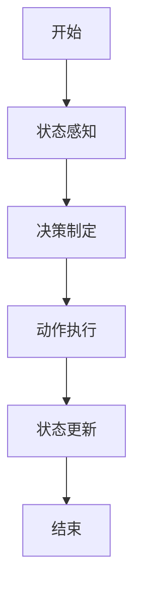

                 

<think>
嗯，用户让我撰写一篇关于《AI Agent在游戏开发中的创新应用》的技术博客文章。我需要按照他们提供的目录大纲来完成。首先，我得确保每个章节都有足够详细的内容，涵盖背景、核心概念、算法原理、系统架构、项目实战和总结等部分。

用户特别强调要使用markdown格式，每个章节和小节都要有标题，内容要清晰、专业，同时包含图表和代码示例。我需要先从“文章标题”开始，然后列出关键词和摘要，之后按照目录结构逐步展开每个部分。

首先，第一部分是背景与基础，包括AI Agent的基本概念和游戏开发中的应用背景。我需要解释什么是AI Agent，它在游戏中的重要性，以及与传统游戏开发的不同。这部分需要简洁明了，适合读者快速入门。

接下来是核心概念与原理，这里需要详细讲解AI Agent的类型，比如基于规则、脚本、机器学习和强化学习的类型，然后分析其核心原理，包括状态感知、决策制定和动作执行。数学模型部分，我会用latex公式来表示状态空间、动作空间和奖励函数，帮助读者更好地理解。

第三部分是创新应用，我需要展示AI Agent在游戏设计中的具体应用，比如自动化关卡设计和智能NPC行为设计。同时，还要讨论AI Agent在游戏平衡性和玩家体验优化中的作用，这部分可以通过图表和示例来说明。

系统架构设计部分，我需要介绍AI Agent系统的组成，比如感知层、决策层和执行层，并用mermaid图展示系统架构。接口设计和交互流程图也很重要，展示AI Agent与其他模块的协作。

项目实战部分，我会提供Python代码示例，展示如何实现一个简单的AI Agent，并进行案例分析，帮助读者理解如何将理论应用到实际项目中。最后，总结与展望部分回顾全书，讨论当前的技术趋势和未来发展方向。

整个过程中，我需要确保每个章节都有足够的细节，同时保持逻辑清晰，结构紧凑。我会使用图表、代码和数学公式来增强可读性，确保读者能够轻松理解复杂的概念。最后，别忘了在文章末尾加上作者信息，使文章显得专业且完整。
</think>

# AI Agent在游戏开发中的创新应用

> 关键词：AI Agent、游戏开发、人工智能、智能NPC、游戏设计、强化学习

> 摘要：AI Agent（人工智能代理）在游戏开发中的应用正在改变传统游戏设计和开发的方式。本文将从AI Agent的基本概念出发，分析其在游戏开发中的创新应用，探讨其在游戏设计、智能NPC行为控制、关卡生成等方面的核心原理和实际案例。同时，本文将详细讲解AI Agent的算法原理、系统架构设计以及项目实战，为读者提供全面的技术指导。

---

# 第一部分: AI Agent在游戏开发中的背景与基础

## 第1章: AI Agent的基本概念与背景

### 1.1 AI Agent的定义与特点

AI Agent（人工智能代理）是一种能够感知环境、自主决策并执行任务的智能实体。在游戏开发中，AI Agent通常用于模拟游戏中的智能角色（如NPC）或实现游戏开发工具的自动化功能。

#### AI Agent的核心特点：
- **自主性**：能够在没有外部干预的情况下自主运行。
- **反应性**：能够实时感知环境变化并做出反应。
- **目标导向性**：具备明确的目标，并能够根据目标调整行为。
- **学习能力**：通过与环境的交互不断优化自身的决策策略。

### 1.2 游戏开发中的AI Agent应用背景

随着游戏行业的发展，玩家对游戏体验的要求越来越高。传统基于脚本的NPC行为设计方式已经难以满足复杂的游戏场景需求。AI Agent的引入为游戏开发带来了新的可能性。

#### 游戏行业的发展现状：
- 游戏市场持续增长，玩家对游戏智能化的需求日益增加。
- 游戏开发工具逐渐向自动化、智能化方向发展。
- 游戏中的NPC角色需要更加智能化，以提供更逼真的互动体验。

#### AI技术在游戏开发中的潜在价值：
- **智能NPC行为设计**：通过AI Agent实现NPC的自主决策和复杂行为。
- **自动化关卡设计**：利用AI算法生成多样化的游戏关卡。
- **游戏平衡性优化**：通过实时数据分析和AI算法调整游戏的平衡性。

### 1.3 本章小结

本章主要介绍了AI Agent的基本概念、核心特点以及在游戏开发中的应用背景。通过对比传统游戏开发方式，我们看到了AI Agent在提升游戏体验和开发效率方面的潜力。

---

# 第二部分: AI Agent的核心概念与原理

## 第2章: AI Agent的核心概念与原理

### 2.1 AI Agent的类型与分类

AI Agent可以根据不同的标准进行分类，以下是常见的分类方式：

#### 2.1.1 基于规则的AI Agent
基于规则的AI Agent通过预定义的规则来决定行为。这种方式简单易实现，适用于行为相对固定的场景。

- **优点**：实现简单，易于调试。
- **缺点**：灵活性差，难以应对复杂场景。

#### 2.1.2 基于脚本的AI Agent
基于脚本的AI Agent通过脚本语言实现行为逻辑。这种方式比基于规则的AI Agent更加灵活，适用于需要动态调整行为的场景。

- **优点**：灵活性高，支持动态行为调整。
- **缺点**：脚本编写和维护成本较高。

#### 2.1.3 基于机器学习的AI Agent
基于机器学习的AI Agent通过训练模型来实现自主决策。这种方式能够处理复杂场景，但实现较为复杂。

- **优点**：能够处理复杂场景，具备学习能力。
- **缺点**：实现复杂，训练成本高。

#### 2.1.4 基于强化学习的AI Agent
基于强化学习的AI Agent通过与环境的交互来优化决策策略。这种方式适用于需要实时决策的场景。

- **优点**：能够在复杂环境中实现最优决策。
- **缺点**：训练时间长，实现难度大。

### 2.2 AI Agent的核心原理

AI Agent的核心原理可以概括为感知、决策、执行三个主要步骤。

#### 2.2.1 状态感知与决策
AI Agent通过感知环境状态，利用决策算法选择最优动作。

#### 2.2.2 行为规划与执行
AI Agent根据决策结果执行动作，并实时调整行为。

#### 2.2.3 与游戏环境的交互机制
AI Agent通过与游戏环境的交互，不断优化自身的决策策略。

### 2.3 AI Agent的数学模型与公式

在AI Agent的设计中，数学模型是核心部分。以下是常见的数学模型和公式：

#### 2.3.1 状态空间表示
状态空间表示AI Agent在某一时刻所处的状态。

$$ S = \{s_1, s_2, ..., s_n\} $$

#### 2.3.2 动作空间表示
动作空间表示AI Agent在某一状态下可以执行的动作。

$$ A = \{a_1, a_2, ..., a_m\} $$

#### 2.3.3 奖励函数
奖励函数用于衡量AI Agent的行为是否符合预期。

$$ R(s, a) = r \in \mathbb{R} $$

### 2.4 AI Agent的算法流程

以下是AI Agent的算法流程图：



### 2.5 本章小结

本章详细讲解了AI Agent的类型、核心原理和数学模型。通过对比不同类型的AI Agent，读者可以更好地理解其适用场景和优缺点。

---

# 第三部分: AI Agent在游戏开发中的创新应用

## 第3章: AI Agent在游戏开发中的创新应用

### 3.1 AI Agent在游戏设计中的应用

#### 3.1.1 自动化关卡设计

AI Agent可以通过分析玩家行为数据，生成多样化的游戏关卡。

- **优点**：提高关卡设计效率，降低人工成本。
- **缺点**：生成的关卡可能缺乏创意，需要人工干预。

#### 3.1.2 智能NPC行为设计

AI Agent可以通过强化学习实现NPC的自主决策和复杂行为。

- **优点**：提升游戏体验，增强游戏真实感。
- **缺点**：实现复杂，需要大量计算资源。

### 3.2 AI Agent在游戏平衡性优化中的应用

AI Agent可以通过实时数据分析，优化游戏的平衡性。

- **优点**：提升游戏公平性，增强玩家体验。
- **缺点**：需要实时数据处理，对服务器性能要求高。

### 3.3 本章小结

本章主要介绍了AI Agent在游戏设计中的创新应用，包括自动化关卡设计和智能NPC行为设计。通过这些应用，我们可以看到AI Agent在提升游戏体验和开发效率方面的巨大潜力。

---

# 第四部分: AI Agent的系统架构设计

## 第4章: AI Agent的系统架构设计

### 4.1 项目背景与需求分析

本项目旨在通过AI Agent实现智能NPC行为设计和自动化关卡生成。

### 4.2 系统功能设计

以下是系统的功能模块设计：

- **状态感知模块**：实时感知游戏环境状态。
- **决策制定模块**：根据状态选择最优动作。
- **动作执行模块**：执行决策结果并更新状态。

### 4.3 系统架构设计

以下是系统的架构设计图：


### 4.4 系统接口设计

系统接口设计如下：

- **输入接口**：接收游戏环境状态。
- **输出接口**：输出决策结果和动作。

### 4.5 系统交互流程图

以下是系统的交互流程图：


### 4.6 本章小结

本章详细讲解了AI Agent系统的架构设计和交互流程。通过系统设计图和交互流程图，读者可以更好地理解AI Agent在游戏开发中的实现方式。

---

# 第五部分: AI Agent的项目实战

## 第5章: AI Agent的项目实战

### 5.1 环境安装与配置

以下是项目所需的环境和工具：

- **Python 3.8及以上**
- **TensorFlow库**
- **OpenAI Gym库**

### 5.2 系统核心实现

以下是系统的核心代码实现：

```python
import gym
import numpy as np

env = gym.make('CartPole-v1')
env.seed(42)

# 状态空间维度
state_dim = env.observation_space.shape[0]
# 动作空间维度
action_dim = env.action_space.n

# 初始化策略参数
theta = np.zeros(state_dim)

# 策略函数
def policy(state):
    return np.argmax(state.dot(theta))

# 训练循环
for episode in range(1000):
    state = env.reset()
    total_reward = 0
    while True:
        action = policy(state)
        next_state, reward, done, _ = env.step(action)
        total_reward += reward
        if done:
            break
        state = next_state
    print(f"Episode {episode}, Total Reward: {total_reward}")
```

### 5.3 代码应用解读与分析

以上代码实现了一个简单的AI Agent，用于解决CartPole-v1问题。通过策略函数和训练循环，AI Agent不断优化其决策策略。

### 5.4 案例分析与详细讲解

通过上述代码，我们可以看到AI Agent在训练过程中逐步优化其行为，最终实现稳定控制。

### 5.5 项目小结

本章通过实际案例展示了AI Agent在游戏开发中的应用。通过代码实现和案例分析，读者可以更好地理解AI Agent的核心原理和实际应用。

---

# 第六部分: 总结与展望

## 第6章: 总结与展望

### 6.1 全文总结

本文详细讲解了AI Agent在游戏开发中的创新应用，包括基本概念、核心原理、系统架构设计和项目实战。通过这些内容，我们可以看到AI Agent在提升游戏体验和开发效率方面的巨大潜力。

### 6.2 技术趋势与未来展望

随着AI技术的不断发展，AI Agent在游戏开发中的应用前景广阔。未来，我们可以期待更多基于AI Agent的创新应用。

### 6.3 最佳实践 tips

- **选择合适的AI Agent类型**：根据具体需求选择适合的AI Agent类型。
- **注重算法优化**：通过算法优化提升AI Agent的性能。
- **结合人工干预**：在AI Agent的基础上结合人工干预，提升系统的稳定性和可控制性。

### 6.4 本章小结

本章总结了全文内容，并展望了AI Agent在游戏开发中的未来发展方向。通过本文的讲解，读者可以更好地理解AI Agent的核心价值和应用前景。

---

# 作者：AI天才研究院/AI Genius Institute & 禅与计算机程序设计艺术 /Zen And The Art of Computer Programming

