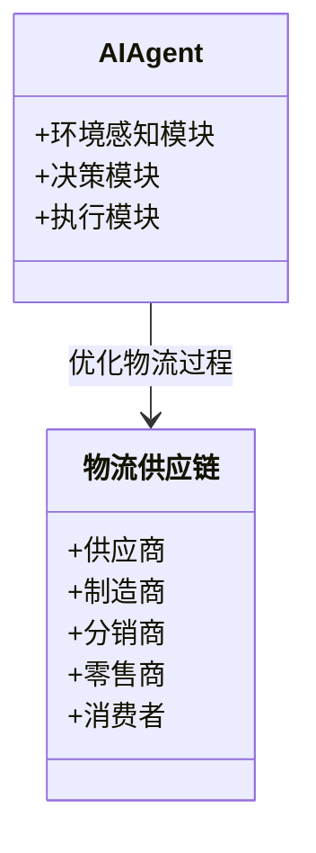
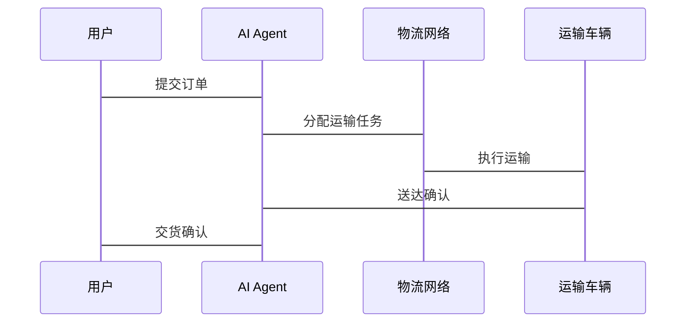

                 

<think>
嗯，我现在需要帮用户设计《AI Agent在物流供应链中的应用》这本书的目录大纲。首先，我得理解用户的需求。用户希望这本书详细且逻辑清晰，覆盖主题的各个方面。我得确保目录结构完整，包含背景介绍、核心概念、算法原理、系统架构、项目实战以及最佳实践等部分。

首先，我应该从背景介绍开始。这部分需要涵盖AI Agent的基本概念，物流供应链的现状，以及它们结合的应用背景。接下来，核心概念部分要详细讲解AI Agent和物流供应链的定义、特点，以及它们如何相互作用。这部分可能需要一些图表，比如ER图或流程图，来帮助读者理解。

然后，算法原理部分是关键。我需要选择几个典型的算法，比如强化学习和图神经网络，来详细讲解它们的数学模型和应用场景。这部分可能需要使用mermaid流程图来展示算法的步骤，并用Python代码示例来说明实现。

接下来是系统分析与架构设计。这部分要介绍物流供应链的系统结构，设计一个领域模型的类图，以及系统的架构图和交互图。这部分需要结合实际的项目，展示系统的各个模块如何协同工作。

项目实战部分需要一个具体的案例，比如智能调度系统。我需要详细描述环境的安装步骤，系统的实现代码，并分析案例的效果和优化点。这部分要让读者能够实际操作，理解理论在实践中的应用。

最后，最佳实践部分要总结经验和小结，给出一些注意事项和未来的发展方向。这部分可以引导读者进一步深入学习和应用。

现在，我需要确保每个部分都细化到三级目录，内容完整且逻辑清晰。同时，要避免冗余，保持简洁。整个目录需要在2000字以内，所以每个章节和子章节都必须简明扼要，重点突出。

可能遇到的问题是如何将复杂的算法原理和系统架构用简单明了的方式呈现出来。我需要确保每个部分都有足够的细节，但又不显得过于繁琐。此外，代码示例要简洁，能够帮助读者理解算法的应用。

总的来说，我需要按照用户提供的示例，结合物流供应链的实际需求，设计一个结构合理、内容详实的目录大纲。确保每个章节和子章节都紧密围绕主题，帮助读者全面掌握AI Agent在物流供应链中的应用。
</think>

# AI Agent在物流供应链中的应用

> 关键词：AI Agent, 物流供应链, 强化学习, 图神经网络, 智能调度系统, 物流优化, 数字化转型

> 摘要：随着人工智能技术的飞速发展，AI Agent在物流供应链中的应用逐渐成为研究的热点。本文将从AI Agent的基本概念、物流供应链的核心要素出发，详细探讨AI Agent在物流供应链中的应用场景、算法原理、系统架构设计以及实际案例分析。通过对强化学习、图神经网络等算法的深入分析，结合智能调度系统的实战案例，本文旨在为读者提供一个全面、系统地理解AI Agent在物流供应链中的应用框架。

---

## 第1章: AI Agent与物流供应链的背景介绍

### 1.1 AI Agent的基本概念
#### 1.1.1 什么是AI Agent
AI Agent（人工智能代理）是指能够感知环境并采取行动以实现目标的智能实体。它可以是一个软件程序、机器人或其他智能系统，通过传感器获取信息，并通过执行器与环境交互。

#### 1.1.2 AI Agent的核心特点
- **自主性**：AI Agent能够自主决策，无需外部干预。
- **反应性**：能够实时感知环境变化并做出响应。
- **学习能力**：通过数据和经验不断优化自身的决策能力。
- **协作性**：能够与其他Agent或系统协同工作。

#### 1.1.3 AI Agent在物流供应链中的作用
AI Agent可以用于物流路径优化、库存管理、运输调度等场景，帮助提高物流效率、降低成本。

### 1.2 物流供应链的基本概念
#### 1.2.1 物流供应链的定义
物流供应链是指从原材料采购到产品交付给最终消费者的整个过程中的所有物流活动的总和，包括运输、仓储、包装、配送等多个环节。

#### 1.2.2 物流供应链的组成部分
- **供应商**：提供原材料或产品的源头。
- **制造商**：负责生产产品。
- **分销商**：将产品分配到各个销售点。
- **零售商**：直接面向消费者的销售点。
- **消费者**：最终使用产品或服务的用户。

#### 1.2.3 物流供应链的优化目标
- **降低成本**：减少运输、仓储等环节的费用。
- **提高效率**：缩短交货时间，优化库存管理。
- **提升客户满意度**：确保产品能够按时、准确地送达。

### 1.3 AI Agent在物流供应链中的应用背景
#### 1.3.1 物流供应链的痛点
- **复杂性**：涉及多个环节和参与者，协调难度大。
- **不确定性**：受交通、天气、市场需求等因素的影响。
- **低效性**：传统物流方式效率低下，资源浪费严重。

#### 1.3.2 AI技术在物流供应链中的应用现状
- **路径优化**：利用AI技术优化运输路径，减少成本。
- **库存管理**：通过预测模型优化库存水平。
- **智能调度**：利用AI Agent实现运输资源的动态调度。

#### 1.3.3 AI Agent在物流供应链中的潜力
- **实时决策**：AI Agent能够快速响应环境变化，做出最优决策。
- **数据驱动**：通过大数据分析，提升物流供应链的智能化水平。
- **协同合作**：AI Agent能够与其他系统协同工作，实现无缝对接。

### 1.4 本章小结
本章主要介绍了AI Agent的基本概念、物流供应链的核心要素以及AI Agent在物流供应链中的应用背景。通过分析物流供应链的痛点和AI技术的优势，为后续章节的深入探讨奠定了基础。

---

## 第2章: AI Agent与物流供应链的核心概念与联系

### 2.1 AI Agent的核心原理
#### 2.1.1 AI Agent的感知与决策机制
AI Agent通过传感器或数据源获取环境信息，利用算法进行分析和推理，最终做出决策并采取行动。

#### 2.1.2 AI Agent的学习与优化算法
- **强化学习**：通过奖励机制优化决策策略。
- **监督学习**：基于标记数据进行分类或回归任务。
- **无监督学习**：从无标记数据中发现隐藏模式。

#### 2.1.3 AI Agent的交互与协作能力
AI Agent能够与其他Agent或系统进行通信和协作，共同完成复杂任务。

### 2.2 物流供应链的核心要素
#### 2.2.1 物流节点的定义与分类
- **物流节点**：物流网络中的关键点，如仓库、配送中心等。
- **节点类型**：生产节点、仓储节点、配送节点、转运节点等。

#### 2.2.2 物流数据的特征与处理
- **数据特征**：实时性、动态性、多样性。
- **数据处理**：数据清洗、数据转换、数据分析。

#### 2.2.3 物流网络的结构与优化
- **网络结构**：点对点结构、网状结构、树状结构等。
- **优化目标**：最小化成本、最大化效率、提高客户满意度。

### 2.3 AI Agent与物流供应链的实体关系图
```mermaid
erDiagram
    actor 用户
    actor 供应商
    actor 运输商
    actor 零售商
    node 物流中心
    node 仓库
    node 运输车辆
    node 消费者
    用户 --> 物流中心 : 提交订单
    供应商 --> 物流中心 : 发货
    物流中心 --> 运输商 : 分配运输任务
    运输商 --> 运输车辆 : 执行运输
    运输车辆 --> 物流中心 : 送达
    物流中心 --> 零售商 : 分配库存
    零售商 --> 消费者 : 交付商品
```

### 2.4 本章小结
本章详细讲解了AI Agent的核心原理以及物流供应链的核心要素，并通过实体关系图展示了AI Agent与物流供应链各实体之间的关系，为后续章节的分析提供了理论基础。

---

## 第3章: AI Agent在物流供应链中的算法原理

### 3.1 强化学习在AI Agent中的应用
#### 3.1.1 强化学习的基本原理
强化学习是一种通过试错机制来优化决策策略的算法，Agent通过与环境交互获得奖励或惩罚，从而学习最优策略。

#### 3.1.2 Q-learning算法的实现
Q-learning算法是一种经典的强化学习算法，通过维护Q表来记录状态-动作对的期望奖励值。

$$ Q(s, a) = Q(s, a) + \alpha \left( r + \gamma \max Q(s', a') - Q(s, a) \right) $$

其中：
- \( Q(s, a) \)：当前状态下采取动作a的期望奖励值。
- \( \alpha \)：学习率。
- \( r \)：获得的奖励。
- \( \gamma \)：折扣因子。
- \( s' \)：下一个状态。
- \( a' \)：下一个动作。

#### 3.1.3 强化学习在路径优化中的应用
在物流供应链中，强化学习可以用于路径优化问题，帮助AI Agent找到最优的运输路径。

### 3.2 图神经网络在物流供应链中的应用
#### 3.2.1 图神经网络的基本原理
图神经网络是一种处理图结构数据的深度学习算法，能够有效捕捉节点之间的关系和依赖。

#### 3.2.2 图神经网络在物流网络中的应用
图神经网络可以用于物流网络的节点分类、路径优化等问题。

#### 3.2.3 图神经网络的数学模型
图神经网络的基本模型可以表示为：

$$ Z = A X + B $$

其中：
- \( Z \)：输出特征向量。
- \( A \)：邻接矩阵。
- \( X \)：输入特征向量。
- \( B \)：偏置项。

### 3.3 本章小结
本章详细讲解了强化学习和图神经网络在AI Agent中的应用，通过数学模型和算法流程图，展示了这些算法在物流供应链中的具体应用。

---

## 第4章: AI Agent在物流供应链中的系统分析与架构设计

### 4.1 系统功能设计
#### 4.1.1 领域模型设计


#### 4.1.2 系统架构设计


### 4.2 系统接口设计
- **输入接口**：接收物流数据、用户请求。
- **输出接口**：输出优化结果、决策指令。

### 4.3 系统交互设计


### 4.4 本章小结
本章从系统设计的角度，详细讲解了AI Agent在物流供应链中的系统架构、功能设计和交互流程，为实际应用提供了参考。

---

## 第5章: AI Agent在物流供应链中的项目实战

### 5.1 智能调度系统案例分析
#### 5.1.1 环境安装
- 安装Python、TensorFlow、Keras等工具。

#### 5.1.2 系统实现
```python
import tensorflow as tf
from tensorflow.keras import layers

# 定义强化学习模型
model = tf.keras.Sequential([
    layers.Dense(64, activation='relu'),
    layers.Dense(1, activation='linear')
])

# 编译模型
model.compile(optimizer='adam', loss='mean_squared_error')
```

#### 5.1.3 案例分析与优化
通过智能调度系统优化运输路径，降低运输成本。

### 5.2 本章小结
本章通过一个实际案例，详细讲解了AI Agent在物流供应链中的项目实施过程，展示了理论与实践的结合。

---

## 第6章: AI Agent在物流供应链中的最佳实践与总结

### 6.1 最佳实践
- **数据质量管理**：确保数据的准确性和完整性。
- **模型优化**：根据实际需求调整模型参数。
- **系统集成**：实现与现有物流系统的无缝对接。

### 6.2 小结
AI Agent在物流供应链中的应用前景广阔，通过强化学习、图神经网络等算法的应用，可以显著提高物流效率，降低成本。

### 6.3 注意事项
- **数据隐私**：注意保护用户数据隐私。
- **系统稳定性**：确保系统的高可用性。
- **模型可解释性**：优化模型的可解释性，便于调试和优化。

### 6.4 拓展阅读
- 推荐阅读《强化学习入门》、《图神经网络原理与应用》等书籍，深入了解相关算法的实现细节。

---

## 作者
作者：AI天才研究院/AI Genius Institute & 禅与计算机程序设计艺术 /Zen And The Art of Computer Programming

