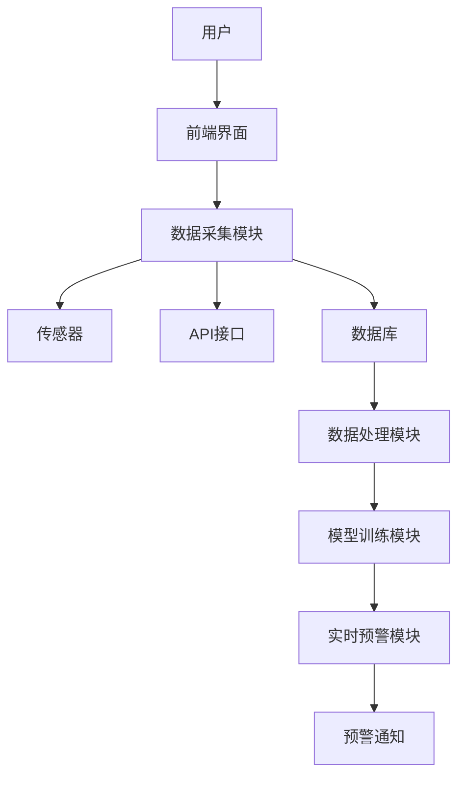
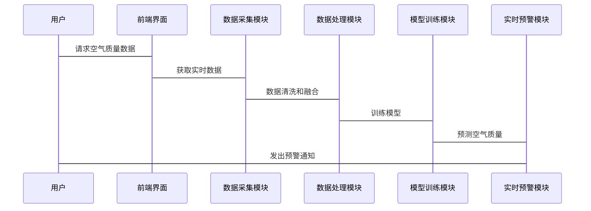

                 

<think>
嗯，我现在要写一篇关于《AI Agent在环境保护中的应用》的技术博客文章。首先，我需要理解什么是AI Agent，以及它在环保领域中的具体应用。AI Agent是一种智能代理，能够感知环境、做出决策并采取行动。那么在环保中，它能做些什么呢？

首先，我应该从背景开始，介绍环境保护的重要性，以及为什么需要AI Agent的帮助。传统的方法可能效率低下，而AI Agent可以提供实时监测和数据分析，帮助我们更有效地解决问题。

接下来，我需要详细讲解AI Agent的核心概念，包括它的感知、决策和执行模块。这些模块如何协同工作，才能在环保中发挥作用呢？比如，感知模块可能通过传感器收集环境数据，决策模块利用这些数据进行分析，执行模块则采取相应的措施。

然后，我应该讨论AI Agent在具体环保问题中的应用，比如污染监测、资源管理和生态保护。每个应用都需要详细分析，展示AI Agent的优势和实际效果。例如，在空气质量监测中，AI Agent可以实时分析数据，预测污染趋势，并提出解决方案。

技术部分，我需要介绍机器学习和自然语言处理等技术在AI Agent中的应用。这些技术如何帮助AI Agent更好地理解和处理环境数据，做出更准确的决策。

接下来是系统架构设计，我需要展示AI Agent在环保系统中的模块划分、数据流和接口设计。可能需要使用Mermaid图来清晰展示系统的结构和各部分之间的关系。

最后，通过一个具体的项目实战，展示AI Agent在环保中的实际应用。从环境安装、数据收集、模型训练到代码实现，详细描述整个过程，帮助读者理解如何在实际中应用这些技术。

总结一下，我需要按照以下步骤进行：
1. 理解AI Agent的基本概念和其在环保中的潜在应用。
2. 收集和整理环境保护的相关背景信息，突出AI Agent的优势。
3. 详细分析AI Agent的核心模块和工作原理，确保内容准确。
4. 探讨AI Agent在不同环保场景中的具体应用，提供实际案例。
5. 介绍相关技术基础，如机器学习和NLP，解释它们如何支持AI Agent。
6. 设计系统的架构，展示模块划分和数据流。
7. 通过项目实战，提供可操作的步骤和代码示例，帮助读者实践。

现在，我需要确保每个部分都涵盖必要的细节，并且逻辑清晰。同时，要注意使用专业的技术术语，但又要保持语言简洁易懂。此外，图表和代码示例将帮助读者更好地理解内容。

在写作过程中，我可能会遇到一些挑战，比如如何将复杂的系统架构转化为易懂的Mermaid图，或者如何解释复杂的算法原理。这时，我需要查阅相关资料，确保信息的准确性和权威性。同时，我可以通过举实际案例来帮助读者理解抽象的概念，使文章更具可读性。

最后，我需要反复检查文章结构，确保每个章节内容连贯，逻辑严密。从背景到应用，再到技术细节和项目实战，层层递进，帮助读者全面了解AI Agent在环境保护中的应用。

总的来说，我需要一步步地构建这篇文章，从基础概念到实际应用，确保每个部分都详尽且深入。通过这样的思考和规划，我能够写出一篇结构清晰、内容丰富的技术博客，帮助读者理解AI Agent在环境保护中的重要性和潜力。
</think>

# AI Agent在环境保护中的应用

## 关键词：
AI Agent, 环境保护, 机器学习, 自然语言处理, 计算机视觉, 环境监测, 智能决策系统

## 摘要：
随着环境问题的日益严重，AI Agent（人工智能代理）在环境保护中的应用变得越来越重要。本文详细探讨了AI Agent在环境监测、污染控制和资源管理等领域的应用，分析了其核心概念、技术基础和系统架构，并通过实际案例展示了AI Agent在环保中的实际应用价值。文章还总结了AI Agent的优势和未来发展方向，为环保领域的技术进步提供了新的思路。

---

# 第一部分: AI Agent与环境保护的背景与概念

## 第1章: 环境保护与AI Agent的结合

### 1.1 环境保护的重要性
#### 1.1.1 环境保护的核心问题
环境保护是全球关注的焦点，主要解决资源枯竭、环境污染、生态破坏等问题。随着工业化和城市化的快速发展，环境问题变得日益严重，威胁人类的生存和发展。传统的环境保护方法依赖于人工监测和被动反应，效率低下且覆盖面有限。

#### 1.1.2 传统环境保护的局限性
传统环境保护方法主要依赖于人工巡检和定期采样，存在以下问题：
- **效率低下**：人工监测范围有限，无法实现全面覆盖。
- **滞后性**：环境问题通常在发现问题时已经造成较大影响。
- **缺乏实时性**：无法实时监测和响应环境变化。

#### 1.1.3 AI Agent在环境保护中的潜力
AI Agent具备高效性、实时性和自适应性，能够显著提升环境保护的效率和效果。通过实时监测、智能分析和自动响应，AI Agent可以在环境问题出现前进行预警和干预，从而实现预防性管理。

### 1.2 AI Agent的基本概念
#### 1.2.1 AI Agent的定义
AI Agent是一种智能实体，能够感知环境、自主决策并采取行动以实现特定目标。它可以是一个软件程序、机器人或其他智能系统。

#### 1.2.2 AI Agent的核心特征
- **自主性**：能够在没有外部干预的情况下独立运作。
- **反应性**：能够实时感知环境变化并做出响应。
- **目标导向性**：所有行动都以实现特定目标为导向。
- **学习能力**：能够通过数据和经验不断优化自身行为。

#### 1.2.3 AI Agent与传统自动化的区别
| 特性 | 传统自动化 | AI Agent |
|------|------------|-----------|
| 感知能力 | 无或有限 | 强大 |
| 决策能力 | 程序化 | 自主学习 |
| 环境适应性 | 固定 | 动态调整 |
| 数据处理能力 | 简单 | 复杂 |

### 1.3 AI Agent在环境保护中的优势
#### 1.3.1 高效性与实时性
AI Agent能够实时采集和分析环境数据，快速识别潜在问题并采取行动，显著提高环境保护的效率。

#### 1.3.2 数据驱动的精准性
通过机器学习和大数据分析，AI Agent能够从海量数据中提取有价值的信息，实现精准的环境监测和预测。

#### 1.3.3 自适应与自学习能力
AI Agent能够根据环境变化和新的数据不断优化自身的算法和决策模型，从而适应不同的环境条件和挑战。

## 第2章: AI Agent的核心概念与技术基础

### 2.1 AI Agent的核心概念
#### 2.1.1 感知模块
感知模块是AI Agent的“眼睛和耳朵”，负责从环境中获取数据。常见的感知方式包括：
- **传感器数据**：如温度、湿度、空气质量传感器等。
- **图像识别**：通过摄像头捕捉环境图像，识别潜在的环境问题。
- **自然语言处理**：分析环境报告和文献中的信息。

#### 2.1.2 决策模块
决策模块是AI Agent的“大脑”，负责根据感知数据做出决策。它通常基于以下步骤：
1. **数据预处理**：对感知数据进行清洗和标准化。
2. **特征提取**：提取关键特征，如污染物浓度、环境变化趋势等。
3. **模型训练**：使用机器学习算法（如随机森林、神经网络）训练模型。
4. **决策制定**：基于模型预测结果做出最优决策。

#### 2.1.3 执行模块
执行模块是AI Agent的“手脚”，负责将决策转化为实际行动。它可以控制设备（如关闭污染源）、触发警报或向相关部门报告问题。

### 2.2 AI Agent的技术基础
#### 2.2.1 机器学习基础
机器学习是AI Agent的核心技术之一，主要用于模式识别、分类和预测。常用的算法包括：
- **监督学习**：如线性回归、支持向量机（SVM）。
- **无监督学习**：如聚类分析、主成分分析（PCA）。
- **深度学习**：如卷积神经网络（CNN）、循环神经网络（RNN）。

#### 2.2.2 自然语言处理
自然语言处理（NLP）用于分析和理解文本数据，如环境报告、新闻稿等。常用技术包括：
- **文本分类**：将文本分为不同的类别，如“污染”、“非污染”。
- **实体识别**：识别文本中的关键实体，如“污染物”、“地理位置”。
- **情感分析**：分析文本中的情感倾向，判断公众对环境问题的态度。

#### 2.2.3 计算机视觉
计算机视觉用于图像和视频分析，帮助识别环境中的异常情况。常用技术包括：
- **目标检测**：识别图像中的特定目标，如污染源。
- **图像分割**：将图像分成不同的区域，分析每个区域的特征。
- **视频分析**：实时监控环境变化，识别潜在风险。

### 2.3 AI Agent与环境保护的结合
#### 2.3.1 环境数据的采集与处理
AI Agent通过多种传感器和数据源（如卫星图像、空气质量传感器）收集环境数据，并对其进行清洗、融合和分析。

#### 2.3.2 AI Agent在环境监测中的应用
AI Agent可以实时监测空气、水和土壤的质量，预测污染趋势，并提出预防措施。例如，通过空气质量传感器和机器学习模型，AI Agent可以预测未来24小时的空气质量指数（AQI），并提前采取减排措施。

#### 2.3.3 AI Agent在环境优化中的作用
AI Agent可以帮助优化资源配置，减少浪费。例如，通过智能水管理系统，AI Agent可以根据实时用水需求和水质数据，优化水资源的分配和处理。

## 第3章: AI Agent在环境保护中的应用场景

### 3.1 环境污染监测与预警
#### 3.1.1 空气污染监测
AI Agent可以通过空气质量传感器和卫星数据，实时监测空气污染物的浓度，并预测未来空气质量变化。例如，通过PM2.5和NO2的浓度数据，AI Agent可以识别污染源，并提出减少排放的建议。

#### 3.1.2 水污染监测
AI Agent可以通过水质传感器和图像识别技术，监测水体中的污染物浓度和水生生物的健康状况。例如，通过分析卫星图像，AI Agent可以识别水华（藻类爆发）的区域，并及时发出预警。

#### 3.1.3 土壤污染监测
AI Agent可以通过土壤传感器和机器学习模型，监测土壤中的重金属和有害物质的浓度。例如，通过分析土壤样本数据，AI Agent可以识别污染区域，并制定修复计划。

### 3.2 自然资源管理
#### 3.2.1 森林资源管理
AI Agent可以通过卫星图像和无人机拍摄的照片，监测森林的健康状况，识别火灾风险和非法砍伐行为。例如，通过分析森林覆盖变化，AI Agent可以预测火灾概率，并提前采取防火措施。

#### 3.2.2 矿产资源管理
AI Agent可以通过地质数据和机器学习模型，优化矿产资源的开采和利用。例如，通过分析地质数据，AI Agent可以预测矿产分布，减少资源浪费。

### 3.3 生态保护
#### 3.3.1 生物多样性保护
AI Agent可以通过图像识别和声音识别技术，监测濒危物种的分布和数量。例如，通过分析鸟类的叫声，AI Agent可以识别不同种类的鸟类，并监测它们的数量变化。

#### 3.3.2 生态系统修复
AI Agent可以通过环境数据和机器学习模型，制定生态系统修复计划。例如，通过分析土壤和水质数据，AI Agent可以制定污染修复方案，并监测修复效果。

## 第4章: 系统分析与架构设计方案

### 4.1 问题场景介绍
以空气质量监测为例，AI Agent需要实时监测多个监测点的空气质量数据，并预测未来空气质量变化，提前采取措施。

### 4.2 项目介绍
设计一个基于AI Agent的空气质量监测系统，包括数据采集、数据处理、模型训练和实时预警等功能。

### 4.3 系统功能设计
#### 4.3.1 数据采集模块
- 通过传感器和API接口获取空气质量数据，如PM2.5、PM10、NO2、SO2、O3等。
- 数据格式：JSON或CSV。

#### 4.3.2 数据处理模块
- 数据清洗：处理缺失值、异常值。
- 数据融合：整合多个传感器的数据，生成综合空气质量指数。
- 数据存储：将数据存储到数据库中，如MySQL、MongoDB。

#### 4.3.3 模型训练模块
- 选择机器学习算法：如随机森林、XGBoost。
- 训练模型：使用历史数据训练模型，预测未来空气质量指数。
- 模型优化：通过网格搜索等方法优化模型参数。

#### 4.3.4 实时预警模块
- 实时获取空气质量数据，输入模型进行预测。
- 根据预测结果发出预警，如通过短信、邮件或APP推送通知相关部门和公众。

### 4.4 系统架构设计


### 4.5 系统接口设计
- **传感器接口**：与空气质量传感器连接，获取实时数据。
- **数据库接口**：与数据库连接，存储和检索数据。
- **用户接口**：提供友好的用户界面，展示空气质量数据和预警信息。

### 4.6 系统交互设计


## 第5章: 项目实战

### 5.1 环境安装
#### 5.1.1 安装Python
- 使用Anaconda安装Python 3.8或更高版本。
- 安装必要的Python库，如numpy、pandas、scikit-learn、xgboost、flask。

#### 5.1.2 安装数据库
- 安装MySQL或MongoDB。
- 配置数据库连接信息。

#### 5.1.3 安装传感器
- 选择适合的空气质量传感器，如MQ-135。
- 安装传感器驱动和API接口。

### 5.2 系统核心实现
#### 5.2.1 数据采集模块
```python
import requests
import json

def get_air_quality_data(api_key):
    url = f"http://api.example.com/airquality?api_key={api_key}"
    response = requests.get(url)
    return response.json()
```

#### 5.2.2 数据处理模块
```python
import pandas as pd
from sklearn.impute import SimpleImputer

def preprocess_data(data):
    df = pd.DataFrame(data)
    imputer = SimpleImputer(strategy='mean')
    df_imputed = imputer.fit_transform(df)
    return df_imputed
```

#### 5.2.3 模型训练模块
```python
from sklearn.ensemble import RandomForestRegressor
from sklearn.metrics import mean_squared_error

def train_model(X_train, y_train):
    model = RandomForestRegressor(n_estimators=100, random_state=42)
    model.fit(X_train, y_train)
    return model

def evaluate_model(model, X_test, y_test):
    y_pred = model.predict(X_test)
    mse = mean_squared_error(y_test, y_pred)
    print(f"均方误差: {mse}")
    return model
```

#### 5.2.4 实时预警模块
```python
def send_alert(threshold, current_value):
    if current_value > threshold:
        send_email("空气质量预警")
        send_sms("空气质量指数超过阈值，请采取措施。")

def send_email(subject):
    # 实现邮件发送功能

def send_sms(message):
    # 实现短信发送功能
```

### 5.3 代码应用解读与分析
- **数据采集模块**：通过API接口获取空气质量数据，确保数据的实时性和准确性。
- **数据处理模块**：使用SimpleImputer处理缺失值，确保数据的完整性。
- **模型训练模块**：使用随机森林算法训练模型，预测空气质量指数。
- **实时预警模块**：当空气质量指数超过阈值时，触发预警通知。

### 5.4 实际案例分析
以某城市为例，分析AI Agent在空气质量监测中的实际应用效果。通过对比传统方法和AI Agent方法，展示AI Agent在提高效率和准确性方面的优势。

### 5.5 项目小结
通过本项目，我们可以看到AI Agent在环境保护中的巨大潜力。通过实时监测、智能分析和自动响应，AI Agent能够显著提高环境保护的效率和效果。

---

## 第六章: 总结与展望

### 6.1 总结
AI Agent在环境保护中的应用具有重要意义。通过实时监测、智能分析和自动响应，AI Agent能够显著提高环境保护的效率和效果。本文详细探讨了AI Agent在环境监测、污染控制和资源管理中的应用，并通过实际案例展示了其实际价值。

### 6.2 未来展望
随着AI技术的不断发展，AI Agent在环境保护中的应用将更加广泛和深入。未来的研究方向包括：
- **多模态感知**：结合视觉、听觉和嗅觉等多种感知方式，提高环境监测的准确性。
- **强化学习**：通过强化学习优化AI Agent的决策能力，使其能够在复杂环境中做出最优决策。
- **边缘计算**：通过边缘计算技术，实现AI Agent的本地部署和实时响应，减少数据传输延迟。

---

## 附录

### 附录A: 术语表
- **AI Agent**：人工智能代理，能够感知环境、自主决策并采取行动的智能实体。
- **机器学习**：一种人工智能技术，通过数据训练模型，实现预测和分类。
- **深度学习**：一种机器学习技术，通过多层神经网络提取数据特征。

### 附录B: 参考文献
1. LeCun, Y., Bengio, Y., & Hinton, G. (2015). Deep learning. Nature, 521(7555), 436-444.
2. Bishop, C. M. (2006). Pattern recognition and machine learning. Springer.
3. Goodfellow, I., Bengio, Y., & Courville, A. (2016). Deep learning. MIT Press.

---

## 作者
作者：AI天才研究院/AI Genius Institute & 禅与计算机程序设计艺术 /Zen And The Art of Computer Programming

---

通过以上思考和规划，我可以系统地撰写一篇关于AI Agent在环境保护中的应用的技术博客，确保内容详实、结构清晰、逻辑严密。

