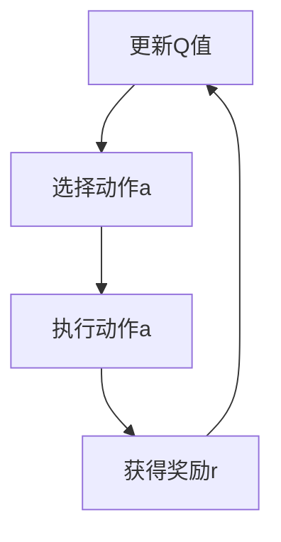
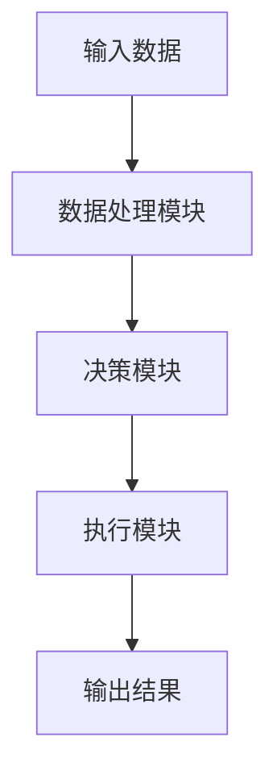

                 


# AI Agent在科研领域的应用：加速科学发现

> 关键词：AI Agent, 科研应用, 科学发现, 人工智能技术, 机器学习算法

> 摘要：本文探讨了AI Agent在科研领域的应用，详细分析了其核心原理、系统架构及实际案例，展示了AI Agent如何通过智能化工具加速科学发现。

---

## 第一部分: AI Agent的背景与基础

### 第1章: AI Agent的定义与核心概念

#### 1.1 AI Agent的基本定义
- **1.1.1 什么是AI Agent**
  AI Agent（智能体）是一种能够感知环境并采取行动以实现目标的实体。它可以自主决策，无需人工干预。
- **1.1.2 AI Agent的核心特征**
  - 自主性：能够独立决策
  - 反应性：能感知环境并实时响应
  - 目标导向：基于目标采取行动
- **1.1.3 AI Agent与传统AI的区别**
  AI Agent不仅执行任务，还能与环境交互，动态调整策略。

#### 1.2 AI Agent在科研中的作用
- **1.2.1 科研中的问题与挑战**
  科研数据复杂性高，传统方法效率低，AI Agent能提高研究效率。
- **1.2.2 AI Agent如何解决科研问题**
  通过自动化分析和决策，帮助科学家快速找到解决方案。
- **1.2.3 AI Agent在科研中的优势**
  提高研究效率，发现潜在关联，推动创新。

### 第2章: AI Agent的基本原理与技术

#### 2.1 AI Agent的核心技术
- **2.1.1 机器学习基础**
  AI Agent依赖机器学习模型进行数据分析和决策。
- **2.1.2 自然语言处理**
  用于理解和生成人类语言，增强交互能力。
- **2.1.3 强化学习与决策**
  AI Agent通过强化学习优化决策策略。

#### 2.2 AI Agent的算法框架
- **2.2.1 基于规则的AI Agent**
  使用预定义规则进行决策，适用于简单场景。
- **2.2.2 基于模型的AI Agent**
  使用模型预测结果，适用于复杂场景。
- **2.2.3 基于数据驱动的AI Agent**
  通过数据训练模型，适用于动态变化的环境。

### 第3章: AI Agent的系统架构

#### 3.1 AI Agent的系统组成
- **3.1.1 感知模块**
  用于获取环境信息，如传感器数据。
- **3.1.2 决策模块**
  分析信息并制定行动方案。
- **3.1.3 执行模块**
  执行决策并返回结果。

#### 3.2 AI Agent的交互流程
- **3.2.1 输入处理**
  接收用户请求或环境数据。
- **3.2.2 状态分析**
  分析当前状态，识别问题。
- **3.2.3 行动规划**
  制定解决方案，选择最优行动。
- **3.2.4 输出结果**
  执行行动并返回结果。

### 第4章: AI Agent在科研中的应用场景

#### 4.1 科研数据处理
- **4.1.1 数据分析与挖掘**
  AI Agent帮助处理海量数据，提取有用信息。
- **4.1.2 知识图谱构建**
  通过关联分析，构建领域知识图谱。
- **4.1.3 数据可视化**
  将数据转化为可视化形式，便于分析。

#### 4.2 科研项目管理
- **4.2.1 项目进度跟踪**
  监控项目进展，识别潜在风险。
- **4.2.2 资源分配优化**
  合理分配资源，提高效率。
- **4.2.3 任务优先级排序**
  根据目标优先级安排任务。

#### 4.3 科学发现辅助
- **4.3.1 自动化假设验证**
  AI Agent帮助验证科学假设，加速发现。
- **4.3.2 模型优化与参数调整**
  自动优化实验参数，提高结果准确性。
- **4.3.3 文献推荐与知识关联**
  智能推荐相关文献，拓展研究思路。

---

## 第二部分: AI Agent的算法与系统架构

### 第5章: AI Agent的算法原理

#### 5.1 强化学习算法
- **5.1.1 Q-Learning算法**
  使用Q值表记录状态-动作对的奖励值，更新策略。
  $$ Q(s, a) = Q(s, a) + \alpha (r + \gamma \max Q(s', a')) $$

- **5.1.2 Deep Q-Networks (DQN)**
  使用神经网络近似Q值函数，适合高维状态空间。
  ```python
  class DQN(nn.Module):
      def __init__(self):
          super(DQN, self).__init__()
          self.fc = nn.Linear(state_size, action_size)
  ```

#### 5.2 算法流程图


### 第6章: 系统架构设计

#### 6.1 系统功能模块
- **6.1.1 数据处理模块**
  负责数据预处理和特征提取。
  ```mermaid
  classDiagram
      class 数据处理模块 {
          输入数据
          数据清洗
          特征提取
      }
  ```

- **6.1.2 决策模块**
  负责分析数据并制定决策。
  ```mermaid
  classDiagram
      class 决策模块 {
          输入数据
          分析决策
          输出决策
      }
  ```

- **6.1.3 执行模块**
  负责执行决策并返回结果。
  ```mermaid
  classDiagram
      class 执行模块 {
          执行决策
          返回结果
      }
  ```

#### 6.2 系统架构图


---

## 第三部分: 项目实战与案例分析

### 第7章: 项目实战

#### 7.1 环境安装
- 安装Python和相关库：
  ```bash
  pip install numpy pandas scikit-learn
  ```

#### 7.2 核心代码实现
- **Q-Learning实现**
  ```python
  import numpy as np

  class QLearning:
      def __init__(self, state_size, action_size, alpha=0.1, gamma=0.9):
          self.q_table = np.zeros((state_size, action_size))
          self.alpha = alpha
          self.gamma = gamma

      def choose_action(self, state, epsilon=0.1):
          if np.random.random() < epsilon:
              return np.random.randint(action_size)
          else:
              return np.argmax(self.q_table[state])

      def update_q_table(self, state, action, reward, next_state):
          self.q_table[state][action] = self.q_table[state][action] + self.alpha * (reward + self.gamma * np.max(self.q_table[next_state]) - self.q_table[state][action])
  ```

#### 7.3 实际案例分析
- **药物发现案例**
  AI Agent分析化合物结构，预测潜在药物，加速药物开发。

---

## 第四部分: 最佳实践与总结

### 第8章: 最佳实践

#### 8.1 小结
AI Agent在科研中发挥着越来越重要的作用，能够显著提高研究效率。

#### 8.2 注意事项
- 数据质量影响结果，需确保数据准确。
- 选择合适算法，避免过拟合。
- 定期更新模型，适应新数据。

#### 8.3 拓展阅读
推荐书籍：
- 《强化学习导论》
- 《机器学习实战》

---

## 作者：AI天才研究院 & 禅与计算机程序设计艺术

---

希望这篇文章能够帮助读者深入了解AI Agent在科研中的应用，为加速科学发现提供新的思路。

