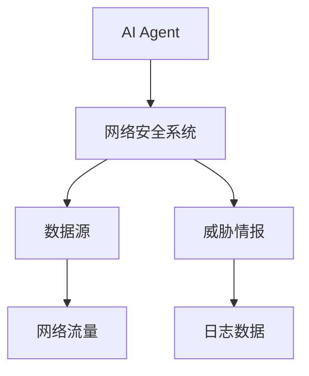
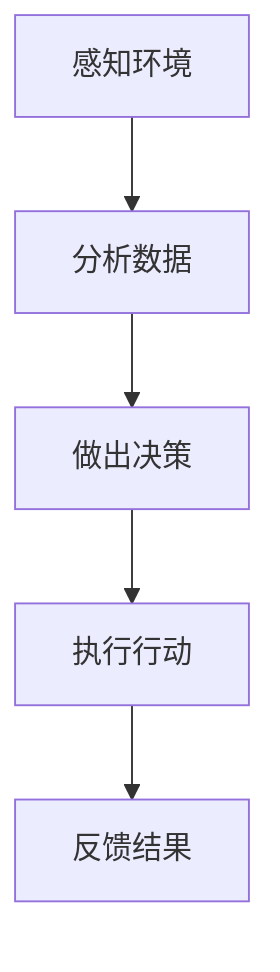
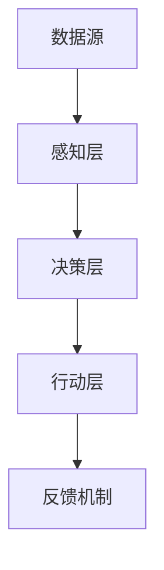
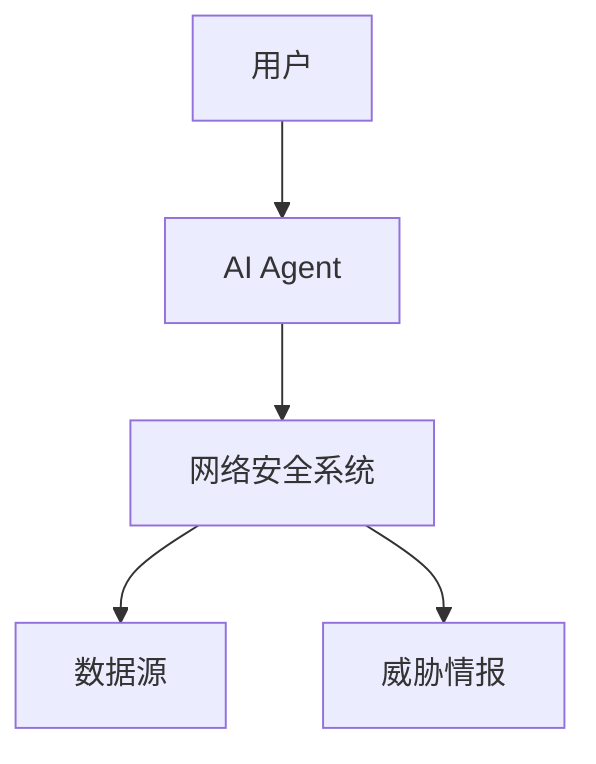

                 


# AI Agent在网络安全中的应用

> 关键词：AI Agent，网络安全，人工智能，威胁检测，入侵防御，机器学习，安全自动化

> 摘要：本文深入探讨了AI Agent在网络安全中的应用，分析了其核心概念、算法原理、系统设计与实际案例，展示了AI Agent如何通过智能化手段提升网络安全防护能力。文章从背景介绍、核心概念、算法原理、系统架构、项目实战到总结展望，全面解析了AI Agent在网络安全中的重要性与实际应用价值。

---

# 第一部分: AI Agent与网络安全概述

## 第1章: AI Agent与网络安全的背景介绍

### 1.1 AI Agent的基本概念

#### 1.1.1 AI Agent的定义与特点
- AI Agent的定义：智能体（AI Agent）是一种能够感知环境、做出决策并采取行动的实体，具备自主性、反应性、目标导向和学习能力。
- AI Agent的特点：
  - **自主性**：无需外部干预，自主完成任务。
  - **反应性**：能够实时感知环境变化并做出反应。
  - **目标导向**：基于明确的目标进行决策和行动。
  - **学习能力**：通过数据和经验不断优化自身行为。

#### 1.1.2 AI Agent的核心要素与组成
- 感知模块：负责收集环境中的信息（如网络流量、日志数据等）。
- 决策模块：基于感知信息，利用算法进行分析和决策。
- 行动模块：根据决策结果采取具体行动（如发出警告、阻止攻击等）。
- 学习模块：通过反馈机制不断优化感知、决策和行动的能力。

#### 1.1.3 AI Agent与传统安全技术的对比
| 对比维度       | AI Agent                 | 传统安全技术             |
|----------------|--------------------------|--------------------------|
| 数据处理能力   | 强大，支持大数据分析     | 较弱，依赖规则匹配       |
| 自适应能力     | 高，能够动态调整策略     | 较低，策略固定或有限     |
| 响应速度       | 快，实时响应             | 较慢，依赖人工干预或固定规则 |
| 学习能力       | 具备，能够自我优化       | 无，依赖预设规则         |

### 1.2 网络安全的基本概念

#### 1.2.1 网络安全的定义与范围
- 网络安全：保护网络系统免受未经授权的访问、数据泄露、破坏和干扰的实践。
- 范围：涵盖网络设备、数据、用户身份、通信通道等多个方面。

#### 1.2.2 网络安全的主要威胁与挑战
- 主要威胁：
  - 病毒、蠕虫、木马等恶意软件。
  - 攻击者通过DDoS、钓鱼攻击、社交工程等手段进行攻击。
- 挑战：
  - 攻击手段日益复杂，传统防护技术难以应对。
  - 数据量激增，人工分析效率低下。
  - 零日漏洞难以预测和防御。

#### 1.2.3 网络安全的防护体系与策略
- 防护体系：
  - **预防**：通过防火墙、入侵检测系统（IDS）等技术阻止攻击。
  - **检测**：及时发现网络中的异常行为。
  - **响应**：快速应对已发生的攻击，减少损失。
- 策略：
  - 建立多层次防御体系。
  - 定期进行安全演练和漏洞扫描。
  - 培养用户的安全意识。

### 1.3 AI Agent在网络安全中的应用背景

#### 1.3.1 网络安全领域的痛点与难点
- 网络攻击日益复杂，传统的基于规则的安全系统难以应对未知威胁。
- 数据量激增，安全分析人员严重不足，导致分析效率低下。
- 零日漏洞难以预测，传统防护手段难以应对新型攻击。

#### 1.3.2 AI Agent如何解决网络安全问题
- **智能化威胁检测**：通过机器学习算法实时分析网络流量，发现异常行为。
- **自动化响应**：AI Agent能够在检测到威胁后立即采取行动，如切断可疑连接、隔离受感染设备等。
- **自我优化**：通过不断学习新的威胁数据，提升检测和防御能力。

#### 1.3.3 当前AI Agent在网络安全中的应用现状
- **入侵检测与防御**：AI Agent通过分析网络流量，识别潜在攻击。
- **威胁情报分析**：利用自然语言处理技术分析安全报告，提取威胁情报。
- **漏洞管理**：AI Agent能够自动识别系统漏洞并提出修复建议。

## 1.4 本章小结
本章介绍了AI Agent的基本概念、核心要素及其在网络安全中的应用背景，分析了网络安全的主要威胁和挑战，并探讨了AI Agent如何通过智能化手段解决这些问题。接下来的章节将深入探讨AI Agent的核心原理和算法。

---

# 第二部分: AI Agent的核心概念与原理

## 第2章: AI Agent的核心概念与原理

### 2.1 AI Agent的定义与分类

#### 2.1.1 AI Agent的定义
AI Agent是一种能够感知环境、做出决策并采取行动的智能实体，具备自主性、反应性、目标导向和学习能力。

#### 2.1.2 AI Agent的分类与应用场景
- **分类**：
  - **简单反射型Agent**：基于预设规则做出反应，适用于简单场景。
  - **基于模型的反射型Agent**：结合内部状态和外部环境进行决策。
  - **目标驱动型Agent**：根据目标选择最优行动。
  - **效用驱动型Agent**：通过最大化效用函数进行决策。
- **应用场景**：
  - **入侵检测**：实时监控网络流量，发现异常行为。
  - **威胁情报分析**：分析日志和安全报告，识别潜在威胁。
  - **漏洞管理**：自动识别和修复系统漏洞。

#### 2.1.3 不同类型AI Agent的特点对比
| 类型               | 简单反射型 | 基于模型的反射型 | 目标驱动型 | 效用驱动型 |
|--------------------|------------|------------------|------------|------------|
| 决策机制           | 基于规则   | 结合内部模型      | 基于目标    | 基于效用函数|
| 适应性             | 低         | 中               | 中         | 高         |
| 应用场景           | 简单场景   | 中等复杂场景      | 复杂场景    | 高效用场景 |

### 2.2 AI Agent的核心原理

#### 2.2.1 AI Agent的感知与决策机制
- **感知**：通过传感器或数据接口获取环境信息。
- **决策**：基于感知信息和内部模型，利用算法进行分析和决策。
- **行动**：根据决策结果采取具体行动。

#### 2.2.2 AI Agent的学习与自适应能力
- **监督学习**：通过标记数据训练模型，提升分类准确率。
- **无监督学习**：从无标签数据中发现模式和异常。
- **强化学习**：通过与环境互动，学习最优策略。

#### 2.2.3 AI Agent的通信与协作能力
- **通信**：通过API或消息队列与其它系统或Agent进行信息交换。
- **协作**：多个AI Agent协同工作，共同完成复杂任务。

### 2.3 AI Agent的数学模型与算法

#### 2.3.1 AI Agent的数学模型概述
- AI Agent的数学模型通常包括状态空间、动作空间和奖励函数。
- 状态空间：表示环境中的各种状态。
- 动作空间：表示Agent可以执行的动作。
- 奖励函数：定义在特定状态下执行某个动作所获得的奖励。

#### 2.3.2 常见AI Agent算法（如强化学习、监督学习等）
- **强化学习**：
  - 基于Q-learning算法，通过最大化累积奖励进行决策。
  - 算法公式：
    $$ Q(s, a) = Q(s, a) + \alpha \left( r + \gamma \max Q(s', a') - Q(s, a) \right) $$
- **监督学习**：
  - 基于支持向量机（SVM）或随机森林（Random Forest）进行分类。
  - 适用于已知威胁的分类任务。

#### 2.3.3 算法的优缺点分析
| 算法类型 | 优点                     | 缺点                     |
|----------|--------------------------|--------------------------|
| 强化学习  | 能够通过试错优化策略       | 需要大量数据和计算资源     |
| 监督学习  | 分类准确率高               | 依赖于高质量的标注数据     |

### 2.4 AI Agent的实体关系图

#### 2.4.1 实体关系图


### 2.5 AI Agent的流程图

#### 2.5.1 AI Agent的决策流程


### 2.6 本章小结
本章详细讲解了AI Agent的核心概念与原理，包括其定义、分类、感知与决策机制、学习与自适应能力，以及常见算法的优缺点。接下来的章节将结合实际案例，探讨AI Agent在网络安全中的具体应用。

---

# 第三部分: AI Agent在网络安全中的算法原理

## 第3章: AI Agent的算法原理与数学模型

### 3.1 强化学习算法在AI Agent中的应用

#### 3.1.1 强化学习的基本原理
- 强化学习：通过试错机制，学习策略以最大化累积奖励。
- 核心要素：
  - 状态（State）
  - 动作（Action）
  - 奖励（Reward）
  - 策略（Policy）

#### 3.1.2 强化学习在AI Agent决策中的应用
- **应用场景**：入侵检测、威胁响应。
- **算法选择**：Q-learning算法。
- **算法流程**：
  1. 状态感知：收集网络流量数据。
  2. 动作选择：根据当前状态选择一个动作。
  3. 执行动作：采取行动（如发出警告或阻止连接）。
  4. 反馈奖励：根据结果获得奖励或惩罚。

#### 3.1.3 强化学习的数学模型与公式
- Q-learning算法公式：
  $$ Q(s, a) = Q(s, a) + \alpha \left( r + \gamma \max Q(s', a') - Q(s, a) \right) $$
- 参数解释：
  - \( \alpha \)：学习率。
  - \( \gamma \)：折扣因子。

### 3.2 监督学习算法在AI Agent中的应用

#### 3.2.1 监督学习的基本原理
- 监督学习：通过训练数据学习映射关系，预测新数据的类别。
- 常见算法：支持向量机（SVM）、随机森林（Random Forest）。

#### 3.2.2 监督学习在威胁分类中的应用
- **应用场景**：恶意软件分类、垃圾邮件识别。
- **算法选择**：随机森林。
- **算法流程**：
  1. 数据收集：收集已知恶意和良性样本。
  2. 特征提取：提取样本的特征（如文件大小、熵值等）。
  3. 模型训练：训练分类器。
  4. 模型预测：预测新样本的类别。

#### 3.2.3 监督学习的数学模型与公式
- 随机森林算法：通过构建多个决策树，集成预测结果。
- 预测概率公式：
  $$ P(y|x) = \sum_{i=1}^{n} \frac{1}{n} \cdot I(\text{树}i \text{预测} y|x) $$

### 3.3 算法的优缺点分析

#### 3.3.1 强化学习的优缺点
- 优点：能够通过试错优化策略。
- 缺点：需要大量数据和计算资源，且可能陷入局部最优。

#### 3.3.2 监督学习的优缺点
- 优点：分类准确率高，适用于已知威胁。
- 缺点：依赖于高质量的标注数据。

## 3.4 本章小结
本章详细讲解了强化学习和监督学习在AI Agent中的应用，分析了它们的数学模型和优缺点。接下来的章节将结合实际案例，探讨AI Agent在网络安全中的具体应用。

---

# 第四部分: AI Agent在网络安全中的系统设计

## 第4章: AI Agent的系统设计与架构

### 4.1 网络安全AI Agent的系统架构

#### 4.1.1 系统架构设计
- **分层架构**：
  - **感知层**：负责收集网络流量、日志数据等信息。
  - **决策层**：对感知数据进行分析，做出决策。
  - **行动层**：根据决策结果采取具体行动。

#### 4.1.2 系统组件设计
- **数据源**：网络流量、日志、威胁情报。
- **AI Agent**：负责感知、决策和行动。
- **反馈机制**：根据结果调整AI Agent的行为。

#### 4.1.3 系统架构图


### 4.2 网络安全AI Agent的接口设计

#### 4.2.1 API接口设计
- **输入接口**：接收网络流量数据。
- **输出接口**：输出威胁检测结果。
- **通信接口**：与其他系统或AI Agent进行通信。

#### 4.2.2 接口规范
- **输入格式**：JSON格式的数据。
- **输出格式**：结构化威胁报告。

### 4.3 系统交互流程图

#### 4.3.1 交互流程图


### 4.4 本章小结
本章详细设计了AI Agent的系统架构，包括感知层、决策层和行动层，并展示了系统组件之间的交互关系。接下来的章节将结合实际案例，探讨AI Agent在网络安全中的具体应用。

---

# 第五部分: AI Agent在网络安全中的项目实战

## 第5章: AI Agent的项目实战

### 5.1 入侵检测系统案例

#### 5.1.1 项目介绍
- **项目目标**：通过AI Agent实现入侵检测。
- **项目范围**：实时监控网络流量，发现异常行为。

#### 5.1.2 环境安装
- **操作系统**：Linux（Ubuntu 20.04）
- **工具**：Python 3.8、TensorFlow 2.0、Scikit-learn 0.24

#### 5.1.3 核心代码实现

##### 5.1.3.1 数据预处理
```python
import pandas as pd
data = pd.read_csv('network_traffic.csv')
data = data.dropna()
```

##### 5.1.3.2 特征提取
```python
from sklearn.feature_selection import SelectKBest
selector = SelectKBest(k=10)
selected_features = selector.fit_transform(data, labels)
```

##### 5.1.3.3 模型训练
```python
from sklearn.ensemble import RandomForestClassifier
model = RandomForestClassifier(n_estimators=100)
model.fit(selected_features, labels)
```

##### 5.1.3.4 模型预测
```python
import joblib
joblib.dump(model, 'in

