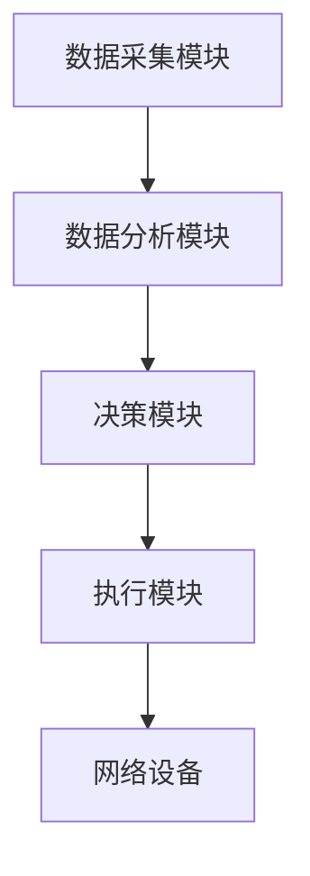
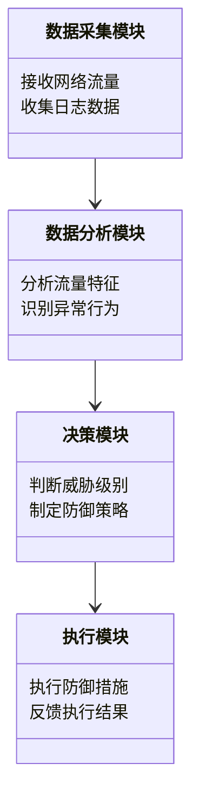
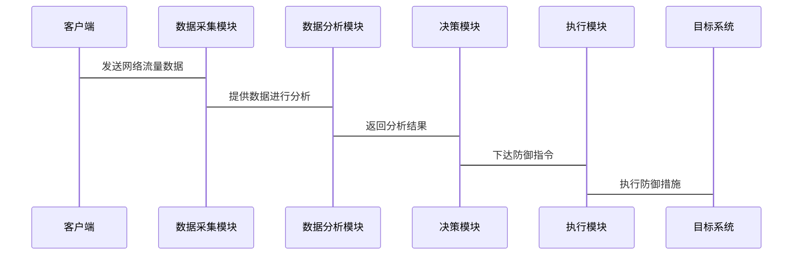

                 


# AI Agent在网络安全中的应用：威胁检测与防御

## 关键词：
- AI Agent
- 威胁检测
- �威肋防御
- 人工智能
- 网络安全
- 异常检测
- 自动响应

## 摘要：
随着网络攻击的日益复杂化和智能化，传统的安全防御手段已难以应对新型威胁。AI Agent（人工智能代理）凭借其强大的学习和适应能力，在网络安全领域展现出巨大潜力。本文将深入探讨AI Agent在威胁检测与防御中的应用，从基本概念、算法原理到系统架构、项目实战，全面解析其在网络安全中的重要性。通过结合实际案例，本文将揭示AI Agent如何帮助我们构建更智能、更高效的网络安全体系。

---

# 第1章：AI Agent的基本概念

## 1.1 AI Agent的定义与特点
AI Agent（人工智能代理）是指能够感知环境、自主决策并执行任务的智能实体。在网络安全领域，AI Agent通常表现为软件组件，能够通过机器学习算法分析数据、识别异常并采取相应措施。其特点包括：
- **自主性**：无需人工干预，自动执行任务。
- **智能性**：基于数据学习，具备推理和决策能力。
- **适应性**：能够根据环境变化调整行为。

## 1.2 AI Agent在网络安全中的作用
AI Agent在网络安全中的应用主要体现在威胁检测与防御两个方面：
- **威胁检测**：通过分析网络流量、日志数据，识别潜在威胁。
- **威胁防御**：根据检测结果，自动采取防御措施，如阻断攻击、修复漏洞。

---

# 第2章：AI Agent的威胁检测应用

## 2.1 异常行为检测
### 2.1.1 异常检测的定义与重要性
异常检测是指通过分析系统或网络的行为，识别与正常行为不符的事件。在网络安全中，异常检测是发现潜在攻击行为的关键手段。

### 2.1.2 基于机器学习的异常检测方法
- **监督学习**：基于已标注的数据训练模型，识别正常与异常行为。
- **无监督学习**：通过聚类分析，识别数据中的异常点。
- **混合学习**：结合监督和无监督学习，提升检测精度。

### 2.1.3 实际案例分析
以银行网络为例，AI Agent可以通过分析交易日志，识别异常转账行为，从而预防金融诈骗。

---

## 2.2 入侵检测系统（IDS）与入侵防御系统（IPS）
### 2.2.1 IDS和IPS的基本原理
- **IDS**：通过监控网络流量，检测潜在的入侵行为，并向管理员发出警报。
- **IPS**：在检测到入侵行为后，立即采取措施，如断开连接或阻止流量。

### 2.2.2 AI Agent在IDS/IPS中的应用
AI Agent可以通过机器学习模型分析流量特征，识别潜在的攻击模式，并实时更新检测规则。

---

## 2.3 恶意软件检测
### 2.3.1 恶意软件检测的挑战
恶意软件往往采用隐蔽技术，如文件加密、行为注入等，传统检测方法难以识别。

### 2.3.2 基于AI的恶意软件分析技术
- **静态分析**：通过分析程序文件的特征，识别恶意代码。
- **动态分析**：通过监控程序运行时的行为，识别恶意活动。
- **行为分类模型**：利用深度学习模型，分类正常与恶意程序行为。

---

# 第3章：AI Agent的威胁防御策略

## 3.1 威胁防御的基本概念
威胁防御是指通过技术手段，阻止或缓解网络攻击的影响。AI Agent在威胁防御中的作用包括：
- **实时监控**：持续监测网络状态，发现异常行为。
- **自动响应**：在检测到威胁后，立即采取防御措施。

---

## 3.2 自动响应机制
### 3.2.1 自动响应的原理与实现
AI Agent通过预定义的规则或机器学习模型，识别威胁后触发相应的防御措施，如：
- **阻断攻击**：切断可疑连接。
- **隔离受感染设备**：将受攻击的设备从网络中隔离，防止威胁扩散。

### 3.2.2 基于AI的响应策略优化
AI Agent可以根据历史数据和实时信息，优化响应策略，提升防御效率。

---

## 3.3 威胁情报分析
### 3.3.1 威胁情报的重要性
威胁情报是指关于潜在或正在进行的网络攻击的信息，能够帮助组织提前做好防御准备。

### 3.3.2 AI Agent在情报分析中的应用
AI Agent可以通过自然语言处理（NLP）技术，分析公开的威胁情报信息，提取有用的情报，如攻击手法、漏洞信息等。

---

# 第4章：AI Agent的系统架构与设计

## 4.1 系统架构概述
AI Agent的网络安全系统通常包括以下几个模块：
- **数据采集模块**：收集网络流量、日志等数据。
- **数据分析模块**：对数据进行处理和分析，识别威胁。
- **决策模块**：根据分析结果，决定采取的防御措施。
- **执行模块**：执行决策模块的指令，如阻断攻击、隔离设备等。

---

## 4.2 系统架构图（Mermaid）



---

## 4.3 系统功能设计
### 4.3.1 领域模型（Mermaid类图）



---

## 4.4 系统架构设计（Mermaid架构图）


---

## 4.5 系统接口设计
- 数据采集模块接口：用于接收网络流量和日志数据。
- 数据分析模块接口：用于与机器学习模型交互。
- 决策模块接口：用于接收分析结果并制定防御策略。
- 执行模块接口：用于执行防御措施并反馈结果。

---

## 4.6 系统交互设计（Mermaid序列图）



---

# 第5章：项目实战

## 5.1 环境安装
- 操作系统：Linux（Ubuntu 20.04）
- 工具：Python 3.8、Scikit-learn、TensorFlow、Flask

---

## 5.2 系统核心实现源代码

### 5.2.1 数据采集模块（网络流量监控）

```python
import socket

def collect_traffic():
    s = socket.socket(socket.AF_INET, socket.SOCK_RAW, socket.IPPROTO_TCP)
    s.bind(('0.0.0.0', 0))
    s.setsockopt(socket.SOL_IP, socket.IP_HDRINCL, 1)
    while True:
        data = s.recv(65535)
        yield data
```

---

### 5.2.2 数据分析模块（异常检测模型）

```python
from sklearn.ensemble import IsolationForest

def train_anomaly_detection_model(data):
    model = IsolationForest(n_estimators=100, random_state=42)
    model.fit(data)
    return model
```

---

### 5.2.3 决策模块（威胁判断）

```python
def decide_threat_level(score):
    if score < -0.5:
        return "High"
    elif score < 0:
        return "Medium"
    else:
        return "Low"
```

---

### 5.2.4 执行模块（自动响应）

```python
def block_attack(ip):
    # 假设iptables用于流量控制
    import subprocess
    subprocess.run(f"iptables -A INPUT -s {ip} -j DROP", shell=True)
```

---

## 5.3 代码应用解读与分析
- **数据采集模块**：通过 sockets 监听网络流量，采集数据。
- **数据分析模块**：使用 Isolation Forest 算法训练异常检测模型，识别异常流量。
- **决策模块**：根据模型输出的异常分数，判断威胁级别。
- **执行模块**：根据决策结果，执行相应的防御措施，如 iptables 阻断。

---

## 5.4 实际案例分析
假设我们部署了一个基于 AI Agent 的入侵检测系统，实时监控公司的内网流量。系统通过分析流量特征，发现了一次正在进行的 DDoS 攻击，并立即触发自动响应，阻断了攻击流量，保护了网络的正常运行。

---

## 5.5 项目小结
通过本项目，我们实现了基于 AI Agent 的网络安全系统，从数据采集、分析到决策、执行，整个流程展示了 AI 在网络安全中的强大能力。实际案例证明，该系统能够有效检测和防御网络威胁。

---

# 第6章：总结与展望

## 6.1 总结
本文详细探讨了 AI Agent 在网络安全中的应用，特别是在威胁检测与防御方面。通过结合理论与实践，展示了如何利用 AI 技术构建智能的网络安全系统。

## 6.2 未来展望
随着 AI 技术的不断发展，AI Agent 在网络安全中的应用将更加广泛。未来的研究方向包括：
- 更智能的威胁检测算法。
- 更高效的自动响应机制。
- 更强大的威胁情报分析能力。

## 6.3 最佳实践 tips
- 定期更新模型，适应新的威胁。
- 结合多种技术，提升系统的 robustness。
- 加强数据隐私保护，避免滥用。

---

# 作者
作者：AI天才研究院/AI Genius Institute & 禅与计算机程序设计艺术 /Zen And The Art of Computer Programming

---

希望这篇文章能够帮助读者理解 AI Agent 在网络安全中的应用，并为实际项目提供参考。

