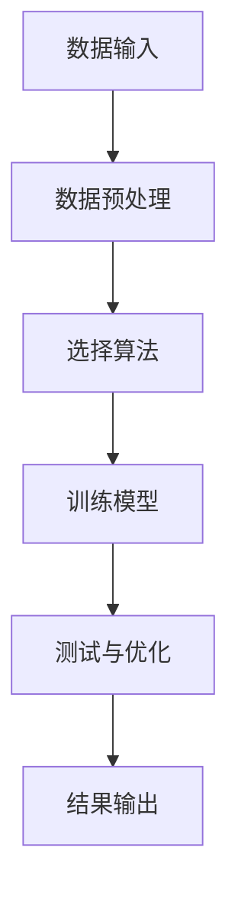
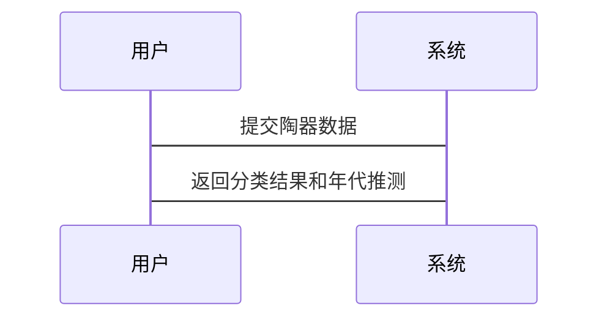

                 


# AI Agent在考古学中的应用：文物分析与历史重建

> 关键词：人工智能，考古学，AI Agent，文物分析，历史重建，深度学习，自然语言处理

> 摘要：本文探讨AI Agent在考古学中的应用，重点分析其在文物分析与历史重建中的作用。通过详细的技术分析和实际案例，阐述AI Agent如何利用先进的算法和系统架构，帮助考古学家更高效、准确地进行研究。文章涵盖从基础概念到算法实现，再到系统设计和项目实战的各个方面，为读者提供全面的视角。

---

## 第一部分: AI Agent与考古学的结合

### 第1章: 背景介绍

#### 1.1 AI Agent的基本概念
- **AI Agent的定义**：AI Agent（智能体）是指能够感知环境、做出决策并执行动作的智能系统。它具备自主性、反应性、目标导向和社交能力等特征。
- **AI Agent的核心特征**：
  - 自主性：无需外部干预，自主决策。
  - 反应性：实时感知环境变化并做出反应。
  - 目标导向：基于目标驱动行为。
  - 社交能力：能够与其他智能体或人类进行交互。
- **AI Agent与传统计算机程序的区别**：AI Agent具备自主性和适应性，能够根据环境动态调整行为，而传统程序通常是静态的、固定的。

#### 1.2 考古学的基本概念
- **考古学的定义**：考古学是研究人类历史的学科，通过发掘和分析古代人类的物质遗存，揭示人类社会的发展过程。
- **考古学的主要研究方法**：
  - 墓葬分析：研究墓葬中的遗物和结构，推断社会制度和宗教信仰。
  - 遗址发掘：通过对遗址的发掘，获取文物和遗迹信息。
  - 文物分析：通过对文物的形态、材料和符号进行研究，推测其用途和历史背景。
- **考古学与现代技术的结合**：随着科技的发展，考古学越来越多地借助计算机技术，如3D建模、图像处理和人工智能等。

#### 1.3 AI Agent在考古学中的应用背景
- **考古学中的数据处理挑战**：
  - 文物数量庞大，种类繁多，人工分析效率低下。
  - 文物的符号和图案复杂，难以手动识别和分类。
  - 文物的时间跨度长，需要跨学科的知识支持。
- **AI Agent在考古学中的潜在优势**：
  - 高效的数据处理能力：AI Agent可以通过机器学习算法快速处理大量文物数据。
  - 自动识别与分类：AI Agent能够自动识别文物的特征，如形状、颜色和纹理，进行分类。
  - 跨学科知识整合：AI Agent可以整合历史学、语言学和材料科学等多学科知识，提供综合分析。
- **当前研究现状与未来趋势**：
  - 当前，AI Agent在考古学中的应用还处于起步阶段，主要集中在图像识别和数据分析方面。
  - 未来，随着AI技术的进步，AI Agent将在文物修复、历史重建和遗址保护等方面发挥更大的作用。

---

### 第2章: AI Agent的核心概念与联系

#### 2.1 AI Agent的核心原理
- **感知与数据获取**：AI Agent通过传感器或其他数据源获取环境信息。在考古学中，这可以是高分辨率的图像、三维模型或文本资料。
- **推理与决策**：AI Agent利用知识库和推理算法，从感知的数据中提取有用的信息，并做出决策。在考古学中，这可以用于确定文物的年代或用途。
- **行动与执行**：AI Agent根据决策结果执行相应的动作。在考古学中，这可以是自动分类文物或生成历史重建的可视化结果。

#### 2.2 AI Agent在考古学中的核心要素
- **数据来源与类型**：
  - 图像数据：包括遗址的照片、卫星图像和三维模型。
  - 文本数据：包括历史文献、铭文和考古报告。
  - 时间序列数据：包括遗址的年代信息和地层学数据。
- **知识库与推理规则**：
  - 知识库：存储与考古学相关的知识，如文物类型、符号含义和历史事件。
  - 推理规则：定义如何从数据中推导出结论，如基于图像特征推断文物的用途。
- **目标与任务定义**：
  - 目标：AI Agent需要完成的任务，如分类文物、重建历史事件。
  - 任务定义：明确任务的具体步骤和所需的数据。

#### 2.3 核心概念对比分析
- **AI Agent与传统数据分析方法的对比**：
  | 特性         | AI Agent                          | 传统数据分析方法 |
  |--------------|------------------------------------|------------------|
  | 自主性       | 高                                 | 低               |
  | 适应性       | 高                                 | 低               |
  | 处理效率     | 高                                 | 低               |
  | 跨学科能力   | 强                                 | 弱               |
- **不同类型AI Agent的特征对比**：
  | 类型         | 特征                               |
  |--------------|------------------------------------|
  | 简单反射型   | 基于条件反射，无复杂推理           |
  | 目标驱动型   | 基于目标驱动，具备规划能力         |
  | 情境-aware型 | 能够感知环境并动态调整行为         |
- **AI Agent在考古学中的独特优势**：
  - 能够处理复杂、不完整的数据。
  - 具备跨学科知识整合能力。
  - 可以快速处理大量数据，提高研究效率。

---

### 第3章: AI Agent的算法原理

#### 3.1 算法原理概述
- **机器学习算法的基本原理**：通过数据训练模型，使其能够从数据中学习规律并进行预测。
- **深度学习算法的基本原理**：通过多层神经网络提取数据的高层次特征。
- **自然语言处理算法的基本原理**：通过语言模型理解和生成文本。

#### 3.2 具体算法实现
- **图像识别算法（如卷积神经网络）**：
  ```python
  import tensorflow as tf
  model = tf.keras.Sequential([
      tf.keras.layers.Conv2D(32, (3,3), activation='relu', input_shape=(256, 256, 3)),
      tf.keras.layers.MaxPooling2D((2,2)),
      tf.keras.layers.Conv2D(64, (3,3), activation='relu'),
      tf.keras.layers.MaxPooling2D((2,2)),
      tf.keras.layers.Flatten(),
      tf.keras.layers.Dense(128, activation='relu'),
      tf.keras.layers.Dense(10, activation='softmax')
  ])
  model.compile(optimizer='adam', loss='sparse_categorical_crossentropy', metrics=['accuracy'])
  model.fit(x_train, y_train, epochs=10)
  ```

- **文本分析算法（如循环神经网络）**：
  ```python
  import tensorflow as tf
  model = tf.keras.Sequential([
      tf.keras.layers.Embedding(10000, 64),
      tf.keras.layers.LSTM(64),
      tf.keras.layers.Dense(1, activation='sigmoid')
  ])
  model.compile(optimizer='adam', loss='binary_crossentropy', metrics=['accuracy'])
  model.fit(x_train, y_train, epochs=5)
  ```

- **决策树算法**：
  ```python
  from sklearn.tree import DecisionTreeClassifier
  model = DecisionTreeClassifier()
  model.fit(X_train, y_train)
  ```

#### 3.3 算法流程图


---

### 第4章: 数学模型与公式

#### 4.1 机器学习模型
- **线性回归模型**：
  $$ y = \beta_0 + \beta_1x + \epsilon $$
  其中，$\beta_0$是截距，$\beta_1$是回归系数，$\epsilon$是误差项。

- **支持向量机模型**：
  $$ \text{最大化} \quad \frac{1}{2}\|w\|^2 $$
  $$ \text{约束} \quad y_i(w \cdot x_i + b) \geq 1 $$

#### 4.2 深度学习模型
- **卷积神经网络**：
  $$ \text{卷积层} \rightarrow \text{池化层} \rightarrow \text{全连接层} $$

#### 4.3 自然语言处理模型
- **循环神经网络**：
  $$ \text{RNN} \rightarrow \text{LSTM} \rightarrow \text{GRU} $$

---

### 第5章: 系统分析与架构设计

#### 5.1 问题场景介绍
- **问题场景**：假设我们需要对一批出土的陶器进行分类和年代确定。这些陶器的图像和铭文数据需要通过AI Agent进行分析。

#### 5.2 项目介绍
- **项目目标**：开发一个基于AI Agent的文物分析系统，能够自动分类陶器并确定其年代。
- **系统功能设计**：
  - 数据输入：接收陶器的图像和铭文数据。
  - 数据处理：对数据进行预处理和特征提取。
  - 模型训练：使用机器学习算法对数据进行训练。
  - 结果输出：输出分类结果和年代推测。

#### 5.3 系统架构设计


#### 5.4 系统接口设计
- **输入接口**：接收陶器的图像和铭文数据。
- **输出接口**：输出分类结果和年代推测。

#### 5.5 系统交互设计


---

### 第6章: 项目实战

#### 6.1 环境安装
- **安装Python**：确保安装了Python 3.8或更高版本。
- **安装依赖库**：安装TensorFlow、Keras、Scikit-learn等库。

#### 6.2 系统核心实现源代码
```python
import tensorflow as tf
from tensorflow.keras import layers
from sklearn.tree import DecisionTreeClassifier

# 图像识别模型
def image_classifier():
    model = tf.keras.Sequential([
        layers.Conv2D(32, (3,3), activation='relu', input_shape=(256, 256, 3)),
        layers.MaxPooling2D((2,2)),
        layers.Conv2D(64, (3,3), activation='relu'),
        layers.MaxPooling2D((2,2)),
        layers.Flatten(),
        layers.Dense(128, activation='relu'),
        layers.Dense(10, activation='softmax')
    ])
    model.compile(optimizer='adam', loss='sparse_categorical_crossentropy', metrics=['accuracy'])
    return model

# 文本分析模型
def text_analyzer():
    model = tf.keras.Sequential([
        layers.Embedding(10000, 64),
        layers.LSTM(64),
        layers.Dense(1, activation='sigmoid')
    ])
    model.compile(optimizer='adam', loss='binary_crossentropy', metrics=['accuracy'])
    return model

# 决策树模型
def decision_tree_classifier():
    model = DecisionTreeClassifier()
    return model
```

#### 6.3 代码应用解读与分析
- **图像识别模型**：用于对陶器的图像进行分类，识别其类型和特征。
- **文本分析模型**：用于分析陶器上的铭文，推测其历史背景和用途。
- **决策树模型**：用于基于分类结果和铭文信息，推测陶器的年代。

#### 6.4 实际案例分析
- **案例背景**：一批出土的陶器，需要分类和年代确定。
- **数据输入**：包括陶器的图像和铭文数据。
- **数据处理**：对图像进行预处理，提取特征。
- **模型训练**：使用训练好的模型对数据进行分析。
- **结果输出**：输出分类结果和年代推测。

#### 6.5 项目小结
- **项目成果**：成功开发了一个基于AI Agent的文物分析系统，能够自动分类陶器并确定其年代。
- **经验总结**：AI Agent在考古学中的应用潜力巨大，但需要结合具体场景和数据特点进行模型优化。

---

## 第七章: 总结与展望

### 7.1 总结
- 本文详细探讨了AI Agent在考古学中的应用，重点分析了其在文物分析与历史重建中的作用。
- 通过具体的技术分析和实际案例，阐述了AI Agent如何利用先进的算法和系统架构，帮助考古学家更高效、准确地进行研究。

### 7.2 未来展望
- **算法优化**：随着AI技术的进步，AI Agent在考古学中的应用将更加广泛，算法的准确性和效率将进一步提升。
- **跨学科合作**：AI Agent需要整合更多学科的知识，如历史学、语言学和材料科学，以提供更全面的分析。
- **智能化考古工具**：未来的考古工具将更加智能化，能够自主完成数据处理、分类和历史重建。

---

## 参考文献
1. LeCun, Y., Bengio, Y., & Hinton, G. (2015). Deep learning. Nature, 521(7552), 436-444.
2. Goodfellow, I., Bengio, Y., & Courville, A. (2016). Deep learning. MIT Press.
3.周志华. (2016). 机器学习. 清华大学出版社.

---

## 附录
- **附录A**：AI Agent相关工具安装指南
- **附录B**：相关数据集说明
- **附录C**：系统架构图详细说明

---

## 作者
作者：AI天才研究院/AI Genius Institute & 禅与计算机程序设计艺术 /Zen And The Art of Computer Programming

