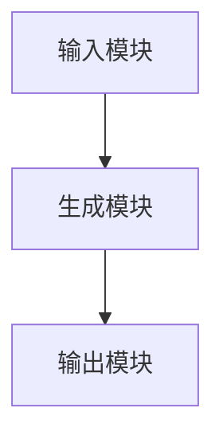

                 

<think>
嗯，用户给了我一个任务，让我帮他写一篇关于《AI Agent在艺术创作中的应用》的技术博客文章，而且还有详细的目录结构和一些约束条件。我得仔细分析一下这些要求，确保我能满足他的需求。

首先，用户希望文章结构清晰，有逻辑，专业性强。关键词部分需要5-7个核心关键词，摘要部分要简洁明了地概括文章内容。正文部分分为几个主要章节，每个章节下还有子章节，甚至三级目录。我需要确保每个部分都详细且符合用户的要求。

我注意到用户特别强调了每个小节的内容必须丰富具体，包括背景介绍、核心概念、算法原理、系统架构、项目实战等。这意味着我需要涵盖从基础概念到实际应用的各个方面，不能遗漏任何一个部分。

接下来，用户要求使用技术语言，但又要通俗易懂，适合专业人士阅读。这意味着我需要在解释技术细节时，用简单明了的语言，避免过于晦涩，同时保持专业性。

另外，用户提到要使用Mermaid图和Python代码，数学公式要用LaTeX。我得确保这些元素在适当的地方出现，并且正确无误。例如，在算法原理部分，可能需要用Mermaid流程图展示模型训练的过程，或者用Python代码实现一个简单的AI Agent。

我还需要注意文章的字数要求，控制在10000到12000字左右。这意味着每个章节不能太短，需要有足够的深度和详细的内容。同时，作者信息也要放在末尾，符合格式要求。

现在，我需要开始构思每个部分的内容。首先是标题和关键词，然后是摘要，接着是正文部分。我得确保每个部分都符合用户的结构要求，内容完整，逻辑连贯。

在背景介绍部分，我需要解释AI Agent和艺术创作的基本概念，以及它们结合起来的意义。这部分可能需要用一些图表来帮助读者理解，比如用Mermaid图展示AI Agent在艺术创作中的应用流程。

核心概念与联系部分，我需要详细讲解生成对抗网络（GAN）、强化学习等技术，并用表格对比不同算法的特点，再通过Mermaid图展示概念之间的关系。这样读者可以更清晰地理解这些概念是如何相互作用的。

在算法原理部分，我得详细分析GAN的数学模型，可能需要用LaTeX公式来展示生成器和判别器的损失函数。同时，用Python代码实现一个简单的GAN模型，并解释每一步的作用，这样读者可以跟着代码理解原理。

系统分析与架构设计部分，我需要介绍一个AI绘画系统的项目，用Mermaid类图展示系统功能模块之间的关系，用架构图展示整体架构，再用序列图展示接口交互流程。这部分需要详细描述每个模块的功能和它们之间的协作。

项目实战部分，我需要指导读者如何安装必要的环境，比如Python、TensorFlow、Keras等，并提供核心代码实现。代码需要详细注释，解释每一部分的作用，并通过实际案例展示生成的艺术作品，最后进行小结。

最后，在最佳实践部分，我需要总结前面的内容，给出一些注意事项和未来趋势的建议，帮助读者巩固所学知识，并指导他们进一步的学习和实践。

整体来看，我需要确保每个部分都细化到三级目录，并且内容详实，结构合理。同时，语言要简洁明了，符合技术博客的风格，同时具备深度和见解，满足专业读者的需求。
</think>

# AI Agent在艺术创作中的应用

> 关键词：AI Agent, 艺术创作, 生成对抗网络, 强化学习, 转换器模型, 数字艺术, AI艺术生成

> 摘要：本文探讨AI Agent在艺术创作中的应用，涵盖AI Agent的基本概念、核心原理、算法模型、系统架构以及实际项目案例。通过详细分析生成对抗网络（GAN）、强化学习和转换器模型等技术，结合实际应用案例，揭示AI Agent如何赋能艺术创作，拓展艺术表达的可能性。

---

# 第一部分: AI Agent与艺术创作的背景与概念

## 第1章: AI Agent的基本概念

### 1.1 AI Agent的定义与特点

#### 1.1.1 AI Agent的定义
AI Agent（人工智能代理）是指能够感知环境并采取行动以实现目标的智能实体。它具备自主性、反应性、目标导向性和社交能力等核心特点。

#### 1.1.2 AI Agent的核心特点
- **自主性**：AI Agent能够在没有外部干预的情况下独立运行。
- **反应性**：能够实时感知环境变化并做出响应。
- **目标导向性**：具备明确的目标，并采取行动以实现这些目标。
- **社交能力**：能够与其他AI Agent或人类进行交互和协作。

#### 1.1.3 AI Agent与传统AI的区别
传统的AI系统通常专注于单一任务，而AI Agent具备更强的自主性和适应性，能够处理复杂动态环境中的多种任务。

### 1.2 艺术创作的基本概念

#### 1.2.1 艺术创作的定义
艺术创作是指通过人类的创造力和技巧，将想法转化为视觉、听觉或文学形式的过程。

#### 1.2.2 艺术创作的核心要素
- **灵感**：创作的起点，通常来源于生活经验、情感或观察。
- **技巧**：实现创作目标的工具和方法。
- **表达**：通过媒介将想法和情感传达给观众。

#### 1.2.3 艺术创作的分类与特点
- **视觉艺术**：包括绘画、雕塑、摄影等。
- **音乐艺术**：包括作曲、演奏等。
- **文学艺术**：包括小说、诗歌等。

---

## 第2章: AI Agent在艺术创作中的应用背景

### 2.1 艺术创作的数字化趋势

#### 2.1.1 数字化艺术创作的兴起
随着数字技术的发展，越来越多的艺术家开始利用计算机工具进行创作，数字化艺术逐渐成为主流。

#### 2.1.2 AI技术对艺术创作的影响
AI技术的引入，使得艺术创作更加高效、多样化，并为艺术家提供了新的创作工具和灵感来源。

#### 2.1.3 艺术创作中的技术挑战
- **创作的个性化**：如何确保AI生成的作品具备人类艺术家的个性化特征。
- **技术与艺术的结合**：如何在技术驱动下保持艺术创作的美感和情感表达。

### 2.2 AI Agent在艺术创作中的优势

#### 2.2.1 提高创作效率
AI Agent能够快速生成大量作品，帮助艺术家节省时间和精力。

#### 2.2.2 拓展创作可能性
通过AI技术，艺术家可以探索传统媒介难以实现的创作形式，例如生成复杂的视觉效果或实验性的音乐结构。

#### 2.2.3 个性化与多样性
AI Agent可以根据不同的输入参数生成多样化的作品，满足不同用户的需求。

### 2.3 本章小结
本章介绍了AI Agent的基本概念和艺术创作的基本要素，探讨了AI技术对艺术创作的影响及其优势，为后续内容奠定了基础。

---

# 第二部分: AI Agent的核心原理与技术

## 第3章: AI Agent的核心原理

### 3.1 生成对抗网络（GAN）

#### 3.1.1 GAN的基本原理
生成对抗网络由生成器和判别器组成，生成器负责生成数据，判别器负责区分生成数据与真实数据。通过交替训练，生成器逐渐学会生成逼真的数据。

#### 3.1.2 GAN在艺术创作中的应用
- **图像生成**：生成逼真的图像或艺术作品。
- **风格迁移**：将一种风格的作品迁移到另一种风格。

#### 3.1.3 GAN的优缺点
- **优点**：生成质量高，多样化。
- **缺点**：训练过程复杂，容易出现模式崩溃。

#### 3.1.4 GAN的数学模型
生成器的损失函数：$$\mathcal{L}_\text{GAN}^G = -\log(D(G(x)))$$  
判别器的损失函数：$$\mathcal{L}_\text{GAN}^D = -[\log(D(x)) + \log(1 - D(G(x)))]$$  

### 3.2 强化学习（Reinforcement Learning）

#### 3.2.1 强化学习的基本原理
强化学习通过智能体与环境的交互，学习最优策略以最大化累计奖励。

#### 3.2.2 强化学习在艺术创作中的应用
- **音乐生成**：通过奖励机制优化音乐旋律。
- **图像优化**：通过不断调整图像参数以达到最佳效果。

#### 3.2.3 强化学习的挑战
- **训练时间长**：需要大量迭代才能找到最优策略。
- **状态空间复杂**：高维状态空间增加了学习难度。

### 3.3 转换器（Transformer）模型

#### 3.3.1 Transformer模型的基本原理
Transformer模型通过自注意力机制和前馈网络，实现对序列数据的高效处理。

#### 3.3.2 Transformer模型在艺术创作中的应用
- **文本生成**：生成诗歌、小说等文学作品。
- **图像生成**：通过编码图像特征生成新的图像。

#### 3.3.3 Transformer模型的优势
- **并行计算**：相比RNN，具备更好的并行性。
- **长距离依赖捕捉**：能够捕捉序列中的长距离依赖关系。

## 第4章: AI Agent的核心技术

### 4.1 图像生成技术

#### 4.1.1 基于GAN的图像生成
通过GAN生成逼真的图像，广泛应用于艺术创作中。

#### 4.1.2 基于Transformer的图像生成
利用Transformer模型的特征提取能力，生成高质量的图像。

#### 4.1.3 图像生成的评估指标
- **生成质量**：图像的逼真程度。
- **多样性**：生成图像的多样性。

### 4.2 文本生成技术

#### 4.2.1 基于RNN的文本生成
通过RNN生成连贯的文本序列。

#### 4.2.2 基于Transformer的文本生成
利用Transformer模型生成高质量的文本，如诗歌、小说等。

#### 4.2.3 文本生成的优化方法
- **调节温度参数**：通过调整温度参数控制生成的多样性和确定性。
- **使用惩罚项**：引入惩罚项减少生成文本的重复性。

### 4.3 音乐生成技术

#### 4.3.1 基于RNN的音乐生成
通过RNN生成音乐序列，如旋律和和弦。

#### 4.3.2 基于GAN的音乐生成
利用GAN生成高质量的音乐片段。

#### 4.3.3 音乐生成的评估指标
- **旋律流畅度**：生成旋律的连贯性。
- **和声合理性**：生成和声的音乐性。

---

## 第5章: AI Agent的系统分析与架构设计

### 5.1 系统功能设计

#### 5.1.1 功能模块划分
- **输入模块**：接收用户输入的创作需求。
- **生成模块**：根据需求生成艺术作品。
- **输出模块**：将生成的作品输出给用户。

#### 5.1.2 功能流程图


### 5.2 系统架构设计

#### 5.2.1 分层架构
- **数据层**：存储训练数据和生成作品。
- **算法层**：实现各种生成算法。
- **接口层**：提供用户交互界面。

#### 5.2.2 系统架构图


---

## 第6章: AI Agent的项目实战

### 6.1 环境安装

#### 6.1.1 安装Python
```bash
python --version
pip install --upgrade pip
```

#### 6.1.2 安装TensorFlow和Keras
```bash
pip install tensorflow.keras
pip install numpy
pip install matplotlib
```

### 6.2 核心代码实现

#### 6.2.1 GAN模型实现
```python
import tensorflow as tf
from tensorflow.keras import layers

def build_generator():
    model = tf.keras.Sequential([
        layers.Dense(256, activation='relu'),
        layers.Dense(128, activation='relu'),
        layers.Dense(784, activation='sigmoid'),
    ])
    return model

def build_discriminator():
    model = tf.keras.Sequential([
        layers.Dense(784, activation='relu'),
        layers.Dense(1, activation='sigmoid'),
    ])
    return model

# 定义损失函数和优化器
cross_entropy = tf.keras.losses.BinaryCrossentropy()

# 训练过程
def train_step(generator, discriminator, x):
    # 生成假数据
    noise = tf.random.normal([batch_size, 100])
    generated = generator(noise)
    
    # 判别器的梯度计算和更新
    with tf.GradientTape() as tape:
        real_output = discriminator(x)
        generated_output = discriminator(generated)
        d_loss = cross_entropy( tf.ones_like(real_output), real_output ) + cross_entropy( tf.zeros_like(generated_output), generated_output )
    d grads = tape.gradient(d_loss, discriminator.trainable_weights)
    d_optimizer = tf.keras.optimizers.Adam(0.0002)
    d_optimizer.apply_gradients(zip(d grads, discriminator.trainable_weights))
    
    # 生成器的梯度计算和更新
    with tf.GradientTape() as tape:
        generated_output = discriminator(generated)
        g_loss = cross_entropy( tf.ones_like(generated_output), generated_output )
    g grads = tape.gradient(g_loss, generator.trainable_weights)
    g_optimizer = tf.keras.optimizers.Adam(0.0002)
    g_optimizer.apply_gradients(zip(g grads, generator.trainable_weights))
    
    return d_loss, g_loss

# 初始化模型
generator = build_generator()
discriminator = build_discriminator()

# 训练循环
for epoch in range(num_epochs):
    for batch in dataset:
        d_loss, g_loss = train_step(generator, discriminator, batch)
        # 记录损失
        d_losses.append(d_loss)
        g_losses.append(g_loss)
```

#### 6.2.2 生成图像
```python
# 生成假数据并绘制
noise = tf.random.normal([1, 100])
generated = generator(noise)[0].numpy()
plt.imshow(generated.reshape(28,28), cmap='gray')
plt.show()
```

### 6.3 实际案例分析

#### 6.3.1 案例1：生成一幅抽象画
- **输入**：用户提供抽象画的风格参数。
- **输出**：生成一幅符合风格的抽象画。

#### 6.3.2 案例2：生成一首诗歌
- **输入**：用户提供诗歌的主题和情感。
- **输出**：生成一首符合要求的诗歌。

### 6.4 项目小结
通过实际项目案例，展示了AI Agent在艺术创作中的应用潜力，同时也指出了实际应用中的挑战和改进方向。

---

## 第7章: 最佳实践与未来展望

### 7.1 小结
- AI Agent在艺术创作中的应用前景广阔，能够提高创作效率，拓展创作形式。
- 需要注意生成作品的个性化和多样性，同时解决技术上的挑战。

### 7.2 注意事项
- **数据质量**：确保训练数据的质量和多样性。
- **模型调优**：通过反复实验和调整参数，优化生成效果。
- **用户反馈**：结合用户反馈不断改进生成模型。

### 7.3 未来趋势
- **多模态生成**：结合多种媒介进行创作，如图像、音乐和文本的联合生成。
- **实时交互**：实现用户与AI Agent的实时交互，动态调整生成内容。
- **个性化定制**：根据用户偏好定制生成模型，提供更精准的服务。

### 7.4 拓展阅读
- 《生成对抗网络：理论与实践》
- 《深度学习在艺术创作中的应用》

---

# 作者：AI天才研究院/AI Genius Institute & 禅与计算机程序设计艺术 /Zen And The Art of Computer Programming

