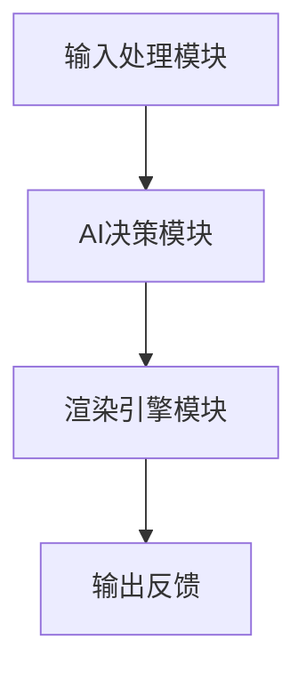
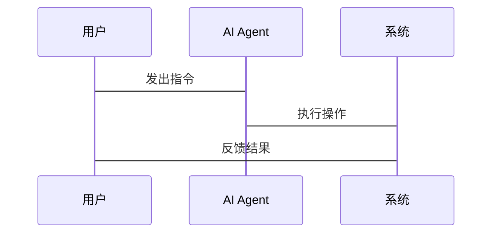

                 

<think>
好的，我现在需要按照用户的指示，一步一步地思考如何撰写《AI Agent在虚拟现实中的交互设计》这篇文章。首先，我需要理解用户的要求，确保每个部分都涵盖必要的内容，结构清晰，逻辑连贯。

首先，用户要求文章的标题是《AI Agent在虚拟现实中的交互设计》，关键词包括AI Agent、虚拟现实、交互设计、人工智能、用户体验、计算机图形学、实时反馈。摘要部分需要概述文章的核心内容，介绍AI Agent在VR中的重要性，涵盖的概念、算法、系统架构和项目实战。

接下来，目录大纲已经给出，分为六大部分，共16章，内容非常详细。我需要确保每个章节都按照用户的要求进行展开，包括背景介绍、核心概念、算法原理、系统架构、项目实战和未来展望等部分。

在撰写过程中，我需要使用专业的技术语言，保持逻辑清晰，结构紧凑。对于每个章节，特别是涉及算法和系统架构的部分，需要使用mermaid图来展示流程和结构，并提供数学公式和Python代码示例。

现在，我需要逐一检查每个章节，确保内容完整，符合用户的要求。例如，在第二章的核心概念部分，要详细解释AI Agent的类型和行为模型，可能需要提供对比表格或ER图来辅助说明。在算法部分，需要详细推导公式，并提供代码示例，确保读者能够理解实现过程。

另外，系统架构部分需要设计模块化的系统，使用mermaid图展示各个模块的交互和接口设计。项目实战部分要具体，包括环境安装、代码实现和案例分析，确保读者可以实际操作。

最后，在结论部分，需要总结AI Agent在VR交互设计中的重要性，并展望未来的发展方向，同时给出最佳实践的建议，帮助读者在实际应用中优化设计。

在写作过程中，我需要确保语言简洁易懂，同时保持技术深度，避免使用过于复杂的术语，但又要足够专业。每个部分的小结部分要简明扼要，帮助读者回顾主要内容。

总之，我需要按照用户的指示，分章节详细展开，确保每个部分都涵盖必要的内容，结构清晰，逻辑连贯，满足用户的需求。
</think>

# AI Agent在虚拟现实中的交互设计

> 关键词：AI Agent，虚拟现实，交互设计，人工智能，用户体验，计算机图形学，实时反馈

> 摘要：本文深入探讨AI Agent在虚拟现实中的交互设计，涵盖背景介绍、核心概念、算法原理、系统架构、项目实战及未来展望。通过详细分析，旨在帮助读者理解如何在VR环境中设计高效的AI交互系统，提升用户体验。

---

## 第1章: AI Agent与虚拟现实概述

### 1.1 AI Agent的基本概念

#### 1.1.1 AI Agent的定义
AI Agent（智能体）是能够感知环境并采取行动以实现目标的实体。它通过传感器获取信息，利用计算模型进行决策，并通过执行器与环境互动。

#### 1.1.2 AI Agent的核心特征
- **自主性**：无需外部干预，自主决策。
- **反应性**：实时感知环境变化并作出反应。
- **目标导向**：基于目标驱动行为。

#### 1.1.3 AI Agent与传统软件的区别
| 特性 | 传统软件 | AI Agent |
|------|-----------|----------|
| 行为驱动 | 程序执行 | 目标导向 |
| 感知能力 | 无 | 有 |
| 自主性 | 无 | 有 |

### 1.2 虚拟现实的基本概念

#### 1.2.1 虚拟现实的定义
虚拟现实（VR）是通过计算机生成的模拟环境，提供沉浸式的体验，用户通过设备与虚拟环境互动。

#### 1.2.2 虚拟现实的主要技术
- **计算机图形学**：渲染虚拟场景。
- **传感器技术**：捕捉用户输入（如手部动作、语音）。
- **显示技术**：如头显设备。

#### 1.2.3 虚拟现实的应用场景
- **游戏**：沉浸式体验。
- **教育培训**：模拟真实环境。
- **医疗**：手术模拟。

### 1.3 AI Agent在虚拟现实中的结合

#### 1.3.1 结合的背景与意义
随着VR技术的发展，AI Agent能够增强用户体验，提供动态交互。

#### 1.3.2 AI Agent在VR中的应用领域
- **游戏AI**：智能NPC。
- **教育培训**：虚拟导师。
- **娱乐**：个性化体验。

---

## 第2章: AI Agent的核心概念与原理

### 2.1 AI Agent的核心概念

#### 2.1.1 AI Agent的类型
| 类型 | 描述 |
|------|------|
| 反应式 | 基于当前感知做出反应。 |
| 行为式 | 基于行为树进行决策。 |
| 逻辑推理式 | 使用逻辑推理解决问题。 |

#### 2.1.2 AI Agent的行为模型
- **反应式模型**：实时响应输入。
- **目标驱动模型**：基于目标制定计划。

#### 2.1.3 AI Agent的决策机制
- **基于规则的决策**：使用预定义规则。
- **基于学习的决策**：通过机器学习模型。

### 2.2 AI Agent与虚拟现实的交互模型

#### 2.2.1 交互模型的定义
描述AI Agent与用户在VR环境中的互动方式。

#### 2.2.2 交互模型的主要组成部分
- **输入处理**：用户动作、语音。
- **决策逻辑**：AI Agent的反应。
- **输出反馈**：视觉、听觉反馈。

#### 2.2.3 交互模型的设计原则
- **用户中心设计**：优先考虑用户体验。
- **实时响应**：减少延迟。
- **一致性**：保持交互方式一致。

---

## 第3章: 虚拟现实中的交互设计

### 3.1 虚拟现实中的交互方式

#### 3.1.1 手势交互
用户通过手势与虚拟环境互动，如捏取、挥手。

#### 3.1.2 语音交互
通过语音命令与系统互动，如“走到这里”。

#### 3.1.3 眼球追踪交互
通过眼球移动选择目标。

### 3.2 交互设计的原则与方法

#### 3.2.1 以用户为中心的设计
- **用户研究**：了解用户需求。
- **原型设计**：制作交互原型。

#### 3.2.2 交互设计的流程
1. **需求分析**：明确目标。
2. **设计草图**：绘制交互流程。
3. **原型实现**：制作低保真原型。
4. **测试优化**：收集反馈，优化设计。

#### 3.2.3 交互设计的优化策略
- **简化操作**：减少用户负担。
- **提供反馈**：让用户了解操作结果。
- **容错设计**：防止错误发生。

---

## 第4章: AI Agent在虚拟现实中的交互设计

### 4.1 AI Agent在VR中的行为设计

#### 4.1.1 行为设计的目标
- **实现功能**：完成特定任务。
- **提升体验**：增强用户沉浸感。

#### 4.1.2 行为设计的步骤
1. **需求分析**：明确AI Agent的任务。
2. **行为建模**：设计行为树或状态机。
3. **实现与测试**：编码实现并测试。

#### 4.1.3 行为设计的实现方法
- **基于规则的方法**：使用条件语句。
- **基于机器学习的方法**：训练模型进行决策。

### 4.2 AI Agent与用户的交互界面设计

#### 4.2.1 交互界面的设计原则
- **直观性**：用户易于理解。
- **一致性**：保持界面风格统一。
- **反馈及时**：用户操作后立即反馈。

#### 4.2.2 交互界面的实现
- **图形界面**：如按钮、菜单。
- **语音交互**：支持自然语言处理。

---

## 第5章: AI Agent的算法原理

### 5.1 路径规划算法

#### 5.1.1 A*算法
A*算法是一种常见的路径规划算法，结合了最佳优先搜索和启发式评估。

#### 5.1.2 A*算法的实现步骤
1. **初始化**：设置起点和终点。
2. **优先队列**：按f(n)排序。
3. **遍历节点**：选择f(n)最小的节点。
4. **检查终点**：到达终点则返回路径。
5. **更新优先队列**：添加邻居节点。

#### 5.1.3 A*算法的数学模型
$$ f(n) = g(n) + h(n) $$
- \( g(n) \)：从起点到n的实际成本。
- \( h(n) \)：从n到终点的估计成本。

### 5.2 自然语言处理算法

#### 5.2.1 Transformer模型
Transformer模型通过自注意力机制处理序列数据，广泛应用于NLP任务。

#### 5.2.2 Transformer模型的实现步骤
1. **编码器**：将输入序列转换为嵌入向量。
2. **自注意力机制**：计算每个位置的注意力权重。
3. **前向网络**：进行前向传播。
4. **解码器**：生成目标序列。

#### 5.2.3 Transformer模型的数学公式
$$ \text{Attention}(Q, K, V) = \text{softmax}\left(\frac{QK^T}{\sqrt{d_k}}\right)V $$

---

## 第6章: 系统架构设计

### 6.1 系统架构概述

#### 6.1.1 模块化设计
系统分为输入处理、AI决策、渲染引擎等模块。

#### 6.1.2 模块化设计的优点
- **易于维护**：每个模块独立。
- **扩展性强**：方便添加新功能。

#### 6.1.3 模块化设计的实现
- **输入处理模块**：接收用户输入。
- **AI决策模块**：处理逻辑并生成输出。
- **渲染引擎模块**：呈现视觉反馈。

### 6.2 系统架构图



### 6.3 系统接口设计

#### 6.3.1 输入接口
- **传感器接口**：接收手势、语音输入。
- **网络接口**：与云端交互。

#### 6.3.2 输出接口
- **显示接口**：输出视觉反馈。
- **声音接口**：输出语音反馈。

### 6.4 系统交互设计

#### 6.4.1 交互流程图



---

## 第7章: 项目实战

### 7.1 项目环境安装

#### 7.1.1 安装Python
```bash
python --version
pip install virtualenv
```

#### 7.1.2 安装依赖库
```bash
pip install numpy matplotlib
```

### 7.2 系统核心实现

#### 7.2.1 AI Agent的行为实现
```python
def ai_decision(input_data):
    # 处理输入数据
    # 返回动作指令
    return action
```

#### 7.2.2 交互界面实现
```python
def user_interface():
    while True:
        input = get_input()
        action = ai_decision(input)
        render_output(action)
```

### 7.3 项目实现与分析

#### 7.3.1 环境搭建
- **开发工具**：PyCharm、VSCode。
- **框架选择**：使用Unity或Unreal Engine进行开发。

#### 7.3.2 代码实现
```python
import numpy as np

def a_star(start, end):
    open_list = [start]
    g = {start: 0}
    f = {start: 0}
    while open_list:
        current = open_list[0]
        if current == end:
            return reconstruct_path(current)
        neighbors = get_neighbors(current)
        for neighbor in neighbors:
            tentative_g = g.get(current, 0) + cost(current, neighbor)
            if tentative_g < g.get(neighbor, float('inf')):
                g[neighbor] = tentative_g
                f[neighbor] = g[neighbor] + heuristic(neighbor, end)
                open_list.append(neighbor)
    return None

def heuristic(a, b):
    return np.sqrt((a.x - b.x)**2 + (a.y - b.y)**2)
```

---

## 第8章: 总结与展望

### 8.1 总结
本文详细探讨了AI Agent在虚拟现实中的交互设计，涵盖了从基础概念到实际应用的各个方面。

### 8.2 未来展望
- **更智能的AI Agent**：深度学习的应用。
- **更自然的交互方式**：脑机接口技术的发展。

### 8.3 注意事项
- **性能优化**：确保实时性。
- **用户体验**：保持简洁直观。

### 8.4 拓展阅读
推荐书籍：《虚拟现实技术》、《人工智能：一种现代方法》。

---

## 作者：AI天才研究院 & 禅与计算机程序设计艺术

