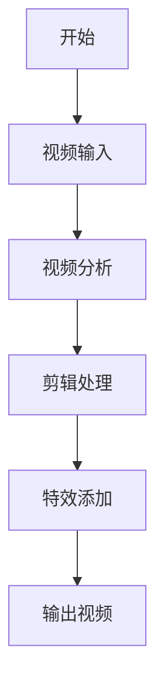
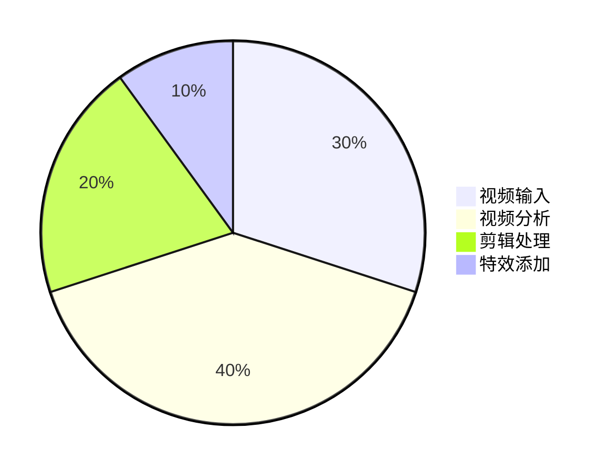
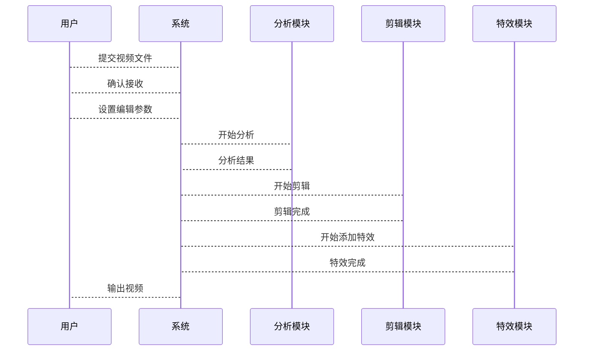

                 

<think>
嗯，我现在需要帮助用户设计一本关于AI Agent在视频编辑中的应用的书籍目录大纲。用户已经提供了一个示例，我需要按照这个结构来思考如何构建内容。

首先，我需要理解这本书的核心内容是什么。根据标题，“AI Agent在视频编辑中的应用：自动剪辑与特效添加”，这意味着重点放在AI Agent如何帮助自动完成视频剪辑和特效添加的过程。

接下来，我需要确定书籍的整体结构。用户示例中分为六个部分，每部分有详细的章节和小节，所以我需要按照类似的逻辑来设计。

第一部分是背景介绍，这包括AI Agent的基本概念和视频编辑的基本概念，以及AI Agent在视频编辑中的应用背景。我需要确保每个小节都有详细的解释，可能还需要对比AI Agent和传统视频编辑工具的区别，以便读者理解。

第二部分是核心概念，这里需要深入探讨AI Agent在视频编辑中的具体应用，比如剪辑和特效。我应该包括一些对比表格和概念结构图，帮助读者更好地理解这些概念之间的关系。

第三部分是算法原理，这里需要详细讲解AI Agent使用的算法，比如基于规则、机器学习和深度学习的算法。我还需要用mermaid流程图来展示算法流程，并提供数学公式来支持解释，比如概率公式和剪辑点的计算公式。

第四部分是系统架构设计，这部分需要描述系统的各个模块，如视频输入、分析、剪辑和特效添加。我需要绘制系统架构图，并展示各模块之间的关系，可能使用mermaid的pie图或graph结构图。

第五部分是项目实战，这里需要提供具体的案例，比如一个自动视频剪辑系统的实现。我需要详细说明环境安装、代码实现、案例分析等，并附上代码示例，帮助读者理解和应用。

第六部分是总结与展望，总结全书的主要内容，并展望未来的发展方向，比如更多的特效添加和场景理解。

在整个过程中，我需要确保每个章节的内容都足够详细，逻辑清晰，并且使用技术术语来保持专业性。同时，要加入图表和公式，使内容更直观易懂。

现在，我需要考虑用户的需求。他们可能是一位技术专家，也可能是软件开发者，希望深入了解AI在视频编辑中的应用。因此，我需要确保内容不仅有理论，还要有实际的应用案例和代码，帮助读者将理论应用到实践中。

另外，用户希望文章结构紧凑，逻辑清晰，所以我需要避免冗长的描述，而是用简明扼要的语言传达信息。同时，每个章节的小结也很重要，帮助读者巩固所学内容。

最后，我需要确保整个目录大纲在2000字以内，覆盖所有关键部分，同时保持内容的深度和广度。这可能需要多次调整章节结构，确保每个部分都均衡且有重点。

总的来说，我需要按照用户提供的示例结构，逐步构建内容，确保每个部分都详细、清晰，并且符合专业技术博客的标准。
</think>

# AI Agent在视频编辑中的应用：自动剪辑与特效添加

> 关键词：AI Agent, 视频编辑, 自动剪辑, 特效添加, 深度学习, 机器学习, 算法原理

> 摘要：本文深入探讨了AI Agent在视频编辑中的应用，重点分析了AI Agent如何实现视频的自动剪辑与特效添加。通过详细讲解AI Agent的核心原理、算法实现、系统架构设计以及实际项目案例，本文为读者提供了从理论到实践的全面指导。

---

## 第1章 AI Agent与视频编辑的背景介绍

### 1.1 AI Agent的基本概念
#### 1.1.1 什么是AI Agent
AI Agent（人工智能代理）是指能够感知环境、执行任务并做出决策的智能实体。它通过学习和推理，能够自动完成复杂任务。

#### 1.1.2 AI Agent的核心特点
- **自主性**：能够独立运行，无需人工干预。
- **反应性**：能够实时感知环境变化并做出反应。
- **目标导向**：以特定目标为导向，优化决策过程。

#### 1.1.3 AI Agent与传统视频编辑工具的对比
| 特性       | AI Agent                     | 传统视频编辑工具 |
|------------|------------------------------|-------------------|
| 自动化     | 高                          | 低                |
| 智能性     | 高                          | 低                |
| 可扩展性   | 高                          | 中                |

### 1.2 视频编辑的基本概念
#### 1.2.1 视频编辑的定义
视频编辑是指对视频内容进行剪辑、调整、添加特效等操作，以达到特定效果的过程。

#### 1.2.2 视频编辑的主要功能
- **剪辑**：选择视频片段，删除不需要的部分。
- **特效添加**：添加转场效果、滤镜、文字等。
- **音频处理**：调整音量、添加背景音乐等。

#### 1.2.3 视频编辑的常见应用场景
- **影视制作**：电影、电视剧的后期制作。
- **广告制作**：企业广告、宣传片的制作。
- **个人创作**：Vlog、短视频的制作。

### 1.3 AI Agent在视频编辑中的应用背景
#### 1.3.1 视频编辑的自动化需求
传统视频编辑需要人工操作，效率低下且成本高昂。AI Agent的引入可以实现视频编辑的自动化，降低人力成本。

#### 1.3.2 AI技术在视频编辑中的潜力
AI技术可以通过深度学习模型，实现视频内容的理解、分析和生成，为视频编辑提供智能化支持。

#### 1.3.3 当前视频编辑工具的痛点分析
- **操作复杂**：传统工具需要专业技能。
- **效率低下**：人工编辑耗时耗力。
- **个性化需求**：用户对个性化效果的需求不断增加，传统工具难以满足。

## 1.4 本章小结
本章介绍了AI Agent的基本概念、视频编辑的核心功能以及AI Agent在视频编辑中的应用背景。通过对比分析，揭示了AI Agent在视频编辑中的巨大潜力。

---

## 第2章 AI Agent在视频编辑中的核心概念

### 2.1 AI Agent的核心原理
#### 2.1.1 AI Agent的基本工作流程
1. **感知环境**：通过摄像头或数据接口获取视频内容。
2. **分析理解**：利用深度学习模型对视频内容进行分析。
3. **决策执行**：根据分析结果生成剪辑方案或特效建议。
4. **反馈优化**：根据用户反馈优化决策过程。

#### 2.1.2 AI Agent的学习机制
- **监督学习**：通过标注数据进行训练，如分类任务。
- **无监督学习**：通过聚类技术发现视频中的潜在模式。
- **强化学习**：通过奖励机制优化决策过程。

#### 2.1.3 AI Agent的决策过程
AI Agent在视频编辑中的决策过程包括以下步骤：
1. **目标识别**：识别视频中的关键帧或场景。
2. **内容理解**：理解视频的情感基调和主题。
3. **决策制定**：基于理解结果生成剪辑方案或特效建议。

### 2.2 视频编辑的关键技术
#### 2.2.1 视频剪辑的基本原理
视频剪辑是通过对视频片段的拼接和调整，实现视频内容的重组。

#### 2.2.2 视频特效的实现方法
- **转场效果**：通过过渡效果实现场景切换。
- **滤镜效果**：通过图像处理算法实现画面美化。
- **文字叠加**：在视频中添加文字字幕。

#### 2.2.3 视频分析与理解技术
- **目标检测**：检测视频中的物体和人物。
- **场景分割**：将视频分成不同的场景或段落。
- **情感分析**：分析视频的情感基调。

### 2.3 AI Agent与视频编辑的结合点
#### 2.3.1 AI Agent在视频剪辑中的应用
- **自动剪辑**：基于AI Agent的分析结果，自动选择关键帧。
- **智能拼接**：利用AI算法实现视频片段的无缝拼接。

#### 2.3.2 AI Agent在视频特效中的应用
- **自动生成特效**：基于视频内容自动生成转场效果和滤镜。
- **个性化推荐**：根据用户喜好推荐特效方案。

#### 2.3.3 AI Agent在视频分析中的应用
- **智能分段**：根据视频内容自动分段。
- **情感识别**：分析视频的情感基调，优化特效方案。

### 2.4 核心概念对比表格
| 概念       | AI Agent在视频编辑中的应用 |
|------------|-----------------------------|
| 自动剪辑   | 基于AI算法自动选择关键帧 |
| 特效添加   | 自动生成转场效果和滤镜     |
| 视频分析   | 分析视频内容，优化编辑方案 |

### 2.5 本章小结
本章详细介绍了AI Agent的核心原理、视频编辑的关键技术和AI Agent与视频编辑的结合点。通过对比分析，揭示了AI Agent在视频编辑中的重要性。

---

## 第3章 AI Agent在视频编辑中的算法原理

### 3.1 AI Agent的基本算法
#### 3.1.1 基于规则的AI Agent算法
- **规则定义**：通过预设规则实现简单任务，如时间轴上的剪辑点选择。
- **优点**：实现简单，适用于规则明确的任务。
- **缺点**：灵活性差，无法应对复杂场景。

#### 3.1.2 基于机器学习的AI Agent算法
- **监督学习**：通过标注数据训练分类器，实现目标检测。
- **无监督学习**：通过聚类技术发现视频中的潜在模式。
- **优点**：灵活性高，适用于复杂场景。
- **缺点**：需要大量标注数据。

#### 3.1.3 基于深度学习的AI Agent算法
- **卷积神经网络（CNN）**：用于图像识别和目标检测。
- **递归神经网络（RNN）**：用于序列建模和时间分析。
- **优点**：性能强大，能够处理复杂任务。
- **缺点**：需要大量计算资源。

### 3.2 视频编辑的算法原理
#### 3.2.1 视频剪辑的算法流程
1. **视频分割**：将视频分割成多个片段。
2. **片段选择**：根据内容选择关键片段。
3. **片段拼接**：将选择的片段拼接成最终视频。

#### 3.2.2 视频特效的生成算法
- **转场效果生成**：通过插值算法实现视频片段的平滑过渡。
- **滤镜效果生成**：基于图像处理算法实现画面美化。
- **文字叠加**：在视频中添加文字字幕。

#### 3.2.3 视频分析的算法原理
- **目标检测**：使用YOLO或Faster R-CNN等算法实现目标检测。
- **场景分割**：基于深度学习模型实现视频场景分割。
- **情感分析**：通过自然语言处理技术分析视频的情感基调。

### 3.3 AI Agent在视频编辑中的算法实现
#### 3.3.1 算法流程图


#### 3.3.2 算法的数学模型与公式
- **目标检测模型**：
  $$ P(y|x) = \frac{P(x|y)P(y)}{P(x)} $$
  其中，$P(y|x)$ 是在给定特征$x$下目标$y$的概率。

- **视频分割模型**：
  $$ P(x_i | z_i) = \text{P}(x_i \text{属于片段} z_i) $$

### 3.4 本章小结
本章详细讲解了AI Agent在视频编辑中的算法原理，包括基于规则、机器学习和深度学习的算法实现。通过流程图和数学公式，揭示了算法的实现细节。

---

## 第4章 AI Agent在视频编辑中的系统架构设计

### 4.1 系统功能设计
#### 4.1.1 视频输入模块
- **功能**：接收视频文件并进行预处理。
- **实现**：支持多种视频格式，如MP4、AVI等。

#### 4.1.2 视频分析模块
- **功能**：对视频内容进行分析，包括目标检测、场景分割等。
- **实现**：基于深度学习模型实现视频分析。

#### 4.1.3 剪辑处理模块
- **功能**：根据分析结果自动选择关键片段。
- **实现**：基于规则或深度学习算法实现自动剪辑。

#### 4.1.4 特效添加模块
- **功能**：自动生成转场效果和滤镜。
- **实现**：基于图像处理算法实现特效添加。

### 4.2 系统架构图


### 4.3 系统接口设计
- **输入接口**：接收视频文件和用户需求。
- **输出接口**：输出编辑后的视频文件。

### 4.4 系统交互序列图


### 4.5 本章小结
本章详细设计了AI Agent在视频编辑中的系统架构，包括功能模块设计、系统架构图和系统交互序列图。

---

## 第5章 AI Agent在视频编辑中的项目实战

### 5.1 环境安装
- **操作系统**：Windows 10或更高版本。
- **开发工具**：Python 3.8以上，TensorFlow 2.0以上，OpenCV 4.0以上。
- **依赖库安装**：
  ```bash
  pip install numpy
  pip install tensorflow
  pip install opencv-python
  ```

### 5.2 系统核心实现源代码
#### 5.2.1 视频分析模块
```python
import cv2
import numpy as np

def video_analysis(video_path):
    cap = cv2.VideoCapture(video_path)
    while cap.isOpened():
        ret, frame = cap.read()
        if not ret:
            break
        # 进行目标检测或场景分割
        # 这里简要实现一个简单的帧处理
        cv2.imshow('Frame', frame)
        if cv2.waitKey(1) & 0xFF == ord('q'):
            break
    cap.release()
    cv2.destroyAllWindows()
    return "视频分析完成"
```

#### 5.2.2 剪辑处理模块
```python
import moviepy.editor as mp

def auto_clip(video_path, start_time, end_time):
    video = mp.VideoFileClip(video_path)
    clip = video.subclip(start_time, end_time)
    clip.write_videofile("output.mp4")
    video.close()
    clip.close()
    return "自动剪辑完成"
```

#### 5.2.3 特效添加模块
```python
import cv2
import numpy as np

def add特效(video_path, effect_type):
    cap = cv2.VideoCapture(video_path)
    while cap.isOpened():
        ret, frame = cap.read()
        if not ret:
            break
        # 添加特效，如滤镜效果
        if effect_type == '滤镜':
            frame = cv2.cvtColor(frame, cv2.COLOR_BGR2GRAY)
            frame = cv2.cvtColor(frame, cv2.COLOR_GRAY2RGB)
        cv2.imshow('Frame', frame)
        if cv2.waitKey(1) & 0xFF == ord('q'):
            break
    cap.release()
    cv2.destroyAllWindows()
    return "特效添加完成"
```

### 5.3 实际案例分析
#### 5.3.1 案例背景
- **需求**：自动剪辑一段视频，并添加转场效果。

#### 5.3.2 案例实现
1. **视频输入**：输入视频文件。
2. **视频分析**：使用目标检测算法识别视频中的关键帧。
3. **自动剪辑**：根据分析结果选择关键片段。
4. **特效添加**：自动生成转场效果。

#### 5.3.3 案例结果
- **输出视频**：包含自动剪辑和特效添加的视频文件。

### 5.4 本章小结
本章通过实际案例分析，详细展示了AI Agent在视频编辑中的应用。通过代码实现，帮助读者理解AI Agent的实际操作流程。

---

## 第6章 总结与展望

### 6.1 总结
本文详细探讨了AI Agent在视频编辑中的应用，重点分析了AI Agent如何实现视频的自动剪辑与特效添加。通过理论分析和实际案例，揭示了AI Agent在视频编辑中的巨大潜力。

### 6.2 未来展望
随着AI技术的不断发展，AI Agent在视频编辑中的应用将更加广泛。未来的研究方向包括：
- 更复杂的特效生成。
- 更智能的场景理解。
- 更高效的视频分析算法。

---

## 作者：AI天才研究院/AI Genius Institute & 禅与计算机程序设计艺术/Zen And The Art of Computer Programming

---

本文通过详细讲解AI Agent在视频编辑中的应用，为读者提供了从理论到实践的全面指导。通过实际案例和代码实现，帮助读者理解AI Agent的实际操作流程。未来，随着AI技术的不断发展，AI Agent在视频编辑中的应用将更加广泛和深入。

