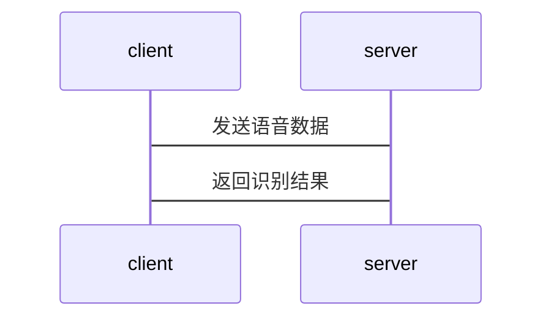

                 

<think>
好的，现在我需要帮助用户撰写一篇关于《AI Agent在语音识别中的方言处理》的技术博客文章。用户已经提供了一个详细的目录大纲，并希望我逐步分析和思考如何撰写这篇文章。

首先，我需要理解文章的结构和内容。文章分为背景与基础、算法与数学模型、系统架构、项目实战以及总结等多个部分。每个部分都有详细的子章节，涵盖从概念到实际应用的各个方面。

接下来，我将按照目录结构，逐一分析每个章节的内容，确保每个部分都详细且符合技术博客的要求。首先，背景部分需要介绍方言处理的重要性，然后是AI Agent的基本原理，接着是具体算法的应用，如支持向量机和神经网络，再深入数学模型的讲解，最后是系统设计和项目实战。

在撰写过程中，我需要确保内容逻辑清晰，技术术语准确，并且使用适当的图表和代码示例来增强可读性。同时，要注意保持文章的结构和格式，符合用户的要求。

现在，我将开始逐步撰写每个部分，确保每个章节都涵盖必要的内容，并进行详细的分析和讲解。
</think>

# AI Agent在语音识别中的方言处理

> 关键词：AI Agent，语音识别，方言处理，支持向量机，神经网络，自然语言处理

> 摘要：本文探讨了AI Agent在语音识别中的方言处理问题，分析了方言处理的重要性及其在语音识别中的挑战。通过介绍AI Agent的基本原理、支持向量机和神经网络在方言识别中的应用，结合数学模型和系统架构设计，详细讲解了如何构建一个支持方言处理的AI Agent系统，并通过实战案例展示了实现过程。最后，总结了方言处理的未来发展方向和优化建议。

---

# 第一部分: AI Agent与语音识别的背景与基础

## 第1章: 方言处理在语音识别中的重要性

### 1.1 方言处理的背景与问题背景

#### 1.1.1 方言在语音识别中的挑战

方言是汉语的重要组成部分，由于地域差异，中国有多种方言，如普通话、粤语、吴语、闽南语等。方言在词汇、语法、发音等方面存在显著差异，这给语音识别带来了挑战。例如，某些方言中的声调和发音与普通话不同，可能导致识别错误。

此外，方言的多样性使得训练通用的语音识别模型更加复杂。传统的语音识别系统主要基于普通话训练，难以准确识别方言，尤其是在资源有限的地区，方言识别的需求更为迫切。

#### 1.1.2 方言处理的必要性与应用场景

方言处理的必要性体现在以下几个方面：
1. **用户体验**：方言识别能够提高用户在不同地区的使用体验，尤其是在方言使用频繁的地区。
2. **多语言支持**：方言处理使得语音识别系统能够支持更多语言，扩大应用范围。
3. **智能化需求**：随着AI技术的发展，用户期望语音助手能够理解并处理更多方言。

应用场景包括：
- 智能音箱：支持方言识别，方便不同地区用户使用。
- 手机语音助手：提供方言识别功能，增强用户体验。
- 公共服务：如银行、交通等领域，方言识别能够帮助不同方言的用户进行沟通。

#### 1.1.3 方言处理的边界与外延

方言处理的边界在于仅处理语言中的语音部分，不涉及文字转换或其他语言处理。外延则包括方言的识别、理解和生成，以及方言之间的转换。

### 1.2 方言处理的核心概念与联系

#### 1.2.1 方言处理的核心概念

- **方言识别**：通过语音识别技术，将方言语音转换为文字。
- **方言生成**：将文本生成对应的方言语音。
- **方言理解**：理解方言中的语义，以便进行进一步的处理。

#### 1.2.2 方言与语音识别的关系

方言是语音识别的一个重要方面，语音识别系统需要能够识别不同方言的语音信号。方言的多样性增加了语音识别的复杂性，但同时也为系统的泛化能力提出了更高的要求。

#### 1.2.3 方言处理的ER实体关系图

```mermaid
entity 方言处理 {
  id 方言ID
  name 方言名称
  attributes 包括发音、语法、词汇等
  related_to 语音识别系统
}
```

---

## 第2章: AI Agent的基本原理与应用

### 2.1 AI Agent的定义与特点

#### 2.1.1 AI Agent的定义

AI Agent（人工智能代理）是指能够感知环境并采取行动以实现目标的智能实体。它能够通过传感器获取信息，利用计算模型进行决策，并通过执行器采取行动。

#### 2.1.2 AI Agent的核心特点

- **自主性**：能够独立决策和行动。
- **反应性**：能够实时感知环境并做出反应。
- **目标导向**：所有行动都以实现特定目标为导向。
- **学习能力**：能够通过经验改进性能。

#### 2.1.3 AI Agent与传统算法的区别

AI Agent不仅仅是算法的实现，更是一个动态的、能够与环境交互的实体。传统算法通常针对特定问题，而AI Agent能够根据环境变化动态调整策略。

### 2.2 语音识别的基本原理

#### 2.2.1 语音识别的定义

语音识别是将语音信号转换为对应的文本或命令的过程。它涉及信号处理、特征提取、模式识别和语言模型等多个步骤。

#### 2.2.2 语音识别的关键技术

- **特征提取**：将语音信号转换为可识别的特征向量。
- **声学模型**：用于识别特征向量对应的语音单位（如音节或单词）。
- **语言模型**：用于计算候选词序列的概率，提高识别的准确性。

#### 2.2.3 语音识别的流程

1. 采集语音信号。
2. 对语音信号进行预处理（如降噪）。
3. 提取特征向量（如MFCC）。
4. 通过声学模型生成候选词序列。
5. 使用语言模型进行概率计算，输出最终结果。

---

# 第二部分: AI Agent在方言处理中的算法与数学模型

## 第3章: 支持向量机在方言识别中的应用

### 3.1 支持向量机的基本原理

#### 3.1.1 支持向量机的定义

支持向量机（Support Vector Machine, SVM）是一种监督学习算法，用于分类和回归分析。它通过构建一个超平面，将数据点分为两类。

#### 3.1.2 支持向量机的数学模型

SVM的目标是最小化经验风险，同时最大化类别间隔。数学模型如下：

$$
\text{目标函数：} \min_{w,b,\xi} \frac{1}{2}||w||^2 + C \sum_{i=1}^n \xi_i
$$

$$
\text{约束条件：} y_i (w \cdot x_i + b) \geq 1 - \xi_i, \xi_i \geq 0
$$

其中，$C$ 是惩罚参数，$\xi_i$ 是松弛变量。

#### 3.1.3 支持向量机的优缺点

优点：
- 理论上有较好的泛化能力。
- 能处理非线性问题，通过核函数扩展。

缺点：
- 对大规模数据的处理能力较弱。
- 需要手动选择合适的核函数和参数。

### 3.2 支持向量机在方言识别中的应用

#### 3.2.1 方言识别中的特征提取

特征提取是语音识别的关键步骤，常用的特征包括MFCC和倒谱。例如，MFCC提取语音的时域和频域特征。

#### 3.2.2 支持向量机的训练与优化

训练过程包括：
1. 收集方言语音数据。
2. 提取特征向量。
3. 划分训练集和测试集。
4. 使用SVM进行训练，并调整参数。

优化方法包括：
- 调整惩罚参数 $C$。
- 使用交叉验证选择最佳核函数。

#### 3.2.3 方言识别的性能评估

评估指标包括准确率、召回率和F1值。通过混淆矩阵可以分析模型在不同方言间的识别效果。

---

## 第4章: 神经网络在方言识别中的应用

### 4.1 神经网络的基本原理

#### 4.1.1 神经网络的定义

神经网络（Neural Network, NN）是一种模拟人脑结构和功能的计算模型，由神经元和层组成。

#### 4.1.2 神经网络的数学模型

神经网络的核心是通过多层非线性变换，将输入映射到输出。例如，感知机模型如下：

$$
y = f(w \cdot x + b)
$$

其中，$f$ 是激活函数，如Sigmoid或ReLU。

#### 4.1.3 神经网络的优缺点

优点：
- 能处理复杂非线性问题。
- 自适应能力强。

缺点：
- 训练时间较长。
- 对硬件要求较高。

### 4.2 神经网络在方言识别中的应用

#### 4.2.1 方言识别中的深度学习模型

常用的模型包括卷积神经网络（CNN）和循环神经网络（RNN）。例如，使用CNN提取时频特征，使用LSTM处理时序信息。

#### 4.2.2 神经网络的训练与优化

训练过程包括：
1. 数据预处理（归一化、分批次）。
2. 构建模型并编译（选择优化器和损失函数）。
3. 使用训练数据进行迭代训练。
4. 调整超参数（学习率、批量大小）。

优化方法包括：
- 使用早停法防止过拟合。
- 增加数据增强技术。

#### 4.2.3 方言识别的性能优化

通过数据增强、迁移学习和模型集成等方法，可以进一步提高方言识别的准确率。

---

# 第三部分: 系统分析与架构设计

## 第5章: 方言处理系统的架构设计

### 5.1 问题场景介绍

方言识别系统需要处理多种方言，支持实时识别和离线处理。

### 5.2 系统功能设计

系统功能包括：
- 多方言识别：支持多种方言的语音识别。
- 识别结果输出：返回识别的文本或命令。
- 语音合成：将文本转换为对应方言的语音。

### 5.3 系统架构设计

```mermaid
client
    ├── 发送语音请求
    └── 接收识别结果

server
    ├── 接收语音数据
    ├── 提取特征
    ├── 识别方言
    └── 返回结果
```

### 5.4 系统接口设计

接口设计包括：
- **输入接口**：接收语音数据。
- **输出接口**：返回识别结果或语音合成结果。

### 5.5 系统交互设计



---

## 第6章: 方言处理系统的实现

### 6.1 项目实战

#### 6.1.1 环境配置

安装必要的库，如Python的librosa、scikit-learn、Keras等。

#### 6.1.2 系统核心实现

代码示例：

```python
import librosa
from sklearn.svm import SVC
import keras

# 加载语音数据
audio_file = "mandarin.wav"
y, sr = librosa.load(audio_file, sr=None, duration=3)

# 提取MFCC特征
mfccs = librosa.feature.mfcc(y, sr=sr)

# 训练SVM模型
model = SVC(C=1, kernel='rb

