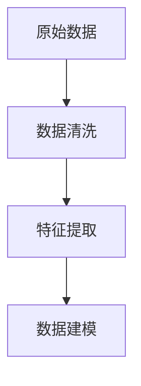
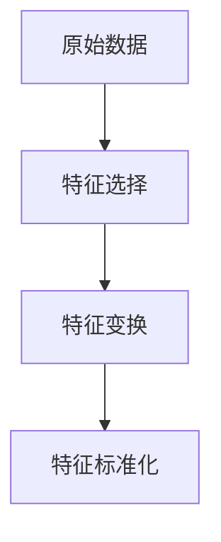
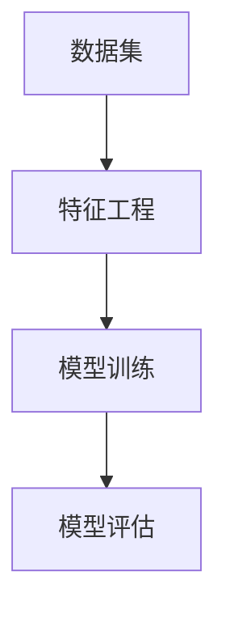
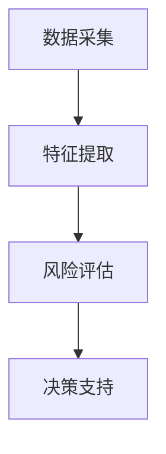

                 


# 《AI Agent在金融风险分析中的应用》

> 关键词：AI Agent，金融风险分析，风险评估，机器学习，自然语言处理，实时监控

> 摘要：本文深入探讨了AI Agent在金融风险分析中的应用，从基本概念到实际应用，结合理论与实践，详细分析了AI Agent在金融风险预测、实时监控和决策支持中的作用。文章通过案例分析和系统设计，展示了AI Agent如何帮助金融机构提高风险分析的效率和准确性，并展望了未来的发展趋势。

----------------------------------------------------------------

# 第一部分: AI Agent与金融风险分析的背景与基础

## 第1章: AI Agent的定义与核心概念

### 1.1 AI Agent的基本概念

#### 1.1.1 AI Agent的定义与特点

AI Agent（人工智能代理）是指能够感知环境、自主决策并执行任务的智能实体。AI Agent的核心特点包括：

1. **自主性**：能够在没有外部干预的情况下独立运作。
2. **反应性**：能够实时感知环境变化并做出响应。
3. **目标导向性**：具备明确的目标导向能力，能够优化决策以实现目标。
4. **学习能力**：能够通过数据和经验不断优化自身的模型和策略。

**AI Agent的特点对比表：**

| 特性          | 描述                                   |
|---------------|--------------------------------------|
| 自主性        | 独立执行任务，无需外部干预           |
| 反应性        | 能够实时感知环境并做出反应           |
| 目标导向性    | 具备明确的目标，优化决策以实现目标   |
| 学习能力      | 通过数据和经验不断优化自身模型       |

#### 1.1.2 AI Agent的分类与应用场景

AI Agent可以根据功能和应用场景分为以下几类：

1. **简单反射型AI Agent**：基于规则的简单响应，适用于简单的决策任务。
2. **基于模型的AI Agent**：基于内部模型进行推理和决策，适用于复杂的任务。
3. **目标驱动型AI Agent**：以实现特定目标为导向，优化决策过程。
4. **学习增强型AI Agent**：通过机器学习算法不断优化自身模型。

**AI Agent的应用场景：**

- **金融领域**：风险评估、投资决策、实时监控。
- **医疗领域**：疾病诊断、治疗方案优化。
- **制造业**：生产过程优化、质量控制。

#### 1.1.3 AI Agent的核心属性与特征对比表

| 属性          | 描述                                   |
|---------------|--------------------------------------|
| 感知能力      | 能够通过传感器或数据源获取环境信息   |
| 决策能力      | 基于感知信息做出最优决策             |
| 执行能力      | 执行决策并输出结果                   |
| 学习能力      | 通过反馈不断优化自身模型             |

#### 1.1.4 AI Agent的ER实体关系图（Mermaid）

```mermaid
er
actor: 用户
agent: AI Agent
environment: 环境

actor --> agent: 请求服务
agent --> environment: 感知数据
agent --> environment: 执行任务
```

---

## 第2章: 金融风险分析的背景与挑战

### 2.1 金融风险分析的基本概念

#### 2.1.1 金融风险的定义与分类

金融风险是指在金融活动中，由于各种不确定因素的影响，可能导致资金损失的可能性。金融风险主要分为以下几类：

1. **市场风险**：由于市场价格波动导致的损失。
2. **信用风险**：由于债务人违约导致的损失。
3. **流动性风险**：由于资产无法快速变现导致的损失。
4. **操作风险**：由于内部操作失误导致的损失。

#### 2.1.2 金融风险分析的常用方法

常用的金融风险分析方法包括：

1. **VaR（Value at Risk）**：计算在一定置信水平下，资产组合的最大可能损失。
2. **CVaR（Conditional Value at Risk）**：计算在VaR的基础上，超过VaR水平的平均损失。
3. **蒙特卡洛模拟**：通过模拟市场波动来评估风险。

#### 2.1.3 传统金融风险分析的局限性

传统金融风险分析方法的局限性主要体现在以下几个方面：

1. **数据依赖性**：传统方法依赖于历史数据，无法预测未来的新情况。
2. **计算复杂性**：复杂模型的计算成本较高，难以实时应用。
3. **缺乏动态性**：传统方法难以实时更新模型，难以应对快速变化的市场环境。

### 2.2 AI Agent在金融风险分析中的应用价值

#### 2.2.1 提高风险预测的准确性

AI Agent通过机器学习算法，能够从海量数据中提取特征，并构建高精度的预测模型，显著提高风险预测的准确性。

#### 2.2.2 实现实时风险监控

AI Agent能够实时感知市场变化，并根据实时数据进行风险评估，实现实时风险监控。

#### 2.2.3 优化决策效率

AI Agent通过自动化决策过程，显著优化了金融风险分析的效率，减少了人工干预的时间和成本。

---

## 第3章: AI Agent在金融风险分析中的核心原理

### 3.1 AI Agent的特征提取与数据处理

#### 3.1.1 数据清洗与预处理流程（Mermaid）



#### 3.1.2 特征工程的核心步骤（Mermaid）



### 3.2 AI Agent的风险评估模型构建

#### 3.2.1 模型选择与训练流程（Mermaid）



#### 3.2.2 风险评估的数学模型（Latex公式）

风险评估的核心模型可以表示为：

$$
\text{风险值} = f(\text{特征向量})
$$

其中，$f$ 是机器学习模型，特征向量包含多个金融指标，如市场波动率、信用评分等。

#### 3.2.3 模型优化与调参

模型优化的目标是提高预测准确性和稳定性，通常通过交叉验证和网格搜索等方法进行参数调优。

---

# 第二部分: AI Agent在金融风险分析中的系统设计与实现

## 第4章: AI Agent的风险评估系统设计

### 4.1 问题场景介绍

本文将设计一个基于AI Agent的金融风险评估系统，用于实时监控和预测金融市场中的风险。

### 4.2 系统功能设计

#### 4.2.1 系统功能模块划分

系统主要包括以下几个功能模块：

1. **数据采集模块**：从金融市场获取实时数据。
2. **特征提取模块**：对采集的数据进行特征提取和处理。
3. **风险评估模块**：基于特征向量进行风险评估。
4. **决策支持模块**：根据评估结果提供决策建议。

#### 4.2.2 系统功能流程图（Mermaid）



### 4.3 系统架构设计

#### 4.3.1 系统架构设计（Mermaid）


---

## 第5章: AI Agent的风险评估系统实现

### 5.1 环境安装与配置

#### 5.1.1 环境要求

- 操作系统：Linux/Windows/MacOS
- Python版本：3.8+
- 依赖库：TensorFlow、Pandas、Scikit-learn、Matplotlib

### 5.2 系统核心代码实现

#### 5.2.1 数据采集模块

```python
import pandas as pd
import requests

def fetch_data(api_key):
    url = f"https://api.example.com/financial_data?api_key={api_key}"
    response = requests.get(url)
    data = response.json()
    df = pd.DataFrame(data)
    return df
```

#### 5.2.2 特征提取模块

```python
from sklearn.preprocessing import StandardScaler

def preprocess_data(df):
    # 假设df包含'close_price', 'volume', 'market_cap'等特征
    features = df[['close_price', 'volume', 'market_cap']]
    scaler = StandardScaler()
    features_scaled = scaler.fit_transform(features)
    return features_scaled
```

#### 5.2.3 风险评估模型训练

```python
from tensorflow.keras import models, layers

def build_model(input_dim):
    model = models.Sequential()
    model.add(layers.Dense(64, activation='relu', input_dim=input_dim))
    model.add(layers.Dense(32, activation='relu'))
    model.add(layers.Dense(1, activation='sigmoid'))
    model.compile(optimizer='adam', loss='binary_crossentropy', metrics=['accuracy'])
    return model

# 假设输入维度为3
model = build_model(3)
model.summary()
```

#### 5.2.4 模型训练与评估

```python
import numpy as np
from sklearn.model_selection import train_test_split

# 假设labels是标签数组
X_train, X_test, y_train, y_test = train_test_split(features_scaled, labels, test_size=0.2)

model.fit(X_train, y_train, epochs=100, batch_size=32, validation_data=(X_test, y_test))
```

---

## 第6章: 项目实战与案例分析

### 6.1 项目背景介绍

本文将基于实际的金融市场数据，设计并实现一个AI Agent驱动的金融风险评估系统，用于预测股票市场的波动风险。

### 6.2 项目实现与分析

#### 6.2.1 数据来源与处理

假设我们从某金融数据API获取股票数据，包括开盘价、收盘价、成交量等指标。

#### 6.2.2 模型训练与优化

通过实验对比不同模型的性能，最终选择最优模型进行部署。

### 6.3 项目总结与经验分享

通过本项目，我们验证了AI Agent在金融风险分析中的有效性，并总结了以下几点经验：

1. 数据质量对模型性能的影响至关重要。
2. 模型的可解释性在金融应用中尤为重要。
3. 实时监控需要高效的计算能力和稳定的网络连接。

---

## 第7章: 总结与展望

### 7.1 全文总结

本文详细探讨了AI Agent在金融风险分析中的应用，从基本概念到系统设计，再到实际实现，全面分析了AI Agent在金融风险分析中的价值和优势。

### 7.2 未来展望

随着AI技术的不断发展，AI Agent在金融风险分析中的应用前景广阔，未来可能会在以下几个方面取得进一步突破：

1. **模型的可解释性**：提高模型的透明度，便于金融监管和审计。
2. **多模态数据处理**：结合文本、图像等多种数据源，提升风险分析的准确性。
3. **实时性优化**：通过边缘计算和分布式架构，提升实时监控的效率。

---

# 作者：AI天才研究院/AI Genius Institute & 禅与计算机程序设计艺术 /Zen And The Art of Computer Programming

