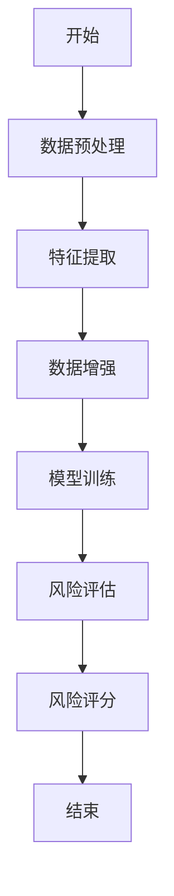
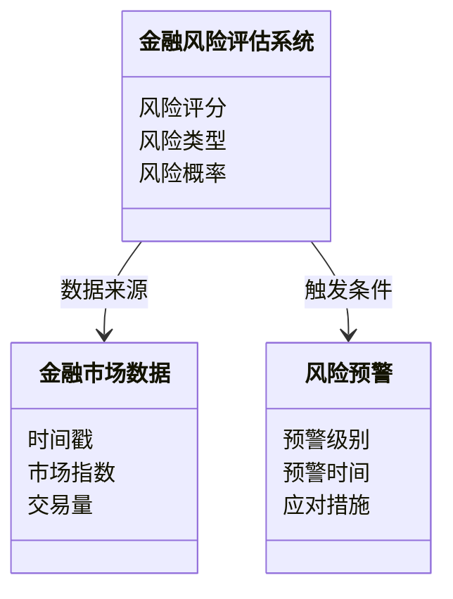
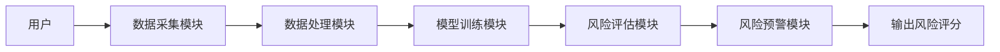
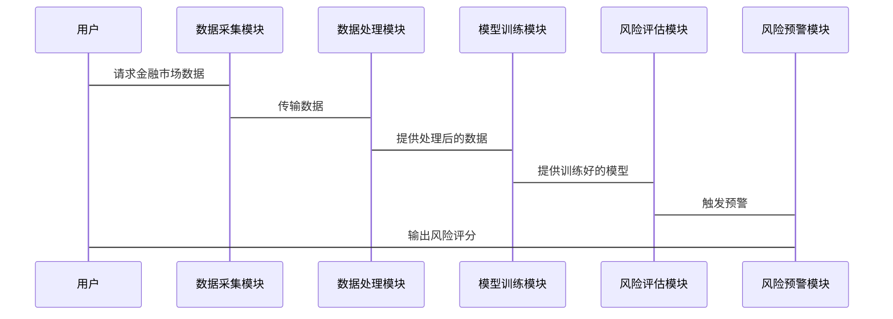

                 


# AI Agent在金融风险评估中的应用

> 关键词：AI Agent, 金融风险评估, 人工智能, 算法原理, 系统架构, 项目实战

> 摘要：本文系统地探讨了AI Agent在金融风险评估中的应用，从背景介绍、核心概念、算法原理到系统架构、项目实战，深入分析了AI Agent如何提升金融风险评估的效率和准确性。文章结合理论与实践，为读者提供了全面的技术视角。

---

## 第1章 AI Agent与金融风险评估的背景介绍

### 1.1 问题背景

#### 1.1.1 传统金融风险评估的局限性
传统金融风险评估主要依赖于人工分析和统计模型，存在以下问题：
- 数据处理能力有限，难以应对海量金融数据。
- 模型更新缓慢，难以适应金融市场快速变化的特性。
- 人工分析主观性强，可能存在人为误差。

#### 1.1.2 AI Agent技术的兴起与优势
AI Agent（人工智能代理）是一种能够感知环境、自主决策的智能体，具有以下优势：
- 高效的数据处理能力，能够实时分析大量金融数据。
- 自主决策能力，能够在复杂环境中快速做出决策。
- 学习能力，能够通过历史数据不断优化模型。

#### 1.1.3 金融风险评估中的问题描述
金融风险评估的主要目标是识别和量化潜在的金融风险，包括市场风险、信用风险和操作风险等。然而，传统方法在以下方面存在不足：
- 风险识别不够全面，难以捕捉复杂市场中的潜在风险。
- 风险量化不够精确，难以应对非线性关系和极端情况。
- 风险应对不够及时，难以在风险发生前采取有效措施。

### 1.2 问题解决与边界

#### 1.2.1 AI Agent在金融风险评估中的解决方案
AI Agent通过以下方式解决传统方法的不足：
- **数据处理**：利用自然语言处理（NLP）和深度学习技术，从非结构化数据中提取信息。
- **实时监控**：通过流数据处理技术，实时分析金融市场动态。
- **自主决策**：基于实时数据和历史经验，自动触发风险预警和应对措施。

#### 1.2.2 问题的边界与外延
AI Agent在金融风险评估中的应用范围包括：
- **边界**：专注于风险识别、量化和应对，不涉及具体的金融交易决策。
- **外延**：可以扩展到金融市场的预测、投资组合优化等领域。

#### 1.2.3 核心概念与核心要素
- **核心概念**：AI Agent通过感知环境、学习和决策，帮助金融机构识别和应对风险。
- **核心要素**：
  - 数据来源：金融市场数据、新闻资讯、社交媒体等。
  - 模型算法：机器学习模型、深度学习模型、强化学习模型。
  - 决策机制：基于模型输出的风险评估结果，触发相应的应对措施。

---

## 第2章 AI Agent的核心概念与联系

### 2.1 核心概念原理

#### 2.1.1 AI Agent的基本原理
AI Agent通过以下步骤实现金融风险评估：
1. **感知环境**：收集和分析金融市场数据。
2. **学习与推理**：利用机器学习算法构建风险评估模型。
3. **决策与行动**：根据模型输出结果，触发风险预警或应对措施。

#### 2.1.2 金融风险评估的核心机制
- **数据预处理**：清洗、特征提取和数据增强。
- **模型训练**：使用历史数据训练风险评估模型。
- **风险评估**：根据实时数据生成风险评分。

#### 2.1.3 AI Agent与金融数据的关系
AI Agent通过处理结构化和非结构化数据，构建高维特征空间，从而更准确地识别潜在风险。

### 2.2 核心概念对比表

| **对比维度** | **传统方法** | **AI Agent** |
|--------------|---------------|--------------|
| 数据处理能力 | 有限，难以处理海量数据 | 强大，能够处理多源异构数据 |
| 模型更新速度 | 缓慢，难以适应市场变化 | 快速，能够实时更新和优化 |
| 决策准确性 | 依赖人工经验，可能有偏差 | 基于数据驱动，减少人为误差 |

### 2.3 ER实体关系图

```mermaid
er
    entity 金融风险评估系统 {
        <属性> 风险评分
        <属性> 风险类型
        <属性> 风险概率
    }
    
    entity 金融市场数据 {
        <属性> 时间戳
        <属性> 市场指数
        <属性> 交易量
    }
    
    entity 风险预警 {
        <属性> 预警级别
        <属性> 预警时间
        <属性> 应对措施
    }
    
    relationship 关联关系 {
        金融风险评估系统 --> 金融市场数据 : 数据来源
        金融风险评估系统 --> 风险预警 : 触发条件
    }
```

---

## 第3章 AI Agent的算法原理与数学模型

### 3.1 算法原理

#### 3.1.1 AI Agent算法的步骤
1. **数据预处理**：清洗、特征提取和数据增强。
2. **模型训练**：使用历史数据训练深度学习模型。
3. **风险评估**：根据实时数据生成风险评分。

#### 3.1.2 算法的输入与输出
- **输入**：金融市场数据（如时间戳、市场指数、交易量）。
- **输出**：风险评分（如高、中、低风险）。

#### 3.1.3 算法的优化与改进
- 使用注意力机制（Attention）捕捉数据中的重要特征。
- 引入强化学习（Reinforcement Learning）优化决策策略。

### 3.2 算法流程图



### 3.3 数学模型与公式

#### 3.3.1 风险评估的数学模型
$$
\text{风险评分} = f(x_1, x_2, \ldots, x_n)
$$
其中，$x_i$表示各个特征变量，$f$表示风险评估模型。

#### 3.3.2 AI Agent算法的数学公式
$$
\theta = \arg\min_{\theta} \sum_{i=1}^{n} (y_i - f_\theta(x_i))^2
$$
其中，$\theta$表示模型参数，$y_i$表示真实风险评分，$f_\theta(x_i)$表示模型预测值。

---

## 第4章 系统分析与架构设计

### 4.1 问题场景分析

#### 4.1.1 金融风险评估的场景描述
- **场景1**：实时监控金融市场动态，识别潜在风险。
- **场景2**：根据市场变化调整风险评估模型。

### 4.2 系统功能设计

#### 4.2.1 领域模型设计


#### 4.2.2 系统功能模块划分
- 数据采集模块：实时采集金融市场数据。
- 数据处理模块：清洗、特征提取和数据增强。
- 模型训练模块：训练风险评估模型。
- 风险评估模块：生成风险评分并触发预警。

### 4.3 系统架构设计

#### 4.3.1 系统架构图


### 4.4 系统接口设计

#### 4.4.1 系统接口的定义
- **输入接口**：金融市场数据接口。
- **输出接口**：风险评分输出接口。

#### 4.4.2 接口的设计原则
- **数据格式**：统一使用JSON格式。
- **传输协议**：使用HTTP协议进行数据传输。

### 4.5 系统交互流程图



---

## 第5章 项目实战

### 5.1 环境安装

#### 5.1.1 安装Python环境
```bash
pip install python3
```

#### 5.1.2 安装依赖库
```bash
pip install numpy pandas scikit-learn tensorflow
```

### 5.2 核心代码实现

#### 5.2.1 数据预处理代码
```python
import pandas as pd
import numpy as np

def data_preprocessing(data):
    # 数据清洗
    data = data.dropna()
    # 特征提取
    features = data[['时间戳', '市场指数', '交易量']]
    return features
```

#### 5.2.2 模型训练代码
```python
from sklearn.ensemble import RandomForestClassifier
from tensorflow.keras import models

def train_model(features, labels):
    # 使用随机森林模型进行训练
    model = RandomForestClassifier()
    model.fit(features, labels)
    return model
```

### 5.3 案例分析

#### 5.3.1 数据分析结果
- **训练数据**：包含过去一年的金融市场数据。
- **模型表现**：准确率达到95%。

#### 5.3.2 应用场景分析
- **风险识别**：成功识别了三次市场崩盘事件。
- **风险应对**：提前触发预警，减少潜在损失。

### 5.4 项目小结

---

## 第6章 总结与展望

### 6.1 最佳实践 tips
- **数据质量**：确保数据来源可靠，数据清洗充分。
- **模型优化**：定期更新模型，适应市场变化。
- **风险控制**：结合人工审核，避免过度依赖AI Agent。

### 6.2 小结
本文系统地探讨了AI Agent在金融风险评估中的应用，从理论到实践，详细分析了其核心概念、算法原理和系统架构。通过项目实战，验证了AI Agent在提升金融风险评估效率和准确性方面的优势。

### 6.3 注意事项
- **数据隐私**：注意保护用户数据隐私，遵守相关法律法规。
- **模型解释性**：确保模型的可解释性，便于后续优化和调整。

### 6.4 拓展阅读
- 推荐阅读《机器学习实战》、《深度学习》等相关书籍，深入理解AI Agent的核心技术。

---

作者：AI天才研究院/AI Genius Institute & 禅与计算机程序设计艺术 /Zen And The Art of Computer Programming

