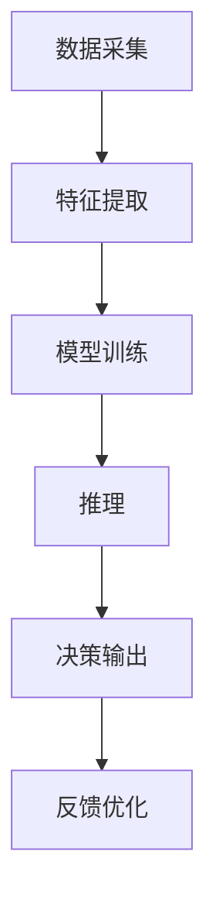
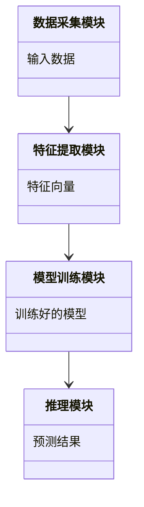
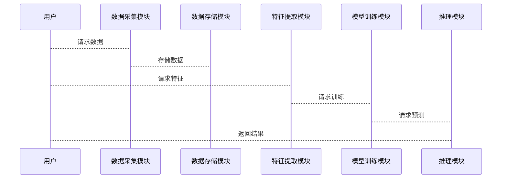

                 


# AI Agent 在预测分析中的应用

> 关键词：AI Agent, 预测分析, 机器学习, 数据挖掘, 算法原理, 系统架构

> 摘要：本文深入探讨了AI Agent在预测分析中的应用，从基本概念到算法原理，从系统架构到项目实战，全面解析AI Agent如何通过数据驱动的方式提升预测分析的准确性和效率。通过实际案例分析，展示了AI Agent在预测分析中的独特优势和广泛的应用前景。

---

## 第1章: AI Agent 与预测分析概述

### 1.1 AI Agent 的基本概念
#### 1.1.1 AI Agent 的定义与分类
- **定义**: AI Agent（人工智能代理）是一种能够感知环境、做出决策并执行任务的智能实体。
- **分类**: 
  1. **简单反射型 Agent**: 基于当前输入做出反应，不依赖历史信息。
  2. **基于模型的反射型 Agent**: 使用内部模型来表示世界状态，并根据模型做出决策。
  3. **目标驱动型 Agent**: 根据目标和优先级选择行动。
  4. **效用驱动型 Agent**: 通过最大化效用函数来优化决策。

#### 1.1.2 AI Agent 的核心特征与优势
- **特征**:
  1. **自主性**: 能够自主决策。
  2. **反应性**: 能够实时感知环境并做出反应。
  3. **目标导向**: 以目标为导向进行决策。
  4. **学习能力**: 能够通过经验改进性能。
- **优势**:
  1. **高效性**: 能够快速处理大量数据。
  2. **准确性**: 通过算法优化提升预测精度。
  3. **适应性**: 能够根据环境变化自适应调整。

#### 1.1.3 预测分析的基本概念与方法
- **预测分析**: 通过历史数据和模型预测未来趋势。
- **方法**:
  1. **时间序列分析**: 基于时间数据的序列模式进行预测。
  2. **回归分析**: 建立变量之间的关系模型。
  3. **机器学习**: 利用算法从数据中学习模式。

### 1.2 AI Agent 在预测分析中的应用背景
#### 1.2.1 数据驱动决策的时代背景
- 数据量的爆炸式增长为预测分析提供了丰富的数据来源。
- AI Agent 的出现解决了传统方法在实时性和准确性上的不足。

#### 1.2.2 传统预测分析的局限性
- **局限性**:
  1. **计算复杂**: 传统方法需要大量人工干预。
  2. **实时性差**: 无法实时响应动态变化。
  3. **泛化能力弱**: 针对特定场景，难以扩展到其他领域。

#### 1.2.3 AI Agent 的独特价值与潜力
- **价值**:
  1. **提高预测效率**: 通过自动化处理提升预测速度。
  2. **增强决策能力**: 基于实时数据做出更精准的决策。
  3. **降低人为错误**: 减少人为因素对预测结果的影响。

### 1.3 本章小结
- 本章介绍了AI Agent的基本概念、核心特征及其在预测分析中的优势，为后续章节奠定了基础。

---

## 第2章: AI Agent 的核心概念与原理

### 2.1 AI Agent 的工作原理
#### 2.1.1 感知层：数据采集与特征提取
- **数据采集**: 通过传感器、数据库等方式获取数据。
- **特征提取**: 从原始数据中提取有用的特征，如统计特征、时序特征等。

#### 2.1.2 计算层：模型训练与推理
- **模型训练**: 使用训练数据对AI Agent进行训练，优化模型参数。
- **推理**: 基于训练好的模型对新数据进行预测。

#### 2.1.3 行动层：决策输出与反馈优化
- **决策输出**: 根据推理结果输出决策。
- **反馈优化**: 根据反馈调整模型参数，提升预测准确性。

#### 2.1.4 图形化解释


### 2.2 预测分析的核心算法
#### 2.2.1 监督学习算法
- **线性回归**: 常用于回归问题。
- **决策树**: 适用于分类和回归问题。
- **随机森林**: 基于决策树的集成方法。

#### 2.2.2 非监督学习算法
- **聚类分析**: 用于无监督场景下的数据分组。

#### 2.2.3 强化学习算法
- **Q-Learning**: 适用于需要策略优化的场景。

#### 2.2.4 算法对比
| 算法类型       | 监督学习 | 非监督学习 | 强化学习 |
|----------------|----------|------------|----------|
| 数据类型       | 标签数据 | 无标签数据 | 状态和奖励 |
| 应用场景       | 分类/回归 | 聚类       | 最大化奖励 |

### 2.3 AI Agent 与传统预测方法的对比
#### 2.3.1 数据处理能力对比
- **AI Agent**: 能够处理非结构化数据和实时数据。
- **传统方法**: 主要处理结构化数据，难以实时更新。

#### 2.3.2 模型训练效率对比
- **AI Agent**: 利用分布式计算和并行处理提升效率。
- **传统方法**: 计算效率较低，难以处理大规模数据。

#### 2.3.3 决策实时性对比
- **AI Agent**: 实时响应，决策速度快。
- **传统方法**: 无法实时更新，决策延迟较高。

### 2.4 本章小结
- 本章详细介绍了AI Agent的工作原理及其在预测分析中的核心算法，分析了其与传统方法的优劣势。

---

## 第3章: AI Agent 的算法原理与数学模型

### 3.1 监督学习算法原理
#### 3.1.1 线性回归模型
- **数学公式**: $$y = \beta_0 + \beta_1x + \epsilon$$
- **实现步骤**:
  1. 数据预处理。
  2. 计算系数 $$\beta_0$$ 和 $$\beta_1$$。
  3. 预测并评估模型性能。

#### 3.1.2 支持向量机（SVM）
- **数学公式**: $$g(x) = sign(w \cdot x + b)$$
- **实现步骤**:
  1. 数据映射到高维空间。
  2. 寻找最优超平面。
  3. 分类并评估模型性能。

#### 3.1.3 随机森林与梯度提升树
- **随机森林**: 通过集成多个决策树提升模型的泛化能力。
- **梯度提升树**: 使用提升树方法优化模型。

### 3.2 非监督学习算法原理
#### 3.2.1 K-means 聚类
- **实现步骤**:
  1. 随机选择初始质心。
  2. 计算每个点的最近质心。
  3. 重新计算质心，直到收敛。

#### 3.2.2 层次聚类
- **实现步骤**:
  1. 计算所有点之间的距离。
  2. 逐步合并最近的点，形成层次结构。

#### 3.2.3 DBSCAN 密度聚类
- **实现步骤**:
  1. 寻找密度较高的区域。
  2. 扩展区域，合并相邻的高密度区域。

### 3.3 强化学习算法原理
#### 3.3.1 Q-Learning 算法
- **数学公式**: $$Q(s, a) = Q(s, a) + \alpha [r + \gamma \max Q(s', a') - Q(s, a)]$$
- **实现步骤**:
  1. 初始化Q表。
  2. 与环境交互，更新Q值。
  3. 根据Q表选择最优动作。

#### 3.3.2 Deep Q-Networks (DQN)
- **数学公式**: $$y = r + \gamma \max(Q(s', a'))$$
- **实现步骤**:
  1. 使用神经网络近似Q函数。
  2. 使用经验回放和目标网络优化模型。

#### 3.3.3 Policy Gradient 方法
- **数学公式**: $$J(\theta) = E_{s,a}[\log \pi_\theta(a|s) Q_\phi(s,a)]$$
- **实现步骤**:
  1. 定义策略网络。
  2. 计算策略梯度，更新参数。

### 3.4 算法实现的数学模型
#### 3.4.1 线性回归的数学公式：$$1+1=2$$
- 示例：使用线性回归预测房价。

#### 3.4.2 支持向量机的目标函数：$$\text{最大化} \frac{1}{2}||w||^2$$
- 示例：使用SVM进行分类。

#### 3.4.3 随机森林的数学公式：$$\text{预测结果} = \text{多数投票结果}$$
- 示例：使用随机森林进行分类。

---

## 第4章: AI Agent 的系统分析与架构设计方案

### 4.1 问题场景介绍
- **问题背景**: 预测股票价格波动。
- **项目介绍**: 开发一个股票价格预测系统。

### 4.2 系统功能设计
#### 4.2.1 领域模型（Mermaid 类图）


#### 4.2.2 系统架构设计（Mermaid 架构图）


#### 4.2.3 系统接口设计
- **数据接口**: REST API 接口。
- **推理接口**: 提供实时预测服务。

#### 4.2.4 系统交互（Mermaid 序列图）


### 4.3 本章小结
- 本章详细介绍了AI Agent在系统架构设计中的应用，包括功能设计、架构设计和接口设计。

---

## 第5章: AI Agent 的项目实战

### 5.1 环境安装
- **工具安装**: 安装Python、TensorFlow、Scikit-learn等。

### 5.2 核心代码实现
#### 5.2.1 线性回归实现
```python
import numpy as np
from sklearn.linear_model import LinearRegression

# 数据准备
X = np.array([1, 2, 3, 4, 5]).reshape(-1, 1)
y = np.array([2, 4, 5, 4, 5])

# 模型训练
model = LinearRegression()
model.fit(X, y)

# 预测
print(model.predict([[6]]))
```

#### 5.2.2 随机森林实现
```python
from sklearn.ensemble import RandomForestClassifier

# 数据准备
X = [[1, 2, 3], [4, 5, 6], [7, 8, 9]]
y = [0, 1, 0]

# 模型训练
model = RandomForestClassifier()
model.fit(X, y)

# 预测
print(model.predict([[10, 11, 12]]))
```

### 5.3 代码解读与分析
- **线性回归代码**: 展示了如何使用Scikit-learn进行线性回归训练和预测。
- **随机森林代码**: 展示了如何使用Scikit-learn进行分类任务。

### 5.4 案例分析
- **案例**: 股票价格预测。
- **分析**: 使用历史数据训练模型，实时预测股票价格。

### 5.5 项目总结
- **总结**: 通过项目实战，展示了AI Agent在预测分析中的实际应用。

---

## 第6章: AI Agent 的最佳实践与小结

### 6.1 最佳实践
- **数据预处理**: 仔细清洗和特征工程。
- **模型选择**: 根据任务选择合适的算法。
- **性能优化**: 使用交叉验证和超参数调优。

### 6.2 小结
- 本章总结了AI Agent在预测分析中的应用，强调了数据处理和模型选择的重要性。

### 6.3 注意事项
- **数据隐私**: 注意数据的安全性和隐私性。
- **模型解释性**: 确保模型的可解释性。

### 6.4 拓展阅读
- **推荐书籍**: 《机器学习实战》、《深度学习》。
- **在线资源**: TensorFlow 和 PyTorch 官方文档。

---

## 作者：AI天才研究院 & 禅与计算机程序设计艺术

---

通过以上思考过程，我逐步构建了《AI Agent在预测分析中的应用》的技术博客文章，确保每个部分都符合用户的要求，并提供了详细的内容和代码示例。

