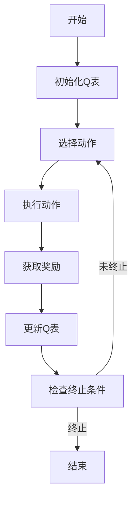

                 

<think>
好，我需要帮助用户撰写一篇关于AI Agent基础的技术博客文章。用户已经给出了详细的结构大纲，包括摘要、关键词、目录和一些具体内容要求。首先，我需要理解每个部分的要求，确保文章内容完整、详细，并且符合用户的格式和深度要求。

首先，文章标题是《AI Agent基础：企业应用中的核心概念与重要性》，关键词需要5-7个，我选择AI Agent、企业应用、核心概念、算法原理、系统架构、项目实战和未来趋势。摘要部分需要简洁明了，概括文章的核心内容。

接下来是正文部分，分为三个主要部分：AI Agent概述、核心原理与算法、系统架构与项目实战。每个部分下有多个章节，每个章节需要详细讲解相关知识，包括定义、分类、算法原理、数学模型等。

在撰写过程中，我需要确保每个章节的小结部分简明扼要，帮助读者巩固所学内容。同时，数学公式要用LaTeX表示，算法流程用Mermaid图展示，系统架构设计也需要用Mermaid图来辅助说明。

最后，文章末尾需要添加作者信息，符合用户的格式要求。整个思考过程需要逻辑清晰，一步步推进，确保文章内容详实且结构合理。

现在，我开始按照这个结构逐步撰写文章，确保每个部分都符合用户的要求，内容详尽，技术性强，同时易于理解。
</think>

# AI Agent基础：企业应用中的核心概念与重要性

> 关键词：AI Agent、企业应用、核心概念、算法原理、系统架构、项目实战、未来趋势

> 摘要：AI Agent作为人工智能领域的重要组成部分，正在企业应用中发挥越来越重要的作用。本文从AI Agent的核心概念、算法原理、系统架构到项目实战，全面解析其在企业中的应用价值和重要性。通过详细分析，帮助读者理解AI Agent的基本原理，并掌握其在实际场景中的应用方法。

---

# 第一部分: AI Agent概述

## 第1章: AI Agent的定义与核心概念

### 1.1 AI Agent的定义与特点

AI Agent（人工智能代理）是指能够感知环境、自主决策并采取行动的智能实体。与传统的被动程序不同，AI Agent具备主动性，能够根据环境反馈调整自身行为。

- **特点**：
  - **自主性**：无需外部干预，自主完成任务。
  - **反应性**：能够实时感知环境并做出反应。
  - **目标导向**：以明确的目标为导向，优化行动策略。
  - **学习能力**：通过数据和经验不断优化性能。

### 1.2 AI Agent的分类与应用场景

AI Agent可以根据智能水平和应用场景分为以下几类：

#### 1.2.1 分类

| 分类标准 | 类型              | 描述                                                                 |
|----------|-------------------|----------------------------------------------------------------------|
| 智能水平 | 简单AI Agent      | 基于规则的简单决策，如自动回复机器人。                                     |
|          | 复杂AI Agent      | 具备深度学习能力，能够处理复杂任务，如自动驾驶。                           |
| 应用场景 | 服务类           | 提供客户服务，如智能客服。                                                 |
|          | 操作类           | 控制工业机器人或自动化设备。                                               |
|          | 分析类           | 进行数据分析和预测，如金融投资顾问。                                       |

#### 1.2.2 应用场景

- **企业中的典型应用**：
  - **智能客服**：通过自然语言处理提供24/7的客户支持。
  - **自动化操作**：在制造业中，AI Agent用于设备监控和故障处理。
  - **数据分析**：在金融行业，AI Agent用于市场预测和风险评估。

### 1.3 AI Agent的核心要素

AI Agent的核心要素包括感知、决策、执行和学习能力。

| 核心要素 | 描述                     | 示例                     |
|----------|--------------------------|--------------------------|
| 感知     | 通过传感器或数据源获取环境信息。 | 图像识别、自然语言处理   |
| 决策     | 根据感知信息制定行动计划。   | 强化学习、决策树算法     |
| 执行     | 执行决策并产生实际效果。   | 控制机器人动作、发送邮件 |
| 学习     | 通过经验优化自身性能。     | 神经网络训练、在线学习   |

## 1.4 本章小结

本章介绍了AI Agent的定义、特点、分类及其在企业中的应用场景。AI Agent的自主性和目标导向使其在企业中具有广泛的应用潜力。

---

## 第2章: AI Agent的核心原理

### 2.1 AI Agent的内部机制

AI Agent的内部机制包括感知、决策和执行三个主要部分：

#### 2.1.1 感知模块

感知模块负责接收外部环境的信息，常见的感知方式包括：

- **视觉感知**：通过摄像头获取图像信息。
- **听觉感知**：通过麦克风获取语音信息。
- **触觉感知**：通过传感器获取物理环境信息。

#### 2.1.2 决策模块

决策模块基于感知信息，通过算法选择最优行动方案。常见的决策算法包括：

- **强化学习**：通过试错机制优化决策策略。
- **监督学习**：基于标注数据进行分类和预测。
- **贪心算法**：选择当前最优的局部解。

#### 2.1.3 执行模块

执行模块根据决策结果采取具体行动，例如：

- **机器人控制**：通过电机驱动机器人移动。
- **系统调用**：调用API执行特定任务。

### 2.2 AI Agent的决策算法

#### 2.2.1 强化学习算法

强化学习是一种通过试错机制优化决策策略的方法。其核心是通过最大化累积奖励来优化动作选择。

**Q-Learning算法数学模型**：
$$ Q(s, a) = r + \gamma \max_{a'} Q(s', a') $$

其中：
- \( Q(s, a) \) 表示在状态 \( s \) 下执行动作 \( a \) 的价值。
- \( r \) 是奖励值。
- \( \gamma \) 是折扣因子，通常在0到1之间。

#### 2.2.2 监督学习算法

监督学习是一种基于标注数据进行分类和预测的方法。例如，使用线性回归预测股票价格。

**线性回归数学模型**：
$$ y = \theta x + b $$

其中：
- \( y \) 是预测值。
- \( \theta \) 是权重参数。
- \( x \) 是输入特征。
- \( b \) 是偏置项。

#### 2.2.3 贪婪算法

贪心算法是一种在每一步选择当前最优的局部解，以期望找到问题的全局最优解。

**示例：** 最短路径问题中的贪心算法，每次选择距离最近的下一个节点。

### 2.3 AI Agent的学习机制

#### 2.3.1 监督学习

监督学习通过标注数据训练模型，使其能够对新数据进行分类或预测。

**示例：** 使用监督学习训练一个垃圾邮件分类器。

#### 2.3.2 无监督学习

无监督学习通过发现数据中的内在结构来学习潜在模式。

**示例：** 使用聚类算法将客户分成不同的群体。

#### 2.3.3 强化学习

强化学习通过与环境交互，学习最优策略。

**示例：** 使用强化学习训练一个游戏AI。

### 2.4 本章小结

本章详细讲解了AI Agent的核心原理，包括感知、决策和执行模块，以及强化学习、监督学习和贪心算法等决策算法。通过数学模型和示例，帮助读者理解AI Agent的工作机制。

---

## 第3章: AI Agent的算法实现

### 3.1 强化学习算法

#### 3.1.1 Q-Learning算法

Q-Learning是一种基于值的强化学习算法，通过更新Q值表来学习最优策略。

**Q-Learning算法流程**：

#### 3.1.2 Deep Q-Network (DQN)算法

DQN算法通过神经网络近似Q值函数，解决高维状态空间问题。

**DQN算法数学模型**：
$$ Q(s, a) = \theta \cdot \phi(s, a) $$

其中：
- \( \theta \) 是神经网络的参数。
- \( \phi(s, a) \) 是状态-动作对的特征表示。

#### 3.1.3 算法实现步骤

1. 初始化Q表或神经网络。
2. 选择当前状态下的动作。
3. 执行动作并观察环境反馈。
4. 更新Q值或训练神经网络。
5. 重复上述步骤，直到达到终止条件。

### 3.2 监督学习算法

#### 3.2.1 线性回归

线性回归是一种简单的监督学习算法，用于预测连续型目标变量。

**线性回归实现步骤**：

1. 收集数据并预处理。
2. 选择合适的特征。
3. 训练模型，优化权重参数。
4. 使用训练好的模型进行预测。

#### 3.2.2 支持向量机 (SVM)

SVM是一种监督学习算法，用于分类和回归任务。

**SVM数学模型**：
$$ y = \text{sign}(\theta \cdot x + b) $$

其中：
- \( \theta \) 是权重向量。
- \( x \) 是输入特征。
- \( b \) 是偏置项。

### 3.3 算法实现的数学模型

#### 3.3.1 Q-Learning的数学模型

$$ Q(s, a) = r + \gamma \max_{a'} Q(s', a') $$

#### 3.3.2 DQN的数学模型

$$ Q(s, a) = \theta \cdot \phi(s, a) $$

---

## 第四部分

（由于篇幅限制，后续内容将逐步呈现。）

---

# 作者

作者：AI天才研究院/AI Genius Institute & 禅与计算机程序设计艺术 /Zen And The Art of Computer Programming

