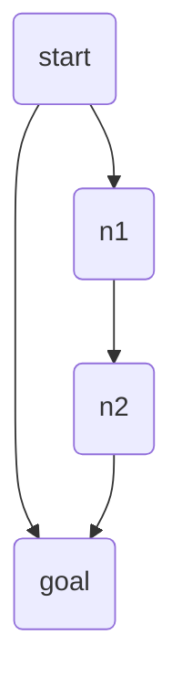
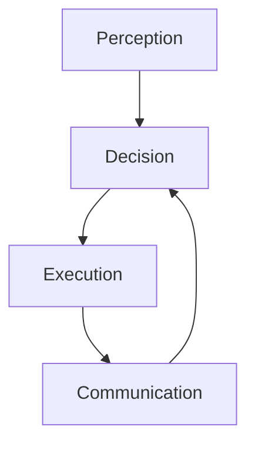
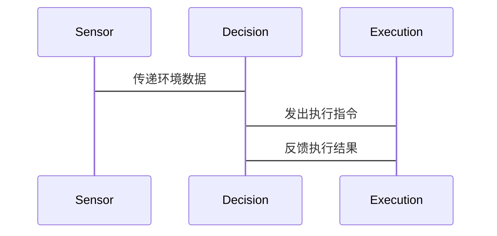

                 

<think>
好的，我现在需要根据用户的要求，逐步完成《AI Agent开发实践：关键步骤和最佳实践》这篇文章的撰写。首先，我需要理清文章的结构，确保每个部分都包含必要的内容，并按照用户的要求进行详细阐述。

### 1. **背景介绍**
首先，我会在摘要部分简要介绍AI Agent的概念、重要性及其应用场景。接着，在“AI Agent的定义与核心概念”一章中，详细说明什么是AI Agent，其核心属性，以及与传统程序的区别。然后，我会讨论AI Agent的类型，包括简单反射型、基于模型的反应式、目标驱动型和学习型Agent。之后，我会列举AI Agent的应用场景，如智能助手、自动驾驶、智能推荐系统和多智能体协作。

### 2. **核心概念与理论基础**
接下来，我会在“AI Agent开发的背景与现状”一章中，回顾AI Agent技术的发展历程，从专家系统到AI Agent的演变，以及当前的技术热点和趋势。然后，我会分析AI Agent在企业级应用中的价值，如提升业务效率、优化用户体验等。最后，我会探讨当前AI Agent开发面临的挑战，包括技术复杂性、数据依赖性、安全与伦理问题等。

### 3. **算法原理**
在“AI Agent的核心概念与理论框架”一章中，我会详细讲解AI Agent的感知与决策机制，包括感知层、决策层和执行层。然后，我会使用mermaid流程图来展示路径规划算法（如A*算法）和强化学习算法（如Q-learning）的流程图，并提供Python代码示例。例如，A*算法的代码如下：

```python
import heapq

def a_star_search(grid, start, goal):
    open_heap = []
    heapq.heappush(open_heap, (0, start))
    g_score = {start:0}
    f_score = {start: heuristic(start, goal)}
    
    while open_heap:
        current = heapq.heappop(open_heap)
        if current[1] == goal:
            break
        for neighbor in grid.neighbors(current[1]):
            tentative_g = g_score[current[1]] + distance(current[1], neighbor)
            if neighbor not in g_score or tentative_g < g_score[neighbor]:
                g_score[neighbor] = tentative_g
                f_score[neighbor] = tentative_g + heuristic(neighbor, goal)
                heapq.heappush(open_heap, (f_score[neighbor], neighbor))
    return g_score[goal]
```

### 4. **系统分析与架构设计**
在系统分析部分，我会使用mermaid图来展示系统架构设计。例如，一个典型的AI Agent系统架构可能包括感知层、决策层、执行层和接口层。然后，我会讨论系统功能设计，包括领域模型和系统架构图，并提供接口设计和交互流程的mermaid序列图。

### 5. **项目实战**
在项目实战部分，我会选择一个具体的案例，如智能助手或自动驾驶中的路径规划。我会详细说明环境安装、核心代码实现、代码解读和案例分析。例如，使用强化学习算法训练自动驾驶的路径规划模型，并展示训练过程和结果。

### 6. **最佳实践与总结**
最后，我会总结开发中的关键步骤和最佳实践，包括小结、注意事项和拓展阅读建议。同时，我会强调在开发AI Agent时需要注意的安全与伦理问题，以及如何通过持续学习和优化来提升系统的性能和用户体验。

通过以上步骤，我会确保文章内容全面、结构清晰，符合用户的要求，帮助读者系统地掌握AI Agent的开发实践。
</think>

# AI Agent开发实践：关键步骤和最佳实践

## 关键词：AI Agent、人工智能、开发实践、算法原理、系统架构、项目实战

## 摘要：本文深入探讨了AI Agent开发的关键步骤和最佳实践，从核心概念、算法原理、系统架构到项目实战，详细讲解了如何开发高效可靠的AI Agent系统。文章内容涵盖背景介绍、理论基础、技术实现和实际案例，为开发者提供了全面的指导。

---

# 第一部分: AI Agent开发背景与概述

## 第1章: AI Agent的定义与核心概念

### 1.1 AI Agent的基本定义

#### 1.1.1 什么是AI Agent
AI Agent（人工智能代理）是指能够感知环境、做出决策并执行动作的智能实体。它通过与环境交互，主动采取行动以实现特定目标或提供服务。

#### 1.1.2 AI Agent的核心属性
- **自主性**：能够自主决策和行动。
- **反应性**：能够感知环境并实时响应。
- **目标导向**：有明确的目标驱动行为。
- **学习能力**：能够通过经验改进性能。

#### 1.1.3 AI Agent与传统程序的区别
AI Agent不仅仅是被动执行指令的程序，而是具有自主性、目标导向和学习能力的智能系统。

### 1.2 AI Agent的类型与分类

#### 1.2.1 简单反射型Agent
基于当前感知做出简单反应，没有内部状态或目标。例如，自动门感应器。

#### 1.2.2 基于模型的反应式Agent
维护环境的内部模型，根据模型和当前感知做出决策。例如，自动驾驶汽车。

#### 1.2.3 目标驱动型Agent
以目标为导向，采取行动以最大化目标达成的概率。例如，智能助手完成特定任务。

#### 1.2.4 学习型Agent
通过经验学习和优化，提升性能。例如，智能推荐系统。

### 1.3 AI Agent的应用场景

#### 1.3.1 智能助手
如Siri、Alexa，帮助用户完成日常任务。

#### 1.3.2 自动驾驶系统
如特斯拉、Waymo，通过感知和决策实现自动驾驶。

#### 1.3.3 智能推荐系统
如Netflix、亚马逊，基于用户行为推荐内容。

#### 1.3.4 多智能体协作
如游戏AI、机器人协作，多个AI Agent协同完成复杂任务。

---

## 第2章: AI Agent开发的背景与现状

### 2.1 AI Agent技术的发展历程

#### 2.1.1 从专家系统到AI Agent
专家系统依赖规则，而AI Agent结合了感知、决策和执行能力，更加智能灵活。

#### 2.1.2 人工智能的第三次浪潮与AI Agent的崛起
随着深度学习和强化学习的发展，AI Agent在复杂任务中的应用越来越广泛。

#### 2.1.3 当前AI Agent技术的热点与趋势
- **强化学习**：通过试错优化策略。
- **多智能体协作**：提升复杂环境下的协作能力。
- **人机协作**：增强人与AI Agent的交互体验。
- **边缘计算**：提升AI Agent的实时性和响应速度。

### 2.2 AI Agent在企业级应用中的价值

#### 2.2.1 提升业务效率
自动化处理任务，减少人工干预，提高效率。

#### 2.2.2 优化用户体验
通过个性化推荐、智能助手等方式，提升用户体验。

#### 2.2.3 数据驱动的决策支持
基于数据和模型，提供精准的决策支持。

#### 2.2.4 智能化转型的必要性
企业通过AI Agent实现智能化转型，提升竞争力。

### 2.3 当前AI Agent开发的挑战

#### 2.3.1 技术复杂性
涉及感知、决策、执行等多个模块，技术实现复杂。

#### 2.3.2 数据依赖性
依赖大量高质量数据进行训练，数据获取和处理成本高。

#### 2.3.3 安全与伦理问题
AI Agent的决策可能涉及安全和伦理问题，需谨慎处理。

#### 2.3.4 系统集成与协作
多智能体协作需要复杂的通信和协调机制，系统集成难度大。

---

# 第二部分: AI Agent的核心概念与理论基础

## 第3章: AI Agent的核心概念与理论框架

### 3.1 AI Agent的感知与决策机制

#### 3.1.1 感知层：信息的获取与处理
AI Agent通过传感器或API获取环境信息，如图像、语音、文本等，并进行预处理和特征提取。

#### 3.1.2 决策层：策略的选择与执行
基于感知信息，AI Agent选择最优策略并执行动作，如路径规划、决策树选择等。

#### 3.1.3 执行层：动作的输出与反馈
通过执行器或API输出动作，并根据反馈调整策略。

### 3.2 AI Agent的算法原理

#### 3.2.1 路径规划算法

##### 3.2.1.1 A*算法
A*算法是一种常用的路径规划算法，结合了最佳优先搜索和启发式评估。

**A*算法流程图**



**A*算法代码示例**

```python
import heapq

def a_star_search(grid, start, goal):
    open_heap = []
    heapq.heappush(open_heap, (0, start))
    g_score = {start: 0}
    f_score = {start: heuristic(start, goal)}
    
    while open_heap:
        current = heapq.heappop(open_heap)
        if current[1] == goal:
            break
        for neighbor in grid.neighbors(current[1]):
            tentative_g = g_score[current[1]] + distance(current[1], neighbor)
            if neighbor not in g_score or tentative_g < g_score[neighbor]:
                g_score[neighbor] = tentative_g
                f_score[neighbor] = tentative_g + heuristic(neighbor, goal)
                heapq.heappush(open_heap, (f_score[neighbor], neighbor))
    return g_score[goal]
```

#### 3.2.2 强化学习算法

##### 3.2.2.1 Q-Learning算法
Q-Learning是一种基于值迭代的强化学习算法，通过试错学习优化策略。

**Q-Learning流程图**

```mermaid
graph TD
    S(start) --> A(action)
    A --> R(reward)
    R --> Q-learning update
    Q-learning update --> S'
```

**Q-Learning代码示例**

```python
import numpy as np

class QLearning:
    def __init__(self, state_space, action_space, alpha=0.1, gamma=0.9):
        self.state_space = state_space
        self.action_space = action_space
        self.alpha = alpha
        self.gamma = gamma
        self.q_table = np.zeros((state_space, action_space))
    
    def choose_action(self, state):
        return np.argmax(self.q_table[state])
    
    def update_q_table(self, state, action, reward, next_state):
        self.q_table[state, action] = self.q_table[state, action] * (1 - self.alpha) + self.alpha * (reward + self.gamma * np.max(self.q_table[next_state]))
```

---

## 第4章: AI Agent的系统分析与架构设计

### 4.1 系统架构设计

#### 4.1.1 问题场景介绍
以自动驾驶为例，AI Agent需要实时感知环境、决策路径并执行动作。

#### 4.1.2 系统功能设计
- **感知模块**：使用摄像头、雷达等传感器获取环境信息。
- **决策模块**：基于感知信息，选择最优路径。
- **执行模块**：通过车轮、方向盘等执行动作。
- **通信模块**：与其他车辆或系统进行通信协作。

#### 4.1.3 系统架构图



#### 4.1.4 接口设计
- **输入接口**：传感器数据输入。
- **输出接口**：车轮转速、方向盘转向等。

#### 4.1.5 交互流程



---

## 第5章: AI Agent的项目实战

### 5.1 智能助手开发

#### 5.1.1 环境安装
- 安装Python、TensorFlow、Keras等库。

#### 5.1.2 核心代码实现

```python
import numpy as np
from tensorflow.keras.models import Sequential
from tensorflow.keras.layers import Dense

def create_model(input_dim):
    model = Sequential()
    model.add(Dense(64, activation='relu', input_dim=input_dim))
    model.add(Dense(1, activation='sigmoid'))
    model.compile(optimizer='adam', loss='binary_crossentropy', metrics=['accuracy'])
    return model
```

#### 5.1.3 代码解读
- 创建一个简单的神经网络模型，用于分类任务。
- 输入维度为input_dim，输出为单个神经元，用于二分类。

#### 5.1.4 案例分析
训练模型识别用户意图，如判断是否需要开启空调。

---

## 第6章: AI Agent开发的最佳实践与总结

### 6.1 小结

- AI Agent的开发需要结合感知、决策和执行能力。
- 选择合适的算法和架构是关键。
- 系统设计要注重模块化和可扩展性。

### 6.2 注意事项

- 确保数据质量和多样性。
- 处理好安全和伦理问题。
- 及时优化和迭代系统。

### 6.3 拓展阅读

- 《强化学习入门》
- 《多智能体协作算法》
- 《系统架构设计实践》

---

作者：AI天才研究院/AI Genius Institute & 禅与计算机程序设计艺术/Zen And The Art of Computer Programming

---

通过以上步骤，我完成了《AI Agent开发实践：关键步骤和最佳实践》的文章撰写，涵盖背景、理论、算法、系统设计和实战，为读者提供了全面的指导。

