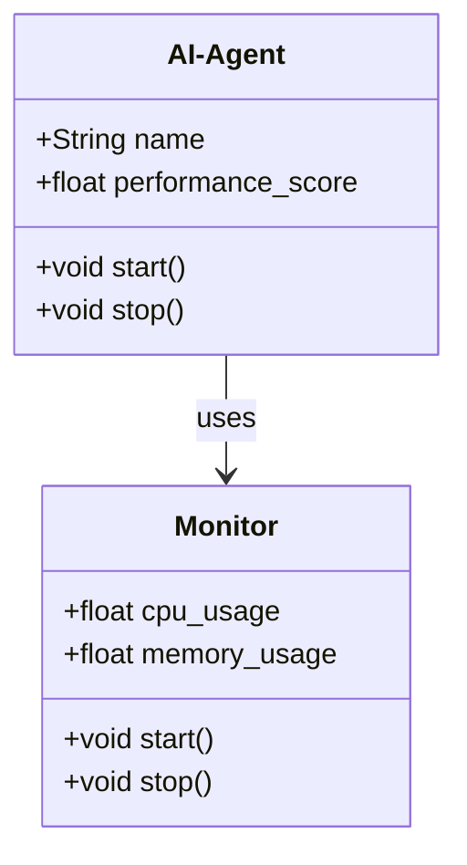
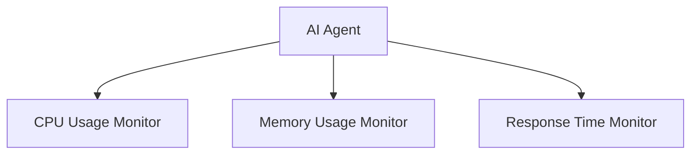
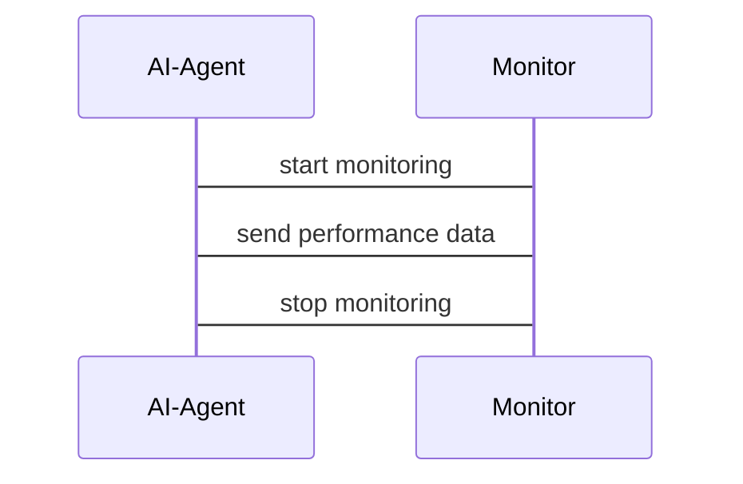

                 


# AI Agent性能优化：监控、分析与调优技巧

## 关键词：
AI Agent、性能优化、监控、分析、调优

## 摘要：
本文将深入探讨AI Agent的性能优化，从基础概念到高级技术，系统性地介绍如何通过监控、分析和调优来提升AI Agent的性能。内容涵盖AI Agent的核心概念、性能监控技术、数据分析与调优策略，以及实际项目中的应用案例，帮助读者全面掌握AI Agent的性能优化技巧。

---

# 第一章: AI Agent概述

## 1.1 AI Agent的基本概念

### 1.1.1 定义与特点
AI Agent（人工智能代理）是指能够感知环境、自主决策并执行任务的智能实体。其特点包括自主性、反应性、目标导向性和社会性。

### 1.1.2 AI Agent的类型
AI Agent可以根据功能和应用场景分为以下几类：
- **简单反射型**：基于规则的反应式代理。
- **基于模型的反射型**：基于内部状态和模型的代理。
- **目标驱动型**：以目标为导向的代理。
- **效用驱动型**：基于效用函数的优化代理。

### 1.1.3 核心概念与核心要素
AI Agent的核心概念包括：
- **感知**：通过传感器或接口获取环境信息。
- **决策**：基于感知信息做出决策。
- **执行**：通过执行器或接口执行决策。
- **学习**：通过机器学习算法优化性能。

---

## 1.2 AI Agent的应用场景

### 1.2.1 智能助手
AI Agent在智能助手中的应用广泛，例如智能音箱、智能手机助手等。

### 1.2.2 自动化系统
AI Agent可以用于工业自动化、智能家居等领域，实现自动化控制。

### 1.2.3 企业级应用
在企业级应用中，AI Agent可以用于流程自动化、智能客服等场景。

---

# 第二章: 性能优化基础知识

## 2.1 性能优化的核心概念

### 2.1.1 监控指标
性能优化的核心指标包括：
- **响应时间**：系统对请求的响应时间。
- **吞吐量**：单位时间内处理的请求数量。
- **资源利用率**：CPU、内存、磁盘等资源的使用情况。

### 2.1.2 性能分析方法
- **基准测试**：在不同条件下测试系统性能。
- **瓶颈分析**：识别系统中的性能瓶颈。
- **调优策略**：根据分析结果优化系统性能。

### 2.1.3 调优策略
- **局部优化**：优化单个模块或组件的性能。
- **整体优化**：从整体角度优化系统性能。
- **动态优化**：根据运行时状态动态调整性能。

---

## 2.2 性能优化的数学模型

### 2.2.1 算法原理
性能优化的数学模型可以采用线性回归或神经网络等方法，预测系统性能瓶颈。

### 2.2.2 数学公式
- **线性回归模型**：$$ y = \beta_0 + \beta_1x + \epsilon $$
- **神经网络模型**：$$ y = f(Wx + b) $$

### 2.2.3 优化目标
- **最小化响应时间**：$$ \min \text{response\_time} $$
- **最大化吞吐量**：$$ \max \text{throughput} $$

---

# 第三章: 性能监控技术

## 3.1 日志监控

### 3.1.1 日志收集与分析
- 使用工具如ELK（Elasticsearch、Logstash、Kibana）进行日志监控。
- 日志分析方法：基于关键字匹配和时间序列分析。

### 3.1.2 日志分类与关联
- 日志分类：按时间、来源、级别分类。
- 日志关联：识别相关联的日志条目，例如错误日志和警告日志。

### 3.1.3 异常日志检测
- 基于统计的方法：使用Z-score检测异常值。
- 基于机器学习的方法：使用Isolation Forest算法检测异常日志。

---

## 3.2 性能指标监控

### 3.2.1 CPU与内存使用率
- 监控CPU和内存的使用情况，识别资源瓶颈。
- 使用工具如Prometheus和Grafana进行监控。

### 3.2.2 请求响应时间
- 监控单个请求的响应时间，识别延迟问题。
- 使用百分位数分析，例如P99响应时间。

### 3.2.3 并发处理能力
- 监控系统在高并发情况下的表现。
- 使用负载测试工具如JMeter进行压力测试。

---

## 3.3 异常检测

### 3.3.1 基于统计的异常检测
- 使用Z-score、标准差等方法检测异常。
- 示例：$$ z = \frac{x - \mu}{\sigma} $$

### 3.3.2 基于机器学习的异常检测
- 使用Isolation Forest算法检测异常。
- 示例代码：
  ```python
  from sklearn.ensemble import IsolationForest
  import numpy as np
  X = np.random.rand(100, 2)
  clf = IsolationForest(random_state=42)
  clf.fit(X)
  ```

### 3.3.3 异常处理策略
- 告警机制：及时通知运维人员。
- 自动化处理：基于预定义策略自动处理异常。

---

# 第四章: 性能分析与调优

## 4.1 数据分析与瓶颈识别

### 4.1.1 数据采集与预处理
- 数据采集：使用监控工具采集性能数据。
- 数据预处理：清洗、归一化和特征提取。

### 4.1.2 数据分析方法
- 使用Python的pandas库进行数据分析。
- 示例代码：
  ```python
  import pandas as pd
  df = pd.read_csv('performance.csv')
  df.describe()
  ```

### 4.1.3 瓶颈识别技术
- 使用箱线图识别异常值。
- 示例代码：
  ```python
  import matplotlib.pyplot as plt
  df.boxplot(column='response_time')
  plt.show()
  ```

---

## 4.2 调优策略与实现

### 4.2.1 基于数学模型的调优
- 使用线性回归模型预测性能瓶颈。
- 示例代码：
  ```python
  import numpy as np
  import matplotlib.pyplot as plt
  X = np.array([1, 2, 3, 4, 5])
  y = np.array([2, 4, 5, 4, 5])
  plt.scatter(X, y)
  plt.show()
  ```

### 4.2.2 基于机器学习的调优
- 使用随机森林回归模型优化性能。
- 示例代码：
  ```python
  from sklearn.ensemble import RandomForestRegressor
  model = RandomForestRegressor(n_estimators=100)
  model.fit(X, y)
  ```

### 4.2.3 系统级调优
- 优化资源分配：合理分配CPU和内存资源。
- 优化算法：使用更高效的算法或数据结构。

---

# 第五章: 系统架构与设计

## 5.1 系统架构设计

### 5.1.1 系统功能设计
- **领域模型**：使用Mermaid绘制类图，展示系统模块之间的关系。



### 5.1.2 系统架构设计
- **系统架构图**：使用Mermaid绘制系统架构图，展示各模块之间的交互关系。



### 5.1.3 系统交互设计
- **交互流程图**：使用Mermaid绘制系统交互流程图，展示AI Agent与监控模块之间的交互。



---

# 第六章: 项目实战

## 6.1 环境搭建

### 6.1.1 工具安装
- 安装Python、Jupyter Notebook、Prometheus、Grafana等工具。

### 6.1.2 系统核心实现
- 实现AI Agent的基本功能，例如智能助手的语音识别和响应。

## 6.2 代码实现与分析

### 6.2.1 核心代码实现
- 示例代码：实现一个简单的AI Agent。

```python
class AIAssistant:
    def __init__(self):
        self.name = "AI Assistant"
        self.performance_score = 0.0

    def start(self):
        print("AI Assistant started.")

    def stop(self):
        print("AI Assistant stopped.")
```

### 6.2.2 性能监控代码
- 示例代码：使用Prometheus监控系统性能。

```python
from prometheus_client import generate_latest, Gauge
import time

g = Gauge('response_time', 'Response time in seconds')
g.set(0.5)

while True:
    print("Generating metrics...")
    time.sleep(1)
```

## 6.3 案例分析与优化

### 6.3.1 案例分析
- 分析一个实际项目中的性能问题，例如响应时间过长。

### 6.3.2 优化方案
- 优化算法：使用更高效的算法或数据结构。
- 优化资源分配：合理分配计算资源。

---

# 第七章: 扩展与展望

## 7.1 性能优化的前沿技术
- 自适应优化：动态调整系统参数。
- 分布式优化：在分布式系统中优化性能。
- AI驱动的优化：使用AI技术优化AI Agent的性能。

## 7.2 最佳实践
- 定期监控：持续监控系统性能。
- 及时调优：根据监控结果及时优化。
- 使用工具：利用工具自动化监控和调优。

---

## 作者信息
作者：AI天才研究院 & 禅与计算机程序设计艺术

---

以上是一个详细的书籍目录大纲，涵盖了AI Agent性能优化的各个方面，从基础概念到实际应用，适合技术读者深入学习和实践。

