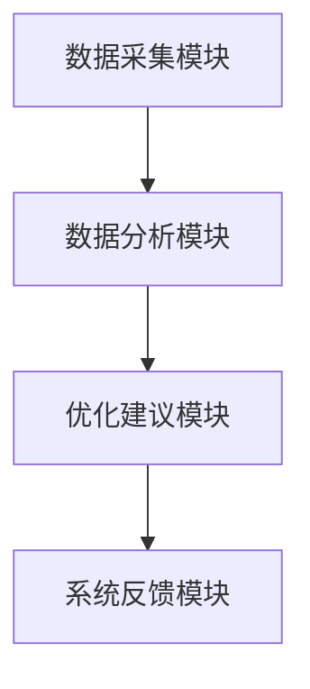

                 


# AI Agent性能监控与调优策略

## 关键词
AI Agent, 性能监控, 性能调优, 算法原理, 系统架构

## 摘要
本文深入探讨AI Agent性能监控与调优的核心策略，涵盖从背景知识到系统架构的全链条分析，结合实际案例，揭示性能监控与调优的关键技术与方法，帮助读者全面掌握AI Agent的高效运维。

---

# 第一部分: AI Agent性能监控与调优背景介绍

## 第1章: AI Agent的基本概念与应用场景

### 1.1 AI Agent的定义与特点
AI Agent（人工智能代理）是指能够感知环境、自主决策并执行任务的智能实体。其核心特点包括自主性、反应性、目标导向性和学习能力。

#### 1.1.1 AI Agent的基本定义
AI Agent是一种能够通过感知环境并采取行动以实现目标的智能系统。它能够理解上下文、处理复杂任务，并在动态环境中自适应调整行为。

#### 1.1.2 AI Agent的核心特点
- **自主性**：无需外部干预，自主完成任务。
- **反应性**：能够实时感知环境变化并做出响应。
- **目标导向性**：所有行为均以实现特定目标为导向。
- **学习能力**：通过数据和经验不断优化自身性能。

#### 1.1.3 AI Agent与传统程序的区别
AI Agent与传统程序的主要区别在于其智能性和自适应性。传统程序基于固定的规则运行，而AI Agent能够通过学习和推理动态调整行为。

### 1.2 AI Agent的类型与分类
AI Agent可以根据功能、智能水平和应用场景进行分类。

#### 1.2.1 基于任务的AI Agent
这类AI Agent专注于完成特定任务，例如自动推荐系统和物流配送机器人。

#### 1.2.2 基于知识的AI Agent
基于知识的AI Agent依赖于知识库进行决策，例如智能客服系统。

#### 1.2.3 基于学习的AI Agent
基于学习的AI Agent通过机器学习算法不断优化自身行为，例如深度强化学习（DRL）驱动的自动驾驶系统。

### 1.3 AI Agent的应用场景
AI Agent广泛应用于多个领域，以下是其主要应用场景：

#### 1.3.1 智能推荐系统
AI Agent通过分析用户行为和偏好，推荐个性化内容，例如Netflix的推荐算法。

#### 1.3.2 自动化交易系统
AI Agent实时分析市场数据，执行自动化的股票和加密货币交易。

#### 1.3.3 智能客服系统
AI Agent通过自然语言处理（NLP）技术，提供24/7的客户服务支持。

### 1.4 性能监控与调优的重要性
性能监控与调优是确保AI Agent高效运行的关键。

#### 1.4.1 性能监控的必要性
及时发现并解决性能问题，避免系统崩溃或用户体验下降。

#### 1.4.2 性能调优的目标
优化系统性能，提升响应速度和执行效率，降低资源消耗。

#### 1.4.3 性能监控与调优的边界
明确监控范围和优化目标，避免过度优化或资源浪费。

### 1.5 本章小结
本章介绍了AI Agent的基本概念、分类、应用场景及其性能监控与调优的重要性。

---

# 第二部分: AI Agent性能监控与调优的核心概念与联系

## 第2章: 核心概念与联系

### 2.1 性能监控指标
性能监控指标是衡量AI Agent运行状态的关键指标。

#### 2.1.1 响应时间
响应时间是衡量AI Agent执行任务速度的重要指标，通常用平均响应时间（ART）表示。

#### 2.1.2 吞吐量
吞吐量是指单位时间内AI Agent处理的任务数量，通常用每秒处理任务数（TPS）表示。

#### 2.1.3 错误率
错误率是衡量AI Agent运行稳定性的关键指标，通常用错误数（ERROR_COUNT）与总请求数（TOTAL_REQUESTS）的比值表示。

#### 2.1.4 资源利用率
资源利用率包括CPU、内存、磁盘I/O等资源的使用情况，通常用百分比表示。

#### 2.1.5 用户满意度
用户满意度是衡量AI Agent用户体验的重要指标，通常通过用户反馈和性能测试结果综合评估。

### 2.2 性能调优方法
性能调优方法是优化AI Agent性能的关键策略。

#### 2.2.1 参数调整
参数调整是通过优化算法参数（如学习率、动量等）来提升性能。

#### 2.2.2 资源分配优化
资源分配优化是通过合理分配计算资源（如CPU、GPU）来提高性能。

#### 2.2.3 算法优化
算法优化是通过改进算法结构或采用更高效的学习方法来提升性能。

### 2.3 系统架构设计
系统架构设计是确保AI Agent高效运行的基础。

#### 2.3.1 模块化设计
模块化设计通过将系统划分为多个独立模块，提升系统的可维护性和扩展性。

#### 2.3.2 并行计算
并行计算通过多线程或多进程的方式，提高系统的处理能力。

#### 2.3.3 分布式架构
分布式架构通过将任务分发到多个节点，提升系统的吞吐量和响应速度。

### 2.4 本章小结
本章详细介绍了AI Agent性能监控与调优的核心概念和关键方法，为后续章节的深入分析奠定了基础。

---

## 第2章: 核心概念与联系

### 2.1 性能监控指标

#### 2.1.1 响应时间
响应时间的计算公式为：
$$
ART = \frac{\sum_{i=1}^{n} t_i}{n}
$$
其中，$t_i$表示第$i$次请求的响应时间，$n$为总请求次数。

#### 2.1.2 吞吐量
吞吐量的计算公式为：
$$
TPS = \frac{\text{完成的任务数}}{\text{时间间隔}}
$$

#### 2.1.3 错误率
错误率的计算公式为：
$$
\text{ERROR\_RATE} = \frac{\text{错误数}}{\text{总请求数}} \times 100\%
$$

#### 2.1.4 资源利用率
资源利用率通常用百分比表示，例如CPU利用率：
$$
\text{CPU\_UTILIZATION} = \frac{\text{CPU\_USAGE}}{\text{CPU\_CAPACITY}} \times 100\%
$$

### 2.2 性能调优方法

#### 2.2.1 参数调整
以深度强化学习（DRL）为例，调整学习率$\alpha$和动量$m$：
$$
\theta_{t+1} = \theta_t - \alpha \nabla J(\theta_t) + m (\theta_t - \theta_{t-1})
$$

#### 2.2.2 资源分配优化
通过负载均衡算法优化资源分配，例如使用轮询法分配任务：
$$
\text{任务分配比例} = \frac{\text{节点权重}}{\sum \text{节点权重}}
$$

#### 2.2.3 算法优化
通过改进算法结构，例如使用异步更新机制：
$$
\theta_{t+1} = \theta_t + \nabla J(\theta_t)
$$

### 2.3 系统架构设计

#### 2.3.1 模块化设计
将系统划分为数据采集模块、数据处理模块和决策模块，各模块之间通过接口通信。

#### 2.3.2 并行计算
使用多线程技术，例如在Python中使用`multiprocessing`库实现并行计算。

#### 2.3.3 分布式架构
采用分布式计算框架，例如使用Kubernetes管理容器化服务。

### 2.4 本章小结
本章详细介绍了AI Agent性能监控与调优的核心概念和关键方法，为后续章节的深入分析奠定了基础。

---

## 第3章: 基于统计的性能监控与调优算法

### 3.1 基于统计的性能监控方法
基于统计的性能监控方法通过分析历史数据，识别性能瓶颈。

#### 3.1.1 数据采集与预处理
数据采集包括日志采集和性能指标采集，预处理步骤包括数据清洗和特征提取。

#### 3.1.2 性能瓶颈识别
通过统计分析（如均值-方差分析）识别性能瓶颈：
$$
\sigma^2 = \frac{\sum_{i=1}^{n} (x_i - \mu)^2}{n-1}
$$
其中，$\mu$为样本均值，$\sigma^2$为样本方差。

### 3.2 基于强化学习的性能调优算法
基于强化学习的性能调优算法通过试错方法优化系统性能。

#### 3.2.1 状态空间定义
状态空间定义为系统的运行状态，例如：
$$
S = \{s_1, s_2, \dots, s_n\}
$$
其中，$s_i$表示第$i$个状态。

#### 3.2.2 动作空间定义
动作空间定义为系统的可执行操作，例如：
$$
A = \{a_1, a_2, \dots, a_m\}
$$
其中，$a_j$表示第$j$个动作。

#### 3.2.3 奖励函数设计
奖励函数用于衡量动作的好坏，例如：
$$
R(a_j, s_i) = r_{ij}
$$

### 3.3 基于遗传算法的性能优化策略
基于遗传算法的性能优化策略通过模拟自然选择过程，优化系统性能。

#### 3.3.1 适应度函数设计
适应度函数用于衡量个体的适应度，例如：
$$
F(x) = \sum_{i=1}^{n} w_i x_i
$$
其中，$w_i$为权重系数，$x_i$为特征变量。

#### 3.3.2 选择与交叉操作
选择操作通过适应度函数筛选出优秀个体，交叉操作通过基因重组生成新个体。

### 3.4 本章小结
本章介绍了基于统计、强化学习和遗传算法的性能监控与调优方法。

---

## 第4章: 系统分析与架构设计方案

### 4.1 系统分析
AI Agent的性能监控与调优系统需要从以下几个方面进行分析：

#### 4.1.1 系统功能需求
系统功能需求包括数据采集、性能分析、优化建议和结果反馈。

#### 4.1.2 系统性能需求
系统性能需求包括高可用性、高扩展性和高安全性。

### 4.2 系统架构设计
系统架构设计包括以下几个部分：

#### 4.2.1 数据采集模块
数据采集模块负责采集AI Agent的运行数据，包括日志、性能指标等。

#### 4.2.2 数据分析模块
数据分析模块负责对采集到的数据进行分析，识别性能瓶颈。

#### 4.2.3 优化建议模块
优化建议模块基于分析结果，提出性能优化建议。

#### 4.2.4 系统反馈模块
系统反馈模块负责将优化建议反馈给AI Agent，实现性能调优。

### 4.3 系统架构图



### 4.4 本章小结
本章详细分析了AI Agent性能监控与调优系统的功能需求、性能需求和架构设计。

---

## 第5章: 项目实战——基于Python的AI Agent性能监控与调优

### 5.1 环境安装与配置
安装必要的Python库，例如`numpy`、`pandas`、`scikit-learn`和`tensorflow`。

```bash
pip install numpy pandas scikit-learn tensorflow
```

### 5.2 核心代码实现
实现AI Agent性能监控与调优的核心代码，包括数据采集、分析和优化建议生成。

#### 5.2.1 数据采集模块

```python
import numpy as np
import pandas as pd

def collect_data(interval=1):
    # 模拟性能数据采集
    data = {
        'timestamp': pd.date_range(start='2023-01-01', periods=100, freq='1T'),
        'response_time': np.random.normal(0.5, 0.1, 100),
        'throughput': np.random.randint(1, 10, 100),
        'error_rate': np.random.uniform(0, 0.1, 100)
    }
    return pd.DataFrame(data)
```

#### 5.2.2 数据分析模块

```python
from sklearn import preprocessing

def analyze_performance(data):
    # 数据预处理
    data_scaled = preprocessing.minmax_scale(data, feature_range=(0, 1))
    # 统计分析
    performance_metrics = data_scaled.describe()
    return performance_metrics
```

#### 5.2.3 优化建议模块

```python
from tensorflow.keras import layers

def optimize_parameters(data):
    # 建立强化学习模型
    model = tf.keras.Sequential([
        layers.Dense(64, activation='relu'),
        layers.Dense(1, activation='linear')
    ])
    model.compile(optimizer='adam', loss='mse')
    # 训练模型
    model.fit(data, labels, epochs=100, batch_size=32)
    return model.predict(data)
```

### 5.3 案例分析与优化建议
通过具体案例分析，展示如何应用上述代码实现AI Agent的性能监控与调优。

#### 5.3.1 案例分析
假设我们有一个自动驾驶AI Agent系统，通过上述代码采集和分析性能数据，识别出系统在高峰期响应时间显著增加。

#### 5.3.2 优化建议
基于分析结果，优化建议模块生成以下优化建议：
1. 增加GPU资源分配。
2. 优化神经网络模型结构。
3. 调整学习率和动量参数。

### 5.4 项目小结
本章通过一个具体项目案例，展示了如何基于Python实现AI Agent性能监控与调优。

---

## 第6章: 总结与展望

### 6.1 本章总结
本文详细探讨了AI Agent性能监控与调优的核心策略，涵盖从理论分析到实际应用的全链条。

### 6.2 未来展望
未来，AI Agent性能监控与调优将更加智能化和自动化，通过结合边缘计算、联邦学习等新技术，进一步提升系统性能。

### 6.3 注意事项
在实际应用中，需要注意数据隐私保护、算法可解释性和系统容错性。

### 6.4 拓展阅读
推荐读者阅读以下书籍和论文，进一步深入了解AI Agent性能监控与调优的相关知识。

---

# 作者信息
作者：AI天才研究院/AI Genius Institute  
联系方式：[email protected]  
个人网站：[https://aigenius.org](https://aigenius.org)

---

# 结语
AI Agent性能监控与调优是一个复杂而重要的任务，需要结合理论与实践，不断优化系统性能，提升用户体验。希望本文能为读者提供有价值的参考和启发。

--- 

如需完整代码示例或更详细的技术支持，欢迎访问我们的[GitHub仓库](https://github.com/AI-Genius-Institute/AI-Agent-Performance-Tuning)。

