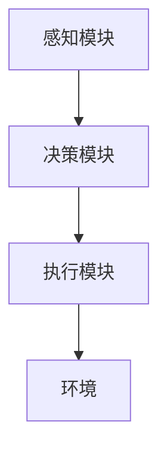
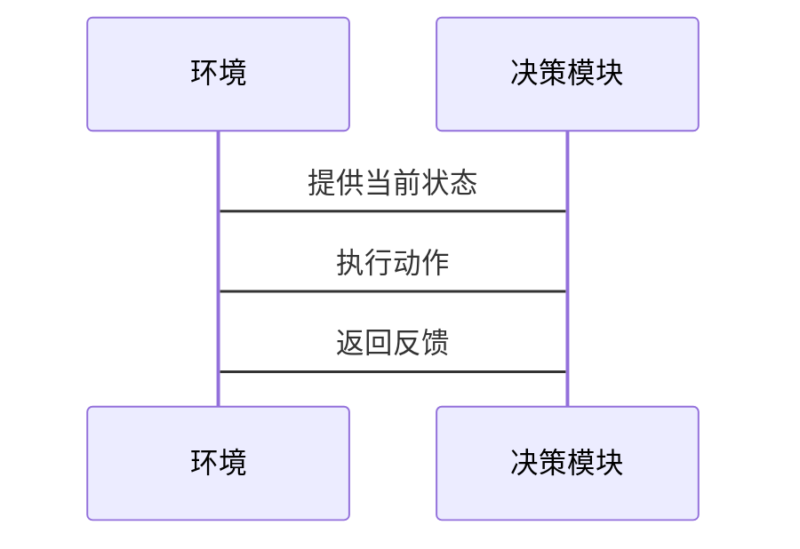

                 


# AI Agent的主动学习策略

> **关键词**：AI Agent，主动学习，强化学习，策略优化，知识表示，系统架构

> **摘要**：  
AI Agent的主动学习策略是一种结合了机器学习和智能代理技术的方法，旨在通过智能体在动态环境中主动探索和优化其行为策略。本文从AI Agent的基本概念出发，系统性地分析了主动学习的核心要素、算法原理、系统架构设计以及实际应用场景，深入探讨了如何通过数学建模和代码实现来提升AI Agent的自主决策能力。

---

## 第1章 AI Agent的基本概念与问题背景

### 1.1 AI Agent的定义与特点
AI Agent（智能体）是指能够感知环境、自主决策并执行任务的智能实体。AI Agent的核心特点包括：
1. **自主性**：无需外部干预，自主完成任务。
2. **反应性**：能够实时感知环境并做出反应。
3. **目标导向性**：基于目标驱动行为，优化决策策略。

### 1.2 主动学习的必要性
主动学习是AI Agent实现自主决策的关键技术。通过主动探索未知环境，AI Agent可以不断优化其策略，适应复杂多变的场景。

### 1.3 问题背景与问题描述
AI Agent在动态环境中面临不确定性，需要通过主动学习策略来优化决策。本文将重点分析如何通过数学建模和算法设计，提升AI Agent的自主决策能力。

---

## 第2章 核心概念与原理

### 2.1 知识表示
知识表示是AI Agent理解环境的基础。常用的知识表示方法包括：
- **符号表示**：使用符号逻辑表示知识。
- **语义网络**：通过节点和边表示概念及其关系。
- **概率表示**：使用概率模型表示不确定性。

### 2.2 状态空间与动作空间
- **状态空间**：描述环境的所有可能状态。
- **动作空间**：描述智能体可以执行的所有动作。

### 2.3 环境建模与交互
通过构建环境模型，AI Agent能够模拟环境行为，评估不同动作的效果。

---

## 第3章 算法原理与数学模型

### 3.1 算法原理
主动学习的核心算法包括强化学习（Reinforcement Learning）和元学习（Meta-Learning）。本文以强化学习为例，介绍其算法原理。

### 3.2 算法的数学模型
强化学习的数学模型包括：
1. **状态值函数**：$V(s)$ 表示从状态 $s$ 开始的期望奖励。
2. **策略函数**：$\pi(a|s)$ 表示在状态 $s$ 下选择动作 $a$ 的概率。
3. **贝尔曼方程**：$V(s) = \max_a Q(s,a)$，用于评估动作的价值。

### 3.3 代码实现
以下是一个简单的强化学习算法示例：

```python
import numpy as np

# 初始化环境
env = Environment()

# 初始化策略
policy = EpsilonGreedyPolicy()

# 初始化Q值表
Q = np.zeros((env.state_space, env.action_space))

# 训练过程
for episode in range(num_episodes):
    state = env.reset()
    while not done:
        action = policy.select_action(Q, state)
        next_state, reward, done = env.step(action)
        Q[state, action] = Q[state, action] + learning_rate * (reward + discount_factor * Q[next_state].max() - Q[state, action])
```

---

## 第4章 系统架构设计

### 4.1 系统功能设计
系统功能模块包括：
- **感知模块**：负责环境感知。
- **决策模块**：负责策略选择和优化。
- **执行模块**：负责执行动作并反馈结果。

### 4.2 系统架构图


### 4.3 接口设计
系统接口设计包括：
- **输入接口**：接收环境反馈。
- **输出接口**：输出决策动作。

### 4.4 交互流程


---

## 第5章 项目实战

### 5.1 环境安装
安装必要的库：
```bash
pip install numpy gym
```

### 5.2 核心代码实现
以下是核心代码示例：

```python
import gym
import numpy as np

env = gym.make('CartPole-v0')
env.seed(42)

# 初始化Q值表
Q = np.zeros((env.observation_space.n, env.action_space.n))

# 参数设置
learning_rate = 0.01
discount_factor = 0.99
epsilon = 0.1

# 训练过程
for _ in range(1000):
    state = env.reset()
    done = False
    while not done:
        action = np.argmax(Q[state]) if np.random.random() > epsilon else env.action_space.sample()
        next_state, reward, done, _ = env.step(action)
        Q[state, action] = Q[state, action] + learning_rate * (reward + discount_factor * max(Q[next_state]) - Q[state, action])
```

### 5.3 案例分析
通过上述代码，AI Agent能够在CartPole环境中不断优化策略，最终实现平衡杆的任务。

---

## 第6章 最佳实践与总结

### 6.1 最佳实践
- 定期更新策略。
- 使用多种算法结合优化。
- 加强环境建模的准确性。

### 6.2 注意事项
- 确保环境模型的准确性。
- 避免过拟化，保持泛化能力。

### 6.3 拓展阅读
推荐阅读《强化学习（第2版）》和《深度强化学习》。

---

**作者：AI天才研究院 & 禅与计算机程序设计艺术**

