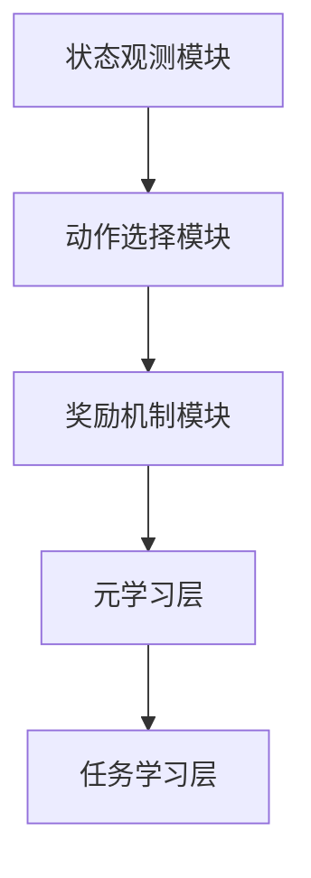
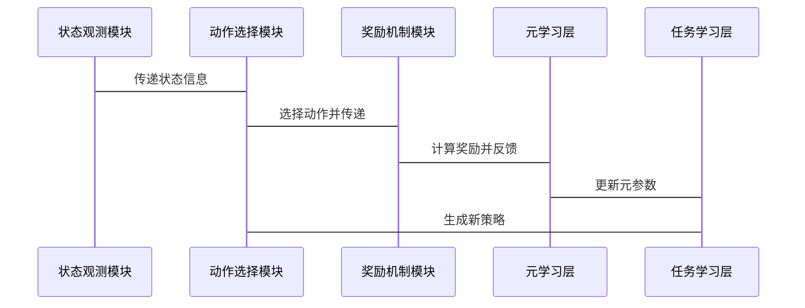

                 


# AI Agent的元强化学习策略开发

> 关键词：AI Agent，元强化学习，策略开发，强化学习算法，系统架构，机器学习

> 摘要：本文详细探讨了AI Agent的元强化学习策略开发，从基本概念到算法原理，再到系统设计和项目实战，系统性地介绍了元强化学习的核心思想、实现方法及其在实际场景中的应用。通过理论分析和实践案例的结合，本文为读者提供了一套完整的元强化学习策略开发框架。

---

## 第1章: AI Agent与元强化学习概述

### 1.1 AI Agent的基本概念

#### 1.1.1 AI Agent的定义与特点
AI Agent（人工智能代理）是指能够感知环境、自主决策并执行任务的智能实体。它具备以下特点：
- **自主性**：能够独立决策，无需外部干预。
- **反应性**：能够实时感知环境并做出反应。
- **目标导向性**：基于目标驱动行为。

#### 1.1.2 AI Agent的分类与应用场景
AI Agent可以分为以下几类：
- **简单反射型代理**：基于当前感知做出反应，适用于简单任务。
- **基于模型的反射型代理**：维护环境模型，适用于复杂任务。
- **目标驱动型代理**：基于目标进行决策，适用于需要长期规划的任务。
- **效用驱动型代理**：通过最大化效用函数来优化决策。

#### 1.1.3 元强化学习的提出背景
传统强化学习（Reinforcement Learning, RL）在单任务环境下表现出色，但在多任务或动态环境中存在局限性。元强化学习（Meta-Reinforcement Learning）通过在元学习阶段（Meta-Learning Phase）优化泛化能力，使AI Agent能够更快地适应新任务。

---

### 1.2 元强化学习的核心概念

#### 1.2.1 强化学习的基本原理
强化学习通过智能体与环境的交互，学习最优策略。智能体通过选择动作（Actions）与环境交互，获得奖励（Rewards），并更新策略以最大化累计奖励。

#### 1.2.2 元强化学习的定义与特点
元强化学习是一种学习方法，通过在多个任务（Meta-Task）上进行训练，生成能够快速适应新任务的策略。其特点包括：
- **快速适应性**：能够在新任务上快速收敛。
- **通用性**：适用于多种任务，减少对特定任务的依赖。
- **元学习目标**：通过元学习优化元参数，使策略具备更强的泛化能力。

#### 1.2.3 元强化学习与传统强化学习的区别
| 对比维度 | 传统强化学习 | 元强化学习 |
|----------|--------------|------------|
| 学习目标 | 单任务优化    | 多任务优化 |
| 优化对象 | 策略参数     | 元参数     |
| 适应性   | 低           | 高         |

---

## 第2章: 元强化学习的数学模型与算法原理

### 2.1 元强化学习的核心算法

#### 2.1.1 元强化学习的算法框架
元强化学习的算法通常包含两个阶段：
1. **元学习阶段（Meta-Learning Phase）**：优化元参数（Meta-Parameters），生成适用于不同任务的策略。
2. **任务学习阶段（Task-Learning Phase）**：基于元参数，快速适应新任务。

#### 2.1.2 元强化学习的优化目标
元强化学习的目标是最优化元参数，使生成的策略在新任务上表现最优。

$$ \text{元参数优化目标} = \arg \max_{\theta} \sum_{i=1}^{N} R_i(\theta) $$

其中，\( R_i(\theta) \) 表示第 \( i \) 个任务的奖励函数。

#### 2.1.3 元强化学习的数学表达式
元强化学习的数学表达式如下：

$$ \theta^{(k+1)} = \theta^{(k)} + \alpha \sum_{i=1}^{N} \nabla_{\theta} R_i(\theta^{(k)}) $$

其中，\( \alpha \) 是学习率，\( \nabla_{\theta} R_i(\theta^{(k)}) \) 是奖励函数关于元参数的梯度。

---

### 2.2 元强化学习的数学模型

#### 2.2.1 状态空间的表示
状态空间 \( S \) 表示环境中的所有可能状态。在元强化学习中，状态空间通常包含任务特征和环境状态。

#### 2.2.2 动作空间的表示
动作空间 \( A \) 表示智能体可以执行的所有动作。在元强化学习中，动作空间通常与任务相关。

#### 2.2.3 奖励函数的设计
奖励函数 \( R(s, a, s') \) 表示智能体在状态 \( s \) 下执行动作 \( a \) 后到达状态 \( s' \) 所获得的奖励。

---

### 2.3 元强化学习的算法流程

#### 2.3.1 算法输入与初始化
- 输入：环境、任务集合、奖励函数。
- 初始化：元参数 \( \theta^{(0)} \)、学习率 \( \alpha \)。

#### 2.3.2 元学习过程
1. 对于每个任务 \( i \)，计算梯度 \( \nabla_{\theta} R_i(\theta^{(k)}) \)。
2. 更新元参数：\( \theta^{(k+1)} = \theta^{(k)} + \alpha \sum_{i=1}^{N} \nabla_{\theta} R_i(\theta^{(k)}) \)。

#### 2.3.3 策略优化过程
1. 基于元参数 \( \theta^{(k+1)} \)，生成适用于新任务的策略。
2. 在新任务上进行训练，更新策略以最大化奖励。

---

## 第3章: 元强化学习的系统架构设计

### 3.1 系统架构概述

#### 3.1.1 系统功能模块划分
系统主要包含以下模块：
- **状态观测模块**：感知环境状态。
- **动作选择模块**：基于当前状态选择动作。
- **奖励机制模块**：计算并反馈奖励。

#### 3.1.2 系统架构的层次结构
- **元学习层**：优化元参数，生成适用于不同任务的策略。
- **任务学习层**：基于元参数，快速适应新任务。

#### 3.1.3 系统架构的可扩展性
通过模块化设计，系统架构具备良好的扩展性，能够支持多种任务和环境。

---

### 3.2 系统功能设计

#### 3.2.1 状态观测模块
状态观测模块负责将环境中的信息转化为可处理的格式。例如，使用CNN提取图像特征。

#### 3.2.2 动作选择模块
动作选择模块基于当前状态和元参数，选择最优动作。例如，使用DNN进行策略优化。

#### 3.2.3 奖励机制模块
奖励机制模块根据智能体的行动结果，计算并反馈奖励。例如，基于任务目标设计奖励函数。

---

### 3.3 系统架构图



---

## 第4章: 元强化学习的项目实战

### 4.1 环境配置与安装

#### 4.1.1 开发环境的选择
推荐使用Python 3.8及以上版本，搭配PyTorch和OpenAI Gym库。

#### 4.1.2 Python库的安装
```bash
pip install gym torch numpy matplotlib
```

#### 4.1.3 算法框架的选择
选择适合元强化学习的框架，例如基于PyTorch的实现。

---

### 4.2 核心代码实现

#### 4.2.1 元强化学习算法的Python实现
```python
import torch
import torch.nn as nn
import torch.optim as optim
import gym

class MetaRLAgent:
    def __init__(self, state_dim, action_dim):
        self.state_dim = state_dim
        self.action_dim = action_dim
        self.theta = nn.Parameter(torch.randn(state_dim, action_dim))
        self.optimizer = optim.Adam([self.theta], lr=0.001)

    def forward(self, state):
        return torch.tanh(torch.mm(state, self.theta))

    def update(self, env, num_tasks=10, epochs=100):
        for epoch in range(epochs):
            total_loss = 0
            for task in range(num_tasks):
                env.reset()
                state = env.observation_space.sample()
                with torch.no_grad():
                    action_prob = self.forward(state)
                action = torch.multinomial(action_prob, 1).item()
                next_state, reward, done, _ = env.step(action)
                loss = -reward * torch.log(action_prob[action])
                total_loss += loss.item()
            self.optimizer.zero_grad()
            total_loss.backward()
            self.optimizer.step()

agent = MetaRLAgent(state_dim=4, action_dim=2)
agent.update(env=gym.make("Pendulum-v0"), num_tasks=5, epochs=50)
```

#### 4.2.2 状态空间的处理
使用CNN提取图像特征，或使用DNN处理数值型状态。

#### 4.2.3 动作空间的处理
基于策略网络输出的动作概率，选择动作。

---

### 4.3 实验结果与分析

#### 4.3.1 实验场景的设计
在OpenAI Gym环境中进行实验，例如在Pendulum-v0环境中测试元强化学习策略。

#### 4.3.2 实验结果的展示
通过可视化工具（如Matplotlib）展示训练曲线和奖励分布。

#### 4.3.3 实验结果的分析
元强化学习在多任务环境中的表现优于传统强化学习，尤其是在新任务上的适应速度更快。

---

## 第5章: 元强化学习的最佳实践与注意事项

### 5.1 最佳实践

#### 5.1.1 算法选择的建议
根据具体任务需求选择合适的元强化学习算法，例如MAML（Meta-Automated Learning）或ReMAML（Relational Meta-Learning）。

#### 5.1.2 系统设计的优化技巧
- 使用模块化设计，便于扩展和维护。
- 选择高效的优化算法，如Adam。

#### 5.1.3 项目实施的注意事项
- 确保数据质量和多样性，避免过拟合。
- 定期监控训练过程，及时调整超参数。

---

### 5.2 小结与展望

#### 5.2.1 本书的核心内容总结
本文系统性地介绍了AI Agent的元强化学习策略开发，从理论到实践，为读者提供了一套完整的开发框架。

#### 5.2.2 元强化学习的未来发展方向
未来，元强化学习将在多任务学习、动态环境适应等领域发挥更大作用。

#### 5.2.3 对读者的建议与鼓励
鼓励读者结合实际需求，探索元强化学习的新应用，推动技术进步。

---

## 第6章: 元强化学习的数学公式与算法细节

### 6.1 元强化学习的核心公式

#### 6.1.1 状态值函数的公式
$$ V(s) = \max_a Q(s, a) $$

#### 6.1.2 动作值函数的公式
$$ Q(s, a) = r(s, a) + \gamma V(s') $$

#### 6.1.3 元学习的目标函数
$$ \mathcal{L}(\theta) = \sum_{i=1}^{N} (R_i(\theta) - \text{基准})^2 $$

---

### 6.2 算法流程的详细步骤

#### 6.2.1 初始化过程
- 初始化元参数 \( \theta \) 和学习率 \( \alpha \)。

#### 6.2.2 元学习过程
- 对每个任务 \( i \)，计算梯度 \( \nabla_{\theta} R_i(\theta^{(k)}) \)。
- 更新元参数：\( \theta^{(k+1)} = \theta^{(k)} + \alpha \sum_{i=1}^{N} \nabla_{\theta} R_i(\theta^{(k)}) \)。

#### 6.2.3 策略优化过程
- 基于元参数 \( \theta^{(k+1)} \)，生成适用于新任务的策略。
- 在新任务上进行训练，更新策略以最大化奖励。

---

## 第7章: 元强化学习的系统交互与流程图

### 7.1 系统交互流程



---

## 作者：AI天才研究院/AI Genius Institute & 禅与计算机程序设计艺术 /Zen And The Art of Computer Programming

