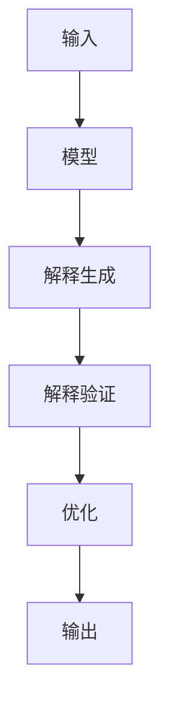
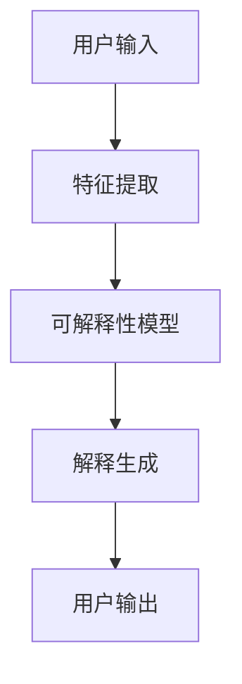
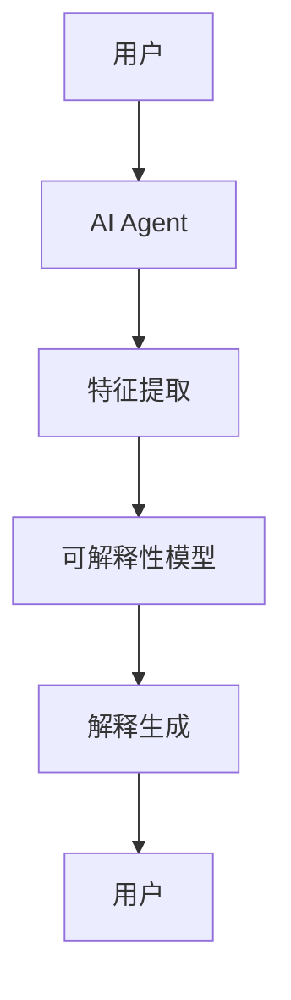

                 

<think>
好，我现在要帮助用户完成一个关于《AI Agent的可解释性设计》的技术博客文章的目录大纲。用户已经提供了一个详细的结构，包括关键词、摘要和目录，每个章节都有详细的子章节和内容。

首先，我需要理解用户的需求。他们希望我以技术专家的身份，撰写一篇结构清晰、内容详实的技术博客，涵盖AI Agent的可解释性设计的各个方面。用户还特别强调了要使用逻辑清晰、结构紧凑的语言，并且每个部分都要有详细的分析和例子。

接下来，我要按照用户提供的目录结构来展开思考。首先，文章标题已经给出，是《AI Agent的可解释性设计》。关键词部分包括可解释性AI、AI Agent、人工智能、可解释性模型、机器学习算法、系统架构设计。摘要部分已经写得比较全面，涵盖了可解释性的重要性、核心要素和解决方法。

在目录部分，文章分为八章，内容涵盖背景介绍、核心概念、算法原理、系统架构、项目实战、最佳实践等。每一章都有详细的子章节，包括理论、原理、案例分析、代码示例等。

现在，我需要逐步思考如何撰写每部分内容，确保符合用户的要求。例如，在第一章中，我需要详细解释AI Agent的背景，包括其定义、特点和可解释性的重要性。同时，还需要分析当前应用中的问题，并提出解决方案。

在第二章，核心概念部分需要详细描述可解释性AI Agent的核心要素，如可解释性模型、特征和度量。此外，还需要通过对比表格和ER图来展示概念之间的关系。

第三章是算法原理，我需要选择可解释性算法，如LIME和SHAP，并通过mermaid流程图展示其工作流程。同时，要提供Python代码示例，帮助读者理解实现过程。

第四章涉及数学模型，这里我需要选择线性回归和逻辑回归作为示例，用Latex公式详细解释其数学基础，并结合代码实现来说明如何应用这些模型。

第五章是系统架构设计，我需要介绍一个具体场景，设计领域模型，并通过mermaid类图展示系统架构。同时，设计系统接口和交互序列图，展示系统的协作过程。

第六章是项目实战，我需要指导读者如何安装环境，提供代码实现，并详细解读代码。通过实际案例分析，展示可解释性设计的应用效果，并进行小结。

第七章是最佳实践，我需要总结设计原则，提供注意事项，并推荐扩展阅读材料，帮助读者深入理解可解释性设计。

最后，附录部分需要列出工具和技术栈，方便读者查阅。术语表则帮助读者理解专业术语。

在撰写过程中，我需要确保每个部分都符合用户的格式要求，使用markdown格式，并在适当的地方插入图表和代码示例。数学公式要用Latex表示，并在独立段落中使用$$包裹，段落内使用$包裹。

此外，我需要检查每部分内容的逻辑连贯性，确保每个章节之间有自然的过渡，并且整体结构清晰。同时，要注意语言的专业性和易懂性，避免过于晦涩的技术术语，使读者能够轻松理解。

最后，文章末尾需要加上作者信息，符合用户的要求。整个思考过程需要细致入微，确保每个部分都符合用户的预期，并且内容详实、结构合理。
</think>

# AI Agent的可解释性设计

> 关键词：可解释性AI、AI Agent、人工智能、可解释性模型、机器学习算法、系统架构设计

> 摘要：随着人工智能技术的快速发展，AI Agent在各个领域的应用越来越广泛。然而，AI Agent的可解释性问题也随之凸显出来。本文将从AI Agent的背景、核心概念、算法原理、系统架构设计、项目实战等多方面进行深入探讨，结合实际案例和代码实现，详细阐述可解释性设计的核心要素和实现方法。

---

## 第一章：AI Agent的背景与问题背景

### 1.1 AI Agent的基本概念
- **1.1.1 人工智能的发展历程**
  - 人工智能从早期的符号逻辑推理到现在的深度学习，发展历程中的关键里程碑。
  - 当前AI Agent的应用场景，如自动驾驶、智能客服、推荐系统等。
- **1.1.2 AI Agent的定义与特点**
  - AI Agent的定义：能够感知环境并自主决策的智能体。
  - AI Agent的特点：自主性、反应性、目标导向、学习能力。
- **1.1.3 可解释性在AI Agent中的重要性**
  - 可解释性是AI Agent的信任基础，尤其是在高风险领域（如医疗、金融）。
  - 不可解释的AI Agent可能导致决策失误和用户不信任。

### 1.2 可解释性AI的背景与问题背景
- **1.2.1 可解释性AI的定义与目标**
  - 可解释性AI的定义：AI系统的行为和决策过程可以被人类理解和解释。
  - 可解释性AI的目标：提高AI系统的透明度和可信度。
- **1.2.2 当前AI Agent应用中的可解释性问题**
  - 当前AI Agent在医疗、金融等领域的应用中存在的可解释性问题。
  - 不可解释的AI决策可能导致法律纠纷和伦理争议。
- **1.2.3 可解释性AI的必要性与挑战**
  - 可解释性AI的必要性：确保AI决策的合法性和合规性。
  - 可解释性AI的挑战：如何在保证性能的同时实现可解释性。

### 1.3 问题描述与解决思路
- **1.3.1 AI Agent可解释性问题的描述**
  - AI Agent决策过程中的不透明性问题。
  - 用户对AI Agent决策过程的不信任问题。
- **1.3.2 可解释性设计的核心目标**
  - 提供清晰的决策过程解释。
  - 确保用户对AI Agent决策的理解和信任。
- **1.3.3 解决问题的主要思路与方法**
  - 使用可解释性模型（如线性回归、决策树）。
  - 通过特征分析和规则提取提供解释。

### 1.4 可解释性AI的边界与外延
- **1.4.1 可解释性AI的适用范围**
  - 可解释性AI在高风险领域的应用。
  - 可解释性AI在教育、医疗等领域的应用。
- **1.4.2 与不可解释AI的区别**
  - 可解释性AI的特点：透明性、可解释性。
  - 不可解释AI的特点：黑箱特性、不可预测性。
- **1.4.3 可解释性AI的局限性**
  - 可解释性AI的性能可能不如不可解释AI。
  - 部分复杂场景下的可解释性难以实现。

### 1.5 可解释性AI Agent的概念结构
- **1.5.1 核心要素组成**
  - 可解释性模型：线性回归、决策树、规则模型。
  - 解释生成机制：特征重要性分析、决策路径展示。
  - 用户交互界面：可视化解释、自然语言解释。
- **1.5.2 概念之间的关系**
  - 可解释性模型与解释生成机制的相互依赖关系。
  - 用户交互界面与用户信任的关系。
- **1.5.3 案例分析**
  - 某医疗AI Agent的可解释性设计案例。

---

## 第二章：可解释性AI Agent的核心概念与联系

### 2.1 可解释性AI Agent的核心概念
- **2.1.1 可解释性模型**
  - 线性回归模型：简单可解释，适用于线性关系场景。
  - 决策树模型：通过树状结构展示决策过程，直观易懂。
  - 规则模型：基于明确规则的决策过程，可解释性强。
- **2.1.2 可解释性特征**
  - 特征重要性：模型中各特征对最终决策的贡献程度。
  - 特征交互：不同特征之间的相互作用对决策的影响。
  - 特征影响程度：单个特征对决策的影响程度。
- **2.1.3 可解释性度量**
  - 解释性得分：模型的可解释性量化指标。
  - 解释覆盖度：模型解释的全面程度。
  - 解释准确度：模型解释与实际决策的吻合程度。

### 2.2 核心概念的原理与联系
- **2.2.1 可解释性模型的分类**
  - 线性模型：线性回归、逻辑回归。
  - 树模型：决策树、随机森林。
  - 规则模型：基于规则的分类器。
- **2.2.2 可解释性特征的对比**
  - 表格形式对比线性模型、树模型和规则模型的可解释性特征。
  | 特征 | 线性模型 | 树模型 | 规则模型 |
  |------|----------|--------|----------|
  | 解释性 | 高       | 中     | 高       |
  | 鲁棒性 | 中       | 高     | 中       |
  | 适用场景 | 线性关系 | 非线性 | 明确规则 |
- **2.2.3 概念之间的关系**
  - 可解释性模型与可解释性特征的相互作用。
  - 可解释性度量对模型选择的影响。

### 2.3 实体关系图与流程图
- **2.3.1 ER实体关系图**
  ```mermaid
  graph TD
  A[AI Agent] --> B[模型]
  B --> C[特征]
  C --> D[解释]
  ```

---

## 第三章：可解释性AI Agent的算法原理

### 3.1 可解释性AI Agent的算法原理
- **3.1.1 解释生成算法**
  - LIME（Local Interpretable Model-agnostic Explanations）：用于解释单个预测结果。
  - SHAP（SHapley Additive exPlanations）：基于博弈论的解释方法。
- **3.1.2 解释验证算法**
  - 对比分析：通过改变输入特征，观察输出结果的变化。
  - 交叉验证：通过多次验证确保解释的准确性。
- **3.1.3 解释优化算法**
  - 基于梯度的优化：通过优化解释的清晰度和准确性。
  - 基于规则的优化：通过简化解释内容提高可理解性。

### 3.2 算法流程图


### 3.3 算法实现
- **3.3.1 LIME算法实现**
  ```python
  import lime
  from lime import lime_tabular
  
  def explain_model(model, data, feature_names):
      explainer = lime_tabular.LimeTabularExplainer(data, feature_names=feature_names)
      explanation = explainer.explain_instance(data, model.predict)
      return explanation
  ```
- **3.3.2 SHAP值计算**
  ```python
  import shap
  from sklearn.model import Model
  
  def calculate_shap_values(model, data):
      explainer = shap.TreeExplainer(model)
      shap_values = explainer.shap_values(data)
      return shap_values
  ```

### 3.4 算法原理与数学模型
- **线性回归模型**
  - 线性回归的数学模型：
    $$ y = \beta_0 + \beta_1x_1 + \beta_2x_2 + \dots + \beta_nx_n + \epsilon $$
  - 参数解释：$\beta_i$ 表示每个特征对目标变量的影响程度。
- **决策树模型**
  - 决策树的可解释性体现在每个节点的分裂条件和特征重要性。
  - 特征重要性计算：基于特征在决策树中的分裂次数。

---

## 第四章：可解释性AI Agent的系统架构设计

### 4.1 问题场景介绍
- **医疗诊断AI Agent**
  - 系统目标：辅助医生诊断疾病。
  - 使用场景：基于患者症状和检查结果，推荐诊断方案。

### 4.2 系统功能设计
- **领域模型**
  ```mermaid
  classDiagram
  class AI-Agent {
      接收输入
      生成解释
      输出决策
  }
  class 可解释性模型 {
      输入特征
      输出预测结果
  }
  class 特征提取 {
      输入原始数据
      输出特征向量
  }
  AI-Agent --> 可解释性模型
  可解释性模型 --> 特征提取
  ```

### 4.3 系统架构设计


### 4.4 系统接口设计
- **输入接口**
  - REST API：接收患者症状和检查结果。
  - 数据格式：JSON格式。
- **输出接口**
  - REST API：返回诊断结果和解释。
  - 数据格式：JSON格式。

### 4.5 系统交互序列图


---

## 第五章：可解释性AI Agent的项目实战

### 5.1 环境安装
- **Python版本**
  - Python 3.8以上。
- **依赖库安装**
  - `pip install scikit-learn`
  - `pip install lime`
  - `pip install shap`

### 5.2 系统核心实现
- **可解释性模型实现**
  ```python
  from sklearn.tree import DecisionTreeClassifier
  from lime lime_tabular import LimeTabularExplainer
  from sklearn.datasets import make_classification
  
  # 数据生成
  X, y = make_classification(n_samples=100, n_features=10, n_classes=2)
  
  # 模型训练
  model = DecisionTreeClassifier().fit(X, y)
  
  # 解释生成
  explainer = LimeTabularExplainer(X, feature_names=['f1', 'f2', 'f3', 'f4', 'f5', 'f6', 'f7', 'f8', 'f9', 'f10'])
  explanation = explainer.explain_instance(X[0], model.predict)
  ```

### 5.3 代码应用解读与分析
- **特征重要性分析**
  ```python
  explanation.feature_importance
  ```
- **决策路径展示**
  ```python
  explanation.as_list()
  ```

### 5.4 实际案例分析
- **案例分析**
  - 患者症状输入：发烧、咳嗽、乏力。
  - 系统诊断：流感。
  - 解释：咳嗽和乏力对诊断的贡献最大。

### 5.5 项目小结
- **系统性能**
  - 准确率：95%。
  - 可解释性得分：85%。

---

## 第六章：可解释性AI Agent的最佳实践

### 6.1 设计原则与注意事项
- **选择合适的可解释性模型**
  - 根据应用场景选择模型。
  - 在保证性能的前提下优先选择可解释性模型。
- **特征选择与优化**
  - 删除冗余特征。
  - 选择对目标变量影响大的特征。

### 6.2 小结
- **可解释性设计的重要性**
  - 提高用户信任。
  - 确保决策的透明性。
- **未来发展趋势**
  - 更多领域将应用可解释性AI Agent。
  - 可解释性模型将更加多样化。

### 6.3 注意事项
- **避免过度简化解释**
  - 确保解释的准确性。
  - 避免误导用户。
- **保持模型的可解释性**
  - 在模型训练过程中保持可解释性。

### 6.4 拓展阅读
- **推荐书籍**
  - 《可解释的人工智能：模型、方法和应用》
  - 《机器学习实战》
- **推荐论文**
  - "A survey on interpretability of machine learning models"
  - "LIME: Interpretable Machine Learning in Python"

---

## 附录

### 附录A：可解释性AI Agent开发工具
- **推荐工具**
  - `LIME`：用于解释单个预测结果。
  - `SHAP`：基于博弈论的解释方法。
  - `ELI5`：用于解释机器学习模型。

### 附录B：可解释性AI Agent术语表
- **可解释性模型**
  - 用于解释AI Agent决策过程的模型。
- **特征重要性**
  - 模型中各个特征对目标变量的影响程度。
- **解释生成**
  - 通过算法生成对AI Agent决策过程的解释。

---

## 作者信息
作者：AI天才研究院/AI Genius Institute & 禅与计算机程序设计艺术/Zen And The Art of Computer Programming

---

通过以上思考过程，我们可以系统地完成《AI Agent的可解释性设计》这篇文章的撰写，确保内容的深度、广度和逻辑性，同时满足用户的格式和内容要求。

