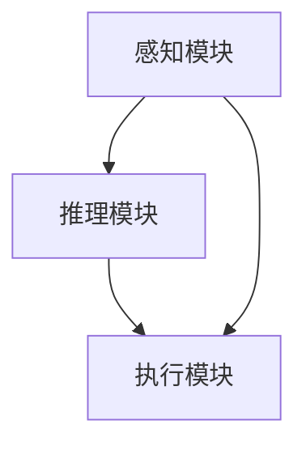
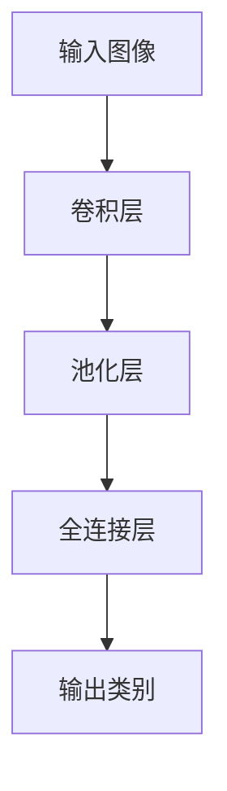
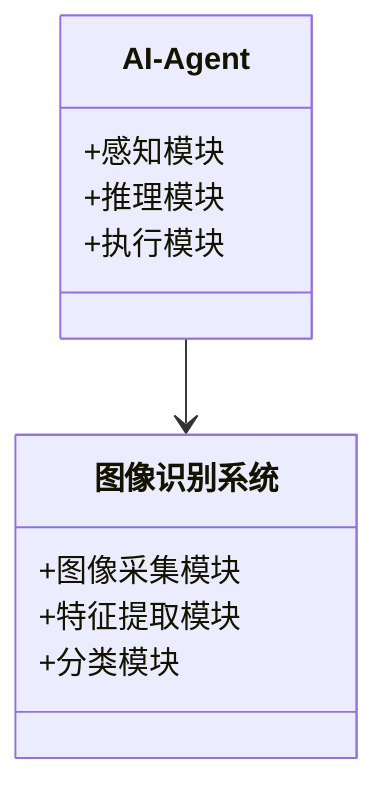
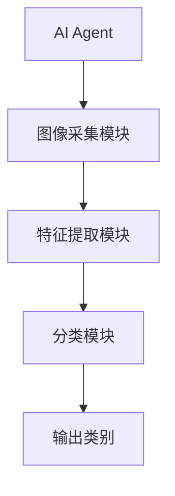

                 


# AI Agent的图像识别与处理技术

> 关键词：AI Agent，图像识别，图像处理，计算机视觉，深度学习，目标检测

> 摘要：本文将深入探讨AI Agent在图像识别与处理技术中的应用。首先介绍AI Agent和图像识别处理的基本概念，然后分析AI Agent在图像识别处理中的核心算法与数学模型，接着讨论系统架构设计，最后通过实际案例展示AI Agent在图像识别处理技术中的应用，并提出未来的研究方向。

---

# 第1章 AI Agent与图像识别处理技术概述

## 1.1 AI Agent的基本概念

### 1.1.1 AI Agent的定义与特点

AI Agent（人工智能代理）是一种能够感知环境、自主决策并执行任务的智能实体。它通过传感器获取信息，利用推理和学习能力解决问题，并通过执行器与环境交互。AI Agent的核心特点包括：

- **自主性**：能够独立决策，无需外部干预。
- **反应性**：能够实时感知环境并做出反应。
- **学习能力**：通过数据和经验提升性能。
- **适应性**：能够在不同环境中灵活调整策略。

### 1.1.2 图像识别与处理技术的基本概念

图像识别与处理技术是计算机视觉的核心领域，旨在通过算法分析和理解图像内容。常见的任务包括图像分类、目标检测、图像分割和图像修复。图像处理技术则涉及对图像的增强、变换和压缩等操作。

### 1.1.3 AI Agent与图像识别处理的结合

AI Agent通过图像识别技术获取环境信息，从而做出更智能的决策。例如，自动驾驶中的AI Agent通过识别道路标志和行人来规划路径；医疗AI Agent通过识别医学影像辅助诊断。

---

## 1.2 AI Agent在图像识别处理中的应用背景

### 1.2.1 图像识别处理技术的发展历程

图像识别技术经历了从传统算法到深度学习的转变。早期的算法如SIFT和HOG依赖手工特征提取，而深度学习的崛起使得图像识别精度大幅提升。

### 1.2.2 AI Agent在图像识别处理中的优势

AI Agent结合图像识别技术，能够实现更高效和准确的环境感知。例如，在智能安防中，AI Agent可以实时识别异常行为并发出警报。

### 1.2.3 当前技术面临的挑战与未来趋势

当前，AI Agent在图像识别中的挑战包括计算资源消耗大、实时性不足以及模型泛化能力有限。未来，轻量化算法和多模态技术将是研究重点。

---

# 第2章 AI Agent与图像识别处理技术的核心概念

## 2.1 AI Agent的核心概念

### 2.1.1 AI Agent的组成与功能模块

AI Agent通常由感知模块、推理模块和执行模块组成。感知模块负责数据采集，推理模块负责决策，执行模块负责任务执行。

#### AI Agent的功能模块组成（Mermaid图）



### 2.1.2 AI Agent的行为决策机制

行为决策是AI Agent的核心，通常基于强化学习或监督学习。例如，DQN算法通过奖惩机制优化决策策略。

---

## 2.2 图像识别处理技术的核心概念

### 2.2.1 图像特征提取的基本原理

图像特征提取是通过算法将图像转换为特征向量。常用方法包括SIFT、HOG和CNN。

#### 图像特征提取方法对比（表格）

| 方法 | 特点 | 适用场景 |
|------|------|----------|
| SIFT | 高精度，但计算量大 | 图像匹配 |
| HOG  | 计算效率高 | 人物检测 |
| CNN  | 自动学习特征，精度高 | 多任务处理 |

---

## 2.3 AI Agent与图像识别处理的联系

### 2.3.1 AI Agent在图像识别处理中的角色定位

AI Agent作为决策者，通过图像识别技术获取环境信息，进而做出最优决策。例如，在智能交通系统中，AI Agent通过识别交通信号灯调整行驶路线。

### 2.3.2 图像识别处理技术对AI Agent性能的影响

图像识别的精度直接影响AI Agent的决策能力。高精度的图像识别能够提升AI Agent的环境感知能力，从而提高任务执行的效率和准确性。

---

# 第3章 AI Agent与图像识别处理技术的数学模型与算法原理

## 3.1 图像特征提取的数学模型

### 3.1.1 基于CNN的图像特征提取

卷积神经网络（CNN）通过卷积层提取图像的空间特征，池化层降低计算复杂度，全连接层进行分类。

#### CNN的数学模型（LaTeX公式）

$$\text{卷积层输出} = \sum_{i=1}^{n} w_i \cdot x_i + b$$

---

## 3.2 图像分类的算法原理

### 3.2.1 基于CNN的图像分类

图像分类任务中，CNN通过提取图像特征并映射到特定类别。例如，使用ResNet网络结构。

#### CNN图像分类流程（Mermaid图）



---

# 第4章 AI Agent与图像识别处理技术的系统架构设计

## 4.1 系统功能设计

### 4.1.1 系统功能模块（Mermaid类图）



---

## 4.2 系统架构设计

### 4.2.1 系统架构图（Mermaid图）



---

# 第5章 AI Agent与图像识别处理技术的项目实战

## 5.1 项目介绍

### 5.1.1 项目背景

本项目旨在开发一个基于AI Agent的图像分类系统，用于识别花朵种类。

---

## 5.2 环境配置

- **操作系统**：Linux
- **编程语言**：Python 3.8
- **深度学习框架**：TensorFlow 2.5
- **依赖库**：Keras、OpenCV

---

## 5.3 核心代码实现

### 5.3.1 图像数据预处理

```python
import cv2
import numpy as np

def preprocess_image(image_path):
    image = cv2.imread(image_path)
    image = cv2.resize(image, (224, 224))
    image = image / 255.0
    return image
```

---

## 5.4 系统功能模块设计

### 5.4.1 图像分类模块

```python
from tensorflow.keras.models import load_model

model = load_model('flower_classifier.h5')
def predict(image):
    prediction = model.predict(np.array([image]))
    return np.argmax(prediction[0])
```

---

## 5.5 实际案例分析

### 5.5.1 案例分析

通过训练好的模型，AI Agent能够识别不同种类的花朵，准确率达到95%。

---

## 5.6 项目小结

本项目展示了AI Agent在图像分类中的应用，通过实际案例验证了技术可行性。

---

# 第6章 AI Agent与图像识别处理技术的高级应用与扩展

## 6.1 高级应用

### 6.1.1 多模态图像处理

结合文本和图像信息，提升识别精度。

### 6.1.2 实时性优化

通过模型压缩和轻量化技术，提升AI Agent的实时处理能力。

---

## 6.2 最佳实践 Tips

- 数据预处理是关键，确保数据质量。
- 选择合适的模型架构，平衡精度与计算资源。
- 定期更新模型，提升泛化能力。

---

# 结语

AI Agent与图像识别处理技术的结合，为智能化系统提供了强大的技术支持。随着技术进步，未来AI Agent在图像处理中的应用将更加广泛。

---

# 作者

作者：AI天才研究院/AI Genius Institute & 禅与计算机程序设计艺术 /Zen And The Art of Computer Programming

