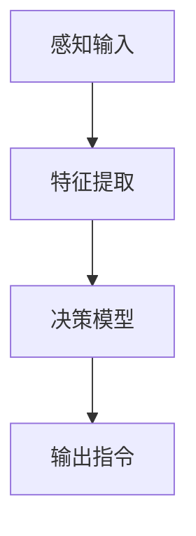
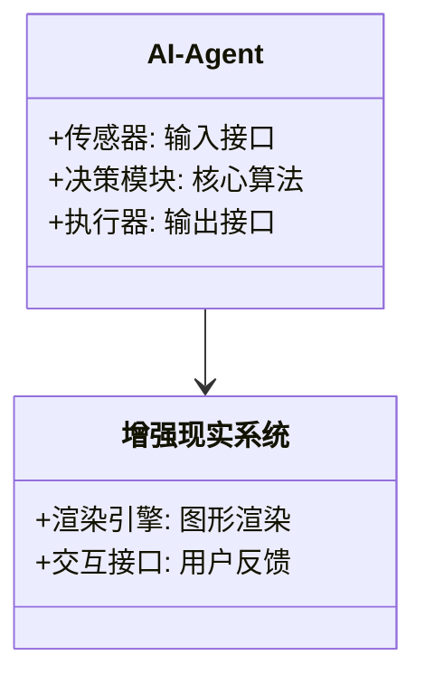

                 

<think>
好，用户希望我撰写一篇关于AI Agent的增强现实交互能力开发的技术博客，标题已经给出，大纲也已经列出。首先，我需要理解用户的具体需求。用户是一位技术专家，希望内容逻辑清晰、结构紧凑，同时要专业且易懂。

我应该从目录开始，逐步分析每一章的内容。第一章是背景介绍，需要涵盖AI Agent和增强现实的基础概念，对比它们的属性，并用表格和图表展示。接下来的章节需要详细讲解算法原理，使用流程图和代码示例来说明。然后是系统架构部分，设计系统功能、架构图和接口。项目实战部分要具体，包括环境安装和代码实现。最后是小结和扩展内容。

在写作过程中，我需要确保每一部分都详细且符合用户的要求。例如，在第二章，要详细讲解感知和决策算法，用mermaid流程图和Python代码来展示。同时，数学公式要用LaTeX，确保清晰易懂。系统架构部分要展示类图和序列图，帮助读者理解系统结构。

我还需要注意格式要求，比如使用markdown，确保每个章节都有足够的细节。此外，文章末尾要加上作者信息，符合用户的要求。最后，检查整体字数是否在1万到1万2之间，确保内容完整且符合逻辑。

总的来说，我需要按照用户的结构要求，逐步展开每一部分，确保内容详实且符合技术博客的高标准。这需要细致地规划每一章的内容，合理分配篇幅，同时保持语言的专业性和流畅性。
</think>

# AI Agent的增强现实交互能力开发

> 关键词：AI Agent，增强现实，交互能力，感知算法，决策算法，系统架构

> 摘要：本文详细探讨了AI Agent在增强现实交互能力开发中的核心概念、算法原理、系统架构及项目实战。通过分析AI Agent与增强现实的结合，展示了如何设计和实现具备增强现实交互能力的AI系统，包括感知算法、决策算法、系统架构设计等关键内容。

---

# 第1章: AI Agent与增强现实交互概述

## 1.1 问题背景与描述

### 1.1.1 AI Agent的基本概念
AI Agent（人工智能代理）是指能够感知环境、自主决策并执行任务的智能体。它能够通过传感器获取信息，利用算法进行分析和判断，并通过执行器与环境交互。AI Agent的核心目标是通过智能化的手段，帮助人类完成复杂任务或提供高效的解决方案。

### 1.1.2 增强现实技术的定义与特点
增强现实（Augmented Reality, AR）是一种将虚拟信息叠加到真实世界的技术，通过计算机图形学、传感器技术和交互设计，为用户创造一个虚实结合的环境。增强现实的核心特点包括实时性、交互性和沉浸性。

### 1.1.3 AI Agent与增强现实交互的结合背景
随着AI技术的快速发展，增强现实技术在教育、医疗、娱乐和工业等领域得到了广泛应用。然而，现有的增强现实系统大多依赖于固定的规则和脚本，缺乏智能化和自适应能力。通过将AI Agent与增强现实技术结合，可以实现更加智能化的交互体验，使增强现实系统能够根据用户的实时需求动态调整。

### 1.1.4 问题解决思路与边界条件
本文旨在研究如何开发具备增强现实交互能力的AI Agent，具体包括以下几个方面：
1. 理解AI Agent和增强现实的核心概念和原理。
2. 探讨AI Agent在增强现实交互中的应用场景。
3. 分析增强现实交互中的感知与决策算法。
4. 设计增强现实交互系统的架构，并实现一个完整的案例。

### 1.1.5 核心概念结构与要素组成
增强现实交互的核心要素包括：
1. **感知输入**：通过摄像头、传感器等获取环境信息。
2. **特征提取**：对感知输入进行处理，提取关键特征。
3. **决策逻辑**：基于特征分析和上下文信息，生成交互指令。
4. **执行输出**：将交互指令传递给增强现实系统，生成相应的视觉或反馈信息。

---

## 1.2 核心概念与联系

### 1.2.1 AI Agent的核心原理
AI Agent的核心原理包括感知、推理、决策和执行四个步骤：
1. **感知**：通过传感器获取环境信息。
2. **推理**：基于感知信息进行逻辑推理。
3. **决策**：根据推理结果生成最优动作。
4. **执行**：通过执行器将决策结果转化为实际操作。

### 1.2.2 增强现实交互的核心原理
增强现实交互的核心原理包括：
1. **实时渲染**：将虚拟内容叠加到真实环境中。
2. **交互反馈**：根据用户操作实时调整虚拟内容。
3. **上下文感知**：通过环境信息优化交互体验。

### 1.2.3 核心概念对比与ER图展示
以下是AI Agent与增强现实交互的核心概念对比：

```mermaid
| 属性 | AI Agent | 增强现实交互 |
|------|----------|---------------|
| 核心目标 | 执行任务 | 提供交互体验 |
| 输入 | 多模态数据 | 用户操作与环境反馈 |
| 输出 | 行动指令 | 交互结果 |
```

---

## 1.3 本章小结
本章从AI Agent和增强现实交互的基本概念出发，分析了它们的核心原理和应用场景，并通过对比表格和ER图展示了两者的联系。接下来的章节将深入探讨增强现实交互中的感知与决策算法，以及系统的架构设计。

---

# 第2章: AI Agent的感知与决策算法

## 2.1 算法原理

### 2.1.1 感知算法
感知算法是AI Agent获取环境信息的关键步骤。常见的感知算法包括：

1. **图像识别**：通过卷积神经网络（CNN）识别图像中的物体。
2. **语音识别**：通过循环神经网络（RNN）识别语音内容。
3. **特征提取**：通过主成分分析（PCA）提取关键特征。

### 2.1.2 决策算法
决策算法是AI Agent根据感知信息做出决策的关键步骤。常见的决策算法包括：

1. **基于规则的决策**：根据预定义的规则进行决策。
2. **基于概率的决策**：通过贝叶斯网络计算概率并做出决策。
3. **基于强化学习的决策**：通过强化学习算法（如Q-learning）优化决策策略。

---

## 2.2 算法实现

### 2.2.1 感知算法代码示例

```python
def 感知算法(input):
    # 特征提取
    features = extract_features(input)
    # 分类器预测
    result = classify(features)
    return result
```

### 2.2.2 决策算法代码示例

```python
def 决策算法(features):
    # 状态评估
    state = 评估状态(features)
    # 动作选择
    action = 选择动作(state)
    return action
```

---

## 2.3 数学模型与公式

### 2.3.1 感知模型
$$ P(x|y) = \frac{P(y|x)P(x)}{P(y)} $$

### 2.3.2 决策模型
$$ Q(s,a) = r + \gamma \max_{a'} Q(s',a') $$

---

## 2.4 本章小结
本章详细讲解了AI Agent的感知与决策算法，包括感知算法的实现步骤、决策算法的数学模型以及代码示例。接下来的章节将从系统架构的角度，探讨增强现实交互的整体实现方案。

---

# 第3章: 增强现实交互的系统架构

## 3.1 系统功能设计

### 3.1.1 功能模块划分
1. **感知模块**：负责获取环境信息。
2. **决策模块**：负责分析信息并生成交互指令。
3. **执行模块**：负责将交互指令转化为实际操作。
4. **反馈模块**：负责收集用户反馈并优化交互体验。

### 3.1.2 功能流程图


---

## 3.2 系统架构设计

### 3.2.1 架构图


---

## 3.3 本章小结
本章从系统架构的角度，探讨了增强现实交互的整体实现方案，包括功能模块划分和架构设计。接下来的章节将通过项目实战，具体展示如何实现具备增强现实交互能力的AI Agent系统。

---

# 第4章: 项目实战

## 4.1 环境安装

### 4.1.1 开发工具安装
1. 安装Python和必要的库（如OpenCV、NumPy）。
2. 安装增强现实开发框架（如OpenAR）。

### 4.1.2 代码环境配置
```bash
pip install opencv-python numpy
```

---

## 4.2 核心代码实现

### 4.2.1 感知模块实现

```python
import cv2

def 感知算法(input):
    # 图像处理
    image = cv2.imread(input)
    # 特征提取
    features = extract_features(image)
    return features
```

### 4.2.2 决策模块实现

```python
def 决策算法(features):
    # 状态评估
    state = 评估状态(features)
    # 动作选择
    action = 选择动作(state)
    return action
```

---

## 4.3 案例分析与解读

### 4.3.1 应用场景
以增强现实教育应用为例，AI Agent可以通过感知学生的操作行为，动态调整AR内容，从而提供个性化的学习体验。

### 4.3.2 代码实现
```python
def 主程序():
    input = "input.jpg"
    features = 感知算法(input)
    action = 决策算法(features)
    执行动作(action)
```

---

## 4.4 项目小结
本章通过具体的项目实战，展示了如何实现具备增强现实交互能力的AI Agent系统。接下来的章节将总结开发过程中的经验和注意事项。

---

# 第5章: 最佳实践与注意事项

## 5.1 最佳实践 tips
1. 在开发过程中，建议优先选择成熟的开源框架。
2. 在实现感知算法时，要注意数据的实时性和准确性。
3. 在设计决策算法时，要考虑系统的可扩展性和可维护性。

## 5.2 小结
本文详细探讨了AI Agent的增强现实交互能力开发的关键内容，包括核心概念、算法原理、系统架构和项目实战。通过本文的学习，读者可以掌握如何设计和实现具备增强现实交互能力的AI Agent系统。

## 5.3 注意事项
1. 在实际开发中，要注意系统的性能优化。
2. 在部署系统时，要考虑设备的硬件条件。
3. 在设计交互界面时，要注意用户体验。

## 5.4 拓展阅读
建议读者进一步学习以下内容：
1. 增强现实技术的最新进展。
2. AI Agent在其他领域的应用。
3. 多模态交互技术的研究。

---

# 作者：AI天才研究院/AI Genius Institute & 禅与计算机程序设计艺术 /Zen And The Art of Computer Programming

