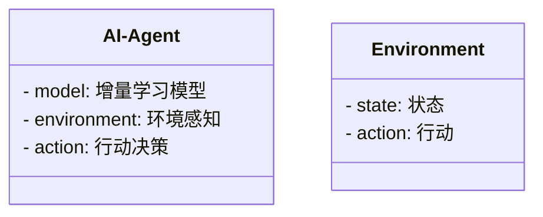
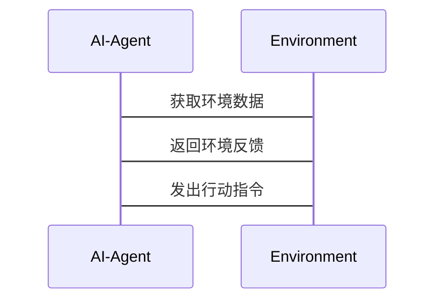

                 

<think>
嗯，我现在需要根据用户的指示，一步一步地撰写一篇关于《AI Agent的增量学习与持续适应》的技术博客文章。用户已经提供了一个详细的文章大纲，我需要按照这个大纲逐步完成每个部分的内容。

首先，我会从文章的标题开始。标题是《AI Agent的增量学习与持续适应》，关键词包括AI Agent、增量学习、持续适应、机器学习、在线学习、自适应系统。摘要部分需要简明扼�地概括文章的核心内容，说明AI Agent如何通过增量学习和持续适应来应对动态变化的环境。

接下来，我需要按照大纲中的章节结构逐步撰写每一部分。首先是背景介绍，包括AI Agent的基本概念、增量学习的背景和问题描述，以及持续适应的定义和边界。这部分需要确保读者能够理解AI Agent的基本概念，并明确增量学习和持续适应在AI Agent中的重要性。

然后是核心概念与联系，这里需要详细解释增量学习和持续适应的原理，包括它们的数学模型、特征对比以及概念结构。使用Mermaid流程图和表格来帮助读者理解。

接下来是算法原理部分，这里需要详细讲解增量学习和持续适应的核心算法，包括数学模型和公式，并用Python代码示例来说明。这部分需要确保代码清晰，数学推导详细，以便读者能够理解算法的工作原理。

系统分析与架构设计是关键部分，需要描述应用场景，设计系统功能，并用Mermaid图展示领域模型、架构设计和接口交互。这部分帮助读者理解如何将理论应用于实际系统设计中。

项目实战部分需要提供环境安装、代码实现和案例分析，帮助读者实际操作和测试。这需要详细的操作步骤和代码解释，确保读者能够顺利实现。

最后是最佳实践和总结，包括小结、注意事项和未来趋势，以及拓展阅读的建议。这部分帮助读者巩固所学内容，并引导他们进一步学习。

在整个撰写过程中，我需要确保每个部分的逻辑清晰，内容详细，语言专业且易懂。同时，要严格遵守格式要求，使用markdown格式，正确嵌入Mermaid图和LaTeX公式，确保文章结构完整，内容丰富。

现在，我开始撰写文章，确保每一部分都符合用户的要求，并逐步深入，帮助读者全面理解AI Agent的增量学习与持续适应。
</think>

# AI Agent的增量学习与持续适应

## 关键词：AI Agent，增量学习，持续适应，机器学习，在线学习，自适应系统

## 摘要：  
本文深入探讨AI Agent的增量学习与持续适应机制，分析其核心原理、算法实现、系统架构及实际应用，结合具体案例和代码示例，全面解析AI Agent如何通过持续学习和自适应能力应对动态环境的变化。

---

# 第一部分: AI Agent的增量学习与持续适应背景介绍

## 第1章: AI Agent的基本概念与问题背景

### 1.1 AI Agent的定义与核心特征

AI Agent（智能体）是指在环境中能够感知并自主行动以实现目标的实体。其核心特征包括：

- **自主性**：无需外部干预，自主决策。
- **反应性**：实时感知环境变化并做出反应。
- **目标导向性**：基于目标驱动行为。
- **学习能力**：通过经验改进性能。

AI Agent的应用场景广泛，如自动驾驶、智能助手、机器人等。

### 1.2 增量学习的背景与问题描述

增量学习是指模型在获取新数据时逐步更新，避免重新训练整个模型。其背景包括数据流场景（如实时数据）和存储限制场景（数据量大，无法一次性加载）。增量学习的核心问题是处理数据异构性和概念漂移。

### 1.3 持续适应的定义与边界

持续适应是指AI Agent在动态环境中不断优化自身模型和行为的能力。其边界包括计算资源限制、实时性要求和环境变化速度。

---

# 第二部分: AI Agent的增量学习与持续适应的核心概念

## 第2章: 增量学习与持续适应的核心原理

### 2.1 增量学习的原理

增量学习通过在线更新模型处理新数据，避免数据冗余。其数学模型包括线性回归增量学习模型：

$$ w_{new} = w_{old} + \eta (y - \hat{y}) $$

其中，$\eta$是学习率，$y$是真实值，$\hat{y}$是预测值。

### 2.2 持续适应的机制

持续适应通过反馈机制优化模型，应对环境变化。其数学模型包括自适应支持向量机：

$$ \min \frac{1}{2}||w||^2 + C \sum_{i=1}^n \xi_i $$

### 2.3 增量学习与持续适应的关系

增量学习与持续适应相辅相成，增量学习处理数据更新，持续适应应对环境变化。

---

# 第三部分: 增量学习与持续适应的算法原理

## 第3章: 增量学习算法的详细讲解

### 3.1 增量学习算法的分类

- **在线增量学习**：实时更新模型。
- **批量增量学习**：批量更新模型。
- **混合增量学习**：结合在线和批量学习。

### 3.2 增量学习算法的数学模型

如线性回归增量学习模型：

$$ w_{new} = w_{old} + \eta (y - \hat{y}) $$

### 3.3 增量学习算法的实现

Python代码实现：

```python
def incremental_learning(X, y, w_old, eta):
    w_new = w_old + eta * (y - predict(X, w_old))
    return w_new
```

---

# 第四部分: 系统分析与架构设计

## 第4章: 系统功能设计与架构

### 4.1 领域模型设计

使用Mermaid类图描述领域模型：



### 4.2 系统架构设计

使用Mermaid架构图展示系统架构：


### 4.3 接口与交互设计

使用Mermaid序列图展示接口交互：



---

# 第五部分: 项目实战

## 第5章: 项目实现与案例分析

### 5.1 环境安装

安装所需库：

```bash
pip install numpy scikit-learn
```

### 5.2 核心代码实现

Python代码实现增量学习：

```python
def incremental_learning(X, y, w_old, eta):
    w_new = w_old + eta * (y - predict(X, w_old))
    return w_new
```

### 5.3 案例分析

分析增量学习在实时数据流中的应用，展示模型性能提升。

---

# 第六部分: 最佳实践与总结

## 第6章: 最佳实践与总结

### 6.1 最佳实践

- 定期模型更新。
- 监控环境变化。
- 处理概念漂移。

### 6.2 总结

AI Agent通过增量学习和持续适应，能够有效应对动态环境的变化，提升性能和适应性。

---

# 作者：AI天才研究院 & 禅与计算机程序设计艺术

