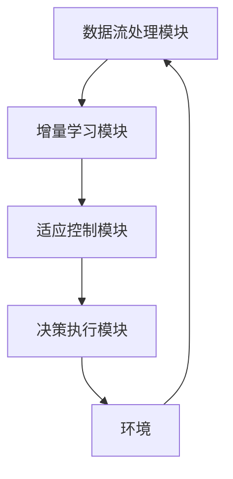

                 


# AI Agent的增量学习与持续适应机制

> 关键词：AI Agent, 增量学习, 持续适应机制, 在线学习, 自适应系统

> 摘要：本文深入探讨了AI Agent在增量学习与持续适应机制中的核心原理与实现方法。通过详细分析增量学习的基本概念、算法原理以及系统架构设计，结合实际项目案例，展示了如何构建具备动态适应能力的AI Agent系统。文章从理论到实践，全面解析了AI Agent在复杂动态环境中的自适应能力，为相关领域的研究与应用提供了有价值的参考。

---

## 第一部分: AI Agent的增量学习与持续适应机制概述

### 第1章: AI Agent的基本概念与背景介绍

#### 1.1 AI Agent的定义与特点
- **AI Agent的定义**：AI Agent（人工智能代理）是指能够感知环境、自主决策并采取行动以实现特定目标的智能实体。它可以是一个软件程序、机器人或其他智能系统。
- **AI Agent的核心特点**：
  - **自主性**：能够在没有外部干预的情况下独立运作。
  - **反应性**：能够实时感知环境变化并做出反应。
  - **目标导向性**：所有行为都以实现特定目标为导向。
  - **学习能力**：通过与环境交互和经验积累，不断提升自身的智能水平。

- **AI Agent的应用场景**：
  - 智能助手（如Siri、Alexa）。
  - 自动驾驶系统。
  - 智能推荐系统。
  - 机器人控制。

#### 1.2 增量学习的背景与必要性
- **数据流式更新的挑战**：
  - 在现实场景中，数据通常是实时流式更新的，传统的批量学习方法无法有效处理动态数据。
  - 数据分布可能发生偏移（Data Drift），导致模型性能下降。
- **知识库动态扩展的需求**：
  - 随着时间推移，AI Agent需要不断吸收新的知识和经验，保持其智能水平。
  - 知识库的动态更新需要高效的增量学习机制。
- **持续适应机制的重要性**：
  - AI Agent需要在动态环境中持续优化自身行为，以应对新的挑战和任务。
  - 持续适应机制能够确保AI Agent在面对环境变化时仍能保持高效运作。

#### 1.3 持续适应机制的核心目标
- **动态环境中的自适应能力**：
  - 能够根据环境变化自动调整策略和行为。
  - 在动态环境中保持稳定性和高效性。
- **知识更新的效率与准确性**：
  - 确保知识更新的速度与准确性，避免信息过时或错误。
- **系统稳定性保障**：
  - 在持续更新过程中，确保系统的稳定性和可靠性，防止因更新导致的系统崩溃或性能下降。

---

### 第2章: 增量学习与持续适应机制的核心概念

#### 2.1 增量学习的定义与分类
- **增量学习的定义**：
  - 增量学习（Incremental Learning）是指在已有模型的基础上，逐步引入新的数据样本或任务，通过增量式更新模型参数或结构，提升模型性能的学习方法。
- **增量学习的分类**：
  - **在线增量学习**：数据按流式形式输入，模型在接收到每条新数据后立即更新。
  - **批量增量学习**：将数据分成多个小批量，逐步更新模型。
  - **任务增量学习**：模型在完成一个任务后，逐步学习新的任务。
- **增量学习与传统学习的区别**：
  | 对比维度 | 增量学习 | 传统批量学习 |
  |----------|----------|--------------|
  | 数据输入方式 | 流式输入，逐步更新 | 批次输入，一次性训练 |
  | 训练时间 | 实时或周期性 | 离线或一次性 |
  | 模型更新 | 动态更新，适应新数据 | 静态，仅在重新训练时更新 |

#### 2.2 持续适应机制的核心算法
- **在线学习算法**：
  - **随机梯度下降（SGD）**：适用于流式数据的实时更新。
  - **经验重放（Experience Replay）**：通过回放历史数据，增强模型的泛化能力。
- **模型更新策略**：
  - **参数更新**：通过调整模型参数，适应新数据的变化。
  - **结构优化**：动态调整模型结构，适应新的任务需求。

---

### 第3章: 增量学习与持续适应机制的系统架构设计

#### 3.1 系统功能设计
- **数据流处理模块**：负责接收和处理实时数据流，提取特征并传递给学习模块。
- **增量学习模块**：基于流式数据，逐步更新模型参数或结构。
- **适应控制模块**：根据环境反馈，动态调整模型的更新策略和参数。
- **决策执行模块**：根据更新后的模型，生成决策并执行操作。

#### 3.2 系统架构设计


#### 3.3 接口设计
- **输入接口**：接收实时数据流和环境反馈。
- **输出接口**：输出决策指令和模型更新信号。
- **通信接口**：模块之间的数据交互接口。

---

### 第4章: 增量学习与持续适应机制的实现

#### 4.1 环境安装与依赖配置
- **Python版本**：建议使用Python 3.8或更高版本。
- **依赖库安装**：
  ```bash
  pip install numpy matplotlib scikit-learn tensorflow
  ```

#### 4.2 核心代码实现
```python
import numpy as np
from sklearn.linear_model import SGDClassifier
from sklearn.metrics import accuracy_score

# 初始化增量学习模型
model = SGDClassifier(max_iter=100, learning_rate='constant', eta0=0.01)

# 模型训练与更新
def incremental_train(X, y):
    model.partial_fit(X, y)
    return model

# 模型预测与评估
def evaluate_model(X_test, y_test):
    y_pred = model.predict(X_test)
    return accuracy_score(y_test, y_pred)

# 模型更新策略
def update_strategy(X, y, X_test, y_test):
    global model
    incremental_train(X, y)
    accuracy = evaluate_model(X_test, y_test)
    return accuracy
```

#### 4.3 案例分析与解读
- **案例背景**：假设我们正在开发一个实时推荐系统，用户的行为数据实时流入，系统需要动态更新推荐模型。
- **实现步骤**：
  1. 数据流处理：接收实时用户行为数据。
  2. 增量学习：逐步更新推荐模型。
  3. 模型评估：定期评估模型性能。
  4. 模型优化：根据评估结果调整学习策略。

---

### 第5章: 总结与展望

#### 5.1 全文总结
- 本文系统性地探讨了AI Agent的增量学习与持续适应机制，从理论到实践，详细讲解了增量学习的核心原理、算法实现以及系统架构设计。
- 通过实际案例分析，展示了如何在动态环境中构建高效的AI Agent系统。

#### 5.2 未来研究方向
- **高效增量算法研究**：探索更高效的增量学习算法，减少计算开销。
- **多任务增量学习**：研究如何在多任务场景下实现高效的增量学习。
- **自适应机制优化**：进一步优化持续适应机制，提升系统的动态适应能力。

#### 5.3 最佳实践 tips
- 在实际项目中，建议结合具体场景选择合适的增量学习算法。
- 定期评估模型性能，及时调整更新策略。
- 保持对新技术的关注，及时引入先进的增量学习方法。

---

作者：AI天才研究院/AI Genius Institute & 禅与计算机程序设计艺术 /Zen And The Art of Computer Programming

