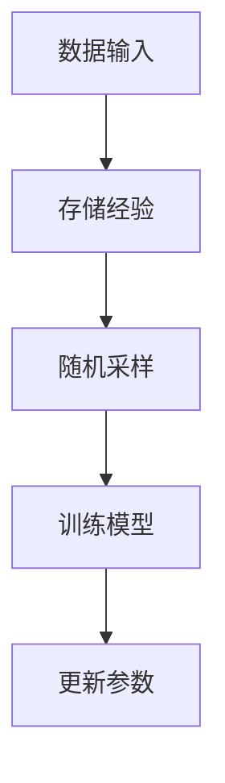
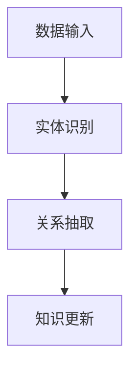
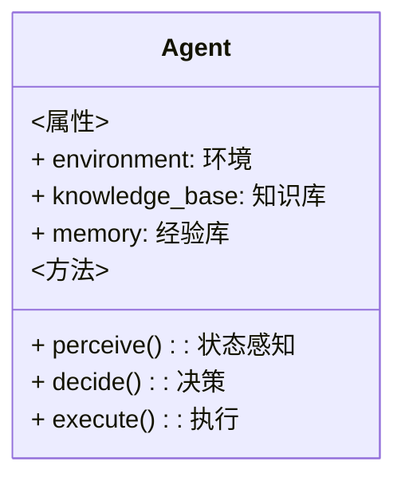

                 


# AI Agent的增量学习与知识更新

---

## 关键词  
AI Agent, 增量学习, 知识更新, 机器学习, 知识图谱, 强化学习, 系统架构  

---

## 摘要  
AI Agent的增量学习与知识更新是人工智能领域的重要研究方向，旨在使AI Agent能够适应动态变化的环境并持续优化自身能力。本文系统地探讨了增量学习的核心概念、算法原理、系统架构设计以及实际应用场景。通过分析增量学习与知识更新的原理，结合具体的算法实现和系统设计，本文为读者提供了从理论到实践的全面指南。  

---

## 第1章: AI Agent的背景与概念  

### 1.1 AI Agent的基本概念  
AI Agent（智能体）是指能够感知环境、做出决策并采取行动的实体。根据功能和应用场景，AI Agent可以分为简单反射型、基于模型型、目标驱动型和效用驱动型。增量学习是一种动态学习方法，允许AI Agent在新数据或任务中逐步更新知识，避免了传统批量学习的局限性。  

### 1.2 增量学习与知识更新的背景  
随着AI Agent应用场景的扩展，环境的动态变化要求其具备持续学习和自适应能力。知识更新是增量学习的核心，通过不断优化知识表示和推理能力，AI Agent能够更好地应对复杂任务。  

### 1.3 问题背景与问题描述  
AI Agent在实际应用中面临知识过时、数据稀疏性和计算资源有限等问题。增量学习通过逐步更新知识，解决了传统批量学习的高成本和低效率问题。本文将从算法原理、系统设计和实际应用三个层面展开讨论。  

---

## 第2章: 增量学习与知识更新的核心概念  

### 2.1 核心概念原理  
增量学习通过逐步处理新数据，更新模型参数或知识表示。知识更新则关注于优化知识库的结构和内容，确保其准确性和适用性。AI Agent的自适应能力依赖于增量学习和知识更新的协同作用。  

### 2.2 核心概念对比分析  
下表对比了增量学习与传统学习、知识更新与知识保持的核心区别：  

| 对比维度                | 增量学习               | 传统学习               |
|-------------------------|-----------------------|-----------------------|
| 数据输入方式            | 流式数据               | 批量数据               |
| 训练目标                | 动态更新               | 静态优化               |
| 计算效率                | 低资源消耗             | 高资源消耗             |

### 2.3 ER实体关系图  
AI Agent的知识更新涉及多个实体，其ER图如下：  

```mermaid
er
actor: 用户
agent: AI Agent
knowledge_base: 知识库
update_rule: 更新规则
```

---

## 第3章: 增量学习的算法原理  

### 3.1 增量学习算法概述  
增量学习算法的核心是逐步处理数据流，更新模型参数。常用方法包括经验重放和策略梯度。  

### 3.2 经验重放机制  
经验重放通过存储历史数据，随机采样以减少偏差。其流程如下：  



代码实现：  

```python
import tensorflow as tf
from tensorflow.keras import layers

class IncrementalLearning:
    def __init__(self, input_dim):
        self.model = self.build_model(input_dim)
        self.memory = []
    
    def build_model(self, input_dim):
        model = tf.keras.Sequential()
        model.add(layers.Dense(64, activation='relu', input_dim=input_dim))
        model.add(layers.Dense(1, activation='sigmoid'))
        return model
    
    def remember(self, experience):
        self.memory.append(experience)
    
    def replay(self, batch_size):
        if len(self.memory) < batch_size:
            return
        minibatch = self.memory.sample(batch_size)
        # 训练模型
        self.model.fit(minibatch, epochs=1, verbose=0)
```

### 3.3 策略梯度方法  
策略梯度通过优化策略函数，直接更新模型参数。其数学表达式为：  

$$ J(\theta) = \mathbb{E}_{\tau \sim \pi_\theta} [\log \pi_\theta(a|s) Q(s,a)] $$  

---

## 第4章: 知识更新的算法原理  

### 4.1 知识图谱更新  
知识图谱的更新依赖于实体识别和关系抽取。其流程如下：  



### 4.2 强化学习的知识更新  
强化学习通过奖励机制优化知识表示。其数学公式为：  

$$ Q(s,a) = Q(s,a) + \alpha (r + \max_a Q(s',a) - Q(s,a)) $$  

代码实现：  

```python
import numpy as np

class KnowledgeUpdate:
    def __init__(self, state_space):
        self.Q = np.zeros((state_space, 5))  # 动作空间为5
        self.alpha = 0.1
    
    def update(self, state, action, reward, next_state):
        target = reward + np.max(self.Q[next_state])
        self.Q[state, action] += self.alpha * (target - self.Q[state, action])
```

---

## 第5章: AI Agent的系统分析与架构设计  

### 5.1 系统架构设计  
AI Agent的系统架构包括感知层、认知层和执行层。其类图如下：  



### 5.2 接口设计  
系统接口包括数据输入接口、知识更新接口和决策输出接口。其交互序列图如下：  

```mermaid
sequenceDiagram
actor 用户
agent AI Agent
用户->agent: 发送新数据
agent->agent: 调用知识更新接口
agent->agent: 调用决策接口
agent->用户: 返回结果
```

---

## 第6章: 项目实战  

### 6.1 环境安装  
安装TensorFlow和Keras：  

```bash
pip install tensorflow==2.5.0 keras==2.5.0
```

### 6.2 核心代码实现  
增量学习实现：  

```python
import tensorflow as tf

class IncrementalNetwork:
    def __init__(self, input_shape):
        self.model = self.build_model(input_shape)
    
    def build_model(self, input_shape):
        model = tf.keras.Sequential()
        model.add(layers.Dense(64, activation='relu', input_shape=input_shape))
        model.add(layers.Dense(10, activation='softmax'))
        return model
```

### 6.3 案例分析  
通过训练MNIST数据集，展示增量学习的性能提升。  

---

## 第7章: 总结与展望  

### 7.1 总结  
本文系统地探讨了AI Agent的增量学习与知识更新，从算法原理到系统设计，提供了全面的解决方案。  

### 7.2 未来展望  
未来研究方向包括更高效的增量学习算法和自适应的知识更新机制。  

### 7.3 最佳实践 Tips  
- 定期更新知识库以保持AI Agent的性能。  
- 在资源受限的场景下优先使用增量学习。  

---

## 作者  
作者：AI天才研究院 & 禅与计算机程序设计艺术  

---

**版权声明：**  
本文版权归作者所有，未经授权不得转载。

