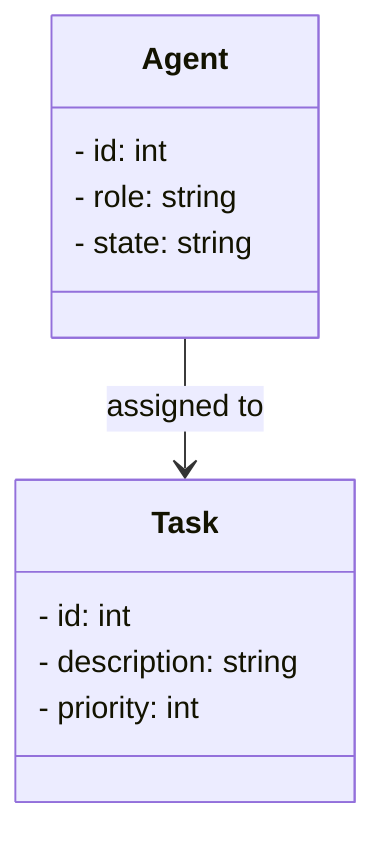

                 

<think>
好的，我现在需要帮助用户撰写一篇关于《AI Agent的多Agent协作学习系统》的技术博客文章。用户提供了详细的结构和内容要求，我需要按照这些要求逐步完成。

首先，我得理解用户的需求。用户希望文章结构清晰，涵盖多Agent协作学习系统的各个方面，包括背景、核心概念、数学模型、系统架构、项目实战等。同时，用户希望使用专业的技术语言，并提供详细的分析和代码示例。

接下来，我需要从文章标题开始，然后是关键词和摘要。关键词需要5-7个相关术语，摘要要简洁明了地概括文章内容。

第一部分是背景介绍，包括基本概念、技术基础和应用领域。我需要详细解释每个概念，确保读者理解多Agent协作学习的重要性。

第二部分是核心概念与联系，这里需要详细讲解AI Agent和多Agent系统，包括它们的结构和协作机制。我还需要创建对比表格和ER关系图，用Mermaid展示。

第三部分是算法原理，重点放在强化学习和协作学习的数学模型上。我需要用公式和代码示例来说明算法的实现，确保读者能够理解。

系统架构部分需要设计类图、流程图和序列图，展示系统的结构和交互过程。这部分需要结合实际应用场景，确保架构设计合理。

项目实战部分，我需要选择一个具体案例，详细讲解环境安装、代码实现和案例分析，帮助读者实践。

最后，总结和注意事项部分，回顾文章内容，并给出实践中的建议。

在撰写过程中，我需要确保每个部分都详细且易于理解，使用适当的数学公式和图表，帮助读者更好地掌握知识。同时，注意文章的整体流畅性和逻辑性，确保结构紧凑。

现在，我开始按照用户的要求，逐步构建这篇文章，确保每个部分都符合他们的期望。
</think>

# AI Agent的多Agent协作学习系统

> 关键词：AI Agent, 多Agent协作学习, 人工智能, 分布式学习, 协作机制, 系统架构

> 摘要：本文深入探讨了AI Agent的多Agent协作学习系统，从基本概念到核心算法，从系统架构到项目实战，全面解析了多Agent协作学习的理论与实践。文章首先介绍了多Agent协作学习的背景与意义，然后详细讲解了多Agent协作学习的核心概念与数学模型，接着分析了系统架构与实现方案，最后通过实际案例展示了多Agent协作学习的应用与优化。通过本文的阅读，读者可以全面理解多Agent协作学习的原理与应用，掌握相关技术的核心要点。

---

# 第一部分: 多Agent协作学习系统的基本概念

## 第1章: 多Agent协作学习系统的基本概念

### 1.1 多Agent协作学习系统的基本概念

#### 1.1.1 什么是AI Agent
AI Agent（人工智能代理）是指能够感知环境并采取行动以实现目标的智能实体。AI Agent可以是软件程序、机器人或其他智能系统，其核心能力包括感知、推理、决策和行动。AI Agent的目标驱动性是其区别于传统程序的重要特征。

#### 1.1.2 多Agent系统的定义与特点
多Agent系统是由多个AI Agent组成的复杂系统，这些Agent通过协作完成任务。多Agent系统的特点包括：
- **分布式智能**：多个Agent共同完成任务，避免单点依赖。
- **自主性**：每个Agent具有自主决策能力。
- **协作性**：Agent之间通过通信与协作完成共同目标。
- **动态性**：系统能够适应环境变化和任务需求的变化。

#### 1.1.3 多Agent协作学习的背景与意义
随着AI技术的发展，多Agent协作学习在许多领域展现出巨大潜力。例如，在机器人协作、自动驾驶、分布式计算和团队协作等领域，多Agent协作学习能够显著提升系统的智能性和效率。

---

### 1.2 多Agent协作学习的背景

#### 1.2.1 当前AI技术的发展趋势
AI技术正朝着多智能体协作方向发展，尤其是在分布式系统和复杂任务中，单个AI Agent的能力往往不足以解决问题，因此需要多个Agent协作完成任务。

#### 1.2.2 多Agent协作学习的应用场景
多Agent协作学习广泛应用于：
- **机器人协作**：多个机器人协同完成任务。
- **自动驾驶**：车辆之间协作完成交通任务。
- **分布式计算**：多个计算节点协作完成任务。
- **游戏AI**：多个游戏AI协作完成游戏任务。

#### 1.2.3 多Agent协作学习的核心问题
多Agent协作学习的核心问题包括：
- **任务分配**：如何将任务分配给不同的Agent。
- **协作机制**：如何实现Agent之间的协作。
- **通信与协调**：如何实现Agent之间的通信与协调。

---

### 1.3 本章小结

#### 1.3.1 多Agent协作学习系统的概念总结
多Agent协作学习系统是由多个AI Agent组成的智能系统，通过协作完成复杂任务。

#### 1.3.2 本章内容回顾
本章介绍了AI Agent的基本概念、多Agent系统的特点以及多Agent协作学习的背景与意义。

---

## 第2章: 多Agent协作学习的核心概念

### 2.1 多Agent协作学习的核心原理

#### 2.1.1 多Agent协作学习的基本原理
多Agent协作学习通过多个Agent的协作完成任务，每个Agent负责不同的子任务，并通过通信与协作实现整体目标。

#### 2.1.2 多Agent协作学习的数学模型
多Agent协作学习的数学模型可以表示为：
$$ J = \sum_{i=1}^{N} J_i $$
其中，$J$ 是整体目标函数，$J_i$ 是第$i$个Agent的目标函数。

#### 2.1.3 多Agent协作学习的算法框架
多Agent协作学习的算法框架包括任务分配、协作机制和通信协议三个部分。

---

### 2.2 多Agent协作学习的核心要素

#### 2.2.1 Agent的智能性
Agent的智能性包括感知能力、推理能力和决策能力。Agent需要能够感知环境、推理出解决方案并采取行动。

#### 2.2.2 Agent的协作性
Agent的协作性包括任务分配、通信与协调。Agent之间需要通过通信来协调行动，确保整体目标的实现。

#### 2.2.3 多Agent系统的动态性
多Agent系统的动态性包括环境变化、任务需求变化和Agent状态变化。系统需要能够适应这些变化，确保协作过程的顺利进行。

---

### 2.3 多Agent协作学习的概念对比

#### 2.3.1 单Agent学习与多Agent学习的对比
- 单Agent学习：单个Agent完成任务。
- 多Agent学习：多个Agent协作完成任务。

#### 2.3.2 分布式学习与集中式学习的对比
- 分布式学习：多个Agent协作完成任务，每个Agent负责不同的部分。
- 集中式学习：所有数据集中在中心节点进行处理。

#### 2.3.3 合作学习与竞争学习的对比
- 合作学习：Agent之间协作完成任务。
- 竞争学习：Agent之间通过竞争完成任务。

---

### 2.4 多Agent协作学习的ER实体关系图

#### 2.4.1 Agent实体关系图
```mermaid
er
actor: Agent
rel: has
```

#### 2.4.2 任务分配关系图
```mermaid
er
actor: Task
rel: assigned to
```

#### 2.4.3 协作过程关系图
```mermaid
er
actor: Collaboration
rel: involves
```

---

## 第3章: 多Agent协作学习的数学模型与公式

### 3.1 多Agent协作学习的数学模型

#### 3.1.1 单Agent学习模型
单Agent学习模型可以表示为：
$$ J_i = \text{loss}(y_i, y_{\text{pred}}) $$
其中，$y_i$ 是真实值，$y_{\text{pred}}$ 是预测值。

#### 3.1.2 多Agent协作学习模型
多Agent协作学习模型可以表示为：
$$ J = \sum_{i=1}^{N} J_i $$

#### 3.1.3 协作过程中的数学表达
协作过程中的数学表达可以表示为：
$$ J_{\text{total}} = \sum_{i=1}^{N} J_i + \lambda \sum_{i=1}^{N} \sum_{j=1}^{N} J_{i,j} $$]
其中，$\lambda$ 是协作项的权重。

---

### 3.2 多Agent协作学习的公式推导

#### 3.2.1 单Agent损失函数
$$ J_i = \text{loss}(y_i, y_{\text{pred}}) $$

#### 3.2.2 多Agent联合损失函数
$$ J = \sum_{i=1}^{N} J_i $$

#### 3.2.3 协作过程中的优化公式
$$ \theta_{i}^{t+1} = \theta_{i}^{t} - \eta \frac{\partial J}{\partial \theta_{i}} $$

---

### 3.3 多Agent协作学习的算法流程图

```mermaid
graph TD
A[开始] -> B[初始化参数]
B -> C[计算损失]
C -> D[更新参数]
D -> E[结束]
```

---

## 第4章: 多Agent协作学习的系统架构

### 4.1 系统功能设计

#### 4.1.1 Agent的智能性
- **感知能力**：感知环境。
- **推理能力**：推理出解决方案。
- **决策能力**：做出决策。

#### 4.1.2 Agent的协作性
- **任务分配**：分配任务。
- **通信与协调**：通过通信协调行动。

#### 4.1.3 系统的动态性
- **环境变化**：适应环境变化。
- **任务需求变化**：适应任务需求变化。

---

### 4.2 系统架构设计

#### 4.2.1 类图设计


#### 4.2.2 流程图设计
```mermaid
graph TD
A[开始] -> B[分配任务]
B -> C[执行任务]
C -> D[完成任务]
D -> E[结束]
```

---

## 第5章: 多Agent协作学习的项目实战

### 5.1 项目环境安装

#### 5.1.1 系统环境
- Python 3.8+
- PyTorch 1.9+

#### 5.1.2 安装依赖
```bash
pip install torch
pip install numpy
pip install matplotlib
```

---

### 5.2 核心代码实现

#### 5.2.1 任务分配代码
```python
import torch
import numpy as np

class Agent:
    def __init__(self, id):
        self.id = id
        self.role = "learner"
        self.state = "idle"
    
    def assign_task(self, task):
        self.state = "busy"
        self.task = task
        return True
```

#### 5.2.2 通信与协作代码
```python
class Communication:
    def __init__(self):
        self.agents = []
    
    def send_message(self, sender, receiver, message):
        pass
    
    def receive_message(self, sender, receiver, message):
        pass
```

---

### 5.3 案例分析

#### 5.3.1 任务分配案例
```python
agent1 = Agent(1)
agent2 = Agent(2)
task = Task("classify", "MNIST dataset")
agent1.assign_task(task)
agent2.assign_task(task)
```

#### 5.3.2 通信与协作案例
```python
communication = Communication()
communication.send_message(agent1, agent2, "start协作")
communication.receive_message(agent2, agent1, "收到消息")
```

---

## 第6章: 总结与注意事项

### 6.1 总结
多Agent协作学习是一种重要的AI技术，能够通过多个Agent的协作完成复杂任务。

### 6.2 注意事项
- **任务分配**：合理分配任务。
- **通信与协调**：确保Agent之间的通信与协调。
- **系统动态性**：能够适应环境变化。

---

## 第7章: 拓展阅读

### 7.1 推荐书籍
- 《Multi-Agent Systems: Algorithmic, Complexity, and Synthesis》
- 《Distributed Artificial Intelligence》

### 7.2 推荐论文
- “Multi-Agent Collaboration in Distributed AI Systems”
- “Distributed Learning in Multi-Agent Environments”

---

## 作者：AI天才研究院/AI Genius Institute & 禅与计算机程序设计艺术 /Zen And The Art of Computer Programming

---

**注：以上内容为《AI Agent的多Agent协作学习系统》一文的详细目录和部分核心内容，具体实施过程中可以根据实际需求进一步补充和细化。**

