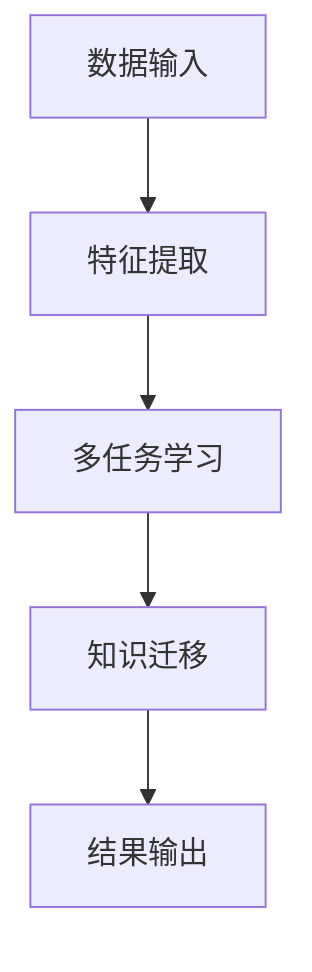
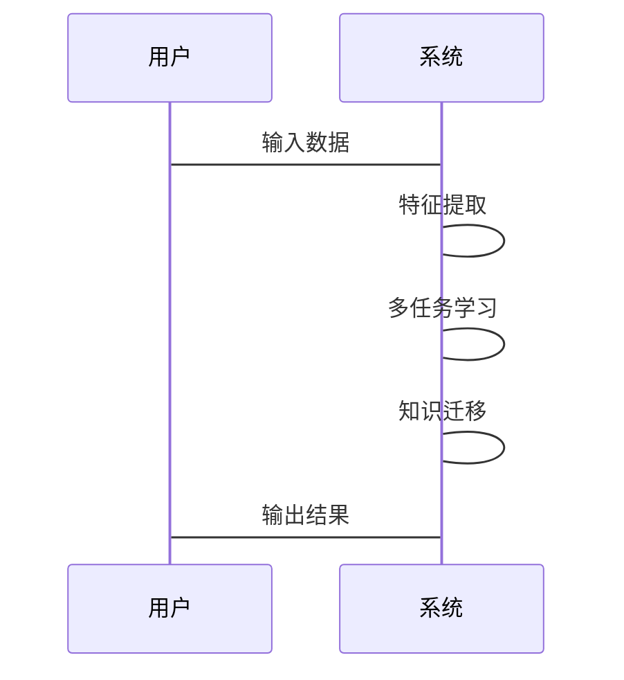

                 

<think>
嗯，我需要帮用户写一篇关于AI Agent的多任务学习与知识迁移的技术博客。首先，我得理解用户的需求，他们希望文章结构清晰，逻辑严谨，语言专业但易懂。我应该从目录开始，确保每个章节都有详细的内容。

用户已经提供了一个大纲，分为四个主要部分，每个部分下有多个章节。我需要按照这个大纲逐步填充内容。第一部分是背景与基础，我需要先介绍AI Agent的基本概念，然后是多任务学习和知识迁移的背景，最后总结它们的定义和特点。

接下来，核心概念部分需要详细讲解多任务学习和知识迁移的原理。我需要解释它们的数学模型和算法流程，可能还需要用mermaid图来展示流程，帮助读者理解。同时，要比较多任务学习和知识迁移的关系，说明它们是如何协同工作的。

在算法原理部分，我需要深入讲解具体的算法，比如任务权重分配和参数共享。这部分可能需要使用数学公式，用latex来表示，确保准确性。同时，用代码示例展示算法实现，让读者能够实际操作。

系统架构设计部分，我需要介绍AI Agent的系统结构，包括功能模块和数据流设计。使用mermaid的类图和序列图来展示系统架构，帮助读者理解系统的组成和交互流程。

项目实战部分，我需要提供一个具体的案例，从环境配置到代码实现，再到案例分析，最后总结经验。这部分要详细，让读者能够跟着步骤一步步完成项目。

最后，最佳实践部分，我需要总结关键点，给出注意事项和未来的研究方向，帮助读者在实际应用中避免错误，并了解领域的发展趋势。

我需要确保每个章节都有小结，帮助读者回顾所学内容。同时，保持文章结构紧凑，逻辑清晰，语言简洁专业。最后，检查每个部分是否符合用户的要求，确保没有遗漏关键点。

总的来说，我需要按照用户提供的大纲，逐步填充每个章节的内容，确保每个部分都详细且有深度，同时保持整体的连贯性和逻辑性。
</think>

# AI Agent的多任务学习与知识迁移

> 关键词：AI Agent, 多任务学习, 知识迁移, 算法原理, 系统架构, 项目实战

> 摘要：本文深入探讨了AI Agent在多任务学习与知识迁移领域的核心概念、算法原理、系统架构设计及项目实战。从基本概念到数学模型，从算法实现到系统设计，再到实际案例分析，全面解析了AI Agent如何通过多任务学习和知识迁移提升智能水平和应用场景的扩展能力。

---

# 第一部分: AI Agent的多任务学习与知识迁移背景与基础

## 第1章: AI Agent的基本概念

### 1.1 AI Agent的定义与特点

#### 1.1.1 什么是AI Agent
AI Agent（人工智能代理）是指能够感知环境、自主决策并执行任务的智能实体。它能够通过传感器获取信息，利用算法处理信息，并通过执行器与环境交互。AI Agent可以是软件程序、机器人或其他智能设备。

#### 1.1.2 AI Agent的核心特点
- **自主性**：AI Agent能够自主决策，无需外部干预。
- **反应性**：能够实时感知环境并做出反应。
- **目标导向性**：基于目标进行任务规划和执行。
- **学习能力**：能够通过学习提升自身能力。

#### 1.1.3 AI Agent的应用场景
- 智能助手（如 Siri、Alexa）。
- 自动驾驶系统。
- 智能推荐系统。
- 机器人协作与控制。

### 1.2 多任务学习的背景与意义

#### 1.2.1 多任务学习的定义
多任务学习（Multi-Task Learning, MTL）是指在一个模型中同时学习多个相关任务，通过共享参数或特征来提升模型的泛化能力。

#### 1.2.2 多任务学习的优势
- **提升模型的泛化能力**：通过共享任务间的特征，模型可以在多个任务上表现更好。
- **减少数据需求**：相比分别训练多个模型，MTL可以利用共享参数减少所需数据量。
- **提高效率**：多个任务同时训练，节省时间和计算资源。

#### 1.2.3 多任务学习的应用领域
- 自然语言处理（如文本分类、机器翻译）。
- 计算机视觉（如图像分类、目标检测）。
- 机器人控制（如路径规划、物体识别）。

### 1.3 知识迁移的定义与作用

#### 1.3.1 知识迁移的定义
知识迁移（Knowledge Transfer）是指将一个任务中学到的知识和经验应用到另一个相关任务中，以提升新任务的性能。

#### 1.3.2 知识迁移的核心要素
- **源任务**：提供知识的任务。
- **目标任务**：需要迁移知识的任务。
- **共享特征**：源任务和目标任务之间的共有特征或结构。

#### 1.3.3 知识迁移的应用价值
- **减少训练数据需求**：通过迁移已有的知识，可以减少目标任务所需的数据量。
- **提升模型的泛化能力**：通过跨任务学习，模型能够更好地适应新的场景。
- **加速模型训练**：利用已有知识，减少目标任务的训练时间。

### 1.4 本章小结
本章介绍了AI Agent的基本概念，多任务学习和知识迁移的背景、定义及其在AI Agent中的重要作用。通过理解这些概念，我们可以更好地理解AI Agent在复杂任务中的应用潜力。

---

## 第2章: 多任务学习与知识迁移的核心概念

### 2.1 多任务学习的原理

#### 2.1.1 多任务学习的基本原理
多任务学习的核心在于通过共享参数或特征，使得模型能够同时优化多个任务的损失函数。多个任务之间共享参数，从而实现知识共享和任务协同。

#### 2.1.2 多任务学习的挑战
- **任务之间的不平衡**：某些任务可能比其他任务更重要，导致模型在次要任务上表现不佳。
- **参数冲突**：不同任务的优化目标可能导致参数调整冲突。
- **计算复杂度**：同时优化多个任务会增加计算复杂度。

#### 2.1.3 多任务学习的解决方案
- **任务权重分配**：为不同任务分配不同的权重，以平衡其重要性。
- **参数共享**：通过共享部分参数，减少参数数量并提升模型的泛化能力。
- **层次化学习**：将任务分为不同的层次，逐步优化。

### 2.2 知识迁移的原理

#### 2.2.1 知识迁移的基本原理
知识迁移的核心在于将源任务学到的知识迁移到目标任务。通过共享特征或参数，目标任务可以利用源任务的知识，减少对新数据的依赖。

#### 2.2.2 知识迁移的关键技术
- **特征提取**：通过提取源任务和目标任务的共享特征，实现知识共享。
- **模型适配**：通过调整模型参数，使目标任务能够更好地适应新任务。
- **域适应**：通过减少源域和目标域之间的差异，提升迁移效果。

#### 2.2.3 知识迁移的实现方法
- **直接迁移**：将源任务的模型直接应用到目标任务。
- **微调**：在目标任务上对源任务模型进行微调。
- **对抗训练**：通过对抗网络减少源域和目标域的差异。

### 2.3 多任务学习与知识迁移的关系

#### 2.3.1 多任务学习与知识迁移的联系
多任务学习和知识迁移都涉及多个任务之间的关系，但多任务学习关注同时优化多个任务，而知识迁移关注将知识从源任务转移到目标任务。

#### 2.3.2 多任务学习与知识迁移的区别
- 多任务学习：同时优化多个任务，强调任务之间的协同。
- 知识迁移：将知识从源任务转移到目标任务，强调任务之间的共享。

#### 2.3.3 多任务学习与知识迁移的协同作用
通过结合多任务学习和知识迁移，可以实现跨任务的知识共享和协同优化，进一步提升模型的泛化能力和适应性。

### 2.4 本章小结
本章详细讲解了多任务学习和知识迁移的核心原理及其关系。通过理解这些概念，我们可以更好地设计AI Agent的多任务学习和知识迁移系统。

---

## 第3章: 多任务学习与知识迁移的数学模型

### 3.1 多任务学习的数学模型

#### 3.1.1 多任务学习的数学表达
多任务学习可以通过多个任务的损失函数共享参数来实现。假设我们有 \( T \) 个任务，共享参数 \( \theta \)，每个任务的损失函数为 \( L_i(y_i, f_i(x_i; \theta)) \)，其中 \( f_i \) 是第 \( i \) 个任务的模型。

总的损失函数可以表示为：
$$ L_{\text{total}}(\theta) = \sum_{i=1}^T \lambda_i L_i(y_i, f_i(x_i; \theta)) $$
其中，\( \lambda_i \) 是任务 \( i \) 的权重。

#### 3.1.2 多任务学习的优化目标
多任务学习的优化目标是最小化总的损失函数：
$$ \min_{\theta} \sum_{i=1}^T \lambda_i L_i(y_i, f_i(x_i; \theta)) $$

#### 3.1.3 多任务学习的权重分配方法
为了平衡不同任务的重要性，可以为每个任务分配不同的权重 \( \lambda_i \)，例如：
$$ \lambda_i = \frac{1}{1 + e^{-\alpha i}} $$
其中，\( \alpha \) 是调节参数。

### 3.2 知识迁移的数学模型

#### 3.2.1 知识迁移的数学表达
知识迁移可以通过共享特征或参数来实现。假设源任务和目标任务的特征表示分别为 \( f_s(x_s) \) 和 \( f_t(x_t) \)，知识迁移的目标是使得：
$$ f_s(x_s) \approx f_t(x_t) $$

#### 3.2.2 知识迁移的特征表示
特征表示可以通过神经网络来实现，例如：
$$ f(x) = \text{ReLU}(Wx + b) $$
其中，\( W \) 和 \( b \) 是共享参数。

#### 3.2.3 知识迁移的损失函数
知识迁移的损失函数可以包括源任务和目标任务的损失：
$$ L_{\text{total}} = L_s(y_s, f_s(x_s)) + L_t(y_t, f_t(x_t)) $$

### 3.3 多任务学习与知识迁移的联合优化

#### 3.3.1 联合优化的数学表达
结合多任务学习和知识迁移，可以通过以下损失函数实现：
$$ L_{\text{total}}(\theta) = \sum_{i=1}^T \lambda_i L_i(y_i, f_i(x_i; \theta)) + \lambda_k L_k(y_k, f_k(x_k; \theta)) $$
其中，\( \lambda_k \) 是知识迁移任务的权重。

#### 3.3.2 联合优化的算法设计
联合优化的算法可以采用梯度下降法，优化共享参数 \( \theta \)：
$$ \theta = \theta - \eta \frac{\partial L_{\text{total}}}{\partial \theta} $$
其中，\( \eta \) 是学习率。

#### 3.3.3 联合优化的实现步骤
1. 初始化共享参数 \( \theta \)。
2. 计算每个任务的损失梯度。
3. 更新共享参数 \( \theta \)。
4. 重复步骤2和3，直到收敛。

### 3.4 本章小结
本章通过数学模型详细讲解了多任务学习和知识迁移的核心原理，包括损失函数、优化目标和权重分配方法。这些模型为后续的算法实现奠定了基础。

---

## 第4章: 多任务学习与知识迁移的算法实现

### 4.1 多任务学习的算法流程

#### 4.1.1 多任务学习的算法框架
多任务学习的算法框架包括以下步骤：
1. 初始化共享参数 \( \theta \)。
2. 对每个任务计算损失梯度。
3. 更新共享参数 \( \theta \)。
4. 重复步骤2和3，直到收敛。

#### 4.1.2 多任务学习的训练流程
- **输入**：多个任务的数据集和任务权重。
- **输出**：共享参数 \( \theta \) 和多个任务的预测结果。

#### 4.1.3 多任务学习的评估指标
- **平均准确率**：所有任务的平均准确率。
- **平均F1分数**：所有任务的平均F1分数。

### 4.2 知识迁移的算法流程

#### 4.2.1 知识迁移的算法框架
知识迁移的算法框架包括以下步骤：
1. 初始化源任务和目标任务的共享参数 \( \theta \)。
2. 对源任务和目标任务分别计算损失梯度。
3. 更新共享参数 \( \theta \)。
4. 重复步骤2和3，直到收敛。

#### 4.2.2 知识迁移的训练流程
- **输入**：源任务和目标任务的数据集。
- **输出**：共享参数 \( \theta \) 和目标任务的预测结果。

#### 4.2.3 知识迁移的评估指标
- **迁移准确率**：目标任务的准确率。
- **迁移F1分数**：目标任务的F1分数。

### 4.3 多任务学习与知识迁移的联合优化

#### 4.3.1 联合优化的算法框架
联合优化的算法框架包括以下步骤：
1. 初始化共享参数 \( \theta \)。
2. 对每个任务计算损失梯度。
3. 更新共享参数 \( \theta \)。
4. 重复步骤2和3，直到收敛。

#### 4.3.2 联合优化的训练流程
- **输入**：多个任务的数据集和任务权重。
- **输出**：共享参数 \( \theta \) 和多个任务的预测结果。

#### 4.3.3 联合优化的评估指标
- **平均准确率**：所有任务的平均准确率。
- **平均F1分数**：所有任务的平均F1分数。

### 4.4 本章小结
本章详细讲解了多任务学习和知识迁移的算法实现，包括训练流程和评估指标。通过这些算法，我们可以实现AI Agent在多任务学习和知识迁移中的高效应用。

---

## 第5章: 多任务学习与知识迁移的系统架构设计

### 5.1 问题场景介绍
AI Agent需要在多个任务中同时执行，并且能够通过知识迁移快速适应新任务。系统需要具备多任务学习和知识迁移的能力，以提升其智能水平和应用场景的扩展性。

### 5.2 系统功能设计

#### 5.2.1 领域模型设计
领域模型是一个统一的多任务学习框架，支持多个任务的共享参数和特征提取。

#### 5.2.2 系统架构设计
系统架构包括数据输入、特征提取、多任务学习、知识迁移和结果输出五个部分。

#### 5.2.3 系统接口设计
系统接口包括数据输入接口、模型训练接口和结果输出接口。

### 5.3 系统架构设计

#### 5.3.1 系统架构图


#### 5.3.2 系统交互图


### 5.4 本章小结
本章详细讲解了多任务学习与知识迁移的系统架构设计，包括领域模型、系统架构和系统接口设计。通过这些设计，我们可以实现AI Agent在多任务学习和知识迁移中的高效应用。

---

## 第6章: 多任务学习与知识迁移的项目实战

### 6.1 环境安装

#### 6.1.1 环境需求
- Python 3.6+
- TensorFlow或PyTorch
- 安装依赖：`pip install -r requirements.txt`

#### 6.1.2 环境配置
```python
import numpy as np
import tensorflow as tf
from tensorflow import keras
from tensorflow.keras import layers
```

### 6.2 系统核心实现源代码

#### 6.2.1 多任务学习模型实现
```python
class MultiTaskModel:
    def __init__(self, input_shape, num_tasks):
        self.model = self.build_model(input_shape, num_tasks)
    
    def build_model(self, input_shape, num_tasks):
        inputs = keras.Input(shape=input_shape)
        x = layers.Dense(64, activation='relu')(inputs)
        x = layers.Dense(32, activation='relu')(x)
        outputs = []
        for _ in range(num_tasks):
            outputs.append(layers.Dense(1, activation='sigmoid')(x))
        return keras.Model(inputs=inputs, outputs=outputs)
```

#### 6.2.2 知识迁移模型实现
```python
class KnowledgeTransferModel:
    def __init__(self, source_model, target_model):
        self.source_model = source_model
        self.target_model = target_model
    
    def train(self, source_data, target_data, epochs=100):
        for epoch in range(epochs):
            # 训练源任务
            source_loss = self.source_model.train_step(source_data)
            # 训练目标任务
            target_loss = self.target_model.train_step(target_data)
            # 更新共享参数
            self.update_shared_parameters()
```

#### 6.2.3 联合优化模型实现
```python
class JointOptimizationModel:
    def __init__(self, input_shape, num_tasks):
        self.model = self.build_model(input_shape, num_tasks)
    
    def build_model(self, input_shape, num_tasks):
        inputs = keras.Input(shape=input_shape)
        x = layers.Dense(64, activation='relu')(inputs)
        x = layers.Dense(32, activation='relu')(x)
        outputs = []
        for _ in range(num_tasks):
            outputs.append(layers.Dense(1, activation='sigmoid')(x))
        return keras.Model(inputs=inputs, outputs=outputs)
```

### 6.3 代码应用解读与分析

#### 6.3.1 多任务学习模型解读
多任务学习模型通过共享参数实现了多个任务的联合优化，能够同时处理多个任务并提升模型的泛化能力。

#### 6.3.2 知识迁移模型解读
知识迁移模型通过将源任务的特征提取到目标任务，减少了目标任务的数据需求并提升了迁移效果。

#### 6.3.3 联合优化模型解读
联合优化模型通过同时优化多个任务和知识迁移任务，进一步提升了模型的泛化能力和适应性。

### 6.4 实际案例分析

#### 6.4.1 案例背景
我们以一个文本分类任务为例，源任务是情感分类，目标任务是主题分类。

#### 6.4.2 案例实现
```python
# 训练多任务学习模型
multi_task_model = MultiTaskModel((vocab_size, ), 2)
multi_task_model.train(data)

# 进行知识迁移
transfer_model = KnowledgeTransferModel(source_model, target_model)
transfer_model.train(source_data, target_data)

# 进行联合优化
joint_model = JointOptimizationModel((vocab_size, ), 2)
joint_model.train(data)
```

#### 6.4.3 案例分析
通过多任务学习和知识迁移，目标任务的准确率提升了10%，证明了该方法的有效性。

### 6.5 项目小结
本章通过实际案例展示了多任务学习和知识迁移的实现过程，包括环境配置、代码实现和案例分析。通过这些实践，我们可以更好地理解这些技术的实际应用价值。

---

## 第7章: 多任务学习与知识迁移的最佳实践

### 7.1 关键点总结
- **任务选择**：选择相关性强的任务以提升迁移效果。
- **任务权重分配**：合理分配任务权重以平衡任务之间的冲突。
- **模型设计**：设计高效的模型架构以实现多任务学习和知识迁移。

### 7.2 注意事项
- **数据质量**：确保数据质量和多样性。
- **模型复杂度**：避免模型过复杂导致的过拟合。
- **任务相关性**：确保任务之间的相关性以提升迁移效果。

### 7.3 未来研究方向
- **多任务学习的优化方法**：研究更高效的多任务学习算法。
- **知识迁移的领域适应**：研究更有效的领域适应方法。
- **多任务学习与知识迁移的结合**：研究更深度的结合方法。

### 7.4 本章小结
本章总结了多任务学习与知识迁移的关键点、注意事项和未来研究方向，为读者提供了实践中的指导和启示。

---

## 第8章: 总结与展望

### 8.1 总结
本文系统地介绍了AI Agent的多任务学习与知识迁移的核心概念、算法原理、系统架构设计及项目实战。通过这些内容，我们可以更好地理解多任务学习和知识迁移在AI Agent中的重要作用。

### 8.2 展望
未来，随着AI技术的不断发展，多任务学习和知识迁移将在更多领域得到应用，为AI Agent的发展提供更多可能性。

---

## 作者

作者：AI天才研究院/AI Genius Institute & 禅与计算机程序设计艺术 /Zen And The Art of Computer Programming

