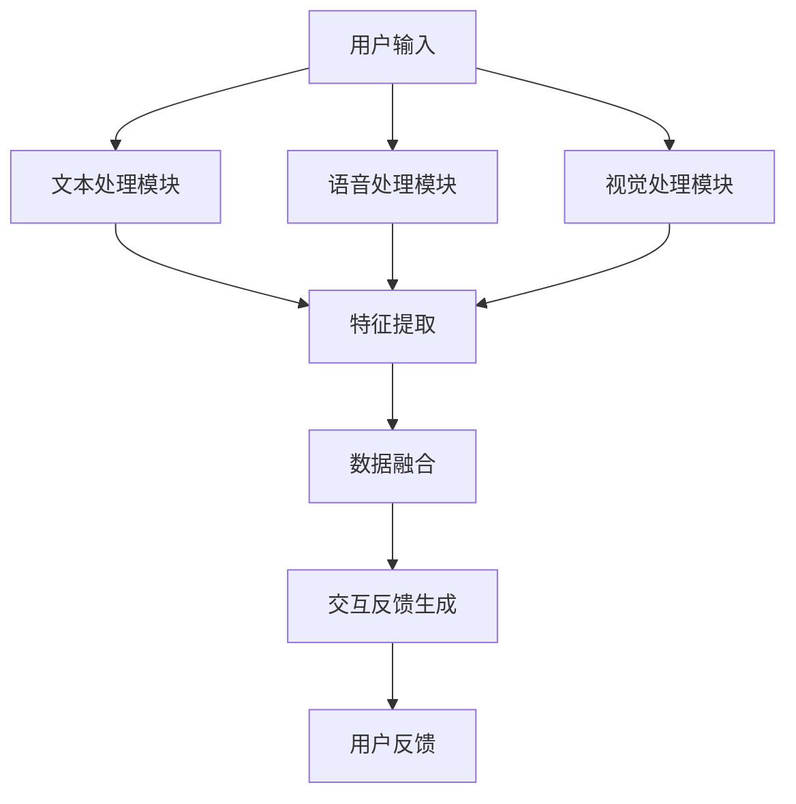
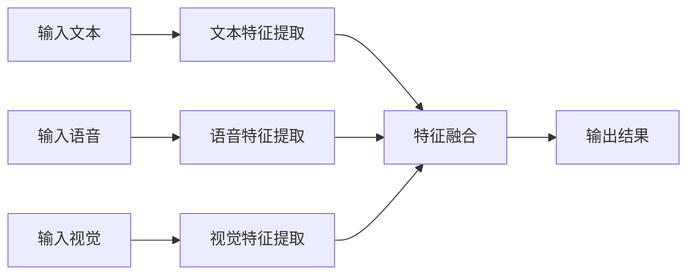
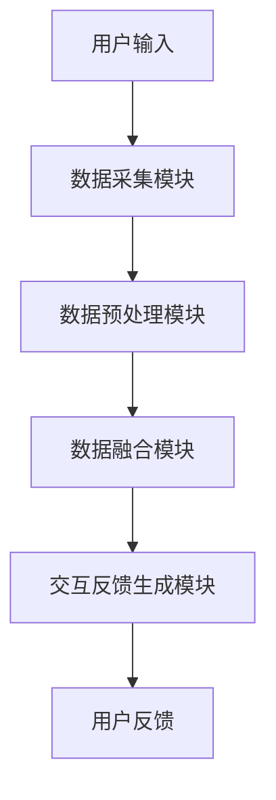
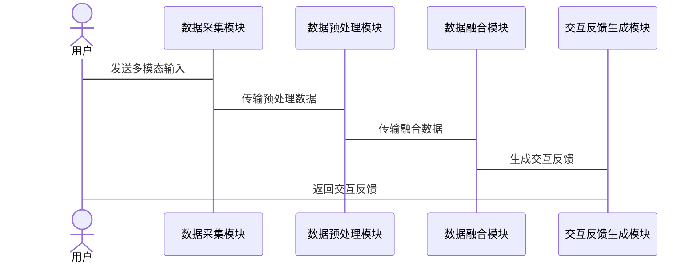

                 

<think>
好的，我现在需要帮助用户完成一篇技术博客文章，标题是《AI Agent的多模态交互：整合文本、语音和视觉》。用户已经提供了一个详细的目录大纲，并希望我根据这个大纲逐步完成文章的撰写。

首先，我需要理解用户的需求。用户希望文章结构清晰，内容专业且深入，同时使用吸引人的章节标题。文章需要包含关键词、摘要，以及多个章节，每个章节详细讲解相关内容，如核心概念、算法原理、系统架构设计等。用户还特别提到要使用技术术语，但保持内容易懂，并且符合学术和专业标准。

接下来，我会按照目录大纲逐步完成每一部分的内容。首先，文章标题和关键词已经给出，我需要先写摘要部分，概述文章的核心内容。然后，进入每个章节，详细阐述每个部分的内容，包括概念分析、算法解释、系统设计等。同时，用户要求使用图表，如Mermaid图和Latex公式，这些图表需要在适当的位置插入，并确保格式正确。

在撰写过程中，我需要确保每个章节内容详实，逻辑清晰，结构紧凑。例如，在“多模态数据融合算法”部分，我需要解释基本原理，介绍多模态神经网络模型，推导数学公式，并用图表辅助说明。在系统架构设计部分，我需要描述问题场景，设计系统功能模块，并用图表展示架构图和接口设计。

此外，用户还提到要包含项目实战部分，我需要提供具体的代码实现，解读关键代码段，并分析实际案例。这有助于读者更好地理解理论知识在实际中的应用。

最后，文章需要以作者信息结尾，注明作者是AI天才研究院和禅与计算机程序设计艺术。同时，文章需要在10000到12000字左右，每个部分都要详细展开，确保内容完整。

现在，我开始撰写摘要，简要概述文章的核心内容，然后逐步完成每个章节的内容，确保符合用户的所有要求。
</think>

# AI Agent的多模态交互：整合文本、语音和视觉

## 关键词：AI Agent，多模态交互，文本，语音，视觉，融合算法，系统架构

## 摘要：  
本文系统地探讨了AI Agent在多模态交互中的应用，重点分析了如何整合文本、语音和视觉三种模态数据，以实现更自然、更高效的交互。文章从多模态交互的核心概念出发，详细讲解了文本、语音和视觉模态的特点及其相互关系，分析了多模态数据融合的算法原理，并通过实际案例展示了如何设计和实现一个多模态交互系统。本文最后总结了多模态交互的挑战与未来发展方向，为相关领域的研究和应用提供了有价值的参考。

---

# 第一部分: AI Agent的多模态交互概述

## 第1章: AI Agent与多模态交互概述

### 1.1 AI Agent的基本概念

#### 1.1.1 AI Agent的定义与特点
AI Agent（人工智能代理）是指能够感知环境、执行任务并做出决策的智能实体。它具备以下特点：
- **自主性**：能够在没有外部干预的情况下独立运行。
- **反应性**：能够实时感知环境并做出反应。
- **目标导向性**：以实现特定目标为导向。
- **学习能力**：能够通过经验改进性能。

#### 1.1.2 多模态交互的定义与重要性
多模态交互是指通过多种信息模态（如文本、语音、视觉等）进行交流和互动的过程。多模态交互的重要性体现在以下几个方面：
- 提高交互的自然性：人类的交流通常是多模态的，结合文本、语音和视觉信息可以更自然地模拟人类的交流方式。
- 增强信息的理解能力：通过整合多种模态信息，系统能够更全面地理解用户的需求和意图。
- 提高用户体验：多模态交互可以为用户提供更丰富、更直观的交互方式。

#### 1.1.3 多模态交互的应用场景
- **智能客服**：通过整合文本和语音信息，提供更智能的客户服务。
- **智能家居**：通过语音和视觉交互，实现更便捷的家居控制。
- **虚拟助手**：通过多模态交互，提供更智能化的个人助手服务。

### 1.2 多模态交互的核心要素

#### 1.2.1 文本模态的特点与作用
文本模态通过文字信息进行交互，其特点包括：
- **准确性**：文本信息可以精确表达意图。
- **可编程性**：文本信息易于处理和分析。
- **局限性**：仅依赖文本信息可能导致交互不够自然。

#### 1.2.2 语音模态的特点与作用
语音模态通过声音信息进行交互，其特点包括：
- **自然性**：语音是最接近人类自然交流的模态之一。
- **情感表达**：语音可以传递情感信息，如语气、语调等。
- **实时性**：语音交互通常需要实时处理。

#### 1.2.3 视觉模态的特点与作用
视觉模态通过图像或视频信息进行交互，其特点包括：
- **直观性**：视觉信息能够提供丰富的空间和场景信息。
- **复杂性**：视觉信息的处理相对复杂，需要高性能的计算能力。
- **丰富性**：视觉信息可以提供额外的上下文信息，增强交互的理解能力。

#### 1.2.4 各模态之间的关联与协同
不同模态的信息可以相互补充，例如：
- **文本与语音的协同**：通过语义理解和语音识别的结合，提高意图识别的准确性。
- **文本与视觉的协同**：通过文本描述和视觉信息的结合，增强场景理解能力。
- **语音与视觉的协同**：通过语音指令和视觉反馈的结合，实现更直观的交互。

### 1.3 本章小结

本章介绍了AI Agent的基本概念及其在多模态交互中的应用。通过对文本、语音和视觉三种模态的特点和作用的分析，我们明确了多模态交互的重要性和实现的必要性。接下来，我们将深入探讨多模态交互的核心概念和实现方法。

---

# 第二部分: 多模态交互的核心概念与联系

## 第2章: 多模态交互的核心概念分析

### 2.1 多模态数据的整合与处理

#### 2.1.1 多模态数据的特征分析
多模态数据的特征包括：
- **异构性**：不同模态的数据格式和语义不同。
- **时序性**：某些模态数据具有时序特性，如语音和视频。
- **关联性**：不同模态的数据通常具有一定的关联性。

#### 2.1.2 数据模态间的关联性分析
文本、语音和视觉模态之间的关联性可以通过以下方式分析：
- **语义一致性**：同一事件在不同模态中的语义表示是否一致。
- **时间同步性**：不同模态数据的时间同步性是否一致。
- **空间一致性**：不同模态数据的空间关系是否一致。

#### 2.1.3 数据融合的挑战与解决方案
数据融合的挑战包括：
- **数据异构性**：不同模态的数据格式和语义不同，难以直接融合。
- **数据缺失性**：某些模态数据可能缺失，影响融合效果。
- **计算复杂性**：多模态数据的处理需要高性能计算能力。

解决方案包括：
- **特征对齐**：通过特征提取和对齐技术，将不同模态的数据转换为统一的特征空间。
- **联合学习**：通过联合学习的方法，将不同模态的数据共同建模，实现信息的互补。

### 2.2 多模态交互的系统架构

#### 2.2.1 多模态数据流的处理流程
多模态数据流的处理流程包括：
1. **数据采集**：通过传感器或接口采集文本、语音和视觉数据。
2. **数据预处理**：对采集的数据进行清洗、归一化等预处理操作。
3. **数据融合**：将不同模态的数据进行融合，生成统一的特征表示。
4. **交互反馈**：根据融合后的特征表示生成交互反馈，如文本回复、语音指令等。

#### 2.2.2 系统模块划分与功能分配
系统模块划分包括：
- **数据采集模块**：负责采集文本、语音和视觉数据。
- **数据预处理模块**：对采集的数据进行预处理。
- **数据融合模块**：将不同模态的数据进行融合。
- **交互反馈模块**：根据融合后的数据生成交互反馈。

#### 2.2.3 系统整体架构图（Mermaid图）



### 2.3 多模态交互的实体关系分析

#### 2.3.1 实体关系图（ER图）构建

```mermaid
er
actor User
rectangle User {
  <text>
}
```

#### 2.3.2 关键实体之间的关联关系
- **用户与AI Agent**：用户通过多模态输入与AI Agent交互。
- **文本、语音、视觉数据**：不同模态的数据通过特征提取和数据融合关联在一起。

### 2.4 本章小结

本章分析了多模态数据的整合与处理，探讨了多模态交互的系统架构，并通过ER图和Mermaid图展示了系统的整体架构。接下来，我们将深入探讨多模态数据融合的算法原理。

---

# 第三部分: 多模态交互的算法原理

## 第3章: 多模态数据融合算法

### 3.1 多模态数据融合的基本原理

#### 3.1.1 数据融合的定义与分类
数据融合的定义：将多个来源的数据进行整合，以提高信息的准确性和完整性。

数据融合的分类：
1. **特征级融合**：在特征层面进行融合，如将文本和语音的特征向量进行融合。
2. **决策级融合**：在决策层面进行融合，如将文本和语音的意图识别结果进行融合。

#### 3.1.2 多模态数据融合的挑战
- **数据异构性**：不同模态的数据格式和语义不同，难以直接融合。
- **数据冗余**：某些模态数据可能存在冗余信息，影响融合效果。
- **计算复杂性**：多模态数据的处理需要高性能计算能力。

#### 3.1.3 常见的多模态融合方法
- **加权融合**：根据各模态的重要性进行加权融合。
- **联合学习**：将不同模态的数据共同建模，实现信息的互补。

### 3.2 多模态神经网络模型

#### 3.2.1 多模态神经网络的基本结构
多模态神经网络的基本结构包括：
- **输入层**：接收不同模态的输入数据。
- **特征提取层**：对输入数据进行特征提取。
- **融合层**：将不同模态的特征进行融合。
- **输出层**：生成最终的输出结果，如意图识别结果。

#### 3.2.2 多模态注意力机制
多模态注意力机制通过关注不同模态的重要特征，提高数据融合的效果。注意力机制的实现可以基于以下步骤：
1. **计算各模态的注意力权重**。
2. **根据注意力权重对各模态的特征进行加权融合**。

#### 3.2.3 多模态数据融合的数学模型（Mermaid流程图）



### 3.3 多模态交互的数学模型

#### 3.3.1 多模态数据的概率分布模型
多模态数据的概率分布模型可以表示为：
$$ P(x_1, x_2, ..., x_n) $$
其中，$x_i$ 表示第i个模态的数据。

#### 3.3.2 多模态融合的数学公式推导
多模态融合的数学公式可以表示为：
$$ y = \sum_{i=1}^{n} w_i x_i $$
其中，$w_i$ 表示第i个模态的权重。

#### 3.3.3 案例分析：文本、语音、视觉的联合表示
假设我们有文本、语音和视觉三种模态的数据，其融合公式可以表示为：
$$ y = w_1 x_1 + w_2 x_2 + w_3 x_3 $$
其中，$w_1, w_2, w_3$ 分别表示文本、语音和视觉模态的权重。

### 3.4 本章小结

本章介绍了多模态数据融合的基本原理和算法实现，通过数学模型和Mermaid图展示了多模态数据融合的流程。接下来，我们将通过实际案例分析多模态交互系统的实现。

---

# 第四部分: 系统分析与架构设计

## 第4章: 多模态交互系统的分析与设计

### 4.1 问题场景介绍

#### 4.1.1 多模态交互的应用场景
- **智能客服**：通过整合文本和语音信息，提供更智能的客户服务。
- **智能家居**：通过语音和视觉交互，实现更便捷的家居控制。
- **虚拟助手**：通过多模态交互，提供更智能化的个人助手服务。

#### 4.1.2 系统目标与需求分析
- **目标**：实现文本、语音和视觉三种模态的多模态交互。
- **需求**：
  - 实现多模态数据的采集与预处理。
  - 实现多模态数据的融合与分析。
  - 提供丰富的交互反馈。

### 4.2 系统功能设计

#### 4.2.1 多模态数据采集模块
- **功能**：采集文本、语音和视觉数据。
- **实现**：通过文本输入框、麦克风和摄像头采集数据。

#### 4.2.2 数据预处理模块
- **功能**：对采集的数据进行清洗、归一化等预处理操作。
- **实现**：使用数据预处理库（如NumPy）进行数据处理。

#### 4.2.3 多模态融合模块
- **功能**：将不同模态的数据进行融合，生成统一的特征表示。
- **实现**：使用多模态神经网络模型进行特征融合。

#### 4.2.4 交互反馈模块
- **功能**：根据融合后的特征表示生成交互反馈，如文本回复、语音指令等。
- **实现**：通过自然语言处理和语音合成技术生成反馈。

### 4.3 系统架构设计

#### 4.3.1 分层架构设计（Mermaid图）



#### 4.3.2 模块间的交互关系（Mermaid序列图）



### 4.4 系统接口设计

#### 4.4.1 API接口定义
- **输入接口**：接收文本、语音和视觉数据。
- **输出接口**：返回交互反馈，如文本回复、语音指令等。

#### 4.4.2 接口调用流程
1. 用户发送多模态输入。
2. 数据采集模块接收输入并进行数据采集。
3. 数据预处理模块对采集的数据进行预处理。
4. 数据融合模块将预处理后的数据进行融合。
5. 交互反馈生成模块根据融合后的数据生成交互反馈。
6. 用户接收交互反馈。

### 4.5 本章小结

本章分析了多模态交互系统的功能需求和架构设计，并通过Mermaid图展示了系统的整体架构和模块间的交互关系。接下来，我们将通过实际案例展示多模态交互系统的实现。

---

# 第五部分: 项目实战与案例分析

## 第5章: 多模态交互系统的实现

### 5.1 环境搭建与工具安装

#### 5.1.1 开发环境配置
- **操作系统**：Windows 10或更高版本。
- **编程语言**：Python 3.8或更高版本。
- **开发工具**：PyCharm或VS Code。

#### 5.1.2 第三方库的安装与配置
- **文本处理库**：Natural Language Toolkit (nltk)、spaCy。
- **语音处理库**：SpeechRecognition、pydub。
- **视觉处理库**：OpenCV、TensorFlow。

### 5.2 系统核心实现

#### 5.2.1 多模态数据采集与预处理代码
```python
import speech_recognition as sr
import cv2
import numpy as np

# 文本数据采集
text_input = input("请输入文本：")

# 语音数据采集
r = sr.Recognizer()
with sr.Microphone() as source:
    print("请开始录音...")
    audio = r.listen(source)
    text_output = r.recognize_google(audio)
    print("识别结果：", text_output)

# 视觉数据采集
cap = cv2.VideoCapture(0)
ret, frame = cap.read()
cv2.imwrite("image.jpg", frame)
cap.release()
```

#### 5.2.2 多模态融合算法实现
```python
import numpy as np

# 文本特征向量
text_features = np.random.rand(10, 1)
# 语音特征向量
audio_features = np.random.rand(10, 1)
# 视觉特征向量
visual_features = np.random.rand(10, 1)

# 多模态融合
merged_features = np.concatenate((text_features, audio_features, visual_features), axis=0)
print("融合特征向量：", merged_features)
```

#### 5.2.3 交互反馈生成
```python
import random

# 随机选择一个反馈模态
feedback_type = random.choice(["文本", "语音", "视觉"])
print("生成的反馈类型：", feedback_type)
```

### 5.3 代码解读与分析

#### 5.3.1 关键代码段解析
- **文本数据采集**：通过输入框采集用户输入的文本数据。
- **语音数据采集**：使用SpeechRecognition库采集用户的语音输入并进行识别。
- **视觉数据采集**：通过摄像头采集图像数据并保存为图片文件。
- **多模态融合**：将文本、语音和视觉的特征向量进行融合，生成统一的特征表示。
- **交互反馈生成**：根据融合后的特征向量随机选择一个反馈模态并生成反馈。

#### 5.3.2 代码实现的优化与改进
- **性能优化**：使用并行计算加速数据处理。
- **模型优化**：通过模型训练和优化提高数据融合的准确性。

### 5.4 实际案例分析

#### 5.4.1 案例背景
假设我们开发一个智能家居系统，用户可以通过多模态交互控制家居设备。

#### 5.4.2 系统功能展示
1. 用户通过语音指令：“打开客厅的灯。”
2. 系统识别语音指令并提取特征。
3. 系统通过视觉信息确认灯的位置。
4. 系统生成交互反馈：“已打开客厅的灯。”

#### 5.4.3 代码实现
```python
# 语音指令识别
r = sr.Recognizer()
with sr.Microphone() as source:
    print("请说出指令...")
    audio = r.listen(source)
    try:
        text_output = r.recognize_google(audio)
        print("识别结果：", text_output)
    except sr.UnknownValueError:
        print("无法识别语音内容")
```

### 5.5 本章小结

本章通过实际案例展示了多模态交互系统的实现过程，包括环境搭建、代码实现和系统功能展示。通过案例分析，我们进一步理解了多模态交互系统的实现方法。

---

# 第六部分: 总结与展望

## 第6章: 总结与展望

### 6.1 多模态交互的总结

#### 6.1.1 多模态交互的核心价值
- 提供更自然、更高效的交互方式。
- 增强系统对复杂场景的理解能力。

#### 6.1.2 多模态交互的主要挑战
- 数据异构性问题。
- 计算复杂性问题。
- 交互体验的优化问题。

### 6.2 多模态交互的展望

#### 6.2.1 未来研究方向
- **多模态数据的高效处理方法**：研究如何更高效地处理多模态数据，提高计算效率。
- **多模态交互的智能化水平**：研究如何进一步提高多模态交互的智能化水平，使其更加贴近人类自然交互方式。
- **多模态交互的应用拓展**：探索多模态交互在更多领域的应用，如医疗、教育、娱乐等。

#### 6.2.2 多模态交互的发展趋势
- **技术融合**：多模态交互将与更多前沿技术（如区块链、元宇宙等）相结合，拓展应用范围。
- **用户体验优化**：通过技术进步和用户研究，进一步优化多模态交互的用户体验。
- **智能化提升**：通过深度学习和强化学习等技术，进一步提高多模态交互的智能化水平。

### 6.3 本章小结

本章总结了多模态交互的核心价值和主要挑战，并展望了未来的研究方向和发展趋势。通过多模态交互技术的不断发展，我们将能够实现更自然、更智能的人机交互方式。

---

# 作者：AI天才研究院/AI Genius Institute & 禅与计算机程序设计艺术 /Zen And The Art of Computer Programming

---

以上是关于《AI Agent的多模态交互：整合文本、语音和视觉》的技术博客文章的完整目录和部分内容。

