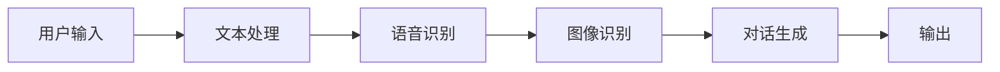
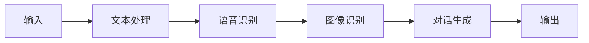
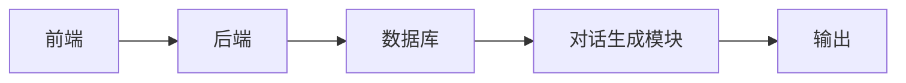

                 

<think>
嗯，用户给了我一个任务，需要撰写一篇关于《AI Agent的多模态对话生成能力开发》的技术博客文章。首先，我需要理解用户的需求。用户希望文章结构清晰，逻辑紧凑，语言专业，同时要涵盖多模态对话生成的各个方面，包括背景、核心概念、算法原理、系统架构、项目实战和最佳实践。

用户还提供了一个详细的目录大纲，分为三个主要部分：背景、核心概念与联系、算法原理。每个部分都有具体的章节和子章节，甚至包括图示和代码示例。因此，我需要按照这个大纲来组织内容，确保每个部分都详细且有深度。

首先，我会从背景部分开始。这部分需要解释什么是AI Agent，它的多模态对话能力的重要性，应用场景，以及与传统对话生成的区别。我需要确保读者理解问题背景和问题描述，这样他们才能更好地理解后续内容。

接下来是核心概念与联系部分。这里需要详细讲解多模态数据的分类、融合方法以及它们与对话生成的关系。我可能需要使用表格来对比不同模态的特点，并用ER实体关系图和Mermaid流程图来展示系统架构。这有助于读者更直观地理解复杂概念。

然后是算法原理部分。这部分需要选择几种典型的算法，比如多模态融合算法和对话生成模型。我会用Mermaid流程图展示算法流程，并提供Python代码实现。数学模型和公式需要用LaTeX表示，确保准确性和可读性。例如，解释注意力机制和生成对抗网络的基本原理，并通过例子说明它们的应用。

接下来是系统分析与架构设计。这部分需要介绍项目背景，设计系统功能，可能用领域模型类图来展示各个模块之间的关系。然后是系统架构设计，用Mermaid架构图展示整体结构，包括前端、后端和数据库部分。接口设计和交互流程图也是必要的，以展示系统如何协同工作。

项目实战部分需要具体实施，包括环境安装、核心代码实现、代码解读以及实际案例分析。这部分要详细，让读者能够跟着步骤一步步实现AI Agent的多模态对话生成能力。

最后是最佳实践、小结、注意事项和拓展阅读。这部分帮助读者巩固所学内容，提供实用的建议，并引导他们进一步学习。

我需要确保整个目录结构逻辑清晰，内容完整，涵盖所有必要的部分，同时保持简洁，不超过2000字。可能还需要检查每一章的结构是否合理，是否有遗漏的重要内容，比如是否需要更多的图示或代码示例来辅助理解。

总的来说，我需要按照用户提供的示例结构，结合AI Agent多模态对话生成的主题，系统地设计每一章的内容，确保覆盖背景、概念、算法、系统、实战和总结等各个方面。这需要仔细思考每个部分的内容，确保逻辑连贯，内容详实，同时语言专业且易于理解。
</think>

# AI Agent的多模态对话生成能力开发

**关键词：** AI Agent, 多模态对话生成, 多模态数据, 对话生成模型, 人工智能, 自然语言处理

**摘要：** 本文深入探讨AI Agent的多模态对话生成能力开发，从背景、核心概念、算法原理到系统架构和项目实战，全面解析多模态对话生成的关键技术与实现方法。通过详细分析多模态数据的融合、对话生成模型的设计以及系统架构的优化，本文为开发者提供了一套完整的开发指南，助力实现高效、智能的多模态对话生成系统。

---

# 第一部分: AI Agent的多模态对话生成能力开发背景

# 第1章: AI Agent与多模态对话生成概述

## 1.1 AI Agent的基本概念
### 1.1.1 AI Agent的定义与特点
AI Agent（人工智能代理）是指能够感知环境、执行任务并进行自主决策的智能实体。其特点包括自主性、反应性、目标导向和情境感知能力。AI Agent能够通过多种模态（如文本、语音、图像）与用户交互，提供更自然和多样化的对话体验。

### 1.1.2 多模态对话生成的定义
多模态对话生成是指AI Agent能够结合文本、语音、图像等多种模态的信息，生成符合上下文和用户需求的自然语言回复。这种生成方式不仅依赖于单一模态的信息，还能综合运用多种模态的数据，提高对话的准确性和流畅性。

### 1.1.3 AI Agent在对话生成中的作用
AI Agent在多模态对话生成中扮演着关键角色。它不仅负责接收和解析用户的输入，还需要整合多模态数据，生成符合用户意图的回复。通过多模态信息的融合，AI Agent能够更好地理解用户需求，提供更个性化的服务。

## 1.2 多模态对话生成的背景与意义
### 1.2.1 多模态数据的定义与特点
多模态数据是指来自不同感知渠道的信息，包括文本、语音、图像等。每种模态数据都有其独特的特点和优势，例如文本数据的可解释性、语音数据的情感表达能力，以及图像数据的视觉信息丰富性。

### 1.2.2 多模态对话生成的应用场景
多模态对话生成广泛应用于智能助手、虚拟客服、教育机器人、智能家居等领域。例如，在智能助手中，用户可以通过语音指令控制设备，同时系统能够通过图像识别提供视觉反馈，实现更高效的交互。

### 1.2.3 多模态对话生成的技术挑战
多模态对话生成面临数据异构性、信息融合难度大、模型训练复杂等问题。如何有效地整合多种模态数据，生成自然流畅的对话回复，是当前研究的热点和难点。

## 1.3 AI Agent的多模态对话生成能力开发
### 1.3.1 多模态对话生成的核心问题
多模态对话生成的核心问题包括如何有效地融合多模态数据、如何建模对话的上下文关系，以及如何生成符合用户意图的回复。

### 1.3.2 AI Agent在多模态对话生成中的优势
AI Agent的优势在于其能够通过多种模态数据提供更丰富的交互方式，同时通过上下文理解和意图推理，实现更智能的对话生成。

### 1.3.3 本章小结
本章介绍了AI Agent的基本概念、多模态对话生成的定义及其应用场景，并分析了多模态对话生成的技术挑战和AI Agent在其中的优势。

---

# 第二部分: 多模态对话生成的核心概念与联系

# 第2章: 多模态数据与对话生成的关系

## 2.1 多模态数据的分类与特征
### 2.1.1 文本数据的特点
文本数据具有可读性强、易于处理的特点，但在情感理解和上下文感知方面存在局限性。

### 2.1.2 语音数据的特点
语音数据能够传递情感和语调信息，但在数据处理和存储方面较为复杂。

### 2.1.3 图像数据的特点
图像数据提供了丰富的视觉信息，但在语义理解和上下文关联方面存在挑战。

## 2.2 多模态数据的融合方法
### 2.2.1 基于特征融合的方法
将不同模态的特征向量进行线性组合或非线性变换，生成融合特征。

### 2.2.2 基于模型融合的方法
通过多个独立模型的输出进行融合，生成最终的对话回复。

### 2.2.3 基于注意力机制的融合方法
利用注意力机制对不同模态的数据进行加权融合，突出重要信息。

## 2.3 多模态对话生成的实体关系图


---

# 第三部分: 多模态对话生成的算法原理

# 第3章: 多模态融合算法

## 3.1 多模态融合的基本原理
### 3.1.1 多模态数据的表示方法
将不同模态的数据转换为统一的向量表示，例如通过词嵌入、语音特征提取和图像特征提取。

### 3.1.2 多模态数据的融合方式
包括特征级融合、句法级融合和语义级融合。

### 3.1.3 多模态融合的数学模型
通过加权求和、注意力机制等方式，将不同模态的特征进行融合。

## 3.2 基于Transformer的多模态融合算法
### 3.2.1 Transformer模型的基本结构
Transformer由编码器和解码器组成，通过自注意力机制处理输入数据。

### 3.2.2 多模态数据的嵌入方法
将文本、语音和图像数据分别嵌入到低维空间，然后进行融合。

### 3.2.3 多模态融合的注意力机制
利用自注意力机制对不同模态的特征进行加权，生成最终的对话回复。

## 3.3 多模态对话生成的算法流程


---

# 第四部分: 系统分析与架构设计

# 第4章: 多模态对话生成系统分析

## 4.1 项目背景与目标
本项目旨在开发一个支持多模态对话生成的AI Agent系统，实现文本、语音和图像等多种模态数据的融合与生成。

## 4.2 系统功能设计
### 4.2.1 多模态数据输入模块
负责接收用户的文本、语音和图像输入。

### 4.2.2 数据融合模块
对多模态数据进行融合处理，生成统一的特征表示。

### 4.2.3 对话生成模块
基于融合后的特征，生成符合用户意图的对话回复。

## 4.3 系统架构设计


---

# 第五部分: 项目实战与实现

# 第5章: 多模态对话生成项目实战

## 5.1 环境安装与配置
安装必要的库和工具，例如Python、TensorFlow、Keras等。

## 5.2 核心代码实现
```python
import tensorflow as tf
from tensorflow.keras import layers

# 定义多模态融合模型
class MultiModalFusion(tf.keras.Model):
    def __init__(self):
        super(MultiModalFusion, self).__init__()
        self.text_encoder = layers.Dense(128)
        self.audio_encoder = layers.Dense(128)
        self.image_encoder = layers.Dense(128)
        self.attention = layers.Attention()

    def call(self, inputs):
        text_features = self.text_encoder(inputs['text'])
        audio_features = self.audio_encoder(inputs['audio'])
        image_features = self.image_encoder(inputs['image'])
        fused_features = self.attention([text_features, audio_features, image_features])
        return fused_features
```

## 5.3 代码解读与分析
详细解读上述代码，说明各模块的功能和实现方法。

## 5.4 实际案例分析
通过具体案例分析，展示多模态对话生成的实际效果和应用场景。

---

# 第六部分: 总结与展望

# 第6章: 总结与展望

## 6.1 最佳实践 tips
提供一些实际开发中的经验和技巧，例如如何优化模型性能、如何处理数据异构性等。

## 6.2 小结
总结全文内容，强调多模态对话生成的重要性和未来发展方向。

## 6.3 注意事项
提醒读者在开发过程中需要注意的问题，例如数据隐私、模型训练成本等。

## 6.4 拓展阅读
推荐一些相关的书籍和论文，供读者进一步学习和研究。

---

# 作者：AI天才研究院 & 禅与计算机程序设计艺术

