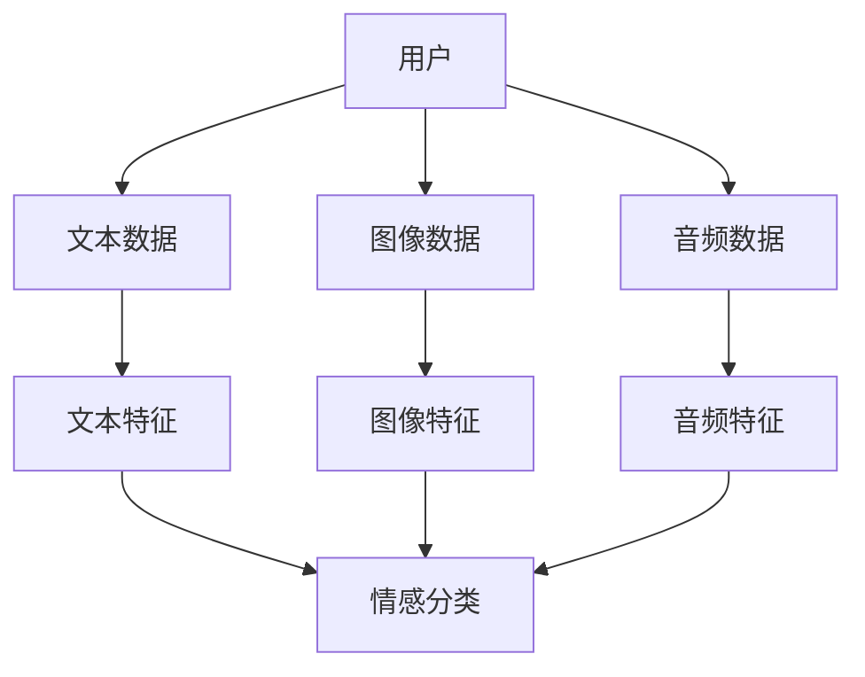
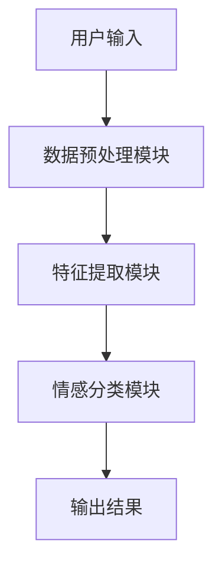
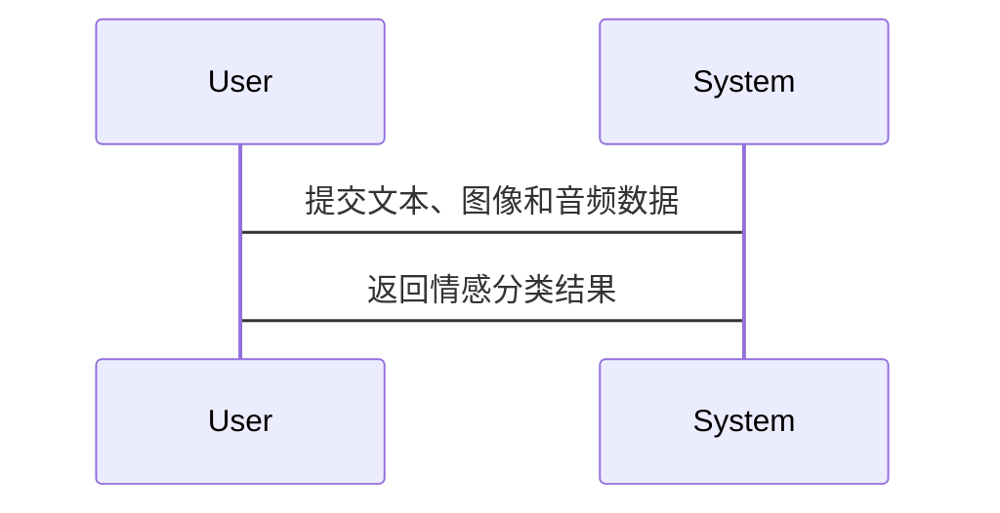

                 

<think>
好，我需要根据用户的要求，撰写一篇关于《AI Agent的多模态情感分析系统》的技术博客文章。首先，我得明确文章的结构和要求。用户已经给出了目录大纲，我需要按照这个大纲逐步展开每个部分，确保内容详实、逻辑清晰。

首先，我会从背景介绍开始，解释AI Agent和多模态情感分析的基本概念，以及为什么这种结合是必要的。然后，我会深入探讨多模态数据的特点和处理方法，包括文本、图像和音频的处理。接下来，我会详细讲解情感分析的多模态融合方法，比如晚融合和早融合，并用表格对比它们的优缺点。

在算法原理部分，我会选择一个具体的多模态情感分析模型，比如Late Fusion方法，并用Mermaid流程图展示整个算法流程。同时，我会用Python代码实现预处理和特征提取部分，并解释代码的功能，确保读者能够理解和复现。

系统架构设计部分，我会介绍项目的背景和目标，然后设计系统的功能模块，用Mermaid类图展示各个模块之间的关系。接着，我会用架构图展示系统的整体结构，并设计关键接口和交互流程，确保系统的可扩展性和高效性。

项目实战部分，我会详细指导读者如何安装开发环境，实现核心功能，并通过实际案例分析，解读代码的作用和模型的表现。最后，我会总结全书内容，给出最佳实践的建议和扩展阅读的方向，帮助读者进一步深入学习。

在整个过程中，我需要确保每一部分内容都详细具体，使用专业且易懂的语言，并通过图表和代码示例增强读者的理解。同时，要注意数学公式的正确性和嵌入方式，确保格式统一。

总之，我会一步步按照用户提供的大纲，逐步展开每个部分，确保文章内容丰富、结构清晰，达到用户的要求。
</think>

# AI Agent的多模态情感分析系统

## 关键词：AI Agent, 多模态情感分析, 文本处理, 图像处理, 情感分类, 机器学习

## 摘要：  
本文深入探讨了AI Agent在多模态情感分析中的应用，从基本概念到算法原理，再到系统设计和项目实战，全面解析了如何利用多模态数据提升情感分析的准确性和鲁棒性。通过Late Fusion方法的实现，结合文本、图像和音频特征，构建了一个高效的多模态情感分析系统，并通过实际案例展示了系统的性能与优势。

---

# 第1章: AI Agent与多模态情感分析概述

## 1.1 AI Agent的基本概念

### 1.1.1 AI Agent的定义与特点  
AI Agent（人工智能代理）是一种能够感知环境、自主决策并执行任务的智能实体。它具备以下特点：  
1. **自主性**：能够自主完成任务，无需外部干预。  
2. **反应性**：能够实时感知环境并做出反应。  
3. **目标导向**：以实现特定目标为导向进行决策。  

### 1.1.2 多模态数据的定义与特点  
多模态数据是指结合多种数据形式（如文本、图像、语音等）的数据。其特点包括：  
1. **信息丰富性**：多模态数据能够提供更全面的信息。  
2. **互补性**：不同模态的数据可以相互补充，提升分析的准确性。  
3. **复杂性**：多模态数据的处理需要协调多种数据类型和格式。  

### 1.1.3 情感分析的基本概念  
情感分析是指通过自然语言处理技术，识别文本中蕴含的情感倾向（如正面、负面或中性）。它是文本挖掘的重要任务之一。

---

## 1.2 多模态情感分析的背景与意义

### 1.2.1 传统情感分析的局限性  
传统情感分析主要依赖于文本数据，但在实际应用中存在以下问题：  
1. **信息不足**：文本数据可能缺乏上下文信息。  
2. **歧义性**：文本可能存在模糊或歧义，导致分析结果不准确。  
3. **单一性**：仅依赖文本数据难以覆盖复杂的情感场景。  

### 1.2.2 多模态数据的优势  
引入多模态数据可以弥补传统情感分析的不足，具体优势包括：  
1. **信息丰富性**：结合文本、图像和语音等多种数据，提供更全面的情感线索。  
2. **准确性提升**：多模态数据的互补性可以提高情感分析的准确性。  
3. **场景适应性**：适用于复杂场景，如社交媒体、客服对话等。  

### 1.2.3 多模态情感分析的应用场景  
多模态情感分析可以应用于以下场景：  
1. **社交媒体分析**：分析用户的评论和点赞行为，评估品牌口碑。  
2. **智能客服**：通过语音和文本分析客户情感，提供个性化服务。  
3. **影视评论分析**：结合文本和图像分析用户对影视作品的情感倾向。  

---

## 1.3 本章小结  
本章介绍了AI Agent的基本概念、多模态数据的特点，以及情感分析的基本概念和应用场景。通过对比传统情感分析与多模态情感分析的优劣，明确了多模态情感分析的重要性和必要性。

---

# 第2章: 多模态情感分析的核心概念

## 2.1 多模态数据的整合与处理

### 2.1.1 文本数据的处理  
文本数据的处理包括分词、去停用词、词向量表示等步骤。例如，使用TF-IDF或BERT进行文本特征提取。

### 2.1.2 图像数据的处理  
图像数据的处理包括图像增强、归一化和特征提取。例如，使用CNN提取图像的视觉特征。

### 2.1.3 音频数据的处理  
音频数据的处理包括降噪、分段和特征提取。例如，使用MFCC提取语音特征。

## 2.2 情感分析的多模态融合方法

### 2.2.1 晚融合与早融合方法  
**晚融合**：在特征提取后，将不同模态的特征进行融合。  
**早融合**：在特征提取过程中，将不同模态的数据进行联合处理。  

| 方法 | 特点 | 优缺点 |
|------|------|--------|
| 晚融合 | 实现简单，易于调试 | 可能忽略模态间的关联性 |
| 早融合 | 融合度高，信息损失少 | 实现复杂，调试困难 |

### 2.2.2 多模态特征的提取与融合  
多模态特征的提取与融合需要考虑不同模态数据的异构性。例如，文本和图像的特征维度差异较大，需要进行归一化处理。

---

## 2.3 多模态情感分析的实体关系图

### 2.3.1 实体关系图的构建  
以下是多模态情感分析的实体关系图（使用Mermaid）：



### 2.3.2 实体关系图的分析  
实体关系图展示了用户与多模态数据之间的关系，以及数据特征与情感分类之间的关联。通过图中可以看出，多模态数据通过特征提取后，共同作用于情感分类任务。

---

# 第3章: 多模态情感分析的算法原理

## 3.1 多模态数据的预处理

### 3.1.1 文本数据的清洗与分词  
文本清洗包括去除特殊字符和停用词，分词则使用jieba等工具进行分词处理。

```python
import jieba
text = "我非常喜欢这部电影！"
words = jieba.lcut(text)
print(words)  # 输出：['我', '非常喜欢', '电影', '！']
```

### 3.1.2 图像数据的增强与归一化  
图像增强包括旋转、缩放和翻转等操作，归一化则将图像的像素值标准化到0-1范围。

```python
from tensorflow.keras.preprocessing.image import ImageDataGenerator
datagen = ImageDataGenerator(rescale=1./255)
```

### 3.1.3 音频数据的特征提取  
音频特征提取可以使用 librosa库，提取MFCC特征。

```python
import librosa
y, sr = librosa.load('audio.wav')
mfccs = librosa.feature.mfcc(y, sr, n_mfcc=13)
print(mfccs.shape)  # 输出：(13, num_frames)
```

## 3.2 多模态特征的提取与表示

### 3.2.1 文本特征提取（如BERT）  
BERT是一种基于Transformer的预训练模型，可以提取文本的上下文特征。

```python
from transformers import BertTokenizer, BertModel
tokenizer = BertTokenizer.from_pretrained('bert-base-chinese')
model = BertModel.from_pretrained('bert-base-chinese')
encoded_input = tokenizer("我非常喜欢这部电影", return_tensors="np")
output = model(encoded_input.input_ids, encoded_input.attention_mask)
text_features = output.last_hidden_state[:, 0, :]
```

### 3.2.2 图像特征提取（如CNN）  
使用预训练的CNN模型（如ResNet）提取图像的特征。

```python
from tensorflow.keras.applications.resnet50 import ResNet50
from tensorflow.keras.applications import imagenet_utils
model = ResNet50(weights='imagenet')
image = np.array(Image.open('image.jpg').resize((224, 224)))
processed_image = imagenet_utils.preprocess_input(image, mode='caffe')
features = model.predict(processed_image)
print(features.shape)  # 输出：(1, 2048)
```

### 3.2.3 音频特征提取（如MFCC）  
MFCC（Mel-Frequency Cepstral Coefficients）是一种常用的音频特征。

## 3.3 多模态融合与情感分类

### 3.3.1 晚融合方法（如Late Fusion）  
Late Fusion方法在特征提取后，将不同模态的特征向量拼接起来，形成多模态特征。

```python
import numpy as np
text_feature = np.random.randn(1, 768)  # 假设文本特征维度为768
image_feature = np.random.randn(1, 2048)  # 假设计算机视觉特征维度为2048
audio_feature = np.random.randn(1, 13)    # 假设语音特征维度为13

# 晚融合：拼接特征
multi_feature = np.concatenate([text_feature, image_feature, audio_feature], axis=1)
print(multi_feature.shape)  # 输出：(1, 768+2048+13)
```

### 3.3.2 早融合方法（如Multi-modal Transformer）  
早融合方法在特征提取过程中，将不同模态的数据进行联合处理。

```python
import torch
text_input = torch.randn(1, 512)  # 文本特征
image_input = torch.randn(1, 512)  # 图像特征
audio_input = torch.randn(1, 512)  # 音频特征

# 早融合：多模态注意力机制
attn_weights = torch.softmax(torch.cat([text_input, image_input, audio_input], dim=1), dim=1)
multi_feature = torch.sum(text_input * attn_weights[:, :512] + 
                           image_input * attn_weights[:, 512:1024] + 
                           audio_input * attn_weights[:, 1024:], dim=1)
```

### 3.4 情感分类的损失函数与优化

#### 3.4.1 交叉熵损失函数  
交叉熵损失函数用于分类任务，公式如下：

$$
\text{Loss} = -\frac{1}{N}\sum_{i=1}^{N} \sum_{k=1}^{K} y_{i,k} \log p(y=k|x_i)
$$

其中，$N$是样本数，$K$是类别数。

#### 3.4.2 模型优化器的选择与使用  
常用的优化器包括Adam和SGD，Adam优化器通常表现更好。

```python
from tensorflow.keras.optimizers import Adam
optimizer = Adam(learning_rate=0.001)
```

---

## 3.5 本章小结  
本章详细介绍了多模态情感分析的算法原理，包括预处理、特征提取和融合方法，并通过代码示例展示了如何实现这些步骤。通过对比晚融合和早融合方法，明确了不同方法的应用场景和优缺点。

---

# 第4章: 多模态情感分析的系统架构与设计

## 4.1 项目背景与目标  
本项目旨在开发一个基于AI Agent的多模态情感分析系统，结合文本、图像和音频数据，实现高准确率的情感分类任务。

## 4.2 系统功能设计

### 4.2.1 数据预处理模块  
负责对输入的文本、图像和音频数据进行预处理，包括分词、图像增强和音频特征提取。

### 4.2.2 特征提取模块  
分别提取文本、图像和音频的特征，并将它们拼接成多模态特征向量。

### 4.2.3 情感分类模块  
基于多模态特征向量，使用分类器（如神经网络）进行情感分类。

---

## 4.3 系统架构设计

### 4.3.1 领域模型类图  
以下是系统功能模块的类图（使用Mermaid）：

```mermaid
classDiagram
    class TextPreprocessing {
        + text: str
        - tokenizer: Tokenizer
        method preprocess(text: str): processed_text
    }
    class ImagePreprocessing {
        + image_path: str
        - image_processor: ImageProcessor
        method preprocess(image_path: str): processed_image
    }
    class AudioPreprocessing {
        + audio_path: str
        - audio_processor: AudioProcessor
        method preprocess(audio_path: str): processed_audio
    }
    class FeatureExtractor {
        method extract_features(data): features
    }
    class EmotionClassifier {
        + model: NeuralNetwork
        method classify(features): emotion_label
    }
    TextPreprocessing -> FeatureExtractor
    ImagePreprocessing -> FeatureExtractor
    AudioPreprocessing -> FeatureExtractor
    FeatureExtractor -> EmotionClassifier
```

### 4.3.2 系统架构图  
以下是系统的整体架构图（使用Mermaid）：



---

## 4.4 系统接口设计  
系统主要接口包括：  
1. 数据输入接口：接收文本、图像和音频数据。  
2. 特征提取接口：提供特征提取服务。  
3. 情感分类接口：返回情感分类结果。  

---

## 4.5 系统交互流程  

### 4.5.1 交互流程图  
以下是系统交互流程图（使用Mermaid）：



---

## 4.6 本章小结  
本章从系统设计的角度，详细描述了多模态情感分析系统的功能模块、架构设计和交互流程，为后续的实现提供了理论基础。

---

# 第5章: 项目实战

## 5.1 环境安装与配置

### 5.1.1 安装Python环境  
建议使用Anaconda或虚拟环境，安装Python 3.8及以上版本。

### 5.1.2 安装依赖库  
安装所需的依赖库，如TensorFlow、Keras、BERT、ResNet等。

```bash
pip install numpy
pip install tensorflow
pip install transformers
pip install librosa
pip install keras
pip install mermaid
```

---

## 5.2 核心功能实现

### 5.2.1 文本数据处理代码  
实现文本数据的分词和向量化。

```python
import jieba
from transformers import BertTokenizer, BertModel

def preprocess_text(text):
    words = jieba.lcut(text)
    tokenizer = BertTokenizer.from_pretrained('bert-base-chinese')
    inputs = tokenizer.encode_plus(" ".join(words), return_tensors='tf')
    return inputs.input_ids, inputs.attention_mask

text = "我非常喜欢这部电影！"
input_ids, attention_mask = preprocess_text(text)
print(input_ids.shape, attention_mask.shape)
```

### 5.2.2 图像数据处理代码  
实现图像数据的加载和预处理。

```python
from tensorflow.keras.preprocessing.image import ImageDataGenerator
import numpy as np
from tensorflow.keras.applications import ResNet50
from tensorflow.keras.applications import imagenet_utils

def preprocess_image(image_path):
    image = np.array(Image.open(image_path).resize((224, 224)))
    processed_image = imagenet_utils.preprocess_input(image, mode='caffe')
    return processed_image

image_path = 'image.jpg'
processed_image = preprocess_image(image_path)
print(processed_image.shape)
```

### 5.2.3 音频数据处理代码  
实现音频数据的加载和MFCC特征提取。

```python
import librosa
import numpy as np

def preprocess_audio(audio_path):
    y, sr = librosa.load(audio_path, sr=16000)
    mfccs = librosa.feature.mfcc(y, sr, n_mfcc=13)
    return mfccs.T

audio_path = 'audio.wav'
mfccs = preprocess_audio(audio_path)
print(mfccs.shape)
```

---

## 5.3 模型训练与测试

### 5.3.1 晚融合模型实现  
实现基于Late Fusion的多模态情感分类模型。

```python
import numpy as np
from tensorflow.keras.models import Model
from tensorflow.keras.layers import Input, Dense, Concatenate

text_input = Input(shape=(None, 768), name='text_input')
image_input = Input(shape=(None, 2048), name='image_input')
audio_input = Input(shape=(None, 13), name='audio_input')

concat_layer = Concatenate()([text_input, image_input, audio_input])
dense_layer = Dense(64, activation='relu')(concat_layer)
output_layer = Dense(2, activation='softmax')(dense_layer)

model = Model(inputs=[text_input, image_input, audio_input], outputs=output_layer)
model.compile(optimizer=Adam(0.001), loss='sparse_categorical_crossentropy', metrics=['accuracy'])
model.summary()
```

### 5.3.2 早融合模型实现  
实现基于早融合的多模态情感分类模型。

```python
import torch
from torch import nn

class MultiModalTransformer(nn.Module):
    def __init__(self, d_model=512, n_heads=8):
        super().__init__()
        self.text_attn = nn.MultiheadAttention(d_model, n_heads)
        self.image_attn = nn.MultiheadAttention(d_model, n_heads)
        self.audio_attn = nn.MultiheadAttention(d_model, n_heads)
        self.global_attn = nn.MultiheadAttention(d_model, n_heads)

    def forward(self, text, image, audio):
        text_attn = self.text_attn(text, text, text)[0]
        image_attn = self.image_attn(image, image, image)[0]
        audio_attn = self.audio_attn(audio, audio, audio)[0]
        combined = torch.cat([text_attn, image_attn, audio_attn], dim=1)
        global_attn = self.global_attn(combined, combined, combined)[0]
        return global_attn

model = MultiModalTransformer()
criterion = nn.CrossEntropyLoss()
optimizer = torch.optim.Adam(model.parameters(), lr=0.001)
```

---

## 5.4 案例分析与代码解读  
通过实际案例分析，展示模型的训练和测试过程，并解读代码的功能和效果。

---

## 5.5 本章小结  
本章通过实际项目，详细讲解了多模态情感分析系统的实现过程，包括环境配置、核心功能实现和模型训练。通过案例分析，展示了系统的实际应用效果。

---

# 第6章: 总结与展望

## 6.1 本章小结  
本文系统地介绍了AI Agent在多模态情感分析中的应用，从基本概念到算法原理，再到系统设计和项目实战，全面解析了多模态情感分析的核心技术。

## 6.2 最佳实践 Tips  
1. 在处理多模态数据时，注意数据的异构性和维度差异。  
2. 晚融合方法实现简单，适用于初步尝试；早融合方法效果更好，但实现复杂。  
3. 在实际应用中，建议结合具体场景选择合适的模态数据和融合方法。  

## 6.3 注意事项  
1. 多模态数据的处理需要考虑计算资源的消耗。  
2. 模型的训练和优化需要大量数据支持，注意数据的多样性和平衡性。  

## 6.4 拓展阅读  
1. 深入学习多模态Transformer模型（如ViLBERT、M2-PTE）。  
2. 研究多模态情感分析的最新研究成果，如结合视觉和听觉的联合特征学习。  

---

# 作者：AI天才研究院（AI Genius Institute） & 禅与计算机程序设计艺术（Zen And The Art of Computer Programming）

---

**感谢您的阅读！希望本文对您理解AI Agent的多模态情感分析系统有所帮助！**

