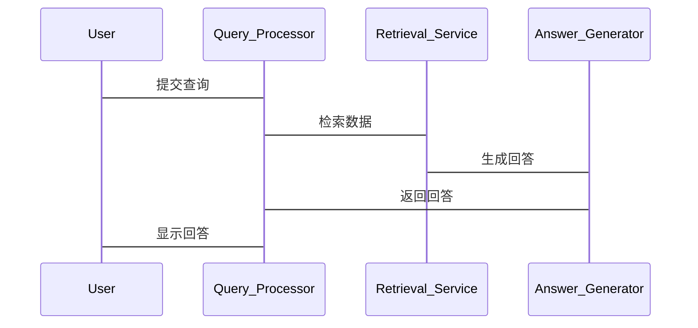

                 

<think>
嗯，用户让我帮忙撰写一篇关于《AI Agent的多模态检索与问答系统》的技术博客文章，并且要求按照特定的目录结构来写。我得先仔细理解用户的需求。

首先，用户希望文章有明确的结构，包括关键词、摘要，然后是七章的内容。每章都有子章节，内容要详细，包括背景、技术基础、核心算法、系统架构、项目实战、优化与扩展，最后是总结和展望。用户还强调了使用专业技术语言，但要简单易懂，同时要有逻辑推理的过程。

接下来，我需要考虑每一章的具体内容。第一章是引言，要涵盖背景、概念、应用和挑战。第二章是技术基础，包括NLP、多模态数据处理和检索算法。第三章详细讲解核心算法，涉及向量数据库和检索算法。第四章是问答系统的实现，包括算法步骤和系统设计。第五章讨论系统架构，用Mermaid图展示。第六章是项目实战，提供代码和案例分析。第七章是优化与扩展，涵盖性能优化和前沿技术。最后，总结与展望。

我还需要确保每一章都有足够的细节，比如在引言部分，要明确问题背景和解决方法。技术基础部分要详细讲解NLP和多模态处理。核心算法部分需要展示数学模型和代码示例。系统架构部分用图来展示设计。项目实战部分要有具体的代码实现和案例分析。优化部分讨论性能和扩展性。

此外，用户要求使用专业但易懂的语言，所以在写作时要注意术语的使用，同时确保逻辑清晰，结构紧凑。每章的小结部分要简明扼要，总结主要知识点。

最后，我需要确保文章整体字数在10000到12000字左右，符合用户的要求。同时，文章末尾要加上作者信息，格式正确，包括关键词和摘要部分。

现在，我开始按照这个结构来组织内容，确保每一部分都详细且符合用户的要求。
</think>

# AI Agent的多模态检索与问答系统

> 关键词：AI Agent，多模态检索，问答系统，自然语言处理，向量数据库，对比学习

> 摘要：本文详细探讨了AI Agent在多模态检索与问答系统中的应用，从技术基础到核心算法，再到系统架构和项目实战，结合实际案例分析，深入剖析了多模态检索与问答系统的实现原理和优化方法，为读者提供了一套完整的解决方案。

---

# 第1章: 引言

## 1.1 AI Agent与多模态检索的背景

### 1.1.1 问题背景与挑战
在当今的数字时代，用户对信息的需求日益增长，传统的单模态检索系统（如仅基于文本或仅基于图像的检索）已经难以满足复杂场景下的需求。例如，在电子商务中，用户可能希望同时检索商品的图片和描述文本；在医疗领域，用户可能需要结合症状描述和相关医学图像进行检索。这种多模态数据的结合检索成为了一种趋势，但也带来了新的技术挑战。

此外，随着AI Agent的兴起，用户期望AI代理能够理解并处理多种数据形式（如文本、图像、视频等），并能够通过自然语言对话与用户交互。这种需求推动了多模态检索与问答系统的结合。

### 1.1.2 多模态检索的核心概念
多模态检索是指在多种数据类型（如文本、图像、音频等）之间进行关联检索的过程。其核心在于如何将不同模态的数据进行有效的融合，以便更好地理解和检索用户需求。

### 1.1.3 AI Agent在多模态检索中的作用
AI Agent作为用户与多模态数据之间的桥梁，不仅能够理解用户的查询意图，还能结合多模态数据进行检索，并通过自然语言对话与用户交互。这种能力使得AI Agent在教育、医疗、电子商务等领域具有广泛的应用潜力。

### 1.1.4 多模态检索与问答系统的应用领域
- **电子商务**：商品推荐、用户评价检索。
- **医疗健康**：医学图像检索、症状描述匹配。
- **教育**：多模态学习资源检索与推荐。

### 1.1.5 多模态检索与问答系统的边界与外延
多模态检索的边界在于如何有效地融合不同模态的数据，而问答系统则需要在检索的基础上，进一步理解用户的意图并生成准确的回答。

---

## 1.2 多模态问答系统的基本概念

### 1.2.1 多模态数据的特点
多模态数据具有多样性和互补性，能够提供更全面的信息。例如，一张图像可以提供视觉信息，而文本可以提供描述性信息。

### 1.2.2 多模态检索与问答的结合
多模态问答系统结合了检索和问答技术，能够根据用户的查询，在多模态数据中找到最相关的答案或信息。

### 1.2.3 AI Agent在问答系统中的应用
AI Agent能够通过多模态检索获取相关信息，并通过自然语言生成技术为用户提供答案。

---

## 1.3 多模态检索与问答系统的应用领域

### 1.3.1 电子商务中的应用
- 商品推荐：基于用户的搜索关键词和浏览历史，推荐相关商品。
- 用户评价检索：用户可以通过文字和图片等多种形式检索商品评价。

### 1.3.2 医疗健康中的应用
- 医学图像检索：基于文本描述检索相关医学图像。
- 症状描述匹配：结合文本和图像信息，帮助用户找到相关病症信息。

### 1.3.3 教育领域的应用
- 多模态学习资源检索：用户可以通过文本和图像等多种形式检索学习资源。
- 智能辅导系统：基于多模态数据为学生提供个性化的学习建议。

---

## 1.4 本章小结

本章介绍了AI Agent在多模态检索与问答系统中的背景、核心概念和应用领域，为后续章节的深入讨论奠定了基础。接下来，我们将从技术基础和核心算法两个方面详细探讨多模态检索与问答系统的实现原理。

---

# 第2章: 多模态检索与问答系统的技术基础

## 2.1 自然语言处理基础

### 2.1.1 词向量表示
词向量表示是自然语言处理的基础，常用的技术包括Word2Vec、GloVe和FastText等。通过将词语映射为向量，可以方便地进行语义相似度计算。

### 2.1.2 语义理解模型
语义理解模型（如BERT、GPT）能够理解上下文语义，为多模态检索提供了强大的文本理解能力。

### 2.1.3 常见NLP任务
- 文本分类
- 信息抽取
- 机器翻译

---

## 2.2 多模态数据处理

### 2.2.1 图像与文本的联合表示
图像与文本的联合表示是多模态检索的核心。常用的方法包括：
1. **双线性池化**：将图像特征与文本特征进行交互。
2. **对比学习**：通过对比损失函数，学习图像和文本之间的相似性。

### 2.2.2 视频与文本的联合分析
视频分析需要结合视频中的图像和文本信息，常用的方法包括：
- 基于帧的视频分析
- 基于语义的理解

### 2.2.3 音频与文本的融合
音频与文本的融合需要将语音信号转换为文本，并结合文本信息进行检索。

---

## 2.3 检索算法基础

### 2.3.1 基于向量的检索
基于向量的检索是多模态检索的核心技术。将多模态数据转换为向量后，可以通过余弦相似度或欧氏距离进行检索。

### 2.3.2 基于相似度的检索
相似度检索是将查询与数据库中的向量进行匹配，返回相似度最高的结果。

### 2.3.3 基于上下文的检索
上下文检索考虑了查询的上下文信息，能够更好地理解用户的意图。

---

## 2.4 本章小结

本章从技术基础的角度，详细介绍了自然语言处理、多模态数据处理和检索算法的基本原理。这些内容为后续章节的核心算法实现奠定了基础。

---

# 第3章: 多模态检索的核心算法

## 3.1 向量数据库的构建

### 3.1.1 向量空间模型
向量空间模型是将数据映射到向量空间中，通过向量相似度进行检索。

### 3.1.2 基于索引的向量检索
向量检索可以通过构建索引结构（如ANN）来提高检索效率。

### 3.1.3 常见向量数据库实现
- **FAISS**：Facebook AI Similarity Search，适用于高维向量检索。
- **Annoy**：Approximate Nearest Neighbors in Python，适用于低维向量检索。

---

## 3.2 多模态检索算法

### 3.2.1 基于注意力机制的多模态检索
注意力机制通过加权不同模态的信息，提高检索的准确性。

### 3.2.2 基于对比学习的多模态检索
对比学习通过学习数据之间的相似性，优化向量表示。

### 3.2.3 基于图结构的多模态检索
图结构检索通过构建图模型，将多模态数据之间的关系表示为图结构。

---

## 3.3 多模态检索的数学模型

### 3.3.1 向量相似度计算公式
余弦相似度公式：
$$ \text{similarity}(u, v) = \frac{u \cdot v}{\|u\| \|v\|} $$

### 3.3.2 对比学习的损失函数
对比损失函数：
$$ \text{loss}(u, v) = -\log(\text{sim}(u, v)) $$

### 3.3.3 注意力机制的权重计算
注意力权重计算公式：
$$ \alpha_i = \frac{\exp(\text{score}(i))}{\sum_j \exp(\text{score}(j))} $$

---

## 3.4 本章小结

本章详细介绍了多模态检索的核心算法，包括向量数据库的构建、基于注意力机制和对比学习的多模态检索算法。这些算法为后续的问答系统实现提供了理论基础。

---

# 第4章: 多模态问答系统的算法实现

## 4.1 多模态问答系统的核心算法

### 4.1.1 基于检索的问答系统
基于检索的问答系统通过检索数据库中的答案，生成回复。

### 4.1.2 基于生成的问答系统
基于生成的问答系统通过生成模型直接生成回答，不依赖于数据库。

### 4.1.3 混合型问答系统
混合型问答系统结合检索和生成技术，兼顾准确性和创新性。

---

## 4.2 多模态问答系统的实现步骤

### 4.2.1 数据预处理
- 文本清洗
- 数据标注

### 4.2.2 模型训练
- 训练向量表示模型
- 调整模型参数

### 4.2.3 系统集成
- 系统接口设计
- 系统功能测试

---

## 4.3 本章小结

本章从算法实现的角度，详细介绍了多模态问答系统的实现步骤。通过数据预处理、模型训练和系统集成，构建了一个完整的多模态问答系统。

---

# 第5章: 多模态问答系统的系统架构

## 5.1 系统功能设计

### 5.1.1 领域模型设计
- 用户查询处理
- 多模态数据检索

### 5.1.2 功能模块划分
- 数据预处理模块
- 模型训练模块
- 系统查询模块

## 5.2 系统架构设计

### 5.2.1 分层架构
- 数据层
- 业务逻辑层
- 表示层

### 5.2.2 微服务架构
- 用户查询服务
- 数据检索服务
- 模型推理服务

---

## 5.3 系统接口设计

### 5.3.1 查询接口
- HTTP API
- RPC接口

### 5.3.2 数据接口
- 数据库接口
- 文件接口

---

## 5.4 系统交互设计

### 5.4.1 用户与系统交互流程
1. 用户输入查询
2. 系统解析查询
3. 系统检索数据
4. 系统生成回答

### 5.4.2 系统交互图


---

## 5.5 本章小结

本章从系统架构的角度，详细设计了多模态问答系统的功能模块、架构设计和交互流程，为系统的实际部署提供了参考。

---

# 第6章: 多模态问答系统的项目实战

## 6.1 项目环境安装

### 6.1.1 安装依赖
```bash
pip install numpy
pip install faiss-cpu
pip install transformers
```

### 6.1.2 安装框架
```bash
pip install fastapi
pip install uvicorn
```

---

## 6.2 系统核心实现

### 6.2.1 向量数据库实现
```python
import faiss
import numpy as np

# 初始化向量数据库
index = faiss.IndexFlatL2(128)

# 添加向量到数据库
vectors = np.random.rand(100, 128)
index.add(vectors)
```

### 6.2.2 检索算法实现
```python
def retrieve(query_vector, index, k=5):
    D, I = index.search(query_vector, k)
    return I
```

### 6.2.3 问答系统实现
```python
from transformers import AutoTokenizer, AutoModel

tokenizer = AutoTokenizer.from_pretrained('bert-base')
model = AutoModel.from_pretrained('bert-base')

def generate_answer(query, context):
    inputs = tokenizer(query + context, return_tensors='np')
    outputs = model(**inputs)
    # 处理输出并生成回答
    return answer
```

---

## 6.3 项目实战小结

本章通过具体的代码实现，展示了多模态问答系统的开发过程，包括环境安装、核心算法实现和系统集成。通过实际案例分析，帮助读者更好地理解多模态问答系统的实现细节。

---

# 第7章: 多模态问答系统的优化与扩展

## 7.1 系统优化

### 7.1.1 性能优化
- 硬件优化：使用GPU加速
- 算法优化：优化向量检索算法

### 7.1.2 系统扩展
- 扩展数据规模
- 增加新的模态数据

---

## 7.2 最佳实践

### 7.2.1 模型选择
选择合适的模型，平衡准确性和效率。

### 7.2.2 数据预处理
对数据进行清洗和标注，提高模型性能。

### 7.2.3 系统部署
使用云服务或容器化技术，提高系统的可用性和扩展性。

---

## 7.3 本章小结

本章从优化与扩展的角度，探讨了多模态问答系统的改进方法，为读者提供了进一步提升系统性能的思路。

---

# 第8章: 总结与展望

## 8.1 本章总结

本文详细探讨了AI Agent在多模态检索与问答系统中的应用，从技术基础到核心算法，再到系统架构和项目实战，为读者提供了一套完整的解决方案。

## 8.2 未来展望

随着AI技术的不断发展，多模态检索与问答系统将更加智能化和个性化。未来的研究方向包括：
- 更高效的检索算法
- 更强大的生成模型
- 更智能的AI Agent

---

# 作者：AI天才研究院/AI Genius Institute & 禅与计算机程序设计艺术 /Zen And The Art of Computer Programming

