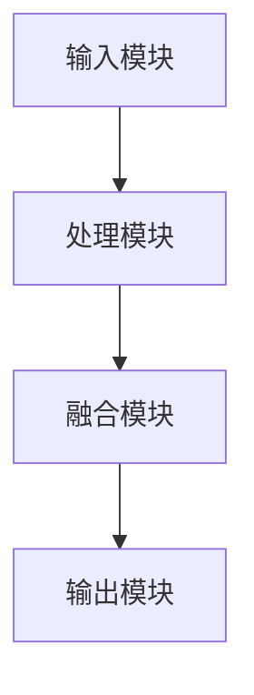
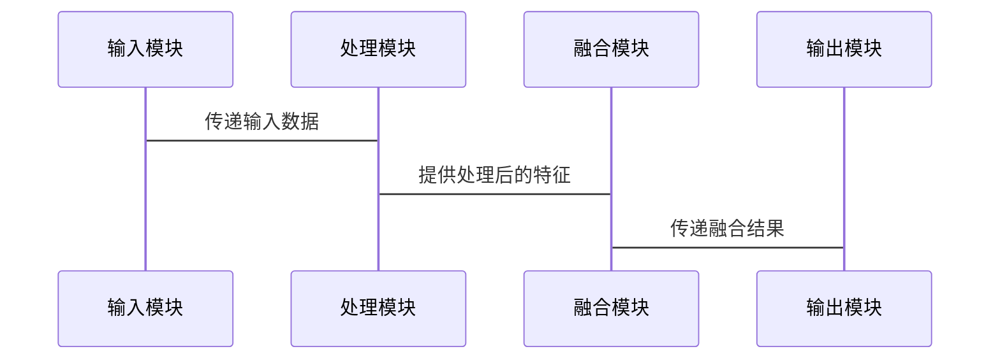

                 


# AI Agent的多模态融合与交互设计

**关键词：** AI Agent，多模态融合，交互设计，深度学习，多模态数据

**摘要：** 本文深入探讨了AI Agent在多模态数据融合与交互设计中的核心原理与实践应用。通过分析多模态数据的特性、融合方法及交互设计，结合实际案例，系统性地阐述了AI Agent的设计与实现过程。文章内容涵盖背景介绍、核心概念、算法原理、系统架构及项目实战，旨在为读者提供一个多维度、深层次的技术指南。

---

## 第一章: AI Agent与多模态融合概述

### 1.1 AI Agent的基本概念

#### 1.1.1 AI Agent的定义与特点
- **定义：** AI Agent（智能体）是指能够感知环境、自主决策并执行任务的智能系统。
- **特点：**
  - 智能性：通过算法实现自主决策。
  - 反应性：能够实时感知并响应环境变化。
  - 社会性：具备与人类或其他智能体交互的能力。

#### 1.1.2 多模态数据的定义与特性
- **定义：** 多模态数据指来自不同感官渠道的数据，如视觉、听觉、语言等。
- **特性：**
  - 异构性：不同模态的数据格式和语义差异大。
  - 补充性：多种模态数据能够互补信息。
  - 复杂性：多模态数据处理需要综合多种算法。

#### 1.1.3 AI Agent与多模态融合的关联性
- AI Agent需要处理多模态数据以实现更强大的感知和决策能力。
- 多模态融合是AI Agent实现复杂任务的关键技术。

### 1.2 多模态融合的背景与意义
#### 1.2.1 多模态数据的异构性与挑战
- 不同模态的数据格式差异大，难以直接融合。
- 数据量大，处理复杂。

#### 1.2.2 多模态融合在AI Agent中的作用
- 提高感知能力，增强决策的准确性。
- 实现更自然的用户交互。

#### 1.2.3 多模态融合的典型应用场景
- 智能客服：结合文本和语音进行交互。
- 智能助手：整合语音、文本和图像信息。

### 1.3 本章小结
本章介绍了AI Agent的基本概念和多模态数据的特性，阐述了多模态融合在AI Agent中的重要性。

---

## 第二章: 多模态数据的特性与处理方法

### 2.1 多模态数据的分类
#### 2.1.1 视觉模态（图像、视频）
- **图像：** 静态视觉信息。
- **视频：** 动态视觉信息。

#### 2.1.2 听觉模态（语音、音频）
- **语音：** 人类语言的声音信号。
- **音频：** 包括环境声音和音乐。

#### 2.1.3 语言模态（文本、知识图谱）
- **文本：** 文本信息，如对话记录。
- **知识图谱：** 结构化知识表示。

#### 2.1.4 其他模态（传感器数据、位置信息）
- **传感器数据：** 如温度、湿度等。
- **位置信息：** GPS定位数据。

### 2.2 多模态数据的预处理
#### 2.2.1 数据清洗与标准化
- **数据清洗：** 去除噪声和冗余数据。
- **标准化：** 统一不同模态的数据格式。

#### 2.2.2 数据对齐与特征提取
- **数据对齐：** 将不同模态的数据对齐到同一时间轴或空间位置。
- **特征提取：** 提取每个模态的关键特征。

#### 2.2.3 数据融合的挑战与解决方案
- **挑战：** 数据异构性、数据量差异。
- **解决方案：** 使用跨模态对齐技术和特征融合方法。

### 2.3 多模态数据的表示方法
#### 2.3.1 向量表示与嵌入技术
- **向量表示：** 将数据转换为高维向量。
- **嵌入技术：** 如Word2Vec、BERT等。

#### 2.3.2 图结构表示与知识图谱
- **图结构表示：** 使用图论方法表示数据关系。
- **知识图谱：** 结构化知识的表示方式。

#### 2.3.3 多模态表示的对比学习
- **对比学习：** 通过对比不同模态的数据，学习其共同特征。

### 2.4 本章小结
本章详细分析了多模态数据的分类、预处理方法及表示技术，为后续的融合与交互设计奠定了基础。

---

## 第三章: 多模态融合的核心方法

### 3.1 基于特征对齐的融合方法
#### 3.1.1 特征对齐的基本原理
- **特征对齐：** 将不同模态的特征对齐到同一空间。

#### 3.1.2 多模态注意力机制
- **注意力机制：** 通过注意力权重分配不同模态的重要性。

#### 3.1.3 对比学习在特征对齐中的应用
- **对比学习：** 通过对比不同模态的数据，学习其共同特征。

### 3.2 基于模态交互的融合方法
#### 3.2.1 模态交互网络的构建
- **模态交互网络：** 通过神经网络实现不同模态之间的交互。

#### 3.2.2 多模态对话系统的交互设计
- **对话系统：** 结合文本、语音等模态进行交互设计。

#### 3.2.3 模态权重动态调整方法
- **动态调整：** 根据上下文动态调整各模态的权重。

### 3.3 基于生成模型的融合方法
#### 3.3.1 多模态生成模型的原理
- **生成模型：** 如GAN、VAE等，用于生成多模态数据。

#### 3.3.2 文本到图像的生成与融合
- **文本到图像生成：** 使用生成模型将文本生成图像。

#### 3.3.3 图像到文本的生成与融合
- **图像到文本生成：** 使用生成模型将图像生成文本。

### 3.4 本章小结
本章介绍了多模态融合的核心方法，包括特征对齐、模态交互和生成模型的应用。

---

## 第四章: AI Agent的交互设计

### 4.1 用户意图的理解与建模
#### 4.1.1 用户意图的分类与表示
- **意图分类：** 将用户意图分为不同的类别。
- **意图表示：** 使用向量或标签表示用户意图。

#### 4.1.2 基于多模态数据的意图识别
- **意图识别：** 通过多模态数据识别用户的意图。

#### 4.1.3 意图理解的挑战与解决方案
- **挑战：** 意图的多样性和模糊性。
- **解决方案：** 使用多模态数据和深度学习模型提高意图理解的准确性。

### 4.2 多模态对话系统的构建
#### 4.2.1 对话系统的架构设计
- **对话系统架构：** 包括意图理解、生成响应等模块。

#### 4.2.2 对话历史的管理与应用
- **对话历史：** 管理对话过程中的历史信息，用于生成更准确的响应。

#### 4.2.3 用户反馈的处理与优化
- **用户反馈：** 处理用户的反馈信息，优化对话系统。

### 4.3 本章小结
本章详细探讨了AI Agent的交互设计，包括意图理解、对话系统构建和用户反馈处理。

---

## 第五章: 多模态融合的算法实现

### 5.1 多模态融合的算法原理
#### 5.1.1 多模态融合的数学模型
- **数学模型：** 描述多模态融合的数学关系。

#### 5.1.2 跨模态注意力机制的实现
- **注意力机制：** 通过注意力权重分配不同模态的重要性。

#### 5.1.3 对比学习的算法实现
- **对比学习：** 通过对比不同模态的数据，学习其共同特征。

### 5.2 基于深度学习的多模态融合
#### 5.2.1 多模态深度学习网络的构建
- **深度学习网络：** 如Transformer、CNN等，用于多模态数据的处理。

#### 5.2.2 多模态特征提取与融合
- **特征提取：** 使用深度学习模型提取多模态特征。
- **特征融合：** 将不同模态的特征进行融合。

### 5.3 算法实现的代码示例
#### 5.3.1 多模态注意力机制的Python代码
```python
import torch
def multi_modal_attention(query, key, value):
    # 计算注意力权重
    attention_weights = torch.softmax(torch.matmul(query, key.T), dim=-1)
    # 加权求和
    output = torch.matmul(attention_weights, value)
    return output
```

#### 5.3.2 对比学习的Python代码
```python
import torch
def contrastive_learning(anchor, positive, temperature=0.1):
    # 计算相似度
    similarity = torch.matmul(anchor, positive.T) / temperature
    # 计算损失
    loss = torch.nn.CrossEntropyLoss()(similarity, torch.zeros_like(similarity))
    return loss
```

### 5.4 本章小结
本章详细介绍了多模态融合的算法实现，包括数学模型、深度学习网络构建和代码示例。

---

## 第六章: 多模态融合的系统架构设计

### 6.1 系统架构设计
#### 6.1.1 系统功能模块划分
- **输入模块：** 接收多模态数据输入。
- **处理模块：** 对输入数据进行预处理和特征提取。
- **融合模块：** 实现多模态数据的融合。
- **输出模块：** 生成最终的输出结果。

#### 6.1.2 系统架构的Mermaid图


### 6.2 系统接口设计
#### 6.2.1 输入接口设计
- **输入接口：** 接收多种模态的数据输入。

#### 6.2.2 输出接口设计
- **输出接口：** 生成融合后的结果输出。

#### 6.2.3 接口交互的Mermaid序列图


### 6.3 本章小结
本章详细设计了多模态融合的系统架构，包括模块划分、接口设计和交互流程。

---

## 第七章: 项目实战——多模态AI Agent的实现

### 7.1 项目背景与需求分析
- **项目背景：** 实现一个多模态AI Agent，能够处理文本、语音和图像数据。
- **需求分析：** 提供交互式对话功能，具备多模态数据处理能力。

### 7.2 系统功能设计
#### 7.2.1 功能模块设计
- **输入模块：** 接收用户的文本、语音和图像输入。
- **处理模块：** 对输入数据进行预处理和特征提取。
- **融合模块：** 实现多模态数据的融合。
- **输出模块：** 生成对话响应或结果输出。

#### 7.2.2 功能流程的Mermaid流程图


### 7.3 系统实现
#### 7.3.1 环境安装
- **安装Python：** Python 3.8及以上版本。
- **安装深度学习框架：** 如TensorFlow、PyTorch。
- **安装多模态处理库：** 如OpenCV、SpeechRecognition。

#### 7.3.2 核心代码实现
##### 7.3.2.1 多模态数据预处理
```python
import cv2
import speech_recognition as sr

def process_image(image_path):
    # 处理图像数据
    image = cv2.imread(image_path)
    return image

def process_audio(audio_path):
    # 处理音频数据
    r = sr.Recognizer()
    audio_file = sr.AudioFile(audio_path)
    with audio_file as source:
        audio = r.record(source)
    return r.recognize(audio)
```

##### 7.3.2.2 多模态融合与交互
```python
def multi_modal_interaction(image, audio_text):
    # 多模态融合与交互逻辑
    print(f"接收到图像和文本：{audio_text}")
    response = f"根据图像和文本，我的回应是：{audio_text}"
    return response
```

### 7.4 项目测试与优化
- **测试：** 对项目进行功能测试和性能测试。
- **优化：** 根据测试结果优化系统性能和用户体验。

### 7.5 本章小结
本章通过一个实际项目展示了多模态AI Agent的实现过程，包括需求分析、系统设计和代码实现。

---

## 第八章: 总结与展望

### 8.1 本章总结
- **总结：** 多模态融合与交互设计是AI Agent实现复杂任务的关键技术。
- **核心内容：** 包括多模态数据处理、融合方法和交互设计。

### 8.2 未来展望
- **技术发展：** 多模态融合将更加智能化和高效化。
- **应用场景：** 更多领域将应用多模态AI Agent技术。

### 8.3 最佳实践 Tips
- **数据质量：** 数据质量对多模态融合效果至关重要。
- **模型选择：** 根据具体任务选择合适的模型和算法。
- **用户体验：** 注重用户体验设计，提升交互的自然性和流畅性。

### 8.4 本章小结
本章总结了全文的核心内容，并展望了未来的技术发展趋势。

---

## 作者：AI天才研究院/AI Genius Institute & 禅与计算机程序设计艺术 /Zen And The Art of Computer Programming

---

本文通过系统性地分析AI Agent的多模态融合与交互设计，结合理论与实践，为读者提供了深入的技术指南。希望本文能为AI领域的研究和应用提供有价值的参考。

