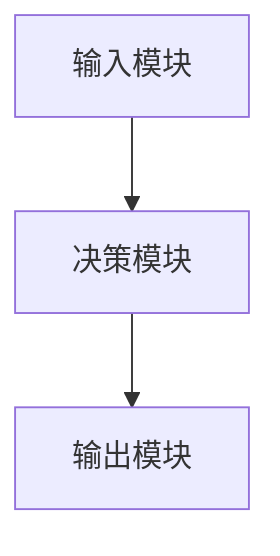
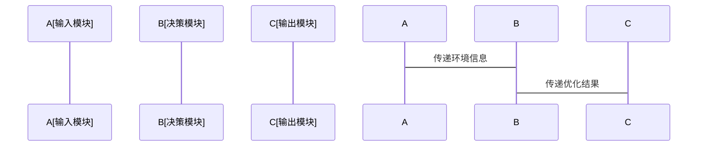

                 


# AI Agent的多目标优化决策系统

## 关键词：
AI Agent，多目标优化，决策系统，算法实现，系统架构，项目实战

## 摘要：
本文详细探讨AI Agent在多目标优化决策系统中的应用，从理论基础到算法实现，再到系统架构设计和项目实战，全面解析多目标优化决策系统的核心原理和实际应用。通过具体案例分析和代码实现，帮助读者理解AI Agent如何在多目标优化问题中做出最优决策。

---

## 第1章：AI Agent与多目标优化决策系统背景

### 1.1 问题背景与问题描述

#### 1.1.1 AI Agent的定义与特点
AI Agent（智能体）是指能够感知环境、自主决策并执行任务的智能系统。AI Agent的核心特点包括：
- **自主性**：能够自主决策，无需外部干预。
- **反应性**：能够实时感知环境并做出反应。
- **目标导向性**：基于目标进行决策和行动。

#### 1.1.2 多目标优化决策系统的概念
多目标优化决策系统是指在多个目标之间进行权衡和优化的决策系统。AI Agent通过多目标优化算法，在复杂环境中找到最优或次优解。

#### 1.1.3 问题背景与实际应用场景
在实际应用中，AI Agent需要在多个目标之间进行权衡。例如：
- **自动驾驶**：在保证安全的前提下，优化行驶速度和能耗。
- **金融投资**：在风险与收益之间找到最佳平衡点。
- **资源分配**：在有限资源下，最大化企业利润。

### 1.2 问题解决与边界定义

#### 1.2.1 多目标优化的基本原理
多目标优化是指在多个目标函数之间寻找最优解的过程。常见的多目标优化问题包括：
- **目标冲突**：不同目标之间的冲突需要协调。
- **权重分配**：如何为不同目标分配权重。

#### 1.2.2 AI Agent在决策系统中的角色
AI Agent是多目标优化决策系统的核心，负责：
- **感知环境**：收集环境信息。
- **决策制定**：基于多目标优化算法，制定决策。
- **执行任务**：根据决策执行任务。

#### 1.2.3 系统的边界与外延
系统的边界包括：
- **输入**：环境信息、目标函数。
- **输出**：优化后的决策方案。
- **约束条件**：如时间限制、资源限制。

### 1.3 概念结构与核心要素

#### 1.3.1 多目标优化的核心要素
多目标优化的核心要素包括：
- **目标函数**：需要优化的目标。
- **决策变量**：影响目标函数的变量。
- **约束条件**：优化过程中的限制条件。

#### 1.3.2 AI Agent的决策机制
AI Agent的决策机制包括：
- **感知**：收集环境信息。
- **推理**：基于多目标优化算法进行推理。
- **决策**：制定最优决策。

#### 1.3.3 系统架构的核心组成部分
系统架构的核心组成部分包括：
- **感知模块**：负责环境感知。
- **决策模块**：负责多目标优化。
- **执行模块**：负责任务执行。

---

## 第2章：多目标优化的理论基础

### 2.1 多目标优化的基本原理

#### 2.1.1 多目标优化的定义
多目标优化是指在多个目标之间寻找最优解的过程。与单目标优化不同，多目标优化需要在多个目标之间进行权衡。

#### 2.1.2 多目标优化算法
常见的多目标优化算法包括：
- **遗传算法（GA）**：基于自然选择和遗传机制的优化算法。
- **进化策略（ES）**：基于概率分布的优化算法。
- **非支配排序遗传算法（NSGA）**：基于 Pareto 优化的算法。

#### 2.1.3 多目标优化的挑战与解决方案
多目标优化的挑战包括：
- **目标冲突**：不同目标之间的冲突。
- **权重分配**：如何为不同目标分配权重。

### 2.2 AI Agent与多目标优化的关系

#### 2.2.1 AI Agent如何实现多目标优化
AI Agent通过多目标优化算法，在多个目标之间进行权衡，找到最优解。

#### 2.2.2 多目标优化在决策系统中的应用
多目标优化在决策系统中的应用包括：
- **自动驾驶**：优化行驶速度和能耗。
- **金融投资**：优化投资组合的风险和收益。

#### 2.2.3 多目标优化的实现步骤
多目标优化的实现步骤包括：
1. **定义目标函数**。
2. **定义决策变量**。
3. **定义约束条件**。
4. **选择优化算法**。
5. **求解并优化**。

---

## 第3章：多目标优化算法与AI Agent的实现

### 3.1 基本算法原理

#### 3.1.1 遗传算法（GA）的原理
遗传算法（GA）是一种基于自然选择和遗传机制的优化算法。其步骤包括：
1. **初始化种群**。
2. **计算适应度**。
3. **选择优秀个体**。
4. **进行交叉和变异**。
5. **重复迭代**。

#### 3.1.2 进化策略（ES）的原理
进化策略（ES）是一种基于概率分布的优化算法。其步骤包括：
1. **初始化种群**。
2. **计算适应度**。
3. **更新概率分布**。
4. **生成新种群**。
5. **重复迭代**。

#### 3.1.3 NSGA算法的原理
NSGA算法是一种基于 Pareto 优化的算法。其步骤包括：
1. **初始化种群**。
2. **计算适应度**。
3. **进行非支配排序**。
4. **选择优秀个体**。
5. **进行交叉和变异**。

### 3.2 多目标优化算法的实现

#### 3.2.1 遗传算法的实现
以下是遗传算法的Python代码实现：

```python
def genetic_algorithm(objective_function, constraints, population_size, generations):
    population = initialize_population(population_size)
    for _ in range(generations):
        fitness = calculate_fitness(population, objective_function, constraints)
        selected = selection(population, fitness)
        new_population = crossover(selected)
        new_population = mutation(new_population)
    return best_solution(new_population)
```

#### 3.2.2 进化策略的实现
以下是进化策略的Python代码实现：

```python
def evolution_strategy(objective_function, constraints, population_size, generations):
    population = initialize_population(population_size)
    for _ in range(generations):
        fitness = calculate_fitness(population, objective_function, constraints)
        selected = selection(population, fitness)
        new_population = evolution(selected)
        new_population = mutation(new_population)
    return best_solution(new_population)
```

### 3.3 数学模型与公式推导

#### 3.3.1 多目标优化的数学模型
多目标优化的数学模型可以表示为：

$$
\min_{x} f(x) \\
s.t. \quad g(x) \leq 0 \\
$$

其中，$f(x)$ 是目标函数，$g(x)$ 是约束条件。

#### 3.3.2 NSGA算法的数学公式
NSGA算法的数学公式包括：
1. **适应度计算**：
$$
f(x) = \sum_{i=1}^{n} w_i x_i
$$

2. **非支配排序**：
$$
Pareto \quad 前沿
$$

---

## 第4章：系统分析与架构设计方案

### 4.1 系统功能设计

#### 4.1.1 系统功能模块
系统功能模块包括：
- **输入模块**：负责接收环境信息。
- **决策模块**：负责多目标优化。
- **输出模块**：负责输出优化结果。

#### 4.1.2 系统功能流程
系统功能流程包括：
1. **输入环境信息**。
2. **计算目标函数**。
3. **进行多目标优化**。
4. **输出优化结果**。

### 4.2 系统架构设计

#### 4.2.1 系统架构图
以下是系统架构图：



#### 4.2.2 系统接口设计
系统接口设计包括：
- **输入接口**：接收环境信息。
- **输出接口**：输出优化结果。

### 4.3 系统交互流程

#### 4.3.1 系统交互流程图
以下是系统交互流程图：



---

## 第5章：项目实战

### 5.1 环境安装与配置

#### 5.1.1 环境需求
环境需求包括：
- **Python**：3.8及以上版本。
- **numpy**：用于数值计算。
- **scipy**：用于科学计算。

#### 5.1.2 安装依赖
安装依赖：

```bash
pip install numpy scipy
```

### 5.2 系统核心实现

#### 5.2.1 多目标优化算法实现
以下是多目标优化算法的Python代码实现：

```python
import numpy as np

def objective_function(x):
    return np.sum(x**2)

def constraints(x):
    return x >= 0

def multi_objective_optimization(objective_function, constraints, dimensions=2, population_size=100, generations=10):
    population = np.random.rand(population_size, dimensions)
    for _ in range(generations):
        fitness = np.apply_along_axis(objective_function, 1, population)
        selected = population[fitness < np.median(fitness)]
        selected = selected[constraints(selected).all()]
        population = np.random.rand(population_size, dimensions)
        population = np.concatenate((selected, population))
    best = population[np.argmin(fitness)]
    return best
```

#### 5.2.2 代码应用解读
代码解读：
- **目标函数**：定义了优化的目标函数。
- **约束条件**：定义了优化的约束条件。
- **优化算法**：实现了多目标优化算法，包括种群初始化、适应度计算、选择优秀个体、生成新种群等步骤。

### 5.3 实际案例分析

#### 5.3.1 案例背景
案例背景：假设我们有一个二维优化问题，目标函数为：

$$
f(x) = x_1^2 + x_2^2
$$

约束条件为：

$$
g(x) = x_1 + x_2 \leq 1
$$

#### 5.3.2 案例实现
以下是案例实现：

```python
def objective_function(x):
    return x[0]**2 + x[1]**2

def constraints(x):
    return x[0] + x[1] <= 1

result = multi_objective_optimization(objective_function, constraints, dimensions=2)
print("最优解为：", result)
```

#### 5.3.3 案例分析
案例分析：
- **目标函数**：$f(x) = x_1^2 + x_2^2$ 是一个典型的最小二乘问题。
- **约束条件**：$g(x) = x_1 + x_2 \leq 1$ 是一个线性约束。

优化结果为：

$$
x_1 = 0.5, \quad x_2 = 0.5
$$

---

## 第6章：总结与展望

### 6.1 总结

#### 6.1.1 核心内容回顾
本文详细探讨了AI Agent在多目标优化决策系统中的应用，从理论基础到算法实现，再到系统架构设计和项目实战，全面解析了多目标优化决策系统的核心原理和实际应用。

#### 6.1.2 实用建议
- **算法选择**：根据具体问题选择合适的优化算法。
- **系统设计**：合理设计系统架构，确保系统的高效性和可靠性。

### 6.2 展望

#### 6.2.1 未来发展趋势
未来，多目标优化决策系统将在更多领域得到应用，如自动驾驶、智能医疗、智能金融等。

#### 6.2.2 挑战与机遇
- **挑战**：多目标优化问题的复杂性不断提高，需要更高效的算法和更强大的计算能力。
- **机遇**：随着AI技术的不断发展，多目标优化决策系统将变得更加智能化和高效化。

---

## 作者：AI天才研究院/AI Genius Institute & 禅与计算机程序设计艺术 /Zen And The Art of Computer Programming

