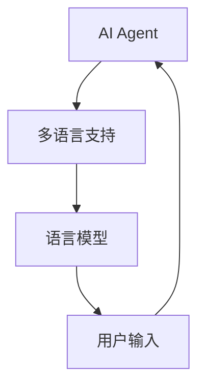

                 

<think>
好的，我现在需要帮助用户撰写一篇关于“AI Agent的多语言支持：跨国企业应用策略”的技术博客文章。首先，我得理解用户的需求，他希望文章结构清晰，逻辑严谨，内容专业且有深度。用户还特别提到了使用特定的格式和内容结构，包括关键词、摘要、目录以及详细的内容部分。

我首先会从背景介绍开始，因为这有助于读者理解为什么多语言支持对AI Agent在跨国企业中的应用如此重要。接下来，我需要解释AI Agent的基本概念和其在多语言环境中的角色，这部分需要简明扼要，同时涵盖关键点。

然后，我会详细讨论多语言支持的核心机制，包括实现原理、关键技术以及与AI Agent的结合方式。为了使内容更直观，我会使用表格和Mermaid图来展示核心概念和实体关系，帮助读者更好地理解这些概念之间的联系。

接下来，我需要深入讲解多语言NLP模型的算法原理，特别是训练方法和模型结构。这部分可能需要使用数学公式和代码示例，确保读者能够理解复杂的算法细节。我打算使用Mermaid流程图来展示算法的整体流程，并结合Python代码示例，让读者能够实际操作和理解。

在系统分析与架构设计部分，我会介绍AI Agent的系统架构，包括领域模型和交互流程图。这部分需要清晰展示系统的各个模块及其交互方式，帮助读者理解系统的整体结构。

项目实战部分，我会提供环境安装步骤、核心代码实现以及案例分析，让读者能够实际应用所学内容。同时，我会分析一个具体的跨国企业案例，展示多语言AI Agent的实际应用场景和效果。

最后，在最佳实践部分，我会总结关键点，提供注意事项和扩展阅读的建议，帮助读者巩固所学知识，并进一步探索相关领域。

在整个写作过程中，我需要确保内容逻辑连贯，技术术语准确，并且使用清晰易懂的语言。同时，我还要注意文章的结构，确保每个部分都有足够的深度和细节，满足用户对高质量技术博客的要求。

现在，我开始按照目录结构逐步撰写每个部分，确保每个章节都涵盖必要的内容，并且符合用户的格式和质量要求。我需要特别注意数学公式的正确使用，以及代码示例的准确性，以确保读者能够顺利理解和应用这些技术。

总之，我的目标是通过系统的分析和清晰的讲解，为读者提供一篇详尽且实用的技术博客，帮助他们理解并掌握AI Agent在多语言环境中的应用策略。
</think>

# AI Agent的多语言支持：跨国企业应用策略

## 关键词
- AI Agent  
- 多语言支持  
- 跨国企业  
- 自然语言处理  
- 人工智能

## 摘要
随着全球化的深入发展，跨国企业在运营过程中面临越来越多的语言障碍。AI Agent作为企业智能化转型的核心技术之一，如何实现多语言支持成为关键挑战。本文从AI Agent的多语言支持技术原理、系统架构、应用场景、项目实战等多方面展开详细论述，深入分析跨国企业中AI Agent的多语言支持策略，为企业技术决策者和开发者提供实践指导。

---

# 第1章: 多语言支持与AI Agent概述

## 1.1 多语言支持的重要性
### 1.1.1 全球化背景下的语言挑战
全球化使得跨国企业需要面对来自不同国家和地区的客户、员工和合作伙伴。语言差异不仅影响沟通效率，还可能造成信息误解，影响企业业务的顺利开展。AI Agent作为企业智能化服务的核心工具，必须具备多语言支持能力，以满足跨国企业的多样化需求。

### 1.1.2 多语言支持的核心价值
多语言支持能够提升AI Agent的适用性，使其能够在多种语言环境下为用户提供一致的智能化服务。这不仅提高了用户体验，还降低了企业的运营成本，提升了业务效率。

### 1.1.3 AI Agent在多语言环境中的角色
AI Agent在多语言环境中扮演着语言转换器、信息处理器和智能交互者的多重角色。它需要能够理解用户输入的多种语言，生成符合目标语言的自然语言输出，并在不同语言间实现无缝切换。

## 1.2 AI Agent的基本概念
### 1.2.1 AI Agent的定义
AI Agent（人工智能代理）是一种能够感知环境、执行任务并与其他实体进行交互的智能系统。它通过自然语言处理、机器学习等技术实现与用户的高效交互。

### 1.2.2 AI Agent的核心特征
- **智能性**：能够理解并处理用户的自然语言输入。
- **适应性**：能够根据上下文动态调整行为。
- **多语言支持**：能够处理多种语言的输入和输出。

### 1.2.3 多语言支持在AI Agent中的意义
多语言支持是AI Agent在全球化应用中的必备能力，它使得AI Agent能够服务于不同语言背景的用户，扩大其应用场景和用户群体。

## 1.3 跨国企业中的多语言应用场景
### 1.3.1 跨国企业的语言多样性
跨国企业通常需要支持多种语言，包括但不限于英语、中文、西班牙语、法语等。不同地区的用户可能使用不同的语言与AI Agent进行交互。

### 1.3.2 AI Agent在跨国企业中的应用场景
- **客户支持**：为不同语言背景的客户提供智能化的咨询服务。
- **内部协作**：支持跨国团队使用多种语言进行高效沟通和协作。
- **市场推广**：通过多语言AI Agent进行跨市场的品牌推广和客户沟通。

### 1.3.3 多语言支持的业务价值
多语言支持能够提升跨国企业的运营效率，增强客户满意度，降低沟通成本，为企业创造更大的价值。

## 1.4 本章小结
本章从多语言支持的重要性、AI Agent的核心概念以及跨国企业中的应用场景三个方面，阐述了AI Agent多语言支持的必要性和实现意义。接下来的章节将深入探讨多语言支持的核心技术与实现策略。

---

# 第2章: 多语言支持的核心机制

## 2.1 多语言支持的实现原理
### 2.1.1 多语言NLP模型的调用
多语言NLP模型是实现AI Agent多语言支持的核心技术。通过调用预训练的多语言模型，AI Agent能够理解和生成多种语言的文本。

### 2.1.2 多语言切换与动态加载
AI Agent需要能够根据用户的语言偏好动态切换语言，并在需要时加载相应的语言模型。这要求系统具备高效的资源管理能力和快速响应能力。

### 2.1.3 语言理解与生成的统一框架
为了实现多种语言的统一处理，AI Agent需要构建一个通用的语言理解与生成框架，支持多种语言模型的集成和统一管理。

## 2.2 多语言支持的关键技术
### 2.2.1 多语言模型训练方法
多语言模型的训练需要考虑不同语言之间的语义差异和语法结构。常用的训练方法包括多任务学习、跨语言迁移学习等。

### 2.2.2 跨语言迁移学习
跨语言迁移学习是一种通过在一种语言上训练模型，然后将其迁移到其他语言的技术。这种方法可以有效降低多语言模型的训练成本。

### 2.2.3 多语言语义理解
多语言语义理解是实现AI Agent多语言支持的核心技术。它需要确保不同语言之间的语义一致性，并能够准确理解用户的意图。

## 2.3 多语言支持与AI Agent的结合
### 2.3.1 多语言支持在AI Agent中的架构
AI Agent的多语言支持架构通常包括语言模型调用层、语言切换层和语言理解与生成层。各层之间通过接口进行通信，确保系统的高效运行。

### 2.3.2 多语言切换策略
AI Agent需要根据用户的语言偏好或上下文信息动态切换语言。切换策略需要考虑语言模型的加载效率和系统的响应速度。

### 2.3.3 跨语言数据处理机制
AI Agent需要能够处理跨语言数据，包括语言识别、语言转换和多语言文本生成。这需要在数据预处理和后处理阶段进行特殊处理。

## 2.4 核心概念对比表
| 核心概念 | 特性 | 示例 |
|----------|------|------|
| 多语言支持 | 支持多种语言 | 中文、英文、西班牙文等 |
| AI Agent | 智能代理 | 自然语言处理、任务执行 |

## 2.5 Mermaid实体关系图


---

# 第3章: 多语言NLP模型的算法原理

## 3.1 多语言NLP模型的训练方法

### 3.1.1 多任务学习
多任务学习是一种通过同时学习多个任务来提升模型性能的技术。在多语言NLP模型中，可以通过多任务学习同时优化多种语言的语义理解和生成任务。

### 3.1.2 跨语言迁移学习
跨语言迁移学习是一种通过在一种语言上训练模型，然后将其迁移到其他语言的技术。这种方法可以有效降低多语言模型的训练成本。

### 3.1.3 多语言预训练模型
多语言预训练模型是一种通过在多种语言数据上进行预训练的模型。常用的多语言预训练模型包括Marian、XLM等。

## 3.2 多语言模型的数学表达
多语言NLP模型的训练通常涉及多个语言的语料库。模型需要通过参数共享的方式，使得不同语言的语义信息能够被共同表达。

### 3.2.1 多语言模型的损失函数
$$ L = \sum_{i=1}^{n} \sum_{j=1}^{m} \text{loss}(x_{i,j}, y_{i,j}) $$

其中，$x_{i,j}$表示第$i$个语言的第$j$个样本，$y_{i,j}$表示对应的标签。

### 3.2.2 多语言模型的优化策略
多语言模型的优化需要考虑不同语言之间的语义差异和语法结构。常用的优化策略包括参数调整、层叠训练等。

## 3.3 多语言模型的实现步骤

### 3.3.1 数据预处理
多语言模型的训练需要对多语言数据进行预处理，包括分词、标注、对齐等。

### 3.3.2 模型训练
使用多任务学习或跨语言迁移学习的方法，对多语言模型进行训练。

### 3.3.3 模型评估
对训练好的多语言模型进行评估，包括在不同语言上的准确率、召回率等指标。

---

# 第4章: AI Agent的多语言支持系统架构设计

## 4.1 系统架构概述
AI Agent的多语言支持系统架构通常包括语言模型调用层、语言切换层和语言理解与生成层。各层之间通过接口进行通信，确保系统的高效运行。

### 4.1.1 语言模型调用层
语言模型调用层负责调用预训练的多语言模型，进行语言理解与生成。

### 4.1.2 语言切换层
语言切换层负责根据用户的语言偏好动态切换语言，并加载相应的语言模型。

### 4.1.3 语言理解与生成层
语言理解与生成层负责对用户输入的语言进行理解和生成，确保不同语言之间的语义一致性。

## 4.2 系统功能设计

### 4.2.1 用户输入处理
用户输入处理包括语言识别、文本解析和意图理解。

### 4.2.2 语言切换与模型加载
根据用户的语言偏好动态切换语言，并加载相应的语言模型。

### 4.2.3 多语言文本生成
生成符合目标语言的自然语言文本，确保语义一致性和表达准确性。

## 4.3 系统架构图


---

# 第5章: 跨国企业中的AI Agent多语言支持应用案例

## 5.1 案例背景
某跨国企业需要为其客户提供多语言的智能化服务，涵盖客户支持、内部协作和市场推广等多个场景。

## 5.2 系统实现
### 5.2.1 环境安装
需要安装多语言NLP模型和AI Agent框架，配置语言模型调用接口。

### 5.2.2 核心代码实现
以下是AI Agent多语言支持的核心代码实现：

```python
def multi_language_agent(user_input, target_language):
    # 语言识别
    detected_language = detect_language(user_input)
    # 语言切换
    switch_language(detected_language, target_language)
    # 生成响应
    response = generate_response(user_input)
    return response
```

### 5.2.3 案例分析
通过实际案例分析，展示AI Agent多语言支持在跨国企业中的具体应用场景和实施效果。

## 5.3 项目小结
通过本案例，展示了AI Agent多语言支持在跨国企业中的实际应用价值，验证了系统的可行性和有效性。

---

# 第6章: AI Agent多语言支持的最佳实践

## 6.1 小结
AI Agent的多语言支持是跨国企业智能化转型的重要技术手段。通过多语言NLP模型和智能代理技术的结合，可以实现高效的多语言交互和智能化服务。

## 6.2 注意事项
- **语言模型的选择**：需要根据具体应用场景选择合适的多语言NLP模型。
- **语言切换策略**：需要考虑语言模型的加载效率和系统的响应速度。
- **语义一致性**：需要确保不同语言之间的语义一致性，避免信息误解。

## 6.3 拓展阅读
- 多语言NLP模型的优化方法
- AI Agent的多语言切换技术
- 跨国企业的智能化转型策略

---

# 作者：AI天才研究院/AI Genius Institute & 禅与计算机程序设计艺术 /Zen And The Art of Computer Programming

