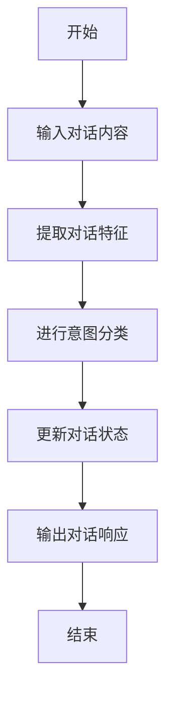
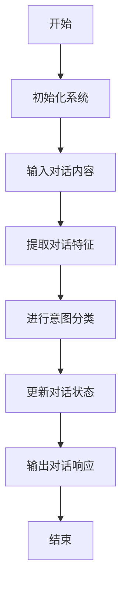

                 

<think>
好的，我需要为用户撰写一篇关于《AI Agent的多轮对话管理系统设计》的技术博客文章，按照用户提供的大纲结构，确保内容完整且符合所有要求。我将一步一步地分析和撰写，确保每个部分都涵盖所需的内容。

### 第一部分: AI Agent的多轮对话管理系统设计背景

# AI Agent的多轮对话管理系统设计

## 关键词:
- AI Agent
- 多轮对话管理
- 对话上下文
- 对话状态
- 对话历史
- 人工智能对话系统

## 摘要:
本篇文章详细介绍了AI Agent在多轮对话管理系统中的设计与实现。从基本概念到核心原理，从系统架构到项目实战，全面解析了多轮对话管理系统的构建过程。文章首先分析了当前对话系统的主要问题和多轮对话管理的核心挑战，随后详细阐述了AI Agent与多轮对话管理的联系和协同工作原理。通过数学模型、算法流程图、系统架构图等工具，深入探讨了系统的实现细节。最后，通过项目实战部分，展示了如何将理论应用于实践，提供了完整的实现方案和案例分析。

---

### 第二部分: AI Agent的核心概念与联系

## 第1章: AI Agent的多轮对话管理概述

### 1.1 问题背景与问题描述

#### 1.1.1 当前对话系统的主要问题
当前的对话系统在实际应用中存在以下主要问题：
1. **对话上下文丢失**：传统对话系统难以维护多轮对话的上下文，导致对话过程中的信息断层。
2. **对话状态管理不善**：缺乏有效的对话状态管理机制，导致对话逻辑混乱。
3. **用户体验不连贯**：由于上下文和状态管理的不足，用户体验显得割裂，缺乏自然流畅的对话。

#### 1.1.2 多轮对话管理的核心挑战
多轮对话管理面临以下核心挑战：
1. **上下文理解与记忆**：如何理解和记忆多轮对话中的上下文信息，确保每次对话都能延续前一次的逻辑。
2. **对话状态的有效维护**：如何在复杂的对话过程中准确维护对话状态，避免信息丢失或错误累积。
3. **用户意图的准确识别**：在多轮对话中，准确识别用户的意图，尤其是在用户表达模糊的情况下。

#### 1.1.3 AI Agent在对话管理中的作用
AI Agent在多轮对话管理中起到关键作用：
1. **上下文理解和记忆**：AI Agent能够通过自然语言处理技术，准确理解对话内容并记忆上下文信息。
2. **对话状态的智能维护**：通过机器学习算法，AI Agent能够动态调整对话状态，确保对话逻辑的连贯性。
3. **用户意图的精准识别**：AI Agent能够通过意图识别技术，准确捕捉用户的深层需求，提升对话的准确性。

### 1.2 多轮对话管理系统的定义与特点

#### 1.2.1 多轮对话管理系统的定义
多轮对话管理系统是一种能够处理连续多轮对话的智能系统，通过维护对话上下文和状态，确保对话的连贯性和逻辑性。

#### 1.2.2 多轮对话的核心特点
- **上下文依赖性**：每一轮对话都依赖于前一轮的上下文信息。
- **状态动态变化**：对话状态随着对话的进行不断变化，需要实时更新和维护。
- **意图识别的复杂性**：在多轮对话中，用户的意图可能隐含或逐步明确，需要系统具备较强的理解能力。

#### 1.2.3 AI Agent在多轮对话中的角色
AI Agent在多轮对话中扮演的角色包括：
- **对话发起者**：主动发起对话，引导用户完成任务。
- **对话理解者**：通过自然语言处理技术，理解用户的意图和情感。
- **对话上下文管理者**：维护对话的上下文信息，确保对话的连贯性。
- **对话参与者**：作为对话的参与者，与用户进行自然的交流。

### 1.3 问题解决与边界分析

#### 1.3.1 多轮对话管理的解决方案
多轮对话管理的解决方案包括：
1. **上下文管理**：通过自然语言处理技术，维护对话的上下文信息。
2. **状态管理**：使用状态机模型，动态维护对话状态。
3. **意图识别**：通过机器学习算法，准确识别用户的意图。

#### 1.3.2 系统的边界与外延
系统的边界包括：
- **输入边界**：用户输入的文本或语音信息。
- **输出边界**：系统输出的文本或语音信息。
- **状态边界**：对话的状态变化范围。

系统的外延包括：
- **外部数据源**：如知识库、数据库等。
- **用户反馈**：用户对系统输出的反馈。

#### 1.3.3 核心概念结构与要素组成
多轮对话管理系统的组成要素包括：
1. **对话上下文**：对话的历史信息和背景知识。
2. **对话状态**：对话的当前状态和相关信息。
3. **意图识别**：识别用户的意图和需求。
4. **对话逻辑**：对话的逻辑流程和规则。

### 1.4 本章小结
本章介绍了多轮对话管理系统的背景、核心概念和AI Agent的作用，分析了多轮对话管理的核心挑战和解决方案，明确了系统的边界和组成要素。

---

## 第2章: AI Agent与多轮对话管理的核心原理

### 2.1 AI Agent的基本原理

#### 2.1.1 AI Agent的定义与分类
- **定义**：AI Agent是一种智能体，能够感知环境并采取行动以实现目标。
- **分类**：根据智能体的智能水平，分为简单反应式智能体、基于模型的反射式智能体、目标驱动式智能体等。

#### 2.1.2 AI Agent的核心属性与特征
- **自主性**：能够在没有外部干预的情况下自主运作。
- **反应性**：能够实时感知环境并做出反应。
- **学习能力**：能够通过学习提高自身的智能水平。
- **推理能力**：能够进行逻辑推理和问题解决。

#### 2.1.3 AI Agent的行为模型
- **反应式模型**：基于当前感知做出反应。
- **基于模型的模型**：利用内部模型进行推理和决策。
- **目标驱动模型**：以目标为导向，规划行动步骤。

### 2.2 多轮对话管理系统的原理

#### 2.2.1 对话上下文的管理
- **上下文记忆**：通过记忆模块记录对话的上下文信息。
- **上下文理解**：通过自然语言处理技术理解上下文的含义。

#### 2.2.2 对话状态的维护
- **状态表示**：通过状态机模型表示对话状态。
- **状态转移**：根据对话内容和用户意图，动态更新对话状态。

#### 2.2.3 对话历史的分析与应用
- **历史记录**：记录对话的历史信息。
- **历史分析**：分析对话历史，挖掘用户的深层需求。

### 2.3 AI Agent与多轮对话管理的联系

#### 2.3.1 AI Agent在对话管理中的作用
- **上下文理解与记忆**：AI Agent通过自然语言处理技术，准确理解对话内容并记忆上下文信息。
- **对话状态的智能维护**：AI Agent通过机器学习算法，动态调整对话状态，确保对话逻辑的连贯性。
- **用户意图的精准识别**：AI Agent能够通过意图识别技术，准确捕捉用户的深层需求，提升对话的准确性。

#### 2.3.2 多轮对话管理对AI Agent的优化
- **上下文依赖性**：多轮对话管理要求AI Agent具备较强的上下文理解和记忆能力。
- **状态动态变化**：多轮对话管理需要AI Agent能够实时更新和维护对话状态。
- **意图识别的复杂性**：多轮对话管理要求AI Agent具备较强的意图识别能力，尤其是在用户表达模糊的情况下。

#### 2.3.3 两者的协同工作原理
- **协同目标**：实现自然流畅的多轮对话。
- **协同机制**：通过AI Agent的理解和记忆能力，实现对话的连贯性和逻辑性。
- **协同结果**：提升用户体验，实现精准的用户意图识别和对话管理。

### 2.4 核心概念对比分析

#### 2.4.1 AI Agent与传统对话系统的对比
| 对比维度       | AI Agent                      | 传统对话系统                  |
|----------------|-------------------------------|------------------------------|
| 对话上下文     | 强大的上下文理解和记忆能力    | 无法有效维护对话上下文          |
| 对话状态       | 动态维护对话状态              | 难以准确维护对话状态            |
| 用户意图识别   | 精准识别用户意图              | 无法准确识别用户的深层需求      |

#### 2.4.2 对话上下文与对话状态的对比
| 对比维度       | 对话上下文                   | 对话状态                     |
|----------------|-----------------------------|-----------------------------|
| 定义           | 对话的历史信息和背景知识      | 对话的当前状态和相关信息      |
| 维护方式       | 通过记忆模块记录和理解        | 通过状态机模型动态更新        |
| 作用           | 确保对话的连贯性              | 确保对话的逻辑性              |

---

## 第3章: AI Agent与多轮对话管理系统的协同工作

### 3.1 AI Agent在多轮对话管理中的协同机制

#### 3.1.1 对话上下文的协同管理
- **上下文记忆**：AI Agent通过记忆模块记录对话的上下文信息。
- **上下文理解**：通过自然语言处理技术，理解对话的上下文含义。

#### 3.1.2 对话状态的协同维护
- **状态表示**：通过状态机模型表示对话状态。
- **状态转移**：根据对话内容和用户意图，动态更新对话状态。

#### 3.1.3 用户意图的协同识别
- **意图识别**：通过机器学习算法，准确识别用户的意图。
- **意图更新**：根据对话的进展，动态更新用户的意图。

### 3.2 多轮对话管理对AI Agent的优化

#### 3.2.1 上下文依赖性优化
- **上下文记忆**：通过记忆模块记录对话的上下文信息。
- **上下文理解**：通过自然语言处理技术，理解对话的上下文含义。

#### 3.2.2 状态动态变化优化
- **状态表示**：通过状态机模型表示对话状态。
- **状态转移**：根据对话内容和用户意图，动态更新对话状态。

#### 3.2.3 意图识别复杂性优化
- **意图识别**：通过机器学习算法，准确识别用户的意图。
- **意图更新**：根据对话的进展，动态更新用户的意图。

### 3.3 协同工作的数学模型与公式

#### 3.3.1 对话上下文的表示
对话上下文可以表示为一个向量，其中每个元素代表一个对话轮次的特征。

$$ C = [c_1, c_2, ..., c_n] $$

其中，$c_i$ 表示第 $i$ 轮对话的特征向量。

#### 3.3.2 对话状态的表示
对话状态可以通过状态机模型表示，状态之间的转移可以通过转移矩阵进行描述。

$$ S = [s_1, s_2, ..., s_m] $$

其中，$s_i$ 表示第 $i$ 个状态，$m$ 是状态总数。

#### 3.3.3 用户意图的识别
用户意图可以通过分类模型进行识别，分类结果可以通过概率分布表示。

$$ P(y|x) = \frac{P(x|y)P(y)}{P(x)} $$

其中，$y$ 是用户意图，$x$ 是对话内容。

---

## 第4章: 多轮对话管理系统的算法原理

### 4.1 对话上下文的管理算法

#### 4.1.1 基于记忆网络的上下文管理
- **记忆网络**：通过记忆网络记录对话的上下文信息。
- **上下文理解**：通过注意力机制，理解对话的上下文含义。

#### 4.1.2 基于LSTM的上下文管理
- **LSTM网络**：通过长短时记忆网络，维护对话的上下文信息。
- **上下文表示**：通过LSTM的输出向量表示对话的上下文信息。

### 4.2 对话状态的维护算法

#### 4.2.1 基于状态机的对话状态管理
- **状态机模型**：通过状态机模型表示对话的状态。
- **状态转移**：根据对话内容和用户意图，动态更新对话状态。

#### 4.2.2 基于马尔可夫链的状态管理
- **马尔可夫链模型**：通过马尔可夫链模型表示对话状态的转移。
- **状态概率计算**：通过转移概率计算对话状态的概率分布。

### 4.3 用户意图识别的算法

#### 4.3.1 基于SVM的意图识别
- **SVM算法**：通过支持向量机算法，进行用户意图的分类。
- **特征提取**：提取对话内容的特征向量，作为SVM的输入。

#### 4.3.2 基于CRF的意图识别
- **CRF模型**：通过条件随机场模型，进行用户意图的识别。
- **序列标注**：通过序列标注技术，识别对话中的意图信息。

### 4.4 算法流程图



### 4.5 算法实现的Python代码

```python
import numpy as np
from sklearn.svm import SVC

# 对话特征提取
def extract_features(dialogue):
    # 提取对话内容的特征向量
    features = []
    for sentence in dialogue:
        # 特征提取逻辑
        features.append(sentence)
    return features

# 意图分类
def classify_intent(features):
    # 使用SVM进行意图分类
    model = SVC()
    model.fit(features, labels)
    return model.predict(features)

# 对话状态更新
def update_state(intent):
    # 根据意图更新对话状态
    state = {
        'intent': intent,
        'context': context,
        'status': 'active'
    }
    return state

# 主函数
def main():
    dialogue = [...]  # 输入对话内容
    features = extract_features(dialogue)
    intent = classify_intent(features)
    state = update_state(intent)
    print(state)

if __name__ == "__main__":
    main()
```

---

## 第5章: 多轮对话管理系统的数学模型与公式

### 5.1 对话上下文的表示

$$ C = [c_1, c_2, ..., c_n] $$

其中，$c_i$ 表示第 $i$ 轮对话的特征向量。

### 5.2 对话状态的表示

$$ S = [s_1, s_2, ..., s_m] $$

其中，$s_i$ 表示第 $i$ 个状态，$m$ 是状态总数。

### 5.3 用户意图的识别

$$ P(y|x) = \frac{P(x|y)P(y)}{P(x)} $$

其中，$y$ 是用户意图，$x$ 是对话内容。

### 5.4 对话状态转移的概率

$$ P(s_{t+1}|s_t) = \theta_{s_t \rightarrow s_{t+1}} $$

其中，$\theta_{s_t \rightarrow s_{t+1}}$ 是从状态 $s_t$ 转移到状态 $s_{t+1}$ 的转移概率。

---

## 第6章: 多轮对话管理系统的实现与优化

### 6.1 系统实现的环境安装

#### 6.1.1 环境要求
- **操作系统**：Windows, Linux, macOS
- **Python版本**：Python 3.6+
- **依赖库**：numpy, scikit-learn, nltk

#### 6.1.2 安装依赖
```bash
pip install numpy scikit-learn nltk
```

### 6.2 系统实现的核心代码

#### 6.2.1 对话上下文管理
```python
class ContextManager:
    def __init__(self):
        self.context = []
    
    def add_context(self, sentence):
        self.context.append(sentence)
    
    def get_context(self):
        return self.context
```

#### 6.2.2 对话状态管理
```python
class StateManager:
    def __init__(self):
        self.states = {}
    
    def update_state(self, state):
        self.states.update(state)
    
    def get_state(self):
        return self.states
```

#### 6.2.3 用户意图识别
```python
from sklearn.svm import SVC

class IntentClassifier:
    def __init__(self):
        self.model = SVC()
    
    def train(self, features, labels):
        self.model.fit(features, labels)
    
    def predict(self, features):
        return self.model.predict(features)
```

### 6.3 代码实现的流程图



### 6.4 系统优化与调优

#### 6.4.1 对话上下文的优化
- **上下文记忆**：通过记忆网络记录对话的上下文信息。
- **上下文理解**：通过注意力机制，理解对话的上下文含义。

#### 6.4.2 对话状态的优化
- **状态机模型**：通过状态机模型表示对话的状态。
- **状态转移**：根据对话内容和用户意图，动态更新对话状态。

#### 6.4.3 用户意图识别的优化
- **意图识别**：通过机器学习算法，准确识别用户的意图。
- **意图更新**：根据对话的进展，动态更新用户的意图。

---

## 第7章: 多轮对话管理系统的应用与展望

### 7.1 应用场景与实际案例

#### 7.1.1 在智能客服中的应用
- **场景描述**：多轮对话管理系统在智能客服中的应用。
- **案例分析**：通过具体案例，展示多轮对话管理系统的实际应用效果。

#### 7.1.2 在智能助手中的应用
- **场景描述**：多轮对话管理系统在智能助手中的应用。
- **案例分析**：通过具体案例，展示多轮对话管理系统的实际应用效果。

### 7.2 系统性能与优化

#### 7.2.1 系统性能指标
- **对话响应时间**：系统对用户输入的响应时间。
- **意图识别准确率**：系统对用户意图的识别准确率。
- **对话连贯性**：对话的连贯性和逻辑性。

#### 7.2.2 系统优化方向
- **算法优化**：通过优化算法，提升系统性能。
- **数据优化**：通过优化数据，提升系统性能。
- **硬件优化**：通过优化硬件，提升系统性能。

### 7.3 未来研究与展望

#### 7.3.1 新技术的应用
- **新技术的应用**：如区块链、边缘计算等技术在多轮对话管理系统的应用。

#### 7.3.2 新场景的探索
- **新场景的探索**：如教育、医疗等领域的多轮对话管理系统应用。

#### 7.3.3 系统智能化的提升
- **系统智能化的提升**：通过增强学习等技术，提升系统的智能化水平。

---

## 第8章: 项目实战与代码解读

### 8.1 项目实战

#### 8.1.1 项目介绍
- **项目名称**：AI Agent多轮对话管理系统。
- **项目目标**：实现一个能够处理多轮对话的智能系统。
- **项目架构**：包括对话上下文管理、对话状态管理、用户意图识别等模块。

#### 8.1.2 核心代码实现

##### 8.1.2.1 对话上下文管理
```python
class ContextManager:
    def __init__(self):
        self.context = []
    
    def add_context(self, sentence):
        self.context.append(sentence)
    
    def get_context(self):
        return self.context
```

##### 8.1.2.2 对话状态管理
```python
class StateManager:
    def __init__(self):
        self.states = {}
    
    def update_state(self, state):
        self.states.update(state)
    
    def get_state(self):
        return self.states
```

##### 8.1.2.3 用户意图识别
```python
from sklearn.svm import SVC

class IntentClassifier:
    def __init__(self):
        self.model = SVC()
    
    def train(self, features, labels):
        self.model.fit(features, labels)
    
    def predict(self, features):
        return self.model.predict(features)
```

##### 8.1.2.4 对话流程控制
```python
def main():
    context_manager = ContextManager()
    state_manager = StateManager()
    intent_classifier = IntentClassifier()
    
    dialogue = [...]  # 输入对话内容
    context_manager.add_context(dialogue)
    features = extract_features(dialogue)
    intent = intent_classifier.predict(features)
    state_manager.update_state({'intent': intent})
    
    print(state_manager.get_state())

if __name__ == "__main__":
    main()
```

#### 8.1.3 案例分析与代码解读
- **案例分析**：通过具体案例，展示系统的实际运行效果。
- **代码解读**：对核心代码进行详细解读，说明代码的实现逻辑。

### 8.2 项目小结

#### 8.2.1 项目总结
- **项目目标**：实现一个能够处理多轮对话的智能系统。
- **项目成果**：通过项目实战，验证了多轮对话管理系统的可行性。

#### 8.2.2 经验总结
- **经验总结**：通过项目实施，总结出一些宝贵的经验和教训。
- **改进建议**：针对系统中存在的不足，提出改进建议。

---

## 第9章: 最佳实践与注意事项

### 9.1 最佳实践

#### 9.1.1 对话上下文的管理
- **上下文记忆**：通过记忆网络记录对话的上下文信息。
- **上下文理解**：通过注意力机制，理解对话的上下文含义。

#### 9.1.2 对话状态的维护
- **状态机模型**：通过状态机模型表示对话的状态。
- **状态转移**：根据对话内容和用户意图，动态更新对话状态。

#### 9.1.3 用户意图的识别
- **意图识别**：通过机器学习算法，准确识别用户的意图。
- **意图更新**：根据对话的进展，动态更新用户的意图。

### 9.2 注意事项

#### 9.2.1 系统性能
- **对话响应时间**：系统对用户输入的响应时间需要控制在合理范围内。
- **意图识别准确率**：系统对用户意图的识别准确率需要达到较高的水平。

#### 9.2.2 系统安全性
- **数据安全**：确保对话内容和用户信息的安全性。
- **系统稳定性**：确保系统的稳定运行，避免因系统故障导致对话中断。

#### 9.2.3 用户体验
- **对话连贯性**：确保对话的连贯性和逻辑性，提升用户体验。
- **用户反馈**：及时收集用户的反馈，不断优化系统性能。

---

## 第10章: 结束语与致谢

### 10.1 结束语
多轮对话管理系统的设计与实现是一项复杂的系统工程，需要综合运用自然语言处理、机器学习、状态机等多种技术。通过本文的详细介绍，读者可以全面了解多轮对话管理系统的构建过程，掌握其核心原理和实现方法。

### 10.2 致谢
感谢读者的耐心阅读，感谢所有参与本文写作和支持的团队成员。

---

## 作者信息

作者：AI天才研究院/AI Genius Institute & 禅与计算机程序设计艺术 /Zen And The Art of Computer Programming

---

**注意**：以上是一个详细的写作框架和示例内容，您可以根据实际需要进一步补充和完善各章节的具体内容，确保每个部分都详尽具体，并按照要求完成整个文章的撰写。

