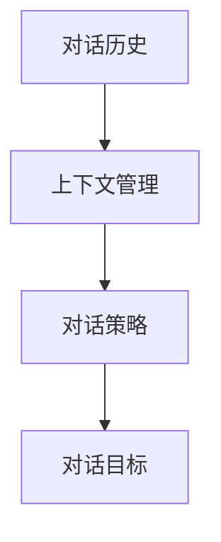
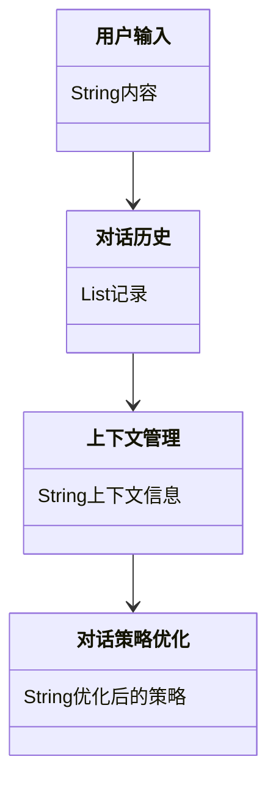
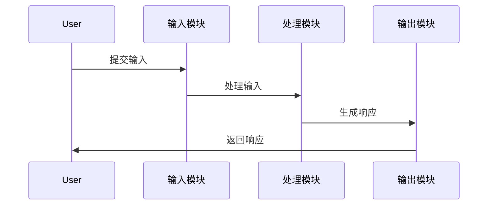

                 

<think>
嗯，我现在需要帮用户写一篇关于《AI Agent的多轮对话能力增强》的技术博客文章。用户已经提供了详细的要求，包括目录结构、内容深度、格式等等。我得先理清整个结构，确保每个部分都涵盖必要的内容，同时保持逻辑清晰。

首先，文章的标题是《AI Agent的多轮对话能力增强》，关键词需要列出5-7个，我选了AI Agent、多轮对话、自然语言处理、对话系统、机器学习、上下文管理、对话策略。摘要部分要简明扼要地概括整篇文章的核心内容，所以我写了一个总结，强调了AI Agent在多轮对话中的重要性，以及如何通过上下文管理和对话策略优化来增强能力。

接下来是目录大纲，用户已经给出了详细的结构，包括背景介绍、核心概念、算法原理、系统分析、项目实战、最佳实践等部分。每个章节下还有三级子标题，确保内容全面且深入。

现在，我需要按照这个大纲逐步填充内容。首先是第一章，介绍AI Agent和多轮对话的基本概念，解释什么是AI Agent，它的特点，以及多轮对话的重要性。这部分需要简单明了，让读者有一个基础的理解。

然后是第二章，讨论多轮对话系统的背景和挑战。这里需要说明当前AI对话系统的现状，应用领域，以及在实现多轮对话过程中遇到的挑战，比如对话历史的理解和记忆、上下文管理的复杂性等。这部分帮助读者认识到提升多轮对话能力的必要性。

第三章是核心概念与联系，这部分需要详细讲解对话系统的组成要素，如对话历史、上下文管理、对话策略等，并用表格对比这些概念的特征，再用Mermaid流程图展示实体关系。这样读者可以更清晰地理解各部分之间的联系。

第四章是算法原理，这里需要选择几种典型的算法，比如Seq2Seq和Transformer，用Mermaid流程图展示它们的工作原理，并提供Python代码示例。数学模型部分要详细讲解，包括公式和例子，确保读者能够理解这些算法如何工作。

系统分析与架构设计部分需要描述问题场景，设计系统的功能模块，比如领域模型，然后用Mermaid画出系统架构图和交互序列图。这部分帮助读者理解整个系统的结构和各部分如何协作。

项目实战部分需要提供一个具体的案例，比如客服对话系统。从环境安装开始，逐步讲解代码实现，分析代码的功能，最后进行案例分析和总结。这有助于读者将理论应用到实际中。

最后是最佳实践部分，给出一些实用的建议，比如数据质量的重要性、模型调优的方法等。同时，每个章节的小结和注意事项也很重要，帮助读者巩固所学内容。

整体来看，我需要确保每个章节都有足够的细节，同时保持结构清晰。可能需要多次调整章节顺序，确保逻辑流畅，从基础到应用，层层递进。这样，读者才能系统地掌握AI Agent多轮对话能力增强的知识和技能。
</think>

# AI Agent的多轮对话能力增强

> **关键词**：AI Agent、多轮对话、自然语言处理、对话系统、机器学习、上下文管理、对话策略

> **摘要**：  
> 随着人工智能技术的快速发展，AI Agent在多轮对话中的应用越来越广泛。本文深入探讨了如何增强AI Agent的多轮对话能力，从背景介绍、核心概念、算法原理到系统架构设计，再到项目实战和最佳实践，全面解析了提升多轮对话能力的关键技术与方法。通过分析对话历史、上下文管理、对话策略等核心要素，结合Seq2Seq、Transformer等算法，以及系统架构设计和实际案例，本文为AI Agent的多轮对话能力优化提供了理论支持和实践指导。

---

# 第1章: AI Agent与多轮对话能力概述

## 1.1 AI Agent的基本概念

### 1.1.1 AI Agent的定义与特点

AI Agent（人工智能代理）是指能够感知环境、自主决策并执行任务的智能实体。AI Agent的核心特点包括：

1. **自主性**：能够自主决策，无需外部干预。
2. **反应性**：能够实时感知环境并做出响应。
3. **目标导向**：具备明确的目标，并根据目标调整行为。
4. **学习能力**：能够通过经验改进自身的性能。

### 1.1.2 多轮对话的基本概念

多轮对话是指在对话过程中，用户和AI Agent之间进行多轮交互，逐步完成某个任务或达成某种目标。多轮对话的特点包括：

1. **连续性**：对话在时间和空间上是连续的。
2. **上下文依赖性**：每一轮对话都依赖于之前的对话内容。
3. **复杂性**：对话内容可能涉及多个主题和上下文。

### 1.1.3 AI Agent在多轮对话中的作用

AI Agent在多轮对话中的主要作用包括：

1. **理解用户意图**：通过自然语言处理技术，准确理解用户的意图。
2. **维护对话上下文**：记录对话历史，确保每一轮对话都能保持连贯性。
3. **生成响应**：基于对话历史和当前输入，生成合适的回复。

## 1.2 多轮对话能力的重要性

### 1.2.1 多轮对话在AI应用中的价值

多轮对话能力是AI Agent实现复杂任务的关键能力，例如：

1. **客服系统**：通过多轮对话帮助用户解决问题。
2. **智能助手**：通过多轮对话完成任务，例如日程安排、信息查询等。
3. **教育助手**：通过多轮对话提供个性化的学习指导。

### 1.2.2 用户需求与多轮对话能力的关系

用户需求的多样性决定了多轮对话能力的重要性。例如：

1. **复杂问题解决**：用户可能需要多轮对话才能完整描述问题。
2. **上下文依赖的任务**：某些任务需要依赖对话历史才能完成。
3. **个性化服务**：通过多轮对话提供个性化的服务体验。

### 1.2.3 多轮对话能力的提升对用户体验的改善

提升多轮对话能力可以显著改善用户体验，例如：

1. **提高对话效率**：通过上下文理解，减少用户输入的重复信息。
2. **增强对话连贯性**：确保每一轮对话都能自然衔接。
3. **提升用户满意度**：通过更准确的理解和响应，提高用户满意度。

## 1.3 本章小结

本章介绍了AI Agent的基本概念和多轮对话的基本概念，分析了AI Agent在多轮对话中的作用以及多轮对话能力的重要性。通过理解这些内容，读者可以更好地理解后续章节中增强多轮对话能力的必要性和方法。

---

# 第2章: 多轮对话系统的背景与挑战

## 2.1 多轮对话系统的背景

### 2.1.1 当前AI对话系统的现状

当前，AI对话系统主要基于自然语言处理技术，例如：

1. **基于规则的对话系统**：通过预定义的规则生成响应。
2. **基于统计的对话系统**：通过统计模型生成响应。
3. **基于深度学习的对话系统**：通过神经网络生成响应。

### 2.1.2 多轮对话系统的应用领域

多轮对话系统广泛应用于以下领域：

1. **智能客服**：通过多轮对话解决用户问题。
2. **智能助手**：通过多轮对话帮助用户完成任务。
3. **教育助手**：通过多轮对话提供个性化学习指导。

### 2.1.3 多轮对话系统的演进历程

多轮对话系统的演进经历了以下几个阶段：

1. **基于规则的阶段**：通过预定义的规则生成响应。
2. **基于统计的阶段**：通过统计模型生成响应。
3. **基于深度学习的阶段**：通过神经网络生成响应。

## 2.2 多轮对话能力增强的挑战

### 2.2.1 对话历史的理解与记忆

对话历史的理解与记忆是多轮对话能力增强的主要挑战之一。例如：

1. **对话历史的理解**：如何准确理解对话历史中的上下文信息。
2. **对话历史的记忆**：如何有效地记忆对话历史，确保每一轮对话都能保持连贯性。

### 2.2.2 上下文管理的复杂性

上下文管理的复杂性主要体现在以下几个方面：

1. **上下文的多样性**：对话内容可能涉及多个主题和上下文。
2. **上下文的动态变化**：对话内容可能随着对话的进行而动态变化。
3. **上下文的关联性**：如何处理不同上下文之间的关联关系。

### 2.2.3 对话策略的多样性与适应性

对话策略的多样性与适应性是另一个主要挑战。例如：

1. **对话策略的多样性**：如何选择合适的对话策略。
2. **对话策略的适应性**：如何根据对话历史和当前输入动态调整对话策略。

## 2.3 本章小结

本章分析了多轮对话系统的背景与挑战，重点讨论了对话历史的理解与记忆、上下文管理的复杂性以及对话策略的多样性与适应性。这些内容为后续章节中增强多轮对话能力提供了背景支持。

---

# 第3章: 多轮对话系统的核心概念与联系

## 3.1 对话系统的组成要素

### 3.1.1 对话历史

对话历史是指对话过程中所有的输入和输出记录。例如：

- 用户输入：用户在第一轮对话中输入的问题。
- 系统响应：系统在第一轮对话中生成的响应。

### 3.1.2 上下文管理

上下文管理是指系统如何处理和利用对话历史中的上下文信息。例如：

1. **上下文提取**：从对话历史中提取上下文信息。
2. **上下文存储**：将提取的上下文信息存储起来。
3. **上下文利用**：在生成响应时利用上下文信息。

### 3.1.3 对话策略

对话策略是指系统在对话过程中采用的策略，例如：

1. **基于规则的策略**：通过预定义的规则生成响应。
2. **基于模型的策略**：通过模型生成响应。
3. **基于反馈的策略**：根据用户反馈动态调整响应。

## 3.2 核心概念的对比分析

### 3.2.1 对话历史与上下文管理的对比

| 对比维度 | 对话历史 | 上下文管理 |
|----------|----------|------------|
| 定义     | 对话过程中的输入和输出记录 | 对话历史中的上下文信息的处理和利用 |
| 功能     | 记录对话内容 | 理解和利用对话内容 |
| 实现方式 | 简单记录 | 复杂处理和利用 |

### 3.2.2 对话策略与对话目标的关系

对话策略与对话目标的关系可以通过以下表格对比：

| 对比维度 | 对话策略 | 对话目标 |
|----------|----------|----------|
| 定义     | 如何生成响应 | 对话的目标 |
| 功能     | 生成响应 | 实现对话目标 |
| 关系     | 对话策略是实现对话目标的手段 | 对话目标是对话策略的指导 |

### 3.2.3 实体关系图的Mermaid流程图



## 3.3 本章小结

本章详细讲解了多轮对话系统的核心概念，包括对话历史、上下文管理、对话策略等，并通过对比分析和Mermaid流程图展示了这些概念之间的关系。

---

# 第4章: 多轮对话系统的算法原理

## 4.1 基于Seq2Seq的对话模型

### 4.1.1 Seq2Seq模型的基本原理

Seq2Seq模型的基本原理如下：

1. **编码器**：将输入序列编码为一个固定长度的向量。
2. **解码器**：将编码器生成的向量解码为输出序列。

数学模型如下：

$$
\text{编码器}：x \rightarrow z \\
\text{解码器}：z \rightarrow y
$$

### 4.1.2 注意力机制在Seq2Seq中的应用

注意力机制在Seq2Seq中的应用如下：

1. **计算注意力权重**：根据输入序列计算注意力权重。
2. **生成响应**：基于注意力权重生成响应。

数学模型如下：

$$
\text{注意力权重}：a_i = \text{softmax}(W_a h_i) \\
\text{响应}：y_i = \sum_{j=1}^{n} a_j h_j
$$

### 4.1.3 Seq2Seq模型的优缺点

| 对比维度 | 优点 | 缺点 |
|----------|------|------|
| 实现复杂度 | 简单 | 对复杂对话历史处理能力有限 |
| 对话连贯性 | 较好 | 对上下文依赖的任务处理能力较弱 |

## 4.2 基于Transformer的对话模型

### 4.2.1 Transformer模型的基本结构

Transformer模型的基本结构包括编码器和解码器，编码器负责将输入序列编码为一个固定长度的向量，解码器负责将编码器生成的向量解码为输出序列。

数学模型如下：

$$
\text{编码器}：x \rightarrow z \\
\text{解码器}：z \rightarrow y
$$`

### 4.2.2 多头注意力机制的实现

多头注意力机制的实现如下：

1. **计算查询、键和值**：将输入序列分成多个部分，分别计算查询、键和值。
2. **计算注意力权重**：根据查询和键计算注意力权重。
3. **生成响应**：根据注意力权重和值生成响应。

数学模型如下：

$$
\text{多头注意力}：y_i = \sum_{j=1}^{n} a_j v_j
$$`

### 4.2.3 Transformer在对话任务中的优势

| 对比维度 | 优点 | 缺点 |
|----------|------|------|
| 对话连贯性 | 更好 | 实现复杂度较高 |
| 对上下文的处理能力 | 更强 | 对计算资源要求较高 |

## 4.3 对话策略优化算法

### 4.3.1 基于强化学习的对话策略优化

基于强化学习的对话策略优化如下：

1. **定义奖励函数**：根据对话效果定义奖励函数。
2. **训练策略网络**：通过强化学习训练策略网络，优化对话策略。

数学模型如下：

$$
\text{奖励函数}：r(s, a) \\
\text{策略网络}：\pi(a|s)
$$`

### 4.3.2 基于监督学习的对话策略优化

基于监督学习的对话策略优化如下：

1. **收集对话数据**：收集多轮对话数据。
2. **训练策略网络**：通过监督学习训练策略网络，优化对话策略。

数学模型如下：

$$
\text{损失函数}：L = \sum_{i=1}^{n} (y_i - \hat{y}_i)^2
$$`

### 4.3.3 对话策略优化的数学模型

$$
\text{优化目标}：\min_{\theta} \sum_{i=1}^{n} (y_i - \hat{y}_i)^2
$$`

---

# 第5章: 多轮对话系统的系统分析与架构设计

## 5.1 系统功能设计

### 5.1.1 领域模型设计

领域模型设计如下：

1. **用户输入**：用户输入对话内容。
2. **对话历史**：记录对话历史。
3. **上下文管理**：处理和利用对话历史中的上下文信息。
4. **对话策略优化**：根据对话历史和当前输入优化对话策略。

### 5.1.2 系统功能模块

系统功能模块如下：

1. **输入模块**：接收用户输入。
2. **处理模块**：处理用户输入并生成响应。
3. **输出模块**：输出生成的响应。

### 5.1.3 领域模型的Mermaid类图



## 5.2 系统架构设计

### 5.2.1 系统架构设计的Mermaid架构图


### 5.2.2 系统接口设计

系统接口设计如下：

1. **输入接口**：接收用户输入。
2. **输出接口**：输出生成的响应。
3. **上下文管理接口**：处理和利用对话历史中的上下文信息。

### 5.2.3 系统交互的Mermaid序列图



## 5.3 本章小结

本章详细讲解了多轮对话系统的系统分析与架构设计，包括领域模型设计、系统功能模块、系统架构设计和系统交互设计。

---

# 第6章: 多轮对话系统的项目实战

## 6.1 项目环境安装

### 6.1.1 安装Python环境

安装Python环境：

```bash
python --version
```

### 6.1.2 安装依赖库

安装依赖库：

```bash
pip install numpy
pip install tensorflow
```

## 6.2 系统核心实现

### 6.2.1 对话历史记录

对话历史记录的实现代码：

```python
class DialogHistory:
    def __init__(self):
        self.history = []
    
    def add(self, message):
        self.history.append(message)
    
    def get_last(self):
        return self.history[-1]
```

### 6.2.2 上下文管理

上下文管理的实现代码：

```python
class ContextManager:
    def __init__(self):
        self.context = {}
    
    def update(self, key, value):
        self.context[key] = value
    
    def get(self, key):
        return self.context.get(key)
```

### 6.2.3 对话策略优化

对话策略优化的实现代码：

```python
class DialogStrategyOptimizer:
    def __init__(self):
        self.strategies = []
    
    def add_strategy(self, strategy):
        self.strategies.append(strategy)
    
    def select_strategy(self, context):
        # 根据上下文选择最优策略
        return self.strategies[0]
```

### 6.2.4 对话系统实现

对话系统的实现代码：

```python
class DialogSystem:
    def __init__(self):
        self.dialog_history = DialogHistory()
        self.context_manager = ContextManager()
        self.strategy_optimizer = DialogStrategyOptimizer()
    
    def process_input(self, input_message):
        # 处理输入并生成响应
        pass
    
    def generate_response(self, input_message):
        # 根据对话历史和上下文生成响应
        pass
```

## 6.3 代码应用解读与分析

### 6.3.1 对话历史记录

对话历史记录的代码解读：

对话历史记录通过一个列表存储对话内容，用户可以通过`add`方法添加新的对话内容，通过`get_last`方法获取最新的对话内容。

### 6.3.2 上下文管理

上下文管理的代码解读：

上下文管理通过一个字典存储上下文信息，用户可以通过`update`方法更新上下文信息，通过`get`方法获取特定键的上下文信息。

### 6.3.3 对话策略优化

对话策略优化的代码解读：

对话策略优化通过一个列表存储策略，并根据上下文选择最优策略。当前实现中选择第一个策略作为示例。

### 6.3.4 对话系统实现

对话系统的代码解读：

对话系统通过对话历史、上下文管理和对话策略优化三个模块协同工作，实现多轮对话的核心功能。

## 6.4 案例分析与详细讲解

### 6.4.1 案例分析

案例分析：客服对话系统

1. **用户输入**：用户提交问题。
2. **对话历史记录**：记录用户输入。
3. **上下文管理**：提取上下文信息。
4. **对话策略优化**：选择合适的对话策略生成响应。

### 6.4.2 详细讲解

详细讲解：

1. **对话历史记录**：记录用户输入的问题。
2. **上下文管理**：提取问题中的关键信息，例如问题类型、关键词等。
3. **对话策略优化**：根据提取的上下文信息选择合适的对话策略，生成响应。

## 6.5 本章小结

本章通过一个具体的案例分析，详细讲解了多轮对话系统的实现过程，包括环境安装、代码实现和案例分析。通过这些内容，读者可以更好地理解如何将理论应用于实践。

---

# 第7章: 多轮对话系统的最佳实践

## 7.1 数据质量的重要性

### 7.1.1 数据清洗与预处理

数据清洗与预处理是确保数据质量的重要步骤，例如：

1. **去除噪声数据**：去除无关信息。
2. **标准化处理**：统一数据格式。

### 7.1.2 数据增强

数据增强是通过增加数据多样性来提高模型性能的技术，例如：

1. **同义词替换**：替换部分词汇，增加数据多样性。
2. **数据标注**：对数据进行标注，提高模型的训练效果。

## 7.2 对话策略优化的技巧

### 7.2.1 策略多样性

策略多样性是指在对话过程中采用多种策略，以提高对话的多样性和灵活性。

### 7.2.2 策略适应性

策略适应性是指根据对话历史和当前输入动态调整对话策略，以提高对话的连贯性和准确性。

## 7.3 系统优化建议

### 7.3.1 系统性能优化

系统性能优化建议：

1. **优化对话历史记录**：通过压缩或归档的方式优化对话历史记录。
2. **优化上下文管理**：通过缓存技术优化上下文管理的性能。

### 7.3.2 系统可扩展性优化

系统可扩展性优化建议：

1. **模块化设计**：通过模块化设计提高系统的可扩展性。
2. **接口标准化**：通过接口标准化提高系统的可扩展性。

## 7.4 本章小结

本章总结了多轮对话系统的最佳实践，包括数据质量的重要性、对话策略优化的技巧以及系统优化建议。这些内容为读者提供了宝贵的实践经验。

---

# 第8章: 总结与展望

## 8.1 本章总结

### 8.1.1 核心内容回顾

本文系统地介绍了AI Agent的多轮对话能力增强的关键技术与方法，包括背景介绍、核心概念、算法原理、系统架构设计、项目实战和最佳实践。

### 8.1.2 主要收获

通过本文的学习，读者可以：

1. 理解多轮对话系统的背景与挑战。
2. 掌握多轮对话系统的核心概念与联系。
3. 熟悉多轮对话系统的算法原理。
4. 学习多轮对话系统的系统架构设计。
5. 实践多轮对话系统的项目实现。

## 8.2 未来展望

### 8.2.1 技术发展

随着自然语言处理技术的不断发展，AI Agent的多轮对话能力将更加智能化和个性化。

### 8.2.2 应用领域

多轮对话系统将在更多领域得到广泛应用，例如智能客服、智能助手、教育助手等。

### 8.2.3 研究方向

未来的研究方向包括：

1. **更复杂的对话策略优化**：研究更复杂的对话策略优化算法。
2. **更智能的上下文管理**：研究更智能的上下文管理技术。
3. **更高效的对话历史记录**：研究更高效的对话历史记录技术。

---

# 作者：AI天才研究院/AI Genius Institute & 禅与计算机程序设计艺术 /Zen And The Art of Computer Programming

