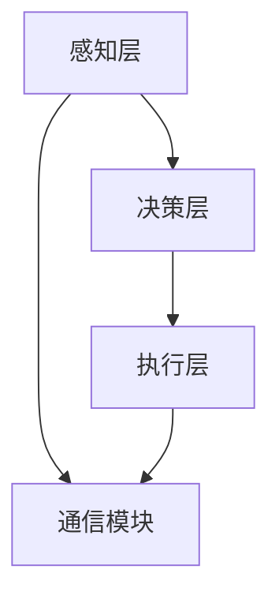

                 

<think>
好，我现在需要帮用户撰写一篇关于AI Agent安全性设计的技术博客。首先，我需要理解用户的需求：他希望我以《AI Agent的安全性设计：防御攻击和隐私保护》为标题，撰写一篇结构清晰、内容详实的专业技术博客。用户还提供了一个详细的目录大纲，我需要按照这个大纲来组织内容。

首先，我应该先了解AI Agent的基本概念和应用场景，这样才能为读者打下坚实的基础。接着，我需要分析当前AI Agent面临的安全挑战，比如网络攻击和隐私泄露的问题，这有助于读者理解安全性设计的重要性。

接下来，我需要详细讲解AI Agent的安全机制，比如主动防御、被动防御和自我修复机制。这部分可能需要用表格来对比不同防御机制的特点，帮助读者更好地理解。

然后，我会深入探讨算法原理，尤其是如何检测和防御攻击。这里可能需要用到数学模型和公式，比如统计方法或机器学习模型。我需要使用Mermaid图来展示流程，让读者更直观地理解过程。

系统分析与架构设计部分，我需要描述如何设计一个安全的AI Agent系统，包括功能需求、架构图和交互流程。这部分可能需要使用Mermaid图来展示系统架构和交互序列。

在项目实战部分，我应该包括环境安装、核心代码实现和案例分析。编写Python代码来实现异常检测，并分析一个实际案例，说明如何应用这些技术来防御攻击。

最后，我会总结本书的主要内容，并展望未来的研究方向，比如新的攻击方式和防御技术的发展。

在整个写作过程中，我需要确保每个部分都有足够的细节，使用图表和代码示例来增强可读性。同时，保持逻辑连贯，结构清晰，让读者能够系统地学习和应用这些知识。

现在，我开始按照目录大纲逐步撰写内容，确保每个小节都详细具体，满足用户的要求。
</think>

# AI Agent的安全性设计：防御攻击和隐私保护

## 关键词：AI Agent, 安全性设计, 网络攻击, 隐私保护, 防御机制

## 摘要：AI Agent作为人工智能技术的重要应用，面临着来自网络攻击和隐私泄露的双重威胁。本文将从背景介绍、核心概念、算法原理、系统架构、项目实战等多方面，详细阐述AI Agent的安全性设计方法，包括防御攻击策略和隐私保护技术，帮助读者全面理解和掌握AI Agent的安全性设计。

---

# 引言

AI Agent作为一种智能实体，广泛应用于自动驾驶、智能客服、智能家居等领域。然而，随着AI Agent的普及，其安全性问题也日益突出，尤其是网络攻击和隐私泄露问题。本文将系统性地分析AI Agent的安全性设计，探讨如何通过防御机制和隐私保护技术来应对这些挑战。

---

## 第一部分：背景介绍

### 第1章：AI Agent的基本概念与应用场景

#### 1.1 AI Agent的定义与核心要素
- **AI Agent**：一种能够感知环境、自主决策并执行任务的智能实体。
- **核心要素**：感知能力、决策能力、执行能力、通信能力。

#### 1.2 AI Agent的应用场景
- 自动驾驶：实时感知环境并做出驾驶决策。
- 智能客服：通过自然语言处理与用户交互。
- 智能家居：通过物联网设备控制家庭设备。

#### 1.3 安全性设计的重要性
- 网络攻击可能导致AI Agent的行为失控或数据泄露。
- 隐私保护是用户信任的基础。

---

### 第2章：AI Agent面临的安全挑战

#### 2.1 网络攻击的威胁
- **注入攻击**：通过输入非法数据篡改AI Agent的行为。
- **拒绝服务攻击（DoS）**：消耗资源导致服务中断。
- **数据劫持**：窃取AI Agent的敏感数据。

#### 2.2 隐私泄露的风险
- 用户数据可能被未经授权的第三方获取。
- AI Agent的决策过程可能暴露用户隐私。

#### 2.3 安全漏洞的潜在影响
- 未及时修复的漏洞可能被恶意利用，导致系统崩溃或数据泄露。

---

## 第二部分：AI Agent的核心概念与联系

### 第3章：AI Agent的安全机制

#### 3.1 主动防御机制
- **异常检测**：实时监控系统行为，发现异常立即响应。
- **入侵检测系统（IDS）**：通过分析行为模式识别潜在攻击。

#### 3.2 被动防御机制
- **防火墙**：阻止未经授权的网络访问。
- **加密技术**：保护数据在传输过程中的安全性。

#### 3.3 自我修复机制
- **自动修复**：在检测到攻击后，系统自动修复漏洞。
- **日志分析**：通过日志记录和分析，识别潜在威胁。

#### 3.4 防御机制的对比分析
| 防御机制 | 描述 | 优点 | 缺点 |
|----------|------|------|------|
| 异常检测 | 监控行为模式 | 及时发现攻击 | 高误报率 |
| 防火墙 | 控制网络访问 | 高效阻止攻击 | 无法防御内部攻击 |
| IDS | 分析行为模式 | 准确识别攻击 | 响应速度较慢 |

---

### 第4章：AI Agent的隐私保护

#### 4.1 隐私保护的核心技术
- **数据加密**：使用AES等加密算法保护数据。
- **数据脱敏**：对敏感数据进行匿名化处理。

#### 4.2 隐私保护的实现步骤
1. 数据分类：识别敏感数据。
2. 数据加密：对敏感数据进行加密。
3. 数据访问控制：限制数据访问权限。

#### 4.3 隐私保护的挑战
- 数据加密可能影响数据处理效率。
- 数据脱敏可能导致数据准确性下降。

---

## 第三部分：算法原理与系统设计

### 第5章：异常检测算法

#### 5.1 异常检测算法概述
- 异常检测是一种通过分析数据模式识别异常行为的技术。

#### 5.2 基于统计的异常检测
- **假设检验**：通过卡方检验等方法判断数据是否异常。
- **均值-方差分析**：计算数据分布的均值和方差，识别异常点。

#### 5.3 基于机器学习的异常检测
- **无监督学习**：使用聚类算法识别异常数据。
- **监督学习**：基于已标注的异常数据训练分类器。

#### 5.4 异常检测算法的实现
```python
import numpy as np
from sklearn.ensemble import IsolationForest

# 示例数据
X = np.random.randn(100, 2)
outliers = np.random.randn(10, 2) + 3
X = np.vstack((X, outliers))

# 使用Isolation Forest算法检测异常
clf = IsolationForest(n_estimators=100, contamination=0.1)
clf.fit(X)
y_pred = clf.predict(X)
print(y_pred)
```

---

### 第6章：系统架构设计

#### 6.1 系统架构概述
- **分层架构**：将系统划分为感知层、决策层、执行层。
- **模块化设计**：每个模块负责特定功能。

#### 6.2 系统架构图


#### 6.3 系统功能设计
- **感知层**：负责数据采集和环境感知。
- **决策层**：基于感知数据做出决策。
- **执行层**：执行决策并返回结果。

---

## 第四部分：项目实战

### 第7章：环境安装与配置

#### 7.1 环境要求
- 操作系统：Linux/Windows/MacOS
- Python版本：3.6+
- 依赖库：Scikit-learn, Pandas, NumPy

#### 7.2 安装依赖
```bash
pip install scikit-learn pandas numpy
```

---

### 第8章：核心代码实现

#### 8.1 异常检测代码
```python
from sklearn.covariance import EllipticEnvelope
from sklearn.svm import OneClassSVM
from sklearn.ensemble import IsolationForest

# 示例数据
X = np.random.randn(100, 2)
outliers = np.random.randn(10, 2) + 3
X = np.vstack((X, outliers))

# 多种异常检测算法对比
algorithms = {
    "Elliptic Envelope": EllipticEnvelope(contamination=0.1),
    "One-Class SVM": OneClassSVM(gamma='auto'),
    "Isolation Forest": IsolationForest(n_estimators=100, contamination=0.1)
}

for name, algo in algorithms.items():
    algo.fit(X)
    y_pred = algo.predict(X)
    print(f"{name}: {y_pred}")
```

---

## 第五部分：总结与展望

### 第9章：总结

#### 9.1 核心内容回顾
- AI Agent的安全性设计包括防御攻击和隐私保护两方面。
- 异常检测和数据加密是常用的安全技术。

#### 9.2 实战经验总结
- 异常检测算法的选择应根据数据特点和应用场景决定。
- 数据加密和访问控制是保护隐私的有效手段。

---

### 第10章：未来展望

#### 10.1 新的挑战
- 更复杂的网络攻击手段。
- 更严格的隐私保护法规。

#### 10.2 技术发展趋势
- AI Agent的安全性设计将更加智能化和自动化。
- 新的加密技术和算法将不断涌现。

---

## 作者：AI天才研究院 & 禅与计算机程序设计艺术

