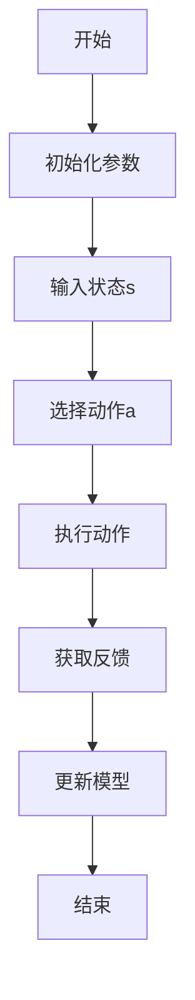
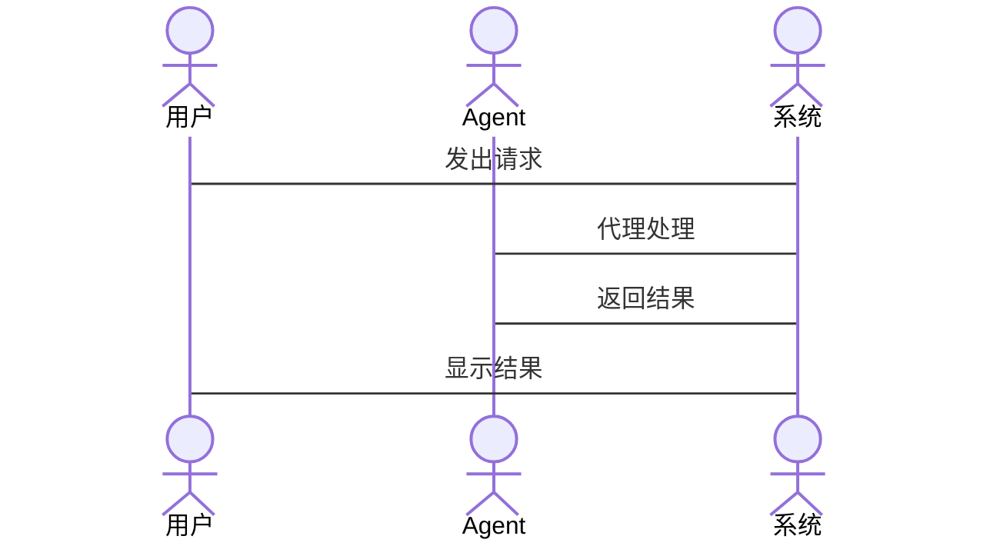

                 

<think>
嗯，我需要帮用户设计一本名为《AI Agent的定义与特性：智能助手的核心要素》的目录大纲。首先，我得理解这本书的核心内容，主要是围绕AI Agent展开，包括定义、特性、设计、实现等方面。

用户希望目录结构清晰，逻辑紧凑，而且要使用吸引人的章节标题。我得确保每个部分都涵盖必要的主题，同时保持结构合理，不超过2000字。

首先，我应该从背景介绍开始，解释AI Agent的概念，包括定义、问题背景、核心要素等。然后，深入探讨核心概念，分析其特性、分类，以及与其他技术的关系。

接下来，我需要考虑算法原理部分，可能涉及强化学习和对话生成模型，用Mermaid流程图展示过程。系统架构部分则需要设计系统的功能模块和交互流程，同样使用Mermaid图来展示。

项目实战部分要详细指导如何搭建环境、编写代码，并分析实际案例。最后，总结最佳实践、注意事项和未来趋势。

我还需要确保每个部分都有足够的细节，比如在核心概念部分，使用表格对比不同特性的AI Agent类型，帮助读者更好地理解。在算法部分，提供数学公式和代码示例，使内容更具深度和实用性。

最后，检查整个目录是否覆盖了所有必要的内容，确保逻辑流畅，结构合理，同时不超过2000字的限制。这样，用户就能得到一个全面且详细的目录大纲，帮助他们撰写一本结构清晰、内容丰富的书籍。
</think>

# AI Agent的定义与特性：智能助手的核心要素

> 关键词：AI Agent, 智能助手, 核心特性, 算法原理, 系统架构

> 摘要：本文将深入探讨AI Agent的定义、核心特性及其在智能助手中的应用。通过分析其算法原理、系统架构和实际案例，揭示AI Agent作为智能助手的核心要素。

---

## 目录大纲

### 第一章：AI Agent的背景与概念

#### 1.1 AI Agent的定义与问题背景
- 1.1.1 什么是AI Agent？
- 1.1.2 AI Agent的核心问题与挑战
- 1.1.3 AI Agent的应用场景与意义

#### 1.2 AI Agent的核心概念与问题描述
- 1.2.1 AI Agent的核心要素
- 1.2.2 AI Agent的特性与功能
- 1.2.3 AI Agent与传统AI的区别

#### 1.3 AI Agent的边界与外延
- 1.3.1 AI Agent的边界
- 1.3.2 AI Agent的外延
- 1.3.3 AI Agent与其他技术的关系

#### 1.4 本章小结

---

### 第二章：AI Agent的核心概念与联系

#### 2.1 AI Agent的核心属性特征
- 2.1.1 智能性
- 2.1.2 自主性
- 2.1.3 反应性
- 2.1.4 社交性

#### 2.2 AI Agent的分类与对比
- 2.2.1 分类维度
- 2.2.2 不同类型AI Agent的对比
- 2.2.3 类型与应用场景的关系

#### 2.3 AI Agent的概念结构与ER实体关系图
```mermaid
er
actor(Agent) {
  id
  name
  type
}
actor(Task) {
  id
  description
  priority
}
actor(State) {
  id
  name
  value
}
actor(Action) {
  id
  name
  result
}
actor(Context) {
  id
  name
  value
}
```

#### 2.4 本章小结

---

### 第三章：AI Agent的算法原理与数学模型

#### 3.1 AI Agent的核心算法
- 3.1.1 强化学习算法
- 3.1.2 对话生成模型
- 3.1.3 多智能体协作算法

#### 3.2 AI Agent的数学模型与公式
- 3.2.1 强化学习模型
  $$ V(s) = \max_a Q(s,a) $$
- 3.2.2 对话生成模型
  $$ P(y|x) = \prod_{i=1}^{n} P(y_i|y_{i-1},x) $$
- 3.2.3 多智能体协作模型
  $$ C = \sum_{i=1}^{n} \sum_{j=1}^{m} w_{i,j} \cdot s_{i,j} $$

#### 3.3 AI Agent算法的实现流程


#### 3.4 本章小结

---

### 第四章：AI Agent的系统架构与设计

#### 4.1 系统架构概述
- 4.1.1 系统功能模块
- 4.1.2 系统架构设计
  ```mermaid
  graph TD
  A[用户] --> B[输入层]
  B --> C[处理层]
  C --> D[输出层]
  D --> A[反馈]
  ```

#### 4.2 系统功能设计
- 4.2.1 领域模型设计
  ```mermaid
  classDiagram
  class Agent {
    id
    name
    type
  }
  class Task {
    id
    description
    priority
  }
  Agent --> Task: 执行任务
  ```

#### 4.3 系统接口设计
- 4.3.1 接口定义
- 4.3.2 接口实现

#### 4.4 系统交互流程


#### 4.5 本章小结

---

### 第五章：AI Agent的项目实战

#### 5.1 项目背景与目标
- 5.1.1 项目介绍
- 5.1.2 项目目标

#### 5.2 环境搭建与工具安装
- 5.2.1 开发环境
- 5.2.2 工具安装

#### 5.3 核心代码实现
- 5.3.1 初始化参数
  ```python
  def initialize_parameters():
      # 代码实现
      pass
  ```
- 5.3.2 状态处理
  ```python
  def process_state(state):
      # 代码实现
      pass
  ```
- 5.3.3 动作选择
  ```python
  def select_action(state):
      # 代码实现
      pass
  ```

#### 5.4 代码解读与分析
- 5.4.1 核心代码解读
- 5.4.2 代码优化建议

#### 5.5 实际案例分析
- 5.5.1 案例背景
- 5.5.2 案例分析
- 5.5.3 案例总结

#### 5.6 本章小结

---

### 第六章：AI Agent的最佳实践与注意事项

#### 6.1 最佳实践
- 6.1.1 设计原则
- 6.1.2 开发技巧
- 6.1.3 测试与调试

#### 6.2 注意事项
- 6.2.1 常见问题
- 6.2.2 解决方案
- 6.2.3 优化建议

#### 6.3 未来趋势
- 6.3.1 技术发展
- 6.3.2 应用前景
- 6.3.3 挑战与机遇

#### 6.4 本章小结

---

### 第七章：总结与展望

#### 7.1 全文总结
- 7.1.1 核心内容回顾
- 7.1.2 主要结论

#### 7.2 未来展望
- 7.2.1 技术创新
- 7.2.2 应用扩展
- 7.2.3 研究方向

#### 7.3 本章小结

---

### 附录：参考文献与拓展阅读

#### 附录A：参考文献
- 文献1
- 文献2
- 文献3

#### 附录B：拓展阅读
- 资源1
- 资源2
- 资源3

---

### 作者信息

作者：AI天才研究院/AI Genius Institute  
禅与计算机程序设计艺术/Zen And The Art of Computer Programming

