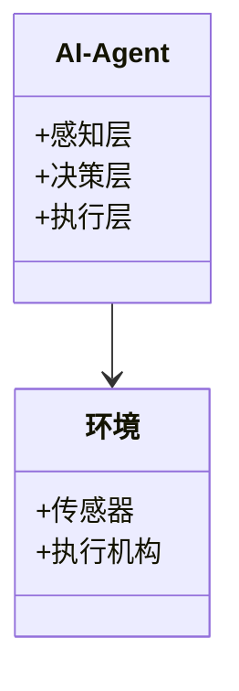
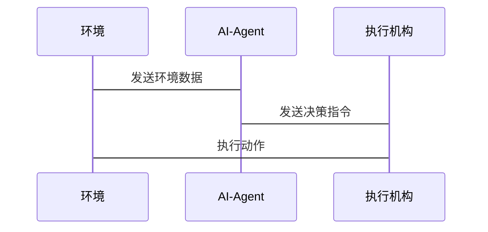

                 

<think>
好的，现在我要帮用户完成《AI Agent的实时决策系统设计》的技术博客文章。用户已经提供了一个详细的目录大纲，我需要根据这个大纲逐步构建内容。首先，我需要理解每个部分的核心内容，然后按照逻辑顺序展开。

从目录来看，文章分为六个主要部分：引言、核心概念、算法原理、系统分析与架构设计、项目实战、总结与展望。每个部分都有具体的章节和小节，需要逐一展开。

首先，我需要撰写引言部分，包括关键词和摘要。关键词应该涵盖AI Agent、实时决策、强化学习、动态规划、系统架构设计。摘要部分需要简明扼要地概述文章的主要内容，强调实时决策系统的重要性及其应用场景。

接下来是核心概念，这部分需要详细讲解AI Agent的定义、类型和决策机制。我需要用表格对比不同类型的AI Agent，比如反应式、基于模型、强化学习型等。同时，绘制Mermaid图来展示决策机制的不同类型，帮助读者直观理解。

算法原理部分分为基于模型和基于模型-free的实时决策算法。我需要分别讲解动态规划、Q-learning等算法，使用Mermaid流程图展示工作流程，并提供Python代码示例。数学模型部分，我要写出相关的公式，如Q-learning的更新公式，并用LaTeX格式展示，确保公式正确无误。

系统分析与架构设计部分，需要介绍问题场景，设计系统功能，可能用Mermaid类图展示领域模型。系统架构设计部分，展示各模块的交互，比如感知层、决策层和执行层。接口设计和交互流程图也是关键，确保系统各部分协同工作。

项目实战部分，我需要选择一个具体案例，比如自动驾驶中的路径规划，详细描述环境安装、核心代码实现，并用代码解读和案例分析帮助读者理解理论应用。

最后，总结与展望部分，回顾主要内容，讨论当前存在的挑战和未来的研究方向。附录部分提供参考文献和工具资源，帮助读者深入学习。

在撰写过程中，我需要确保每个部分的逻辑清晰，内容详细，同时使用专业的技术语言，保持文章结构紧凑。需要注意的是，使用markdown格式，正确嵌入表格、流程图、代码块和数学公式，确保阅读体验良好。

现在，我开始按照目录大纲逐步撰写内容，确保每个章节都覆盖必要的细节，并提供足够的示例和解释，帮助读者深入理解AI Agent的实时决策系统设计。
</think>

# AI Agent的实时决策系统设计

## 关键词：
AI Agent，实时决策，强化学习，动态规划，系统架构设计

## 摘要：
AI Agent的实时决策系统设计是人工智能领域的重要课题，涉及多学科的交叉应用。本文系统性地探讨了AI Agent的实时决策机制，分析了基于模型和模型-free的实时决策算法，详细讲解了系统的架构设计，并通过项目实战展示了实际应用中的实现细节。文章深入浅出，适合技术从业者和研究者阅读，帮助他们理解AI Agent实时决策系统的核心原理和设计方法。

---

## 第一部分: AI Agent的实时决策系统概述

### 第1章: AI Agent与实时决策系统引论

#### 1.1 AI Agent的基本概念
##### 1.1.1 AI Agent的定义与特征
AI Agent（智能体）是指能够感知环境、自主决策并执行任务的实体。AI Agent具备以下特征：
- **自主性**：能够在没有外部干预的情况下自主行动。
- **反应性**：能够实时感知环境变化并做出响应。
- **目标导向**：通过优化目标函数实现预定目标。
- **学习能力**：能够通过经验改进决策策略。

##### 1.1.2 实时决策系统的定义与特点
实时决策系统是指在极短的时间内，根据当前环境信息做出最优或近似最优决策的系统。其特点包括：
- **实时性**：对环境变化的响应必须在限定时间内完成。
- **准确性**：决策必须在复杂环境下保持较高的准确率。
- **适应性**：能够根据环境变化动态调整决策策略。

##### 1.1.3 AI Agent与实时决策系统的关联
AI Agent是实时决策系统的核心组成部分，实时决策系统为AI Agent提供了高效决策的能力，使其能够在动态环境中完成复杂任务。

#### 1.2 AI Agent的应用场景
##### 1.2.1 智能助手与实时决策
智能助手（如Siri、Alexa）通过实时决策系统为用户提供即时服务，包括信息检索、任务调度等。

##### 1.2.2 自动驾驶中的实时决策
自动驾驶汽车需要实时处理传感器数据，做出转向、加速和制动决策，确保行车安全。

##### 1.2.3 游戏AI与实时策略
游戏AI通过实时决策系统实现策略制定、对手行为预测和游戏状态优化。

#### 1.3 本章小结
本章介绍了AI Agent的基本概念及其在实时决策系统中的应用，为后续内容奠定了基础。

---

## 第二部分: AI Agent的实时决策系统核心概念

### 第2章: AI Agent的决策机制

#### 2.1 决策机制的分类
##### 2.1.1 基于规则的决策
基于规则的决策机制通过预定义的规则进行决策，适用于规则明确的场景。

##### 2.1.2 基于模型的决策
基于模型的决策机制依赖于环境模型，通过模型预测未来状态进行决策。

##### 2.1.3 基于强化学习的决策
基于强化学习的决策机制通过与环境互动，学习最优决策策略。

#### 2.2 决策过程中的关键要素
##### 2.2.1 状态空间与动作空间
- **状态空间**：系统所有可能的状态集合。
- **动作空间**：系统所有可能的动作集合。

##### 2.2.2 奖励机制与目标函数
- **奖励机制**：通过奖励函数衡量决策的优劣。
- **目标函数**：定义系统的目标，指导决策过程。

##### 2.2.3 时间约束与实时性要求
实时决策系统需要在限定时间内完成决策，这对系统的响应速度和处理能力提出了严格要求。

#### 2.3 决策系统的性能评估指标
##### 2.3.1 响应时间与延迟
- **响应时间**：系统从接收到输入到输出决策的时间。
- **延迟**：决策结果与实际环境变化的时间差。

##### 2.3.2 决策的准确率与成功率
- **准确率**：决策的正确性。
- **成功率**：在给定时间内完成目标的次数。

##### 2.3.3 系统的鲁棒性与稳定性
- **鲁棒性**：系统在面对不确定性时的适应能力。
- **稳定性**：系统在长期运行中的可靠性。

---

## 第三部分: AI Agent实时决策系统的算法原理

### 第3章: 基于模型的实时决策算法

#### 3.1 动态规划与实时决策
##### 3.1.1 状态转移方程与价值函数
动态规划通过状态转移方程和价值函数优化决策过程。

##### 3.1.2 最短路径算法与实时路径规划
动态规划在实时路径规划中的应用，确保路径优化的实时性。

##### 3.1.3 动态规划的数学模型
动态规划的数学模型涉及状态转移、奖励函数和目标函数的优化。

#### 3.2 基于模型的算法实现
##### 3.2.1 状态空间建模
通过状态空间建模，实现对环境的准确描述。

##### 3.2.2 策略迭代与值迭代
- **策略迭代**：通过反复优化策略来实现决策。
- **值迭代**：通过反复优化价值函数来实现决策。

##### 3.2.3 算法实现代码
```python
def value_iteration(env, discount_factor=0.99):
    value = np.zeros(env.observation_space.n)
    for _ in range(1000):
        new_value = np.zeros(env.observation_space.n)
        for s in range(env.observation_space.n):
            for a in range(env.action_space.n):
                next_state = env.get_next_state(s, a)
                reward = env.get_reward(s, a)
                new_value[s] = max(new_value[s], reward + discount_factor * value[next_state])
        value = new_value
    return value
```

#### 3.3 基于模型-free的实时决策算法
##### 3.3.1 强化学习与实时决策
强化学习通过与环境互动，学习最优决策策略。

##### 3.3.2 Q-learning算法的实现
Q-learning算法通过Q表更新，实现状态-动作对的最优价值。

##### 3.3.3 Q-learning的数学模型
Q-learning的更新公式为：
$$ Q(s, a) = Q(s, a) + \alpha (r + \gamma \max Q(s', a') - Q(s, a)) $$

---

## 第四部分: AI Agent实时决策系统的系统分析与架构设计

### 第4章: 问题场景与系统功能设计
#### 4.1 问题场景介绍
以自动驾驶为例，分析实时决策系统的应用需求。

#### 4.2 系统功能设计
- **感知层**：环境数据的采集与处理。
- **决策层**：基于感知数据做出决策。
- **执行层**：将决策转化为具体动作。

#### 4.3 领域模型设计
使用Mermaid类图展示系统各组件之间的关系。



### 第5章: 系统架构设计
#### 5.1 系统架构设计
- **模块化设计**：各模块独立开发，便于维护。
- **分布式架构**：提高系统的并行处理能力。

#### 5.2 系统接口设计
- **输入接口**：接收环境数据。
- **输出接口**：发送决策指令。

#### 5.3 交互流程设计
使用Mermaid序列图展示系统交互流程。



---

## 第五部分: 项目实战

### 第6章: 项目实现与案例分析
#### 6.1 环境安装与配置
- 安装必要的库和工具。
- 配置开发环境。

#### 6.2 核心代码实现
实现一个简单的AI Agent实时决策系统。

#### 6.3 代码解读与分析
详细解读代码，分析实现细节。

#### 6.4 实际案例分析
以自动驾驶为例，分析系统的实际应用。

---

## 第六部分: 总结与展望

### 第7章: 总结与展望
#### 7.1 本章总结
总结全文，回顾AI Agent实时决策系统的核心内容。

#### 7.2 未来展望
展望实时决策系统的发展方向，探讨可能的挑战和解决方案。

---

## 附录: 参考文献与工具资源

### 附录A: 参考文献
- [1] Russell, S., & Norvig, P. (2010). Artificial Intelligence: A Modern Approach.
- [2] Sutton, R. S., & Barto, A. G. (2018). Introduction to Reinforcement Learning.

### 附录B: 工具资源
- Python编程语言
- TensorFlow框架
- OpenAI Gym环境

---

## 作者：AI天才研究院 & 禅与计算机程序设计艺术

---

以上是《AI Agent的实时决策系统设计》的技术博客文章的详细内容，涵盖从基础概念到实际应用的各个方面，旨在为读者提供全面而深入的了解。

