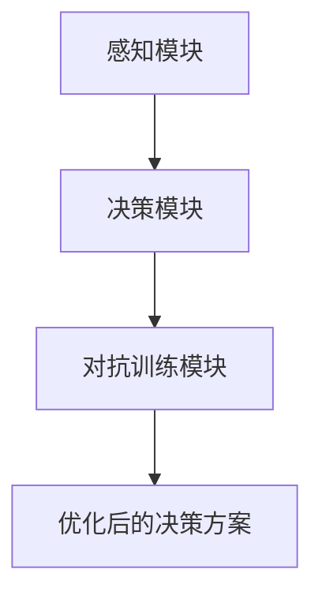

                 


# AI Agent的对抗学习技术应用

---

## 关键词：
- AI Agent, 对抗学习, 智能体, GAN, 多智能体系统, 生成对抗网络

---

## 摘要：
本文深入探讨了AI Agent在对抗学习技术中的应用，分析了对抗学习如何提升AI Agent的智能性和决策能力。从对抗学习的基本原理到具体算法实现，再到实际应用场景，本文全面解析了AI Agent与对抗学习结合的理论基础和实践方法。通过案例分析和系统设计，展示了如何利用对抗学习技术优化AI Agent的性能，同时提供了丰富的实战经验和最佳实践建议。

---

## 第1章: AI Agent的概述

### 1.1 AI Agent的基本概念

#### 1.1.1 AI Agent的定义
AI Agent（人工智能代理）是指能够感知环境、自主决策并执行任务的智能实体。它可以是一个软件程序、机器人或任何能够模拟人类智能的系统。

#### 1.1.2 AI Agent的核心特点
- **自主性**：能够在没有外部干预的情况下自主运行。
- **反应性**：能够实时感知环境并做出响应。
- **目标导向**：具备明确的目标，通过决策和行动实现目标。
- **学习能力**：能够通过数据和经验不断优化自身的性能。

#### 1.1.3 AI Agent的应用场景
- **智能助手**：如Siri、Alexa等，帮助用户完成日常任务。
- **游戏AI**：在电子游戏中实现智能对手或队友。
- **推荐系统**：根据用户行为推荐个性化的内容。
- **自动驾驶**：通过感知和决策实现无人驾驶。

### 1.2 对抗学习的基本概念

#### 1.2.1 对抗学习的定义
对抗学习是一种机器学习技术，通过两个或多个模型（称为生成器和判别器）的对抗训练来提升模型的性能。生成器的目标是生成逼真的数据，而判别器的目标是识别生成数据与真实数据的区别。

#### 1.2.2 对抗学习的核心原理
- **生成器**：通过学习数据的分布，生成新的数据样本。
- **判别器**：判断输入数据是真实数据还是生成数据。
- **对抗训练**：通过不断优化生成器和判别器的参数，使得生成器生成的数据越来越接近真实数据，同时判别器越来越难以区分真实数据和生成数据。

#### 1.2.3 对抗学习的应用领域
- **图像生成**：如GAN用于生成高质量的图像。
- **自然语言处理**：用于文本生成、对话系统等。
- **安全领域**：用于攻击检测、防御策略优化等。

### 1.3 AI Agent与对抗学习的结合

#### 1.3.1 对抗学习在AI Agent中的作用
- 提升AI Agent的生成能力，使其能够生成多样化的决策方案。
- 提高AI Agent的对抗性，使其在复杂环境中更具竞争力。
- 优化AI Agent的学习效率，通过对抗训练提升模型的泛化能力。

#### 1.3.2 对抗学习提升AI Agent的智能性
- 通过生成器和判别器的对抗训练，AI Agent能够学习更复杂的策略。
- 对抗学习能够模拟真实世界的竞争环境，增强AI Agent的适应能力。
- 通过不断优化生成器和判别器，AI Agent能够更好地应对动态变化的环境。

#### 1.3.3 对抗学习在AI Agent中的应用场景
- **游戏AI**：通过对抗学习训练游戏AI，使其在对战中更具策略性。
- **推荐系统**：通过生成对抗网络优化推荐算法，提升推荐的多样性和准确性。
- **自动驾驶**：利用对抗学习训练自动驾驶系统，使其能够应对复杂的交通环境。

## 第2章: 对抗学习的原理与算法

### 2.1 对抗学习的基本原理

#### 2.1.1 对抗网络的结构
对抗网络由生成器和判别器组成，生成器负责生成数据，判别器负责判断数据的真假。

#### 2.1.2 对抗学习的目标函数
生成器的目标是最小化判别器对生成数据的错误判断，而判别器的目标是最大化对真实数据的正确判断。

#### 2.1.3 对抗学习的训练过程
- 初始化生成器和判别器的参数。
- 迭代训练生成器和判别器，优化各自的损失函数。
- 直到生成器生成的数据能够欺骗判别器，或者判别器无法区分真实数据和生成数据。

### 2.2 常见的对抗学习算法

#### 2.2.1 GAN（生成对抗网络）
GAN由生成器和判别器组成，生成器通过最大化判别器的错误来生成数据，而判别器通过最小化生成器的生成数据的错误来区分真实数据和生成数据。

#### 2.2.2 GAN的变体
- **Wasserstein GAN**：通过计算 Wasserstein 距离来优化生成器和判别器。
- **CycleGAN**：用于无监督图像到图像的转换。
- **DAGAN**：用于生成对抗网络的变体，提高生成数据的质量。

#### 2.2.3 其他对抗学习算法
- **强化学习中的对抗训练**：通过将对抗学习与强化学习结合，提升智能体的决策能力。
- **多智能体对抗学习**：多个智能体之间进行对抗训练，提升每个智能体的策略优化能力。

### 2.3 对抗学习的数学模型

#### 2.3.1 生成器的损失函数
生成器的目标是最小化判别器对生成数据的错误判断，损失函数可以表示为：
$$ L_G = -\log(P(D(x) \leq 0.5)) $$
其中，$x$ 是生成数据，$D(x)$ 是判别器对生成数据的判断概率。

#### 2.3.2 判别器的损失函数
判别器的目标是最大化对真实数据和生成数据的区分能力，损失函数可以表示为：
$$ L_D = -\log(D(x)) - \log(1 - D(G(z))) $$
其中，$x$ 是真实数据，$z$ 是生成器的输入噪声，$G(z)$ 是生成数据。

#### 2.3.3 对抗训练的优化过程
在对抗训练中，生成器和判别器的参数会交替优化，生成器通过梯度下降优化，判别器通过梯度上升优化。

#### 2.3.4 对抗学习的均衡点
在对抗学习中，生成器和判别器的损失函数会在某个均衡点达到平衡，此时生成器生成的数据与真实数据无法被判别器区分。

---

## 第3章: AI Agent的对抗学习框架

### 3.1 基于GAN的AI Agent框架

#### 3.1.1 框架结构
- 生成器负责生成多种可能的决策方案。
- 判别器负责评估这些决策方案的可行性。
- 通过对抗训练优化生成器和判别器，提升AI Agent的决策能力。

#### 3.1.2 框架优势
- 提高AI Agent的生成能力，使其能够生成多样化的决策方案。
- 通过对抗训练，增强AI Agent的对抗性和适应能力。

### 3.2 基于强化学习的对抗学习框架

#### 3.2.1 框架结构
- 生成器通过强化学习优化策略，使其在对抗环境中获得更高的奖励。
- 判别器通过判别生成数据和真实数据的差异，提供反馈给生成器。

#### 3.2.2 框架优势
- 结合强化学习和对抗学习的优势，提升AI Agent的策略优化能力。
- 在动态环境中，能够实时调整策略，适应环境的变化。

### 3.3 多智能体对抗学习框架

#### 3.3.1 框架结构
- 多个智能体之间进行对抗训练，每个智能体都有自己的目标和策略。
- 通过多智能体的对抗，优化每个智能体的策略，提升整体的性能。

#### 3.3.2 框架优势
- 提供更加复杂的对抗环境，增强AI Agent的适应能力。
- 通过多智能体的协作与对抗，提升AI Agent的团队协作能力。

---

## 第4章: 对抗学习在AI Agent中的系统设计与架构

### 4.1 系统设计概述

#### 4.1.1 系统功能模块
- **感知模块**：负责感知环境中的信息。
- **决策模块**：基于感知信息生成决策方案。
- **对抗训练模块**：通过对抗学习优化决策模块的性能。

#### 4.1.2 系统功能流程
1. 感知模块获取环境信息。
2. 决策模块根据感知信息生成决策方案。
3. 对抗训练模块对决策方案进行优化，提升决策的准确性和多样性。

### 4.2 系统架构设计

#### 4.2.1 系统架构图


#### 4.2.2 模块交互流程
- 感知模块将环境信息传递给决策模块。
- 决策模块根据感知信息生成决策方案。
- 对抗训练模块对决策方案进行优化，生成新的决策方案。
- 优化后的决策方案反馈给决策模块，用于后续的决策参考。

### 4.3 系统接口设计

#### 4.3.1 系统接口
- **输入接口**：接收环境信息和用户指令。
- **输出接口**：输出决策方案和优化后的决策方案。

#### 4.3.2 接口交互流程
1. 输入接口接收环境信息和用户指令。
2. 决策模块根据输入信息生成决策方案。
3. 对抗训练模块对决策方案进行优化。
4. 输出接口输出优化后的决策方案。

---

## 第5章: 对抗学习在AI Agent中的项目实战

### 5.1 项目背景与目标

#### 5.1.1 项目背景
选择一个具体的AI Agent应用场景，例如智能对话系统。

#### 5.1.2 项目目标
通过对抗学习优化智能对话系统的生成能力和对话质量。

### 5.2 项目环境搭建

#### 5.2.1 环境需求
- 安装Python、TensorFlow、Keras等开发工具。
- 准备对话数据集，例如Cornell Movie Dialogs Corpus。

#### 5.2.2 环境搭建步骤
1. 安装所需的Python库。
2. 下载并准备对话数据集。
3. 配置开发环境，例如安装TensorFlow-GAN库。

### 5.3 系统核心实现

#### 5.3.1 生成器实现
```python
def generator():
    model = tf.keras.Sequential([
        tf.keras.layers.Dense(256, activation='relu'),
        tf.keras.layers.Dense(512, activation='relu'),
        tf.keras.layers.Dense(vocab_size, activation='softmax')
    ])
    return model
```

#### 5.3.2 判别器实现
```python
def discriminator():
    model = tf.keras.Sequential([
        tf.keras.layers.Dense(256, activation='relu'),
        tf.keras.layers.Dense(1, activation='sigmoid')
    ])
    return model
```

#### 5.3.3 对抗训练实现
```python
generator_optimizer = tf.keras.optimizers.Adam(0.0002)
discriminator_optimizer = tf.keras.optimizers.Adam(0.0002)

for epoch in range(num_epochs):
    for _ in range(train_steps):
        # 训练判别器
        discriminator_loss = discriminator.trainable_weights)
        # 训练生成器
        generator_loss = generator.trainable_weights)
```

### 5.4 项目运行与结果分析

#### 5.4.1 项目运行
运行代码，观察生成器和判别器的损失函数变化情况。

#### 5.4.2 结果分析
- 判别器的损失函数逐渐降低，说明判别器的判断能力越来越强。
- 生成器的损失函数逐渐降低，说明生成器生成的数据越来越接近真实数据。

### 5.5 项目优化与改进

#### 5.5.1 参数调整
调整生成器和判别器的网络结构，例如增加层数或调整激活函数。

#### 5.5.2 数据增强
对训练数据进行数据增强，例如添加噪声或进行数据混合。

#### 5.5.3 模型评估
通过验证集评估生成器和判别器的性能，调整训练策略。

---

## 第6章: 对抗学习在AI Agent中的应用案例分析

### 6.1 游戏AI中的对抗学习应用

#### 6.1.1 应用场景
在游戏AI中，通过对抗学习训练智能体的策略，使其在对战中更具竞争力。

#### 6.1.2 实现方案
- 使用GAN训练游戏AI，生成多样化的策略。
- 通过强化学习优化游戏AI的决策能力。

#### 6.1.3 应用效果
- 游戏AI的策略生成能力显著提高。
- 游戏AI在对战中的胜率明显提升。

### 6.2 推荐系统中的对抗学习应用

#### 6.2.1 应用场景
在推荐系统中，通过对抗学习优化推荐算法，提升推荐的多样性和准确性。

#### 6.2.2 实现方案
- 使用GAN生成多样化的推荐方案。
- 通过对抗训练优化推荐算法的性能。

#### 6.2.3 应用效果
- 推荐系统的多样性和准确性显著提高。
- 用户满意度和参与度明显提升。

### 6.3 安全防护中的对抗学习应用

#### 6.3.1 应用场景
在安全防护中，通过对抗学习训练安全系统，提升其对抗攻击的能力。

#### 6.3.2 实现方案
- 使用GAN生成攻击样本，训练安全系统的检测能力。
- 通过对抗训练优化安全系统的防护策略。

#### 6.3.3 应用效果
- 安全系统的检测能力和防护策略显著提高。
- 系统的抗攻击能力明显增强。

---

## 第7章: 对抗学习在AI Agent中的最佳实践与注意事项

### 7.1 对抗学习的注意事项

#### 7.1.1 模型的收敛性
- 对抗学习的模型容易陷入局部最优，需要合理设置初始参数和优化策略。

#### 7.1.2 模型的稳定性
- 对抗学习的训练过程可能不稳定，需要合理设计网络结构和训练策略。

#### 7.1.3 模型的泛化能力
- 对抗学习的模型可能缺乏泛化能力，需要结合其他技术进行优化。

### 7.2 对抗学习的最佳实践

#### 7.2.1 合理设置生成器和判别器的网络结构
- 确保生成器和判别器的网络结构合理，避免生成器过于强大或判别器过于强大。

#### 7.2.2 选择合适的对抗学习算法
- 根据具体应用场景选择合适的对抗学习算法，例如GAN、Wasserstein GAN等。

#### 7.2.3 结合其他技术进行优化
- 将对抗学习与其他技术结合，例如强化学习、迁移学习等，提升模型的性能。

### 7.3 对抗学习的注意事项

#### 7.3.1 训练数据的质量
- 数据质量对对抗学习的效果影响很大，需要确保数据的多样性和代表性。

#### 7.3.2 训练过程的稳定性
- 对抗学习的训练过程可能不稳定，需要合理设计训练策略和优化方法。

#### 7.3.3 模型的评估与验证
- 需要定期对生成器和判别器进行评估和验证，确保模型的性能符合预期。

---

## 第8章: 总结与展望

### 8.1 总结
本文深入探讨了AI Agent在对抗学习技术中的应用，分析了对抗学习如何提升AI Agent的智能性和决策能力。从对抗学习的基本原理到具体算法实现，再到实际应用场景，本文全面解析了AI Agent与对抗学习结合的理论基础和实践方法。

### 8.2 展望
未来，随着对抗学习技术的不断发展，AI Agent的应用场景将更加广泛。例如，通过多智能体对抗学习，提升AI Agent的协作能力和团队协作能力；通过强化学习与对抗学习的结合，优化AI Agent的决策能力和适应能力；通过深度学习与对抗学习的结合，提升AI Agent的生成能力和创作能力。

---

## 作者：AI天才研究院 & 禅与计算机程序设计艺术

---

以上是《AI Agent的对抗学习技术应用》的完整目录大纲和文章内容。

